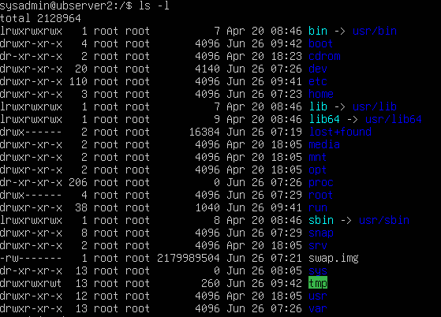

# Comandos básicos de Linux

La virguriña \~ significa que estamos en el directorio home del usuario actual. Por ejemplo, si tu nombre de usuario es "juan", entonces "\~" se refiere a "/home/juan". El simbolo \$ significa que el usuario actual es un usuario normal, mientras que el simbolo \# indica que el usuario actual es el superusuario o root. Por ejemplo, si vemos un prompt como "juan\@servidor:\~\$" significa que estamos en el directorio home del usuario "juan" y somos un usuario normal. Si vemos "root\@servidor:/# " significa que estamos en el directorio raíz y somos el superusuario.

Usando la palabra clave "sudo" (*superuser do*) podemos ejecutar comandos con privilegios de superusuario. Por ejemplo, si queremos instalar un paquete, podemos usar `sudo apt install nombre_del_paquete`. Se nos pedirá la contraseña del usuario actual para confirmar la acción.

-   Para limpiar la pantalla de la terminal, podemos usar el comando `clear`. Esto eliminará todo el contenido visible en la terminal y nos dejará con un prompt limpio.

## Navegación y administración de archivos

-   Usando el comando `pwd` (***print working directory***) podemos ver en qué directorio nos encontramos actualmente. Por ejemplo, si ejecutamos `pwd` en la terminal, obtendremos la ruta completa del directorio actual.

-   Para **navegar entre directorios**, podemos usar el comando `cd` (change directory). Por ejemplo, `cd /var/log` nos llevará al directorio "/var/log". Si queremos regresar al directorio home, podemos usar `cd ~` o simplemente `cd`.

-   Para **ir al directorio padre**, podemos usar `cd ..`, o `cd /` .

-   **Crear directorio:** `mkdir nombre_carpeta`

-   **Borrar directorio (vacío):** `rmdir nombre_carpeta`

-   **Borrar archivo/directorio:** `rm nombre` (`-r` para recursivo, `-f` para forzar)

-   **Copiar:** `cp origen destino`

-   **Mover/Renombrar:** `mv origen destino`

-   Búsqueda

    -   **Buscar archivos (rápido):** `locate nombre`

    -   **Buscar archivos (detallado):** `find /ruta -name "nombre"`

-   Para listar los archivos y directorios dentro del directorio actual, podemos usar el comando `ls`. Por ejemplo, `ls` mostrará los archivos y carpetas en el directorio actual, mientras que `ls -l` proporcionará una lista detallada con permisos, propietario, tamaño y fecha de modificación.

    

### Guía: Interpretación de `ls -l` y Permisos en Linux

Cuando ejecutas el comando `ls -l`, el sistema te devuelve una lista detallada. La primera parte de esa línea es fundamental para entender qué es el archivo y quién puede hacer qué con él.

Una línea típica se ve así: `-rwxr-xr-- 1 root root 4096 Jun 26 19:50 archivo.txt`

Desglose campo a campo:

1.  **Tipo de archivo y Permisos:** `-rwxr-xr--` (Explicado en detalle abajo).

2.  **Enlaces:** `1` (Número de enlaces físicos al archivo/directorio).

3.  **Propietario:** `root` (Usuario que posee el archivo).

4.  **Grupo:** `root` (Grupo que tiene permisos sobre el archivo).

5.  **Tamaño:** `4096` (Tamaño en bytes).

6.  **Fecha de modificación:** `Jun 26 19:50` (Última vez que se modificó).

7.  **Nombre:** `archivo.txt` (Nombre del archivo).

#### El bloque de permisos (El primer campo)

El primer carácter indica el **tipo de archivo**:

-   `-`: Archivo estándar (documentos, imágenes, scripts).

-   `d`: Directorio (carpeta).

-   `l`: Enlace simbólico (un acceso directo).

Los siguientes **9 caracteres** se dividen en 3 bloques de 3 bits cada uno:

**Bloque 1: Usuario Propietario (`u`):** Define qué puede hacer el creador o dueño del archivo.

**Bloque 2: Grupo Propietario (`g`):** Define qué pueden hacer los usuarios que pertenecen al grupo asignado al archivo.

**Bloque 3: Otros Usuarios (`o`):** Define qué puede hacer cualquier otro usuario del sistema (el "resto del mundo").

#### Significado de los caracteres (r, w, x)

En Archivos normales (`-`):

-   `r` (Read): Permite **leer** el contenido del archivo (ej. `cat`, `less`).

-   `w` (Write): Permite **modificar, renombrar o borrar** el contenido del archivo.

-   `x` (Execute): Permite **ejecutarlo** si es un programa o script (ej. `./script.sh`).

-   `-`: Permiso revocado/inexistente.

En Directorios (`d`):

-   `r` (Read): Permite **listar** el contenido del directorio (ver los nombres de los archivos dentro con `ls`).

-   `w` (Write): Permite **crear, borrar o mover** archivos dentro del directorio.

-   `x` (Execute): Permite **entrar** en el directorio (usar `cd` para navegar dentro).

Resumen de interpretación rápida

| Carácter | Función en Archivo         | Función en Directorio          |
|----------|----------------------------|--------------------------------|
| **r**    | Ver el contenido (lectura) | Listar archivos (`ls`)         |
| **w**    | Modificar/borrar contenido | Crear/borrar archivos internos |
| **x**    | Ejecutar como programa     | Entrar en la carpeta (`cd`)    |

**Ejemplo práctico:** `-rwxr-xr--`

-   **Propietario:** Tiene todos los permisos (`rwx`).

-   **Grupo:** Puede leer y ejecutar, pero no modificar (`r-x`).

-   **Otros:** Solo pueden leer el archivo (`r--`).

Linux no permite asignar múltiples grupos directamente a un archivo. Pero sí puedes lograrlo de varias formas:

**Opción 1**: Cambiar el grupo del archivo `chgrp desarrolladores archivo.txt` para asignar el grupo "desarrolladores" al archivo "archivo.txt". Luego, puedes agregar usuarios al grupo "desarrolladores" usando `sudo usermod -aG desarrolladores usuario`.

**Opción 2**: Usar ACLs (Access Control Lists) Esto es lo moderno y flexible: puedes dar permisos a varios grupos o usuarios adicionales. Ejemplo: dar permisos de lectura a un grupo extra: `setfacl -m g:grupo_extra:r archivo.txt`. Para ver los permisos ACL de un archivo, puedes usar `getfacl archivo.txt`.

Los permisos se pueden cambiar usando el comando `chmod`. Por ejemplo, `chmod 755 archivo` otorgará permisos de lectura, escritura y ejecución al propietario, y permisos de lectura y ejecución a los demás usuarios.

# Conexión remota a un servidor Linux

[Ver guía de configuración de SSH en Ubuntu](ubuntu_ssh.html)

El comando básico para conectarse a un servidor remoto es:

``` bash
ssh usuario@direccion_ip_del_servidor
```

Por ejemplo, si nuestro nombre de usuario es "juan" y la dirección IP del servidor es "12.34.56.78", el comando sería:

``` bash
ssh juan@12.34.56.78
```

Si es la primera vez que nos conectamos a ese servidor, se nos pedirá que confirmemos la autenticidad del host y que aceptemos su clave pública. Una vez aceptada, se nos pedirá la contraseña del usuario para iniciar sesión. Si la autenticidad del host ya ha sido confirmada previamente, se nos pedirá directamente la contraseña del usuario.

------------------------------------------------------------------------

## Gestión de Usuarios y Grupos

### Usuarios

-   **Añadir usuario:** `sudo adduser nombre_usuario`

-   **Eliminar usuario:** `sudo deluser nombre_usuario`

-   **Cambiar contraseña:** `passwd nombre_usuario`

-   **Ver usuarios:** `cat /etc/passwd`

### Grupos

-   **Añadir grupo:** `sudo addgroup nombre_grupo`

-   **Eliminar grupo:** `sudo delgroup nombre_grupo`

-   **Añadir usuario a grupo:** `sudo usermod -aG nombre_grupo nombre_usuario`

-   **Eliminar usuario de grupo:** `sudo deluser nombre_usuario nombre_grupo`

-   **Ver grupos:** `cat /etc/group`

## Permisos y Propietarios

### Cambiar Propietario

-   **Usuario propietario:** `sudo chown nuevo_usuario archivo`

-   **Grupo propietario:** `sudo chgrp nuevo_grupo archivo`

### Permisos (chmod)

-   **Modo Numérico (Octal):**

    -   `r=4, w=2, x=1`

    -   Ejemplo: `sudo chmod 764 archivo` (7: Usuario, 6: Grupo, 4: Otros)

-   **Modo Texto:**

    -   **Asignación:** `sudo chmod u=rw,g=rw,o=r archivo`

    -   **Añadir permisos:** `sudo chmod u+x archivo`

    -   **Quitar permisos:** `sudo chmod u-x archivo`

## 4. Fecha y Hora (Timedatectl)

-   **Ver estado:** `timedatectl`

-   **Desactivar sincronización NTP:** `sudo timedatectl set-ntp false`

-   **Cambiar hora manualmente:** `sudo timedatectl set-time "AAAA-MM-DD HH:MM:SS"`

-   **Activar sincronización NTP:** `sudo timedatectl set-ntp true`