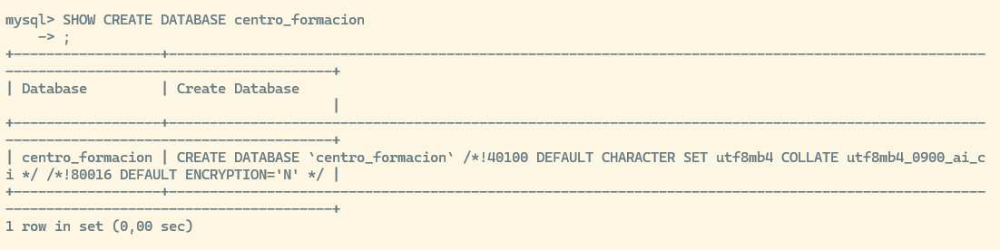
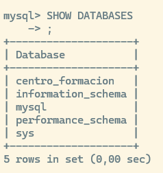
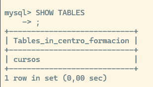
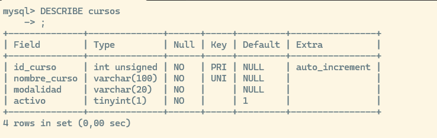
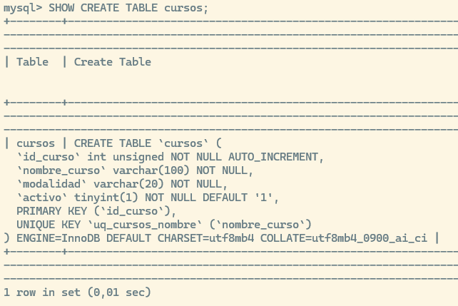
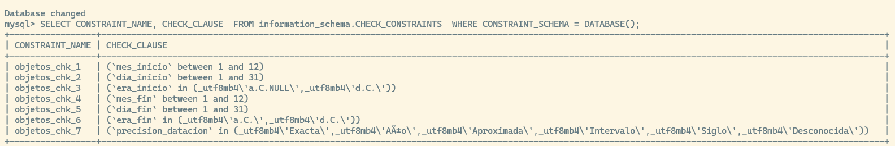

# Crear una base de datos (`CREATE`)

``` sql
CREATE DATABASE IF NOT EXISTS centro_formacion
DEFAULT CHARACTER SET utf8mb4
DEFAULT COLLATE utf8mb4_0900_ai_ci;
```

Donde centro_formacion es el nombre de la base de datos

`DEFAULT CHARACTER SET utf8mb4` significa que admite caracteres Unicode standard

`DEFAULT COLLATE utf8mb4_0900_ai_ci` define reglas de comparación y ordenación.

- `ai` significa insensible a los acentos "accent insensitive" (Ej. María = Maria)

- `ci` significa case insensitive, que es que es insensible a las mayusculas o minisculas (ej. MARIA = Maria)

Estas definiciones de la base de datos serán la configuración por defecto para las tablas que se creen en ella, pero pueden sobreescribirse en las tablas.

En cualquier momento podemos ver cómo se creó la base de datos usando el comando `SHOW CREATE DATABASE {nombre base de datos}`



## Ver las bases de datos creadas en el servidor

``` sql
SHOW DATABASES;
```



## Entrar en la base de datos

``` sql
USE centro_formacion;
```

## Ver en qué base de datos estamos

``` sql
SELECT DATABASE();
```

# Crear una tabla (`CREATE`)

``` sql
CREATE TABLE cursos (
    id_curso INT UNSIGNED AUTO_INCREMENT,
    nombre_curso VARCHAR(100) NOT NULL,
    modalidad VARCHAR(20) NOT NULL,
    activo BOOLEAN NOT NULL DEFAULT TRUE,
    CONSTRAINT pk_cursos PRIMARY KEY (id_curso),
    CONSTRAINT uq_cursos_nombre UNIQUE (nombre_curso)  
    
);
```

`CONSTRAINT pk_cursos PRIMARY KEY (id_curso)` esto define la clave primaria bajo el nombre `pk_cursos`

`CONSTRAINT uq_cursos_nombre UNIQUE (nombre_curso)` esto añade una restricción al campo nombre_curso para que no admita duplicados, guardamos esta regla bajo el nombre `uq_cursos_nombre`

## Ver las tablas de la base de datos donde estamos

`SHOW TABLES;`



## Ver la definición de la tabla que acabamos de crear:

`DESCRIBE cursos;`



## Ver los comandos con los que se creo la tabla

`SHOW CREATE TABLE cursos;`



# Restricciones de Integridad (Constraints)

Las restricciones (*constraints*) son reglas aplicadas a las columnas o tablas de una base de datos para garantizar la precisión, fiabilidad e integridad de los datos. MySQL evalúa estas restricciones en tiempo de ejecución de manera inmediata al ejecutar sentencias como `INSERT` o `UPDATE`.

Si en una operación que afecta a múltiples registros (como un `UPDATE` multirregistro) una sola fila viola una restricción, toda la operación se cancela automáticamente (*rollback*) y no se modifica ninguna fila.

## Tipos de Restricciones

Existen diferentes tipos de restricciones que se pueden definir al crear o modificar una tabla:

- **`NOT NULL`**: Obliga a que una columna siempre contenga un dato. Si en un `INSERT` se omite una columna definida como `NOT NULL` (y que no tiene un valor `DEFAULT`), MySQL lanzará un error indicando que el campo no puede ser nulo.

- **`UNIQUE`**: Garantiza que todos los valores de una columna sean distintos. Si se intenta insertar un valor duplicado en una columna marcada como `UNIQUE`, MySQL abortará la operación por duplicidad de clave.

- **`CHECK`**: Valida que los datos cumplan una condición lógica específica. Si un valor infringe un `CHECK` (por ejemplo, intentar guardar un `mes_inicio` igual a `13`), la inserción se cancela con un error.

- **`PRIMARY KEY`**: Identifica de forma única cada fila de la tabla. Es el equivalente a combinar `NOT NULL` y `UNIQUE`.

- **`FOREIGN KEY`**: Asegura la integridad referencial vinculando los datos de una columna con la clave primaria de otra tabla.

###  `PRIMARY KEY` (Clave Primaria)

Garantiza que cada fila sea única e identificable. No permite valores `NULL`.

Al crear la tabla:

``` sql
CREATE TABLE cursos (
    id_curso INT UNSIGNED AUTO_INCREMENT,
    nombre VARCHAR(100) NOT NULL,

    -- Definición a nivel de tabla con nombre
    CONSTRAINT pk_cursos PRIMARY KEY (id_curso)
);
```

En una tabla existente:

``` sql
ALTER TABLE cursos 
    ADD CONSTRAINT pk_cursos PRIMARY KEY (id_curso);
```

### `FOREIGN KEY` (Clave Foránea)

Relaciona una columna con la clave primaria de otra tabla, garantizando la integridad referencial.

``` sql
CREATE TABLE alumnos (
    id_alumno INT UNSIGNED AUTO_INCREMENT PRIMARY KEY,
    nombre VARCHAR(50) NOT NULL,
    id_curso INT UNSIGNED NULL,

    -- Definición con regla de borrado
    CONSTRAINT fk_alumnos_cursos 
        FOREIGN KEY (id_curso) REFERENCES cursos(id_curso)
        ON DELETE SET NULL
);
```

``` sql
-- En una tabla existente
ALTER TABLE alumnos 
    ADD CONSTRAINT fk_alumnos_cursos 
    FOREIGN KEY (id_curso) REFERENCES cursos(id_curso);
```

### `UNIQUE` (Valor Único)

Asegura que no existan dos filas con el mismo valor en esa columna (a excepción de los valores `NULL`, que sí pueden repetirse).

``` sql
CREATE TABLE usuarios (
    id_usuario INT UNSIGNED AUTO_INCREMENT PRIMARY KEY,
    email VARCHAR(100) NOT NULL,

    CONSTRAINT uq_usuarios_email UNIQUE (email)
);
```

``` sql
-- En una tabla existente
ALTER TABLE usuarios 
    ADD CONSTRAINT uq_usuarios_email UNIQUE (email);
```

### `CHECK` (Validación Condicional)

Evalúa una condición lógica (`TRUE` / `FALSE`) antes de permitir insertar o actualizar un dato.

``` sql
CREATE TABLE empleados (
    id_empleado INT UNSIGNED AUTO_INCREMENT PRIMARY KEY,
    edad TINYINT UNSIGNED NOT NULL,
    dni VARCHAR(20) NULL,
    pasaporte VARCHAR(20) NULL,

    -- CHECK simple de rango
    CONSTRAINT chk_empleados_edad CHECK (edad >= 18),

    -- CHECK combinando múltiples columnas
    CONSTRAINT chk_identificacion_obligatoria 
        CHECK (dni IS NOT NULL OR pasaporte IS NOT NULL)
);
```

``` sql
-- En una tabla existente
ALTER TABLE empleados 
    ADD CONSTRAINT chk_empleados_edad CHECK (edad >= 18);
```

### `NOT NULL` (Obligatoriedad)

Obliga a que la columna contenga siempre un valor.

``` sql
CREATE TABLE categorias (
    id_categoria INT UNSIGNED AUTO_INCREMENT PRIMARY KEY,
    nombre VARCHAR(50) NOT NULL -- Definición a nivel de columna
);
```

``` sql
-- En una tabla existente
-- En MySQL, NOT NULL se añade redefiniendo la columna con MODIFY
ALTER TABLE categorias 
    MODIFY COLUMN nombre VARCHAR(50) NOT NULL;
```

### `DEFAULT` (Valor por Defecto)

Asigna un valor automático a la columna si en el `INSERT` no se especifica ninguno.

``` sql
CREATE TABLE pedidos (
    id_pedido INT UNSIGNED AUTO_INCREMENT PRIMARY KEY,
    estado VARCHAR(20) DEFAULT 'Pendiente',
    fecha_creacion DATETIME DEFAULT CURRENT_TIMESTAMP
);
```

``` sql
ALTER TABLE pedidos 
    ALTER COLUMN estado SET DEFAULT 'Pendiente';
```

## ¿Dónde se guardan las restricciones y cómo consultarlas?

Toda la información sobre la estructura de las bases de datos en MySQL se guarda en una base de datos del sistema llamada **`information_schema`**. Puedes usar vistas específicas dentro de este esquema para auditar qué restricciones existen en tus tablas.

### Consultar restricciones generales (Claves y Checks)

La vista `TABLE_CONSTRAINTS` almacena un listado general de todas las restricciones aplicadas a las tablas (incluyendo `PRIMARY KEY`, `UNIQUE`, `FOREIGN KEY` y `CHECK`).

``` sql
SELECT 
    CONSTRAINT_NAME AS 'Nombre de la Restricción',
    CONSTRAINT_TYPE AS 'Tipo'
FROM information_schema.TABLE_CONSTRAINTS
WHERE TABLE_SCHEMA = DATABASE() 
  AND TABLE_NAME = 'identificaciones';
```

# Crear una tabla relacionada

``` sql
CREATE TABLE alumnos (
    id_alumno INT UNSIGNED AUTO_INCREMENT,
    nombre VARCHAR(50) NOT NULL,
    apellidos VARCHAR(100) NOT NULL,
    id_curso INT UNSIGNED NULL,
    estado VARCHAR(20) NOT NULL DEFAULT 'Activo',
    CONSTRAINT pk_alumnos PRIMARY KEY (id_alumno),
    CONSTRAINT fk_alumnos_cursos
        FOREIGN KEY (id_curso)
        REFERENCES cursos(id_curso)
        ON UPDATE CASCADE
        ON DELETE SET NULL     
);
```

- **`id_alumno INT UNSIGNED AUTO_INCREMENT`:** Clave primaria única. `UNSIGNED` impide números negativos y `AUTO_INCREMENT` asigna un entero correlativo de forma automática.

- **`id_curso INT UNSIGNED NULL`:** Columna que actúa como clave foránea. Debe coincidir exactamente en tipo de dato (`INT UNSIGNED`) con la clave primaria de la tabla referenciada (`cursos`). Se define como `NULL` para permitir alumnos sin curso asignado.

- **`CONSTRAINT pk_alumnos PRIMARY KEY (id_alumno)`:** Define explícitamente la restricción de clave primaria dándole un nombre claro (`pk_alumnos`).

- **`CONSTRAINT fk_alumnos_cursos`:** Nombra la regla de clave foránea para poder modificarla o eliminarla con un `ALTER TABLE` en el futuro.

## ¿Qué es una Clave Foránea (*Foreign Key*)?

Una **Clave Foránea** es un campo en una tabla (tabla hija: `alumnos`) que apunta a la clave primaria de otra tabla (tabla padre: `cursos`).

Garantiza la **integridad referencial**: impide que se registre un alumno apuntando a un `id_curso` que no exista en la tabla `cursos`.

## Acciones Referenciales: `ON DELETE` y `ON UPDATE`

Definen qué debe hacer MySQL cuando el registro de la tabla padre (`cursos`) se **modifica** (`ON UPDATE`) o se **elimina** (`ON DELETE`).

|  |  |  |
|---------------|---------------|------------------------------------------|
| **Opción** | **¿Qué hace al Borrar/Actualizar el Padre?** | **Ejemplo con tu código** |
| **`RESTRICT`** *(Por defecto)* | **Bloquea la operación.** Devuelve un error y no permite borrar/cambiar el padre si tiene hijos vinculados. | Si intentas borrar un curso que tiene alumnos, MySQL lanza un error. |
| **`CASCADE`** | **Propaga el cambio.** Borra o actualiza automáticamente los registros hijos asociados. | En tu código (`ON UPDATE CASCADE`): Si el `id_curso` `5` pasa a ser `10`, todos los alumnos con `id_curso = 5` cambian a `10` automáticamente. |
| **`SET NULL`** | **Pone a `NULL` la columna del hijo.** Mantiene al registro hijo pero rompe el vínculo. | En tu código (`ON DELETE SET NULL`): Si eliminas el curso `5`, los alumnos pertenecientes a ese curso pasan a tener `id_curso = NULL` (no se borra al alumno). |
| **`NO ACTION`** | Similar a `RESTRICT` en MySQL. Comprueba la integridad al final de la instrucción. | Bloquea la eliminación/modificación si existen referencias activas. |

- **Usa `ON DELETE CASCADE`** cuando el hijo no tenga sentido sin el padre (ejemplo: las líneas de detalle de una factura respecto a la cabecera de la factura; si se borra la factura, deben desaparecer sus líneas).

- **Usa `ON DELETE SET NULL`** cuando la entidad hija tenga valor propio independientemente del padre (ejemplo: un alumno sigue existiendo aunque el curso se cancele).

- **Usa `RESTRICT` (por defecto)** cuando quieras proteger datos críticos e impedir borrados accidentales de entidades principales sin revisión previa.

# Modificar tablas (`ALTER`)

ALTER TABLE cambia una tabla existente: añadir o eliminar columnas, modificar tipos y crear restricciones.

## Modificar el tipo de datos

``` sql
ALTER TABLE cursos
    MODIFY COLUMN nombre_curso VARCHAR(150) NOT NULL;
```

## Añadir columnas (`ADD COLUMN`)

``` sql
-- Añade la columna 'modalidad' al final de la tabla
ALTER TABLE cursos
    ADD COLUMN modalidad VARCHAR(30) NOT NULL DEFAULT 'Presencial';

-- Añade la columna 'email' justo después del campo 'apellidos'
ALTER TABLE alumnos
    ADD COLUMN email VARCHAR(100) NULL AFTER apellidos;

-- Añade una columna al principio de todo (primera posición)
ALTER TABLE cursos
    ADD COLUMN codigo_curso VARCHAR(10) FIRST;
```

## Eliminar columnas (`DROP COLUMN`)

``` sql
-- Elimina la columna 'estado' de la tabla alumnos
ALTER TABLE alumnos
    DROP COLUMN estado;
```

## Renombrar Columnas (`RENAME COLUMN`)

Cambia únicamente el nombre de la columna sin modificar su tipo de dato o restricciones.

``` sql
-- Renombra 'horas' a 'duracion_horas' en la tabla cursos
ALTER TABLE cursos
    RENAME COLUMN horas TO duracion_horas;
```

## Renombrar la Tabla Completa (`RENAME TO`)

``` sql
-- Cambia el nombre de la tabla 'cursos' a 'acciones_formativas'
ALTER TABLE cursos
    RENAME TO acciones_formativas;
```

## Cambiar Nombre y Tipo de Dato a la Vez (`CHANGE COLUMN`)

A diferencia de `MODIFY` (que solo cambia el tipo/atributos), `CHANGE` permite renombrar la columna y redefinir su tipo de dato en la misma instrucción.

``` sql
-- Cambia la columna 'nombre' por 'nombre_completo' y amplia su tamaño a VARCHAR(100)
ALTER TABLE alumnos
    CHANGE COLUMN nombre nombre_completo VARCHAR(100) NOT NULL;
```

## Gestionar Valores por Defecto (`SET / DROP DEFAULT`)

Permite añadir o quitar un valor por defecto a una columna sin necesidad de redefinir su tipo de dato completo.

``` sql
-- Establece un valor por defecto para la columna duracion_horas
ALTER TABLE cursos
    ALTER COLUMN duracion_horas SET DEFAULT 50;

-- Quita el valor por defecto de una columna
ALTER TABLE cursos
    ALTER COLUMN duracion_horas DROP DEFAULT;
```

## Cambiar restricciones

### Añadir restricciones a una tabla existente (`ADD CONSTRAINT`)

``` sql
ALTER TABLE cursos  
    ADD CONSTRAINT chk_cursos_modalidad 
    CHECK (modalidad IN  ('Presencial','Teleformación','Mixta')     );
```

``` sql
-- Garantiza que no existan dos alumnos con el mismo email 
ALTER TABLE alumnos     
    ADD CONSTRAINT uq_alumnos_email UNIQUE (email);
```

``` sql
-- Vincula la columna id_curso de alumnos con la tabla cursos 
ALTER TABLE alumnos     
    ADD CONSTRAINT fk_alumnos_cursos    
    FOREIGN KEY (id_curso) 
    REFERENCES cursos(id_curso)     
    ON DELETE SET NULL    
    ON UPDATE CASCADE;
```

``` sql
-- Elimina la restricción CHECK que creaste para la modalidad 
ALTER TABLE cursos     
    DROP CHECK chk_cursos_modalidad;  
-- Elimina la clave foránea en MySQL 
ALTER TABLE alumnos     
    DROP FOREIGN KEY fk_alumnos_cursos;
```

## Borrar restricciones (`DROP ...`)

``` sql
-- En MySQL / MariaDB / PostgreSQL / SQL Server

-- Eliminar un CHECK, UNIQUE o FOREIGN KEY (usando su nombre asignado)
ALTER TABLE empleados DROP CHECK chk_empleados_edad;
ALTER TABLE usuarios DROP KEY uq_usuarios_email;
ALTER TABLE alumnos DROP FOREIGN KEY fk_alumnos_cursos;

-- Eliminar PRIMARY KEY
ALTER TABLE cursos DROP PRIMARY KEY;

-- Quitar un DEFAULT
ALTER TABLE pedidos ALTER COLUMN estado DROP DEFAULT;
```

## ¿Modificar restricciones?

### Ver todas las restricciones de la base de datos activa

``` sql
select * 
    from information_schema.TABLE_CONSTRAINTS 
    WHERE CONSTRAINT_SCHEMA = DATABASE();
```

### Ver todas las restricciones de una tabla

``` sql
SELECT      
    CONSTRAINT_NAME,      
    CONSTRAINT_TYPE  
FROM information_schema.TABLE_CONSTRAINTS  
WHERE  
    TABLE_SCHEMA = DATABASE()      
    AND TABLE_NAME = 'alumnos';
```

En la inmensa mayoría de los motores SQL (incluyendo MySQL, PostgreSQL y SQL Server), **no existe un comando `ALTER CONSTRAINT` directo para modificar la lógica de una restricción**.

Para cambiar las reglas de una restricción existente, el procedimiento estándar siempre consta de dos pasos: **eliminar la restricción antigua (`DROP`) y crear la nueva (`ADD`)**.

Imagina que quieres modificar la restricción `CHECK` de la columna `modalidad` en la tabla `cursos` para incluir una nueva opción llamada `'Online'`.

``` sql
-- En MySQL / MariaDB / PostgreSQL / SQL Server
ALTER TABLE cursos
    DROP CHECK chk_cursos_modalidad;
```

*(Si fuera una clave foránea en MySQL, la sintaxis sería `DROP FOREIGN KEY fk_alumnos_cursos`)*.

Crear la nueva restricción con los cambios (`ADD`)

``` sql
ALTER TABLE cursos
    ADD CONSTRAINT chk_cursos_modalidad
    CHECK (modalidad IN ('Presencial', 'Teleformación', 'Mixta', 'Online'));
```

En MySQL/MariaDB puedes encadenar varias acciones dentro del mismo `ALTER TABLE` separándolas con comas. Esto resulta más eficiente porque el motor solo reestructura la tabla una vez:

``` sql
-- Edición en un solo bloque (Recomendado)
ALTER TABLE cursos
    DROP CHECK chk_cursos_modalidad,
    ADD CONSTRAINT chk_cursos_modalidad
        CHECK (modalidad IN ('Presencial', 'Teleformación', 'Mixta', 'Online'));
```

En la mayoría de gestores, lo único que puedes cambiar directamente **sin borrar la restricción** es el nombre de la restricción

``` sql
ALTER TABLE cursos
    RENAME CONSTRAINT chk_cursos_modalidad TO chk_cursos_tipo_modalidad;
```

### Qué pasa si has creado la restricción sin darle un nombre?

Si creaste el `CHECK` en la misma línea de la columna (sin usar la palabra `CONSTRAINT`), MySQL le habrá asignado un nombre automático (por ejemplo, `objetos_chk_1` o `objetos_chk_2`).

Para ver los nombres exactos de todas las constraints the tipo CHECK antes de borrar, ejecuta:

``` sql
SELECT CONSTRAINT_NAME, CHECK_CLAUSE 
FROM information_schema.CHECK_CONSTRAINTS 
WHERE CONSTRAINT_SCHEMA = DATABASE();
```



Una consulta un poco más compleja nos permite acceder a más información:

``` sql
SELECT 
    tc.TABLE_NAME AS 'Tabla',
    cc.CONSTRAINT_NAME AS 'Nombre Restricción',
    cc.CHECK_CLAUSE AS 'Regla / Condición'
FROM information_schema.CHECK_CONSTRAINTS cc
JOIN information_schema.TABLE_CONSTRAINTS tc
    ON cc.CONSTRAINT_NAME = tc.CONSTRAINT_NAME
   AND cc.CONSTRAINT_SCHEMA = tc.CONSTRAINT_SCHEMA
WHERE cc.CONSTRAINT_SCHEMA = DATABASE();
```

### Desactivar restricciones

**El estado de activación (En PostgreSQL / Oracle / SQL Server):** Puedes desactivarla temporalmente (`DISABLE CONSTRAINT`) y volver a activarla (`ENABLE CONSTRAINT`) sin tener que destruirla. *(MySQL no soporta desactivación temporal de restricciones CHECK de forma individual, solo permite definirlas como `NOT ENFORCED`)*.

# Eliminación de datos y estructuras

## `TRUNCATE`

**Vacía completamente una tabla** destruyendo las páginas de datos y recreando la tabla con su estructura original vacía.

### Características

- **Filtrado:** **NO admite la cláusula `WHERE`**. Siempre vacía la tabla completa.

- **Contador `AUTO_INCREMENT`:** **SÍ resetea el contador a su valor inicial** (normalmente `1`).

- **Rendimiento:** Extremadamente rápido. En lugar de borrar fila por fila, libera directamente las páginas de memoria reservadas.

- **Claves Foráneas:** En MySQL/MariaDB, **no permite ejecutar `TRUNCATE` si la tabla está referenciada por una `FOREIGN KEY` activa**, incluso si la otra tabla está vacía. Hay que desactivar temporalmente la revisión de claves (`SET FOREIGN_KEY_CHECKS =0`) o usar `DELETE`.

- **Disparadores (*Triggers*):** NO activa los *triggers* de tipo `DELETE`.

``` sql
-- Vacía la tabla alumnos y resetea el contador AUTO_INCREMENT a 1
TRUNCATE TABLE alumnos;
```

## `DROP`

**Elimina por completo el objeto** (tabla, vista o base de datos) del sistema, borrando tanto su estructura como todos sus datos, índices, permisos y restricciones asociados.

### Características

- **Efecto:** La tabla deja de existir en el diccionario de datos (`information_schema`). Si intentas hacer un `SELECT` posterior, devolverá un error de *"Table doesn't exist"*.

- **Cláusula de seguridad `IF EXISTS`:** Evita que el script falle con un error crítico si la tabla o base de datos ya fue eliminada previamente.

``` sql
-- Borrar tablas si existen (Atención al orden por las Foreign Keys)
DROP TABLE IF EXISTS alumnos;
DROP TABLE IF EXISTS cursos;

-- Borrar una base de datos completa con todas sus tablas
DROP DATABASE IF EXISTS centro_formacion;DROP TABLE IF EXISTS alumnos;
DROP TABLE IF EXISTS cursos;
DROP DATABASE IF EXISTS centro_formacion;
```

## `DELETE` (DML)

Pertenece al lenguaje de manipulación de datos (**DML**), pero lo incluimos también aquí por su relación con TRUNCATE y DROP

Elimina **filas individuales o específicas** de una tabla evaluando una condición mediante la cláusula `WHERE`.

### Características

- **Filtrado:** Admite la cláusula `WHERE`. Si se omite, elimina **todas** las filas de la tabla una a una.

- **Contador `AUTO_INCREMENT`:** **NO resetea el contador**. Si borras el registro con `id = 10` y luego insertas uno nuevo, el nuevo registro tomará el `id = 11`.

- **Rendimiento:** Más lento en tablas grandes. Genera un registro en el archivo de registro de transacciones (*transaction log*) por cada fila eliminada.

- **Transacciones (`ROLLBACK`):** Al ser DML, se puede deshacer con un `ROLLBACK` si se ejecuta dentro de una transacción.

- **Disparadores (*Triggers*):** Activa los *triggers* definidos para `ON DELETE`.

``` sql
-- Borrado parcial (Recomendado)
DELETE FROM alumnos 
WHERE id_alumno = 5;

-- Borrado de todos los registros que cumplan una condición
DELETE FROM alumnos 
WHERE estado = 'Inactivo';

-- Borrado total de filas sin eliminar la tabla (NO resetea AUTO_INCREMENT)
DELETE FROM alumnos;
```

## Tabla Comparativa

|  |  |  |  |
|------------------|------------------|------------------|------------------|
| **Característica** | **DELETE** | **TRUNCATE** | **DROP** |
| **Categoría SQL** | **DML** (*Data Manipulation*) | **DDL** (*Data Definition*) | **DDL** (*Data Definition*) |
| **¿Qué elimina?** | Filas específicas o todas las filas. | Todas las filas de la tabla. | **La tabla completa + su estructura**. |
| **Soporta `WHERE`** | **Sí** | **No** | **No** |
| **Resetea `AUTO_INCREMENT`** | **No** | **Sí** | N/A (la tabla desaparece) |
| **Mantiene la estructura** | **Sí** | **Sí** | **No** |
| **Rendimiento** | Lento (registro fila por fila). | **Muy rápido** (libera páginas). | **Inmediato**. |
| **Se puede hacer `ROLLBACK`** | **Sí** (si está en transacción). | Depende del motor (en MySQL no). | **No** |

## Comportamiento de triggers y acciones de clave foránea durante el borrado

Es muy común confundirlos porque ambos provocan **acciones automáticas** dentro de la base de datos, pero operan en capas totalmente distintas del motor:

- **Acción Referencial de Clave Foránea (`ON DELETE` / `ON UPDATE`):** Es una **regla de integridad declarativa**. Está integrada en el motor de almacenamiento (como InnoDB) para mantener la consistencia entre tablas relacionadas.

- **Disparador (*Trigger*):** Es un **bloque de código procedural** (programado expresamente con un `CREATE TRIGGER`) que ejecuta lógica personalizada antes o después de una sentencia `INSERT`, `UPDATE` o `DELETE`.

|  |  |  |
|-----------------|--------------------------|----------------------------|
| **Criterio** | **Clave Foránea (ON DELETE / ON UPDATE)** | **Disparador (Trigger DML)** |
| **Definición** | Se declara en el `CREATE TABLE` o `ALTER TABLE`. | Se crea de forma independiente mediante `CREATE TRIGGER`. |
| **Propósito** | Garantizar la **integridad referencial** entre dos tablas. | Ejecutar **lógica de negocio**, auditorías, validaciones o cálculos complejos. |
| **Acciones posibles** | Limitadas a 4 estándar: `RESTRICT`, `CASCADE`, `SET NULL`, `NO ACTION`. | Cualquier código SQL (insertar registros en logs, enviar alertas, actualizar otras tablas, etc.). |
| **Disparo con `DROP TABLE`** | **No se ejecuta.** De hecho, bloquea el `DROP` de la tabla padre. | **No se ejecuta.** El trigger se destruye junto con la tabla sin dispararse. |
| **Efecto en Cascada (`CASCADE`)** | Actualiza o borra en la tabla hija a nivel del motor interno. | En la mayoría de versiones de MySQL, los cambios en cascada por FK **no activan triggers en las tablas hijas**. |