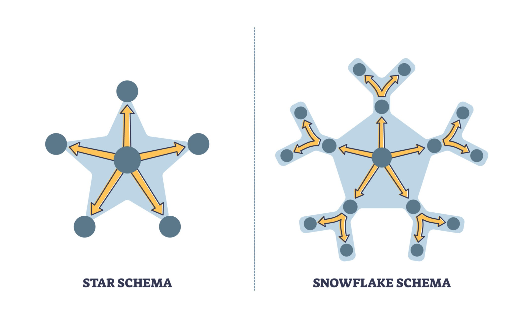
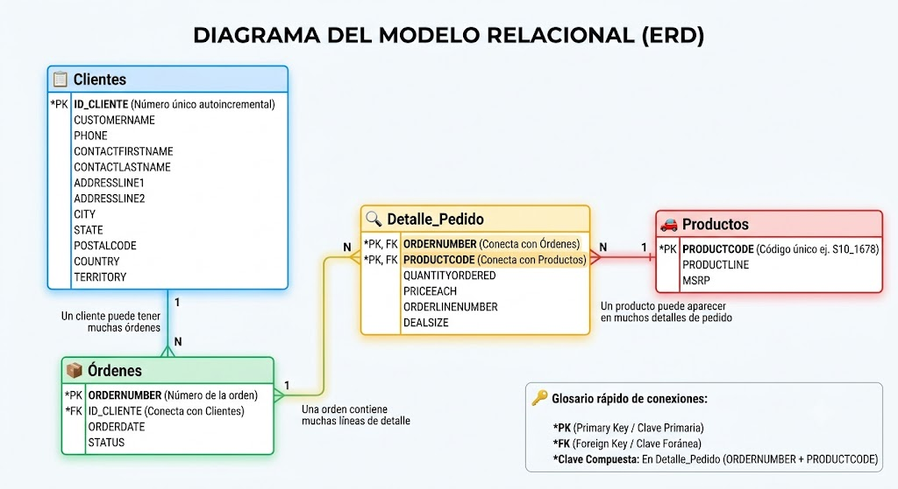

Partimos de una hoja de excel plana sales_data_sample.xls.

La tabla inicial es lo que en el mundo de los datos llamamos un **Dataset Denormalizado** o **Tabla Plana**. Es un registro histórico de ventas de una empresa (en este caso, de maquetas y juguetes de colección).

Contiene las siguientes columnas:

**Datos del Pedido (La Transacción)**

-   **`ORDERNUMBER`**: El número de factura o ticket. Se repite si el cliente compró varios productos a la vez.

-   **`ORDERDATE`**: La fecha y hora en que se realizó la compra.

-   **`STATUS`**: El estado del pedido (Shipped/Enviado, Resolved/Resuelto, Cancelled/Cancelado, etc.).

-   **`QTR_ID`, `MONTH_ID`, `YEAR_ID`**: Campos redundantes que desglosan el trimestre, mes y año de la fecha.

**Datos del Producto**

-   **`PRODUCTCODE`**: El código de barras o identificador único del artículo (ej. S10_1678).

-   **`PRODUCTLINE`**: La categoría del juguete (Motorcycles, Classic Cars, Trains, etc.).

-   **`MSRP`**: El precio de venta recomendado por el fabricante.

**Datos del "Renglón" de la Factura (El Detalle)**

-   **`QUANTITYORDERED`**: Cuántas unidades de ese producto compró el cliente en esa orden.

-   **`PRICEEACH`**: El precio real al que se le vendió cada unidad (el que venía con el error de formato que detectaste).

-   **`ORDERLINENUMBER`**: El número de renglón dentro de la factura (Renglón 1, Renglón 2, etc.).

-   **`SALES`**: El total de dinero de esa línea (`QUANTITYORDERED` $\times$ `PRICEEACH`).

-   **`DEALSIZE`**: Una clasificación del tamaño del negocio basado en el dinero (Small, Medium, Large).

**Datos del Cliente (El Comprador)**

-   **`CUSTOMERNAME`**: El nombre de la empresa que compra.

-   **`CONTACTLASTNAME` / `CONTACTFIRSTNAME`**: El apellido y nombre de la persona de contacto en esa empresa.

-   **`PHONE`**: Teléfono de la empresa.

-   **`ADDRESSLINE1` / `ADDRESSLINE2`**: La dirección física de entrega.

-   **`CITY` / `STATE` / `POSTALCODE`**: Ciudad, Estado/Provincia y Código Postal.

-   **`COUNTRY` / `TERRITORY`**: País y región geográfica (ej. EMEA, NA, APAC).

# El Diagnóstico Inicial: ¿Por qué no dejamos todo en una sola tabla?

Cuando recibes un archivo como `sales_data_sample`, se le llama **Tabla Plana**. Para analizarla en Excel rápido está bien, pero para un sistema de verdad es un peligro por tres razones:

1.  **Redundancia masiva:** Si el cliente "Land of Toys Inc." hace 50 pedidos, vas a repetir su teléfono, su dirección y el nombre del contacto 50 veces. El archivo pesa más de lo debido.

2.  **Riesgo de inconsistencia:** Si ese cliente cambia de teléfono, tendrías que buscar las 50 filas y cambiarlo en todas. Si te olvidas de una, tus datos pierden coherencia.

3.  **Anomalías de borrado:** Si borras el único pedido que te hizo un cliente, ¡borras también la existencia del cliente y su teléfono de tu historial!

Para solucionar esto, aplicamos la **Normalización**: separar los datos por "entidades" (conceptos lógicos del mundo real).

# Pasos lógicos para saber cómo dividir tablas planas

## PASO 1: El truco de los "Sustantivos" (Identificar Tablas)

Para saber en qué tablas dividir una hoja de Excel gigante, mira los encabezados de las columnas y busca**"Sustantivos" principales (personas, cosas, lugares, eventos)**.

Frente a cualquier tabla plana, agrupa las columnas respondiendo a estas preguntas:

-   ¿Hay datos que describen a una **persona/empresa**? (Nombre, teléfono, dirección) $\rightarrow$ ¡Eso es una tabla! (**Clientes**).

-   ¿Hay datos que describen un **objeto/servicio** a la venta? (Código, categoría, precio de lista) $\rightarrow$ ¡Eso es otra tabla! (**Productos**).

-   ¿Hay datos que describen un **evento en el tiempo**? (Fecha de factura, número de ticket, estado de envío) $\rightarrow$ ¡Eso es otra tabla! (**Órdenes**).

## PASO 2: La prueba del "Eco" (Detectar Redundancia)

Para entender *por qué* se divide, haz este ejercicio mental con la tabla plana:

> **La Regla del Cambio Único:** \> *"Si un cliente cambia su número de teléfono, ¿en cuántas filas de este Excel tengo que modificarlo?"*

Si la respuesta es: *"En todas las filas donde ese cliente haya comprado algo (pueden ser 10, 50 o 100 veces)"*, entonces **está mal diseñado**.

**La conclusión lógica:** Cada dato del mundo real debe existir en **un solo lugar** de la base de datos. Si el teléfono se repite, es una señal irrefutable de que toda la información del cliente debe ser arrancada de ahí y mudarse a su propia tabla independiente.

## PASO 3: El dilema de la Clave Foránea (¿Dónde pongo el puente?)

Este es el talón de Aquiles de los principiantes: *Saben que tienen que conectar la tabla A con la tabla B, pero no saben cuál de las dos debe llevarse la clave del otro.*

### La Analogía del Bolsillo (Relación 1 a Muchos)

Imagina que tenemos dos entidades: **Madre** y **Hijo**. Una madre puede tener *muchos* hijos, pero un hijo tiene *una sola* madre. Queremos conectarlos usando sus IDs. ¿Dónde ponemos el ID del otro?

-   **Opción A (Incorrecta):** Ponemos el ID de los hijos en la tarjeta de la Madre.

    -   *El problema:* Si una madre tiene 1 hijo, anotas un número. Si tiene 5, tienes que empezar a crear columnas nuevas en su tarjeta (`Hijo_1`, `Hijo_2`, `Hijo_3`...). Rompes la tabla porque madre solo hay una, y tú la estás duplicando.\

        | Nombre del Hijo | Edad | Nombre de la Madre | Teléfono de la Madre |
        |-----------------|------|--------------------|----------------------|

        |       |     |                            |                               |
        |-------|-----|----------------------------|-------------------------------|
        | Juan  | 8   | María                      | 555-1234                      |
        | Sofía | 5   | 🔴 **María** *(Duplicado)* | 🔴 **555-1234** *(Duplicado)* |
        | Lucas | 3   | 🔴 **María** *(Duplicado)* | 🔴 **555-1234** *(Duplicado)* |

        ⚠️ **El peligro real:** Si María cambia de teléfono, tus compañeros tendrían que modificar tres celdas separadas. Si se olvidan de la fila de Lucas, los datos quedan corruptos.

-   **Opción B (Correcta):** Ponemos el ID de la Madre **en el bolsillo de cada Hijo**.

    -   *La ventaja:* Cada hijo es una fila independiente. No importa si la madre tiene 1 o 20 hijos; cada hijo solo necesita guardar **un único número** en su bolsillo: el ID de su madre.\

        |                   |            |              |
        |-------------------|------------|--------------|
        | **ID_Madre (PK)** | **Nombre** | **Teléfono** |
        | **1**             | María      | 555-1234     |

        |                  |                     |          |                   |
        |------------------|---------------------|----------|-------------------|
        | **ID_Hijo (PK)** | **Nombre del Hijo** | **Edad** | **ID_Madre (FK)** |
        | 101              | Juan                | 8        | **1**             |
        | 102              | Sofía               | 5        | **1**             |
        | 103              | Lucas               | 3        | **1**             |

> 👑 **La Regla de Oro Definitiva:**
>
> La Clave Foránea (FK) **SIEMPRE viaja a la tabla del "Muchos" (el Hijo)**. Nunca al revés.

## (Cheat Sheet)

|  |  |  |
|------------------------|------------------------|------------------------|
| **Paso** | **¿Qué hay que hacer?** | **¿Cómo se lo explico a mi cerebro?** |
| **1. Separar** | Agrupar columnas por concepto. | "Esto habla del auto, esto habla del mecánico, esto habla del turno". |
| **2. Crear PK** | Darle un número de identidad a cada cosa. | "Cada cliente/producto necesita un DNI único que nunca cambie". |
| **3. Conectar (FK)** | Poner el ID del "padre" en la tabla del "hijo". | "El elemento que se puede repetir muchas veces (el pedido) guarda en su bolsillo el ID del dueño (el cliente)". |

# Llevado a nuestro ejercicio práctico:

## ¿Cuántas tablas debo crear?

En el diseño de bases de datos no existe una única respuesta correcta. El proceso de normalización es como ordenar un armario: puedes clasificar la ropa en tres grandes cajas o puedes usar veinte cajones diminutos para separar los calcetines por colores y texturas.

Para este proyecto, tras analizar el archivo plano original, decidimos dividir la información en **cuatro tablas principales: Clientes, Productos, Órdenes y Detalle de Pedido**. Sin embargo, es importante entender que esta no era la única opción disponible y que toda decisión de diseño implica un equilibrio entre la teoría matemática y la realidad práctica.

### Las Alternativas: ¿Cómo se podría haber dividido?

Si le hubiéramos entregado este archivo a diferentes ingenieros de datos, habríamos obtenido soluciones muy distintas según su enfoque:

-   **El enfoque minimalista (3 tablas):** Algunos podrían haber intentado fusionar `Órdenes` y `Detalle_Pedido`. El problema es que se rompería la lógica relacional, obligándonos a repetir la fecha y el estado del pedido por cada producto diferente que viniera dentro de la misma caja.

-   **El enfoque ultra-teórico (6 o más tablas):** Un purista de las bases de datos habría llevado la normalización al extremo (lo que se conoce como *Modelo Copo de Nieve*). Habría arrancado los campos de contacto de la tabla de clientes para crear una tabla de `Contactos`, y habría separado las ciudades, estados y países en tablas independientes (`Paises`, `Estados`, `Ciudades`) para evitar cualquier tipo de repetición de texto.

    {width="466"}

### ¿Por qué 4 tablas es el "Punto Dulce" para este caso?

Hemos elegido el modelo de 4 tablas porque representa el equilibrio perfecto entre **limpieza de datos, rendimiento del sistema y simplicidad de aprendizaje** para el equipo, basándonos en los siguientes criterios:

#### Respeta el flujo del negocio

El modelo refleja exactamente cómo funciona el mundo real: un **Cliente** genera una **Orden**, esa orden se desglosa en un **Detalle** específico, y ese detalle consume artículos de un catálogo de **Productos**. Es una estructura intuitiva y fácil de consultar mediante código SQL o herramientas de análisis.

#### Tolerancia aceptable a la redundancia (Países y Territorios)

Es verdad que en nuestra tabla de `Clientes` el texto "USA" o "France" se va a repetir si tenemos varios clientes del mismo país. Teóricamente, esto es una redundancia. Sin embargo, decidimos dejar esos campos allí por pura **pragmaticidad**:

-   **Poco beneficio de espacio:** Una lista de países o ciudades es información muy estática que ocupa poquísimo espacio en texto. Crear tres tablas nuevas con sus respectivas claves primarias y foráneas solo para no repetir la palabra "USA" habría sobrecargado el sistema de forma innecesaria.

-   **Complejidad en las consultas:** Si separáramos los países, cada vez que quisiéramos hacer un reporte simple de "Ventas por País" tendríamos que unir (*JOIN*) cinco tablas en lugar de conectar directamente las que ya tenemos.

> 💡 **Conclusión para el equipo:** \> Normalizar no significa destruir la redundancia a cualquier precio; significa eliminar la redundancia **peligrosa** (como los datos de facturación o los precios modificables) y mantener el diseño lo más simple y eficiente posible para quienes van a trabajar con él en el día a día.

## ¿Qué tablas debo crear?

Para saber qué tablas crear, hazte estas preguntas frente al dataset:

-   *¿Quién compra?* $\rightarrow$ El **Cliente**.

-   *¿Qué compra?* $\rightarrow$ El **Producto**.

-   *¿Cuándo y cómo se hace la transacción?* $\rightarrow$ La **Orden (o Pedido)**.

-   *¿Qué productos específicos van dentro de esa orden y en qué cantidad?* $\rightarrow$ El **Detalle del Pedido**.

## Nuevo Modelo Relacional

A continuación, vemos cómo se distribuyen los campos originales, cuáles serán sus **Claves Principales (Primary Key - PK)** (el identificador único de cada fila) y sus **Claves Foráneas (Foreign Key - FK)** (el puente para conectar una tabla con otra).

-   Un **Cliente** puede tener **Muchas** Órdenes.

    -   *¿Quién es el hijo/el "Muchos"?* La Orden.

    -   *¿Dónde va la FK?* El `ID_CLIENTE` se mete en el bolsillo de la tabla **Órdenes**.

-   Una **Orden** puede tener **Muchos** Detalles de Producto.

    -   *¿Quién es el hijo/el "Muchos"?* El Detalle.

    -   *¿Dónde va la FK?* El `ORDERNUMBER` se mete en el bolsillo de **Detalle_Pedido**.

### Tabla 1: Clientes (`Clientes`)

Guarda la información única de las empresas que nos compran. Solo hay un registro por cliente.

-   **Clave Principal (PK):** `ID_CLIENTE`, un nuevo campo que se

-   **Campos incluidos:** `PHONE`, `CONTACTFIRSTNAME`, `CONTACTLASTNAME`, `ADDRESSLINE1`, `ADDRESSLINE2`, `CITY`, `STATE`, `POSTALCODE`, `COUNTRY`, `TERRITORY`.

### Tabla 2: Productos (`Productos`)

Guarda el catálogo de lo que vendemos. Un registro por cada artículo diferente.

-   **Clave Principal (PK):** `PRODUCTCODE` (El código único del producto, ej: S10_1678).

-   **Campos incluidos:** `PRODUCTLINE` (Gama o línea de producto), `MSRP` (Precio sugerido).

### Tabla 3: Órdenes / Pedidos (`Ordenes`)

Guarda la cabecera del pedido. Es decir, los datos generales de la compra, sin importar si compraron 1 o 20 productos distintos en ella.

-   **Clave Principal (PK):** `ORDERNUMBER` (Número de factura/pedido único).

-   **Clave Foránea (FK):** `ID_CLIENTE`(Nos dice *quién* hizo este pedido. Conecta con la tabla Clientes).

-   **Campos incluidos:** `ORDERDATE` (Fecha), `STATUS` (Estado del envío).

### Tabla 4: Detalle de Pedido (`Detalle_Pedido`)

Esta es la tabla intermedia. Una orden puede tener muchos productos, y un producto puede estar en muchas órdenes. Esta tabla registra el "puzle" de qué cosas van dentro de cada caja.

-   **Clave Principal (PK):** Aquí podemos usar **Clave Compuesta** formada por la combinación de `ORDERNUMBER` + `PRODUCTCODE`. No puede haber una fila idéntica con el mismo pedido y el mismo producto o dejar la tabla sin clave principal, ya que esta tabla no va a ser referenciada por otras, no hay necesidad de incluir una.

-   **Claves Foráneas (FK):**

    -   `ORDERNUMBER` (Conecta con la tabla Órdenes).

    -   `PRODUCTCODE` (Conecta con la tabla Productos).

-   **Campos incluidos:** `QUANTITYORDERED` (Cantidad), `PRICEEACH` (Precio cobrado), `SALES` (Total de la línea), `ORDERLINENUMBER` (Número de renglón en la factura), `DEALSIZE` (Tamaño del trato).

## Campos Redundantes y Eliminables

Un buen analista le demuestra al profesor que sabe optimizar espacio. En el dataset original hay campos que **no deberías guardar** en tu base de datos relacional porque se pueden calcular automáticamente:

|  |  |  |
|------------------------|------------------------|------------------------|
| **Campo original** | **¿Por qué es redundante?** | **¿Qué hacemos con él?** |
| `QTR_ID`, `MONTH_ID`, `YEAR_ID` | Ya tienes la fecha completa en `ORDERDATE`. Guardar el año, mes y trimestre por separado es repetir datos que cualquier software puede extraer de la fecha. | **Eliminar.** Se calculan mediante consultas de SQL o código cuando se necesiten. |
| `SALES` | Es el resultado matemático de multiplicar `QUANTITYORDERED * PRICEEACH`. | **Eliminar (o tratar como campo calculado).** En bases de datos puras no se guardan multiplicaciones para evitar que, si cambia el precio, el total quede desactualizado. |

## El Mapa de Relaciones (Modelo Entidad-Relación)

Para que las tablas "hablen" entre sí, establecemos conexiones lógicas.

-   **Clientes** $\rightarrow$ Órdenes (Relación 1 a Muchos / $1:N$):

    -   *Lógica:* Un cliente puede hacer **muchas** órdenes a lo largo del tiempo, pero una orden en específico pertenece a **un solo** cliente.

    -   *Conexión:* El campo `ID_CLIENTE`viaja de la tabla Clientes a la tabla Órdenes.

-   **Órdenes** $\rightarrow$ Detalle de Pedido (Relación 1 a Muchos / $1:N$):

    -   *Lógica:* Una orden puede tener **muchos** productos detallados en sus renglones, pero ese renglón de detalle pertenece exclusivamente a **esa** orden.

    -   *Conexión:* El campo `ORDERNUMBER` conecta ambas tablas.

-   **Productos** $\rightarrow$ Detalle de Pedido (Relación 1 a Muchos / $1:N$):

    -   *Lógica:* Un producto puede aparecer en **muchos** detalles de pedidos diferentes, pero cada renglón de detalle especifica un **único** producto.

    -   *Conexión:* El campo `PRODUCTCODE` conecta ambas tablas.

> 💡 **Nota conceptual:** Al unir **Órdenes** y **Productos** a través de **Detalle de Pedido**, hemos resuelto una relación de **Muchos a Muchos (**$N:M$) (Muchas órdenes tienen muchos productos). Las bases de datos no toleran las relaciones de Muchos a Muchos directamente, por eso la tabla `Detalle_Pedido` actúa como el puente perfecto.

