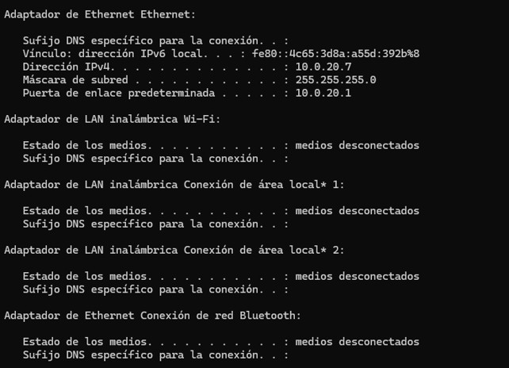
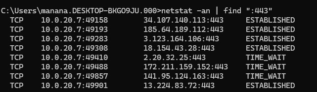

# Definiciones

-   **Red Informática:** Es un conjunto de ordenadores y otros dispositivos conectados entre sí para compartir información, recursos y servicios .
-   **LAN (Red de Área Local):** Es una red de acceso privado, muy rápida y segura, que abarca un área geográfica pequeña, como una casa o una oficina .
-   **Wi-Fi:** Tecnología que permite la conexión inalámbrica de dispositivos dentro de una LAN mediante ondas de radio, evitando tener que usar cables físicos .
-   **Fibra Óptica:** Es el medio físico de transmisión de datos más rápido y estable actualmente, utilizando hilos de vidrio o plástico muy finos por los que se envían pulsos de luz .

# Identificación y Direccionamiento de Dispositivos

Para comunicarse, los dispositivos necesitan tanto identificadores físicos como lógicos.

## Dirección Física: MAC (Media Access Control)

-   La dirección MAC es el identificador físico y único que tiene cada tarjeta de red de fábrica. Es como la "huella dactilar" del hardware de tu ordenador y nunca cambia .
-   Solo permite caracteres hexadecimales. **Ejemplo:** `00:1A:2B:3C:4D:5E`
-   *Nota sobre el enrutamiento:* Aunque la MAC de tu dispositivo es fija, la "MAC de destino" en la cabecera de los datos cambia continuamente dependiendo de hacia dónde se mueva la petición en la red (por ejemplo, de tu aplicación a tu router).

## Dirección Lógica: IP (Internet Protocol)

-   La dirección IP es una dirección lógica asignada a un dispositivo dentro de una red para que pueda ser localizado.
-   A diferencia de la MAC, la IP cambia dependiendo de la red a la que te conectes, y también cambia con el tiempo a no ser que sea una IP fija. Una analogía puede ser una persona, que puede tener distintos números de teléfono, el fijo de casa, el del móvil, o el del trabajo.
-   **IPv4:** Tiene 32 bits divididos en 4 números o bytes . Como 1 byte son 8 bits , cada bloque permite ($2^8$) 256 combinaciones posibles, comprendidas entre `0` y `255` .
-   **IPv6:** Solo permite caracteres hexadecimales Consta de 128 bits.

**Tipos de IP:**

Según su ámbito:

-   **IP Privada:** Es la dirección que tienen los dispositivos dentro de tu red local (ej. `10.0.20.7`) y no son visibles desde Internet.

-   **IP Pública:** Es la dirección única que identifica a toda tu red de cara a Internet, y es la que te asigna tu proveedor (ISP) .

Según su persistencia:

-   **IP Fija (Estática):** Es una dirección IP que nunca cambia, **esencial para servidores de bases de datos** porque los clientes necesitan saber siempre su ubicación exacta para conectarse .

-   **IP Dinámica:** Es una dirección IP que cambia cada cierto tiempo . El protocolo encargado de configurar esta IP cada vez se llama **DHCP** (Dynamic Host Configuration Protocol) .

## NAT (Network Address Translation)

NAT es el protocolo que traduce tu dirección privada a la pública en IPv4 .

-   Cuando haces una petición hacia Internet, tu ordenador utiliza un puerto lógico aleatorio de salida (ej. puerto `P1`) .

-   NAT cambia tu IP privada por la IP pública, y guarda la información del puerto en una tabla para saber a quién retornar la información .

-   Si se da el caso de que dos equipos de la misma red utilizan el mismo puerto a la vez, NAT asigna un puerto distinto a una de las peticiones de salida para evitar que se confundan, y lo registra en su tabla .

# Conversión Binaria

Para entender cómo funcionan las direcciones IP y las máscaras de red, primero debemos entender cómo "piensan" los ordenadores. Las máquinas no entienden nuestros números del 0 al 9 (sistema decimal); solo entienden de encendido y apagado, lo que se representa con **1 (encendido)** y **0 (apagado)**. A esto se le llama **sistema binario** .

Como hemos visto, una dirección IPv4 se divide en 4 bloques de 8 bits (1 byte) . Cada uno de esos 8 bits tiene un **valor posicional** basado en potencias de 2 . Si escribimos esos valores de izquierda a derecha, obtenemos nuestra "tabla mágica" que usaremos para todas las conversiones (128-64-32-16-8-4-2-1) :

| Posición (Bit)    | 8º      | 7º     | 6º     | 5º     | 4º    | 3º    | 2º    | 1º    |
|:------------------|:--------|:-------|:-------|:-------|:------|:------|:------|:------|
| **Valor Decimal** | **128** | **64** | **32** | **16** | **8** | **4** | **2** | **1** |

El valor máximo que puede tener un bloque de 8 bits es **255** (que es el resultado de sumar todos los valores de la tabla: 128+64+32+16+8+4+2+1) . Si todos los bits están en `0`, el valor es **0** .

### Cómo convertir de Binario a Decimal (El método de la suma)

Esta es la parte más sencilla. Si te dan un número binario de 8 bits, solo tienes que colocarlo debajo de nuestra tabla mágica y **sumar los valores que tengan un 1**. Los que tengan un 0, se ignoran.

**Ejemplo: Convertir el número binario `00101011` a decimal .**

| Valor Decimal      | 128 | 64  | 32    | 16  | 8     | 4   | 2     | 1     |
|:-------------------|:----|:----|:------|:----|:------|:----|:------|:------|
| **Número Binario** | 0   | 0   | **1** | 0   | **1** | 0   | **1** | **1** |

-   Paso 1: Identificamos dónde están los "unos". Están en las posiciones del 32, el 8, el 2 y el 1 .
-   Paso 2: Sumamos esos valores: **32 + 8 + 2 + 1 = 43** .
-   *Resultado:* El binario `00101011` es el número **43** en decimal .

### Cómo convertir de Decimal a Binario (El método de la resta)

Para hacer el camino inverso, tomamos nuestro número decimal y vamos recorriendo la tabla de izquierda a derecha (desde el 128 hasta el 1), haciéndonos siempre la misma pregunta: **¿Puedo restar el valor de la tabla a mi número actual?**

-   Si la respuesta es **SÍ**, ponemos un **1**, restamos el valor, y continuamos con lo que nos sobra .

-   Si la respuesta es **NO**, ponemos un **0** y pasamos al siguiente número .

**Ejemplo: Convertir el número decimal `172` a binario .**

Vamos paso a paso de izquierda a derecha con nuestra tabla (128 - 64 - 32 - 16 - 8 - 4 - 2 - 1) :

1\. **128:** ¿El 128 cabe en el 172? **SÍ**. Ponemos un **1** . (Nos sobra: 172 - 128 = 44).

2\. **64:** ¿El 64 cabe en el 44 que nos sobra? **NO**. Ponemos un **0** .

3\. **32:** ¿El 32 cabe en el 44? **SÍ**. Ponemos un **1** . (Nos sobra: 44 - 32 = 12).

4\. **16:** ¿El 16 cabe en el 12? **NO**. Ponemos un **0**.

5\. **8:** ¿El 8 cabe en el 12? **SÍ**. Ponemos un **1**. (Nos sobra: 12 - 8 = 4).

6\. **4:** ¿El 4 cabe en el 4? **SÍ**. Ponemos un **1**. (Nos sobra: 4 - 4 = 0).

7\. **2:** ¿El 2 cabe en el 0? **NO**. Ponemos un **0**.

8\. **1:** ¿El 1 cabe en el 0? **NO**. Ponemos un **0**.

Si juntamos todos los unos y ceros que hemos ido poniendo, obtenemos el resultado:

-   *Resultado:* El número 172 en decimal es **`10101100`** en binario.

# Subnetting

La Máscara de Subred nos indica cuál es la parte de la IP que identifica a la red y cuál a los dispositivos .

## Entendiendo las Máscaras de Subred

La **Máscara de Subred** es un parámetro vital que acompaña siempre a una dirección IP.

Mientras que la IP nos dice *quién* es el dispositivo, la máscara nos da información sobre *en qué red* se encuentra ese dispositivo . Su función principal es dividir los 32 bits de una dirección IP en dos partes bien diferenciadas:

-   **La porción de Red:** Identifica a la red específica a la que pertenece el equipo .

-   **La porción de Host:** Identifica al propio dispositivo (el equipo) dentro de esa red concreta .

*(Para entenderlo mejor, imagina un número de teléfono. El código de país y el prefijo provincial serían la "porción de red" que te dice dónde está ubicada la línea, y el resto de los números serían la "porción de host" que identifica a la persona exacta. Gracias a la máscara, tu ordenador sabe exactamente dónde termina su red local y cuándo debe enviar la información a la Puerta de Enlace (el router) para salir a Internet).*

**¿Cómo se representa la máscara de subred?** Se puede expresar de dos maneras distintas que significan exactamente lo mismo:

-   **Notación simplificada (Ejemplo: `/24`):** Nos indica directamente cuántos bits (de los 32 totales) están encendidos e identifican a la red . Si es `/24`, los primeros 24 bits (los tres primeros bloques) son la red .

-   **Notación decimal (Ejemplo: `255.255.255.0`):** Es la traducción de esos bits a formato decimal, agrupados en 4 bloques para que se parezca a una dirección IP . Por ejemplo, una máscara `/16` equivale a `255.255.0.0` , y una máscara `/25` equivale a `255.255.255.128` .

Ejemplos más comunes:

-   **Máscara /24 (`255.255.255.0`):** Los primeros 24 bits, es decir los primeros 3 bloques de la IP identifican la red, dejando sólo un byte, es decir 8 bits ($2^{8}$) =256 IPs disponibles en el último bloque para los dispositivos. \[10, 12\].

-   **Máscara /16 (`255.255.0.0`):** Los primeros 2 bloques identifican la red, dejando $2^{16}$ es decir, *65,536* IPs disponibles en total \[11, 12\].

Otros casos: pasando de máscaras /24 a /16 pasamos de tener 256 direcciones disponibles a 65,536, puede ser que se decida dejar menos direcciones disponibles, pondremos un par de ejemplos:

-   **Máscara /25 (`255.255.255.128`):** Se toman los primeros 25 bits .

-   **Máscara /26 (`255.255.255.192`):** Se toman los primeros 26 bits .

Para entender cómo llegamos de una notación como **`/24`** al número **`255.255.255.0`**, debemos recordar que una dirección IPv4 y su máscara tienen 32 bits, divididos en 4 bloques (bytes) de 8 bits cada uno.

El número después de la barra (por ejemplo, el 24 en **`/24`**) simplemente indica **cuántos bits están encendidos (con valor 1) de izquierda a derecha** en la máscara de subred. El resto de los bits hasta completar los 32 se rellenan con ceros (**`0`**).

Cuando un bloque de 8 bits tiene todos sus unos encendidos (**`11111111`**), la suma de sus valores (**`128 + 64 + 32 + 16 + 8 + 4 + 2 + 1`**) es siempre **`255`**. Si todos están apagados (**`00000000`**), el valor es **`0`**.

**Cómo se calcula la Máscara /24:**

-   Cogemos los primeros 24 bits y los convertimos en unos: **`11111111.11111111.11111111.00000000`**.

-   Convertimos cada bloque de binario a decimal:

    -   Bloque 1 (**`11111111`**) = 255

    -   Bloque 2 (**`11111111`**) = 255

    -   Bloque 3 (**`11111111`**) = 255

    -   Bloque 4 (**`00000000`**) = 0

-   **Resultado decimal:** **`255.255.255.0`**.

**Cómo se calcula una Máscara /25:**

-   Cogemos los primeros 25 bits: **`11111111.11111111.11111111.10000000`**.

-   Los tres primeros bloques siguen siendo **`255`**.

-   En el último bloque (**`10000000`**), solo está encendido el primer bit de la izquierda, cuyo valor posicional es 128.

-   **Resultado decimal:** **`255.255.255.128`**.

**Cómo se calcula una Máscara /26:**

-   Cogemos los primeros 26 bits: **`11111111.11111111.11111111.11000000`**.

-   En el último bloque (**`11000000`**), están encendidos los dos primeros bits, que corresponden a los valores 128 y 64. Al sumarlos (**`128 + 64`**), obtenemos 192.

-   **Resultado decimal:** **`255.255.255.192`**.

## **Direcciones IP reservadas en toda red:**

-   **Dirección de Red:** Es la primera IP, reservada para identificar la red y no la puede llevar ningún equipo.

-   **Dirección de Broadcast:** Es la última IP disponible (ej. `192.168.1.255`), común a todos los dispositivos . Si se envía información a ella, la reciben todos los equipos .

-   **Puerta de Enlace Predeterminada (Default Gateway):** La puerta de enlace predeterminada es la dirección IP del router o dispositivo que actúa como punto de salida de la red local hacia otras redes, normalmente Internet. Es el equipo al que un dispositivo envía todo el tráfico destinado a direcciones que no pertenecen a su misma red. Aunque por convención suele asignarse una dirección "cómoda", generalmente la primera dirección disponible (ej. `192.168.1.1`) pero no existe ninguna obligación técnica para que esto sea así . Permite que un dispositivo pueda comunicarse fuera de su red local, por ejemplo, acceder a Internet o a otra subred . Sin una puerta de enlace configurada, el dispositivo solo podrá comunicarse con hosts de su misma red .

### Calculando IPs de Red, Broadcast y Puerta de Enlace

Para entender cómo se calculan estas tres direcciones fundamentales, vamos a ver varios ejemplos con distintas máscaras de subred, desde las más sencillas hasta las más complejas.

Ejemplo 1: Máscara /24 (Bloques completos, el caso más fácil)

-   **IP del equipo:** **`192.168.1.33/24`**

-   **Análisis:** La máscara **`/24`** significa que los primeros 3 bloques de 8 bits (8+8+8=24) están fijos e identifican a la red. Nos queda un bloque entero (8 bits) libre para los hosts, permitiendo 256 combinaciones.

-   **Dirección de Red:** Ponemos a **`0`** toda la parte de los hosts. Resultado: 192.168.1.**0**. No se puede asignar a ningún equipo.

-   **Puerta de Enlace (Router):** Generalmente es la primera dirección disponible después de la de red. Resultado: 192.168.1.**1**.

-   **Dirección de Broadcast:** Ponemos todos los bits de la parte de hosts a **`1`** (que en decimal es 255). Resultado: 192.168.1.**255**.

Ejemplo 2: Máscara /16 (Bloques completos más grandes)

-   **IP del equipo:** Supongamos una IP **`192.168.50.33/16`**

-   **Análisis:** La máscara **`/16`** significa que solo los primeros 2 bloques identifican la red. Nos quedan libres dos bloques enteros (216=65.536 direcciones).

-   **Dirección de Red:** Ponemos los dos bloques de hosts a **`0`**. Resultado: **192.168.0.0**.

-   **Puerta de Enlace:** La primera dirección disponible. Resultado: **192.168.0.1** (A veces también se configura como **`192.168.1.1`** dependiendo del administrador).

-   **Dirección de Broadcast:** Ponemos los dos últimos bloques al máximo (255). Resultado: **192.168.255.255**.

Ejemplo 3: Máscara /23 (El caso difícil: Desbordamiento al siguiente byte)

Aquí es donde se complica, porque la red no termina en un punto exacto, sino en medio de un byte.

-   **IP del equipo:** **`172.16.5.112/23`**.

-   **Análisis de la Máscara:** Una máscara **`/23`** toma los primeros 16 bits completos (los dos primeros bloques), y **7 bits del tercer bloque** (16+7=23). Esto significa que para los hosts nos quedan 9 bits libres (32−23=9). Tener 9 bits disponibles nos da ($2^9$)=512 direcciones para dispositivos.

-   **Dirección de Red:**

    -   Tenemos que convertir el tercer bloque de la IP, en nuestro ejemplo el **`5`**, a binario. Esto nos da **`00000101`**.
    -   Como la máscara coge 7 bits de este bloque, ponemos 1 en las primeras 7 posiciones **`11111110`**.
    -   Para saber cuál es la red real, aplicamos la lógica binaria (AND) cruzando la IP con la máscara. La regla es sencilla: solo da `1` si ambos bits son `1`. Veámoslo en una tabla bit a bit:

    | Posición / Valor    |   128   |   64    |   32    |   16    |    8    |    4    |    2    |    1    |
    |:-------|:------:|:------:|:------:|:------:|:------:|:------:|:------:|:------:|
    | **IP (Valor: 5)**   |   `0`   |   `0`   |   `0`   |   `0`   |   `0`   |   `1`   |   `0`   |   `1`   |
    | **Máscara (/23)**   |   `1`   |   `1`   |   `1`   |   `1`   |   `1`   |   `1`   |   `1`   |   `0`   |
    | **Resultado (Red)** | **`0`** | **`0`** | **`0`** | **`0`** | **`0`** | **`1`** | **`0`** | **`0`** |

    -   Como puedes observar en la tabla, el último `1` del número 5 coincide con un `0` en la máscara, por lo que se anula. El resultado binario es **`00000100`**, que al pasarlo a decimal es **`4`**.
    -   *¡Fíjate cómo el bloque 5 original de la IP se ha convertido en un 4 al calcular la base de la red!* Por tanto, la dirección de red empieza en: **`172.16.4.0`**.

-   **Puerta de Enlace:** La primera dirección disponible en esa red. Resultado: **`172.16.4.1`**.

-   **El Problema del Broadcast (El desbordamiento):** Como nuestra red tiene 512 direcciones disponibles, un solo bloque final de la IP (que solo llega a 255) se nos queda pequeño. ¿Cómo metemos 512 equipos? Llenamos un primer bloque entero (desde **`172.16.4.0`** hasta **`172.16.4.255`**) y, al agotarlo, **continuamos en el siguiente número del bloque anterior**, sumándole 1. Es decir, la red continúa por **`172.16.5.0`** hasta llegar a su fin en **`172.16.5.255`**. (¡Y aquí es exactamente donde se encuentra encuadrada la IP de nuestro equipo inicial `172.16.5.112`!).

-   **Dirección de Broadcast:** Será la última IP de este segundo bloque desbordado: **`172.16.5.255`**.

-   **Dirección de Broadcast:** Será la última IP de este bloque desbordado: **172.16.5.255**.

Ejemplo 4: Máscara /25 (Partiendo un byte por la mitad)

En el ejemplo anterior faltaba espacio, pero aquí ocurre lo contrario: un solo bloque de 256 se divide en partes más pequeñas.

-   **IP del equipo:** **`192.168.1.132/25`**.

-   **Análisis:** Una máscara **/25** significa que tomamos los tres primeros bloques completos (24 bits) y le "robamos" 1 bit al último bloque (24+1=25). En binario, la máscara de ese bloque de bits queda 10000000, es decir, el primero queda reservado para la identificacion de la red. Ese número en decimal es 128.

-   **Dirección de Red:** El número **`132`** de la IP en binario es **`10000100`**. Si aplicamos nuestra máscara (que solo deja encendido el primer bit de valor 128), nos queda **`10000000`**, al cruzarlo con lógica binaria nos queda **`10000000`**, al pasarlo a decimal es el valor 128, lo que significa que el inicio de esta subred específica es **192.168.1.128**.

-   **Puerta de Enlace:** La primera disponible después de la red. Resultado: **192.168.1.129**.

-   **Dirección de Broadcast:** Como la red empezó en el 128 y le quedaban 7 bits disponibles para los hosts eso es $(2^7)$ = 128 posiciones para los hosts, llega hasta el final del bloque natural. El broadcast es la última IP antes del 256 ficticio. Resultado: **192.168.1.255**.

::: practica
## Ejercicio Resuelto: Subnetting

¿Están las IPs `192.168.1.127/25` y `192.168.1.129/25` en la misma red?

¿Cuál es la IP de red y la de broadcast de cada una?

¿Cuántas IPs nos quedan disponibles para los hosts? .

**Solución Paso a Paso:**

**1. Entender la Máscara de Subred:** Una máscara `/25` nos dice que los primeros 25 bits identifican a la red . En binario, esto es: `11111111.11111111.11111111.10000000` . En decimal, esto es `255.255.255.128` . Como nos quedan 7 bits en el último bloque para los hosts, el total de direcciones por subred es $2^7 = 128$

**2. Analizar la primera IP (`192.168.1.127`):**

-   Pasamos el último byte (`127`) a binario: `01111111`

-   Aplicamos la máscara (`10000000`) usando lógica booleana (AND): `01111111` AND `10000000` = `00000000`

-   Pasamos ese número a decimal: 0

-   **IP de Red:** `192.168.1.0`

-   **IP de Broadcast:** Es la última dirección antes de la siguiente subred, así que es `192.168.1.127`

-   *Conclusión para la IP 1:* Esta dirección es la IP de Broadcast de la primera subred, por lo que no es una IP que se le pueda dar a un equipo normal.

**3. Analizar la segunda IP (`192.168.1.129`):**

-   Pasamos el último byte (`129`) a binario: `10000001` .

-   Aplicamos la máscara (`10000000`) mediante lógica booleana: `10000001` AND `10000000` = `10000000`

-   Lo pasamos a decimal 128

-   **IP de Red:** `192.168.1.128` .

-   **IP de Broadcast:** `192.168.1.255` .

-   *Conclusión para la IP 2:* Esta sí es una IP válida para un host dentro de la segunda subred .

**4. Respuestas Finales:**

-   **¿Están en la misma red?** No.

-   **¿Cuántas IPs nos quedan disponibles para los hosts?** Dado que la subred tiene 128 direcciones en total y hay que restar siempre 2 (la IP de Red y la de Broadcast), quedan **126 IPs disponibles** para hosts en cada subred .
:::

## Usando la consola para ver los detalles de red

Podemos usar la consola de comandos para ver la información sobre nuestra red usando el comando ipconfig:

La ip que se muestra ahí es nuestra ip privada, para ver la pública podemos usar internet, hay muchas páginas que nos muestran nuestra ip, simplemente pregunta a google cual es mi ip.

Hay información que no se muestra usando solo ipconfig, como por ejemplo la MAC (aparece como dirección física), para ver más información podemos usar ipconfig /all

# El Modelo TCP/IP y el Viaje de los Datos

El Modelo TCP/IP es el modelo práctico real en el que se basa Internet hoy en día y consta de 4 capas . Los datos bajan por las capas en el emisor (**Encapsulamiento**, añadiendo etiquetas) y suben en el receptor (**Desencapsulamiento**, retirando etiquetas) .

1.  **Capa de Aplicación:** Es donde interactúa el usuario y los programas (como clientes de bases de datos), generando los **Datos** puros .
2.  **Capa de Transporte:** Segmenta la información en trozos más pequeños llamados **Segmentos** y añade a la cabecera el puerto de origen y el de destino.
3.  **Capa de Red:** Añade la IP de origen y la IP de destino a la cabecera para ocuparse del enrutamiento, creando **Paquetes** .
4.  **Capa Física / Enlace de Datos:** Añade la MAC de origen y de destino creando **Tramas**. Se añade una cola (trailer) indicando que se ha bloqueado su modificación, y traduce todo a código binario puro (**Bits**) para enviarse por el medio físico .

> **💡 Regla Mnemotécnica para el nombre de la información en orden descendente:**
>
> -   **A**plicación $\rightarrow$ **D**atos (**D**e)
>
> -   **T**ransporte $\rightarrow$ **S**egmentos (**S**ábado)
>
> -   **R**ed $\rightarrow$ **P**aquetes (**P**or)
>
> -   **F**ísica $\rightarrow$ **T**ramas / **B**its (**T**arde)
>
> -   *Frase:* **D**e **S**ábado **P**or **T**arde .

# Capa de Transporte: Puertos y Protocolos (TCP vs UDP)

## Puertos Lógicos: Las "Puertas" de las Aplicaciones

Si la Dirección IP es como la dirección postal del servidor, los puertos lógicos son los "números de puerta" o apartamentos dentro de ese edificio. Permiten que los datos de muchas aplicaciones distintas (como tener varias pestañas del navegador abiertas, actualizaciones o aplicaciones de streaming) lleguen a su destino exacto dentro del mismo dispositivo al mismo tiempo .

-   Para la comunicación, el ordenador elige un puerto de salida al azar, pero hay que llegar a un puerto de llegada determinado en el servidor .
-   **¿Por qué hay exactamente 65.536 puertos lógicos?** No depende de tu red ni de tu ordenador. Los protocolos de transporte tienen reservado un espacio de exactamente 16 bits en su cabecera para escribir este número. Como sabemos por el sistema binario, $2^{16}$ da exactamente 65.536 puertos lógicos posibles .

**Clasificación de Puertos:**

-   **Puertos Bien Conocidos (*Well-Known Ports*, del 0 al 1023):** Son puertos asignados a determinadas cosas básicas y universales a nivel internacional . Al estar estandarizados, cualquier ordenador o navegador del mundo sabe a qué puerto llamar por defecto sin que se lo tengamos que decir. - *Ejemplos:* **HTTP siempre usa el puerto 80**, **HTTPS el 443** para navegación web segura y **SSH el 22** para conexiones remotas a servidores .

-   **Puertos Registrados (del 1024 al 49151):** Son puertos que empresas de software piden que se les asigne para sus aplicaciones particulares. - *Ejemplo:* Los servidores de bases de datos usarán un puerto distinto, por ejemplo **MySQL usa el 3306** . Por lo tanto, entran en esta categoría y no en la de puertos bien conocidos.

**️ Consejos de Gestión y Seguridad para el DBA:**

-   **El Firewall es el vigilante:** Para que tu servidor de base de datos MySQL reciba peticiones externas, ese puerto tiene que estar abierto en el Firewall, que se encarga de controlar qué puertos lo están .

-   **Regla de Oro:** Conviene tener todos los puertos que no estén en uso cerrados por seguridad .

-   **Resolución de problemas (Troubleshooting):** Puedes usar la consola de comandos (cmd) para verificar qué conexiones hay activas a un puerto . Por ejemplo, `netstat -an | find ":443"` mostrará las conexiones web, y si filtras por el puerto `22` cuando te conectas a un servidor puedes ver tu petición de conexión.

Podemos usar la consola de comandos para ver qué conexiones hay en un puerto, por ejemplo para ver las conexiones al puerto 443 usamos `netstat -an | find ":443"`

esto nos indica el protocolo, la dirección y puerto de origen y la dirección y puerto de destino.

::: summary
## TCP vs UDP

| Características          | TCP (Transmission Control Protocol)                                                           | UDP (User Datagram Protocol)                                                            |
|:---------------|:----------------------------|:--------------------------|
| **Conexión**             | Protocolo orientado a conexión y fiable .                                                     | Protocolo no orientado a conexión y rápido .                                            |
| **Funcionamiento**       | Comprueba que todos los datos lleguen completos y en orden; vuelve a pedir lo que se pierda . | Envía segmentos de forma continua sin comprobar si llegan, priorizando el tiempo real . |
| **Uso en Base de Datos** | **Esencial.** No podemos permitirnos perder registros o datos .                               | Rara vez usado en almacenamiento .                                                      |
| **Ejemplos**             | Consultar bases de datos, descargar archivos, enviar emails .                                 | Videollamadas, streaming, juegos online .                                               |
:::

# Protocolos de la Capa de Aplicación

Son las reglas que usan los programas del usuario para tareas concretas:

-   **HTTP / HTTPS:** Usados por navegadores web. HTTP envía información en texto plano, mientras que HTTPS es seguro y cifra los datos confidenciales .

-   **SMTP:** Protocolo dedicado exclusivamente a **enviar** correos electrónicos (*Send Mail To People*) .

-   **POP (POP3):** Descarga el correo al ordenador y lo borra del servidor, solo puedes leerlo ahí .

-   **IMAP:** Sincroniza el correo en tiempo real, permaneciendo los mensajes en el servidor para acceder desde cualquier dispositivo .

-   **FTP:** Protocolo especializado en la transferencia directa de archivos, muy útil para administradores que suben copias de seguridad de una base de datos al servidor .

-   **DNS (Domain Name System):** Traduce un nombre de dominio legible para los humanos (como `google.com`) a su dirección IP numérica real .

-   **VPN (Virtual Private Network):** Crea un túnel seguro y cifrado sobre una red pública . Permite el teletrabajo seguro simulando que tu equipo está conectado localmente a la red de la empresa para gestionar bases de datos .

# Infografic

