# Requisitos previos

- Una máquina con Ubuntu Server 26.04.

- Acceso con un usuario con permisos sudo.

- Conexión a Internet para instalar paquetes.

- Una terminal local o conexión SSH.

- Al menos 2 GB de RAM recomendados para realizar las pruebas con comodidad.

# Normas de seguridad

- No ejecutar esta práctica en un servidor de producción real.

- No detener servicios críticos.

- No matar procesos desconocidos.

- No modificar configuraciones permanentes salvo que se indique.

- No borrar logs del sistema.

- No ejecutar pruebas de carga durante más tiempo del indicado.

- No cambiar permisos de archivos del sistema.

- No ejecutar comandos destructivos como rm -rf /, mkfs, dd sobre discos reales o similares.

# Estado general del sistema

- Ver la **versión del sistema operativo** `cat /etc/os-release`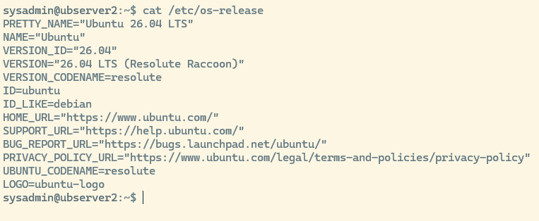

- Ver **información general del equipo**: `hostnamectl` Muestra información del equipo, como nombre del host, sistema operativo, kernel, arquitectura y tipo de máquina.

  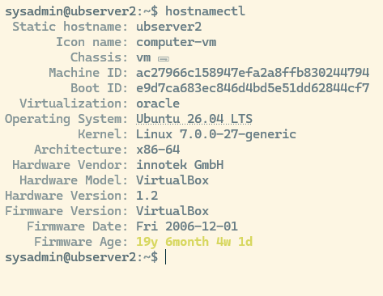

- Ver versión del kernel `uname -a` nombre del kernel, versión, arquitectura y fecha de compilación.

  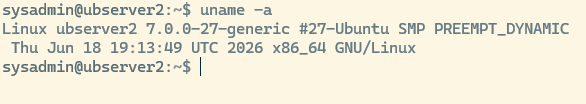l

  7.0.0

- **Ver CPU y número de procesadores lógicos**: `lscpu` muestra información de la cpu

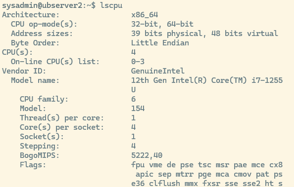

`nproc` devuelve el numero de procesadores lógicos: 4

- Ver **tiempo encendido y carga media:** Comando: `uptime` Muestra la hora actual, el tiempo que lleva encendido el sistema y los usuarios conectados. Los tres valores finales son la carga media del sistema en 1, 5 y 15 minutos.

``` bash
12:17:07 up 2:48, 2 users, load average: 0,00, 0,02, 0,00
```

- Ver **uso de memoria:** Comando: `free -h` Muestra la memoria RAM y swap en formato legible.\
  El dato más útil suele ser available, porque indica una estimación de la memoria disponible para nuevas aplicaciones sin recurrir a swap.\
  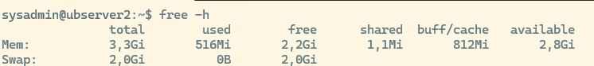

- Ver **espacio en disco:** Comando: `df -hT` Muestra el espacio usado y libre de los sistemas de archivos montados. `-h`: muestra tamaños en formato legible. `-T`: muestra el tipo de sistema de archivos.\
  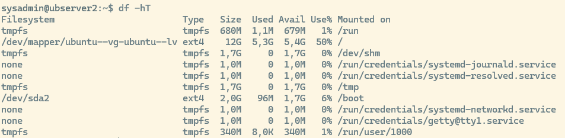

- Ver discos y particiones: Comando: `lsblk -o [nombres de columnas a mostrar]`. Ejemplo `lsblk -o NAME,SIZE,TYPE,FSTYPE,MOUNTPOINTS,MODEL`

Nos fijaremos en el resultado del arbol sda, vda, nvme0n1 o similares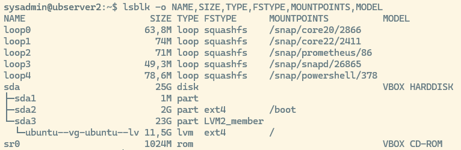

- Ver **direcciones de red:** `ip -br a` Muestra las interfaces de red y sus direcciones IP de forma resumida.\
  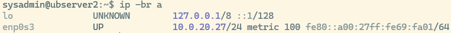

Qué significa `enp0s3 :`El nombre se divide en partes:

- **e** → *Ethernet*

- **n** → *Network*

- **p0** → está en el **bus PCI número 0**

- **s3** → es el **slot 3** dentro de ese bus

En resumen: `enp0s3` **= interfaz Ethernet en el bus PCI 0, slot 3**

# Monitorización en tiempo real con top

Comando: `top` Muestra una vista **dinámica** del sistema:

- Carga media.

- Número de tareas.

- Uso de CPU.

- Uso de memoria.

- Procesos en ejecución.

- Procesos que más recursos consumen.

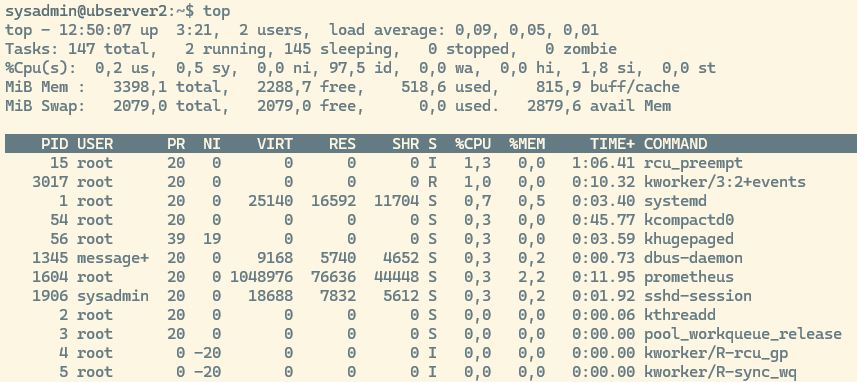

Dentro de top:\
`p` Ordena por uso de CPU.\
`m` Ordena por uso de memoria.\
`q` Sale de top.

**Ejecutar top en modo no interactivo:**

Comando: `top -b -n 1 | head -n 20` Las opciones significan:\
`-b`: modo batch, útil para guardar o mostrar salida en terminal.\
`-n 1`: toma una sola muestra.\
`head -n 20`: muestra solo las primeras 20 líneas, por defecto ordenadas por PID

\
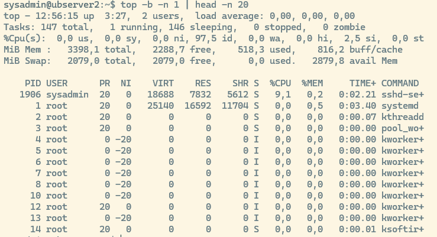

Para ordenar por columnas determinadas y conseguir así los procesos que más recursos están usando:\
Ordenar por:

- CPU: `top -b -o %CPU -n 1 | head -n 20`

- Memoria:`top -b -o %MEM -n 1 | head -n 20`

- tiempo acumulado de CPU: `top -b -o TIME+ -n 1 | head -n 20`

Explicación de la cabecera.\

```         
top - 13:14:26 up 3:45, 2 users, load average: 0,00, 0,01, 0,00
```

- **13:14:26** → hora actual del sistema.

- **up 3:45** → tiempo que lleva encendido el sistema (3 horas y 45 minutos).

- **2 users** → número de usuarios conectados (por consola o SSH).

- **load average** → carga media del sistema en los últimos 1, 5 y 15 minutos.

  - Valores bajos (como 0,00) indican que el sistema está ocioso.

  - Si el número se acerca al número de núcleos de CPU, el sistema está ocupado.

```         
Tasks: 147 total, 1 running, 146 sleeping, 0 stopped, 0 zombie
```

- **total** → número total de procesos.

- **running** → procesos activos usando CPU.

- **sleeping** → procesos en espera (la mayoría del tiempo).

- **stopped** → procesos detenidos manualmente.

- **zombie** → procesos “muertos” que aún ocupan una entrada en la tabla de procesos (debería ser 0).

```         
%Cpu(s): 0,0 us, 0,2 sy, 0,0 ni, 98,2 id, 0,0 wa, 0,0 hi, 1,6 si, 0,0 st
```

- **us** → porcentaje de CPU usado por procesos de usuario.

- **sy** → porcentaje usado por procesos del sistema (kernel).

- **ni** → procesos con prioridad modificada (nice).

- **id** → CPU inactiva (idle).

- **wa** → tiempo esperando operaciones de E/S (disco, red).

- **hi** → interrupciones de hardware.

- **si** → interrupciones de software.

- **st** → tiempo “robado” por el hypervisor (solo en máquinas virtuales).

```         
MiB Mem : 3398,1 total, 2294,5 free, 511,6 used, 817,1 buff/cache 
```

- **total** → memoria física total.

- **free** → memoria libre sin usar.

- **used** → memoria usada por procesos.

- **buff/cache** → memoria usada por buffers y caché del sistema (se libera si hace falta).

```         
MiB Swap: 2079,0 total, 2079,0 free, 0,0 used. 2886,6 avail Mem
```

- **total** → tamaño total del espacio swap.

- **free** → swap libre.

- **used** → swap usada (0,0 → no se está usando).

- **avail Mem** → memoria disponible para nuevos procesos (RAM libre + caché reutilizable).

::: extra
**top:** Permite acciones mientras está corriendo:

- `k` → matar procesos

- `r` → cambiar prioridad (renice)

- `M` → ordenar por memoria

- `P` → ordenar por CPU

- `q` → salir
:::

La versión moderna de top es `htop`. Pruébalo!

::: nota
# **Memoria libre vs memoria disponible**

## **Memoria libre (**`free`**)**

Es **RAM sin usar en absoluto**. Literalmente, páginas de memoria que no contienen nada útil.

En Linux suele ser **baja**, porque el kernel intenta usar la RAM para acelerar el sistema (cachés, buffers, page cache…).

**Interpretación:**

- Si es baja → *normal*.

- Si es alta → el sistema no está usando la RAM para cache (poco trabajo o recién arrancado).

## **Memoria disponible (**`available`**)**

Es una estimación de **cuánta RAM podría usarse para nuevas aplicaciones sin necesidad de empezar a usar swap**.

Incluye:

- Memoria libre real

- Memoria de caché que puede liberarse rápidamente

- Buffers reutilizables

- Otras páginas que el kernel puede descartar sin penalización

**Interpretación:**

- Es la métrica **realmente útil** para saber si te estás quedando sin RAM.

- Si baja de \~10–15% → empieza la presión de memoria.

- Si baja de \~5% → pronto habrá swap.

## Ejemplo:

```         
free = 200 MB 
available = 2500 MB
```

Aunque solo haya 200 MB “libres”, el sistema tiene **2.5 GB disponibles** para nuevas aplicaciones sin necesidad de swap, porque puede liberar caché y buffers.
:::

# Análisis estático de procesos con ps

Usaremos el comando `ps aux`

`ps` (Process Status) sirve para ver procesos que están ejecutándose en el sistema.

aux:

- `a` (all users): Muestra procesos de **todos los usuarios**, no solo los tuyos.

- `u`(user oriented format): presenta la información en un formato más legible

- `x` (processes without a controlling terminal): incluye procesos que no tienen terminal asociada, como servicios del sistema o demonios.

muestra **una lista completa de procesos activos**, incluyendo usuario, consumo de CPU y memoria, estado del proceso y el comando que lo lanzó.

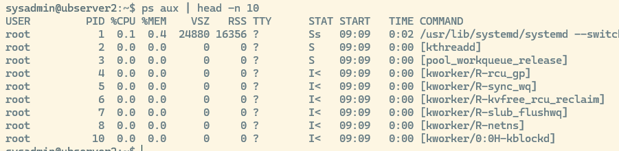

Por defecto ordena los procesos por uso de CPU, de mayor a menor, podemos cambiar ese orden usando argumentos, por ejemplo para ver los que más memoria consumen `ps aux --sort=-%mem | head -n 10`

Los procesos entre PID 1 y \~100 suelen ser **hilos internos del kernel**, no programas de usuario.

Se reconocen porque:

- El comando aparece entre **corchetes**: `[kworker/0:0H-kblockd]`

- El **PPID es 2**, que es el proceso `kthreadd`

- No tienen **TTY**

- No tienen binario ejecutable en disco

Podemos visualizar un proceso en concreto, por ejemplo usando su PID

`ps -fp {pid}`

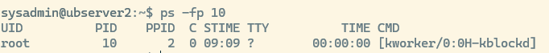

o buscarlo por nombre usando `grep`: `ps aux | grep apache`

Ver la ruta real del ejecutable (no funcionará con los hilos internos de kernel):

`sudo ls -l /proc/{pid}/exe`

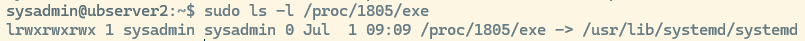

`sudo readlink /proc/{pid}/exe`

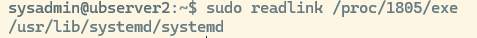

Ver el nombre del proceso: `ps -p {PID} -o pid,user,comm,args`

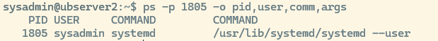

Ver la línea de comandos completa: `tr '\0' ' ' < /proc/{PID}/cmdline , echo` Muestra el comando completo con el que se inició el proceso con sus parámetros.

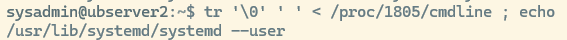

::: nota
La diferencia esencial entre `ps aux` y `top` es que uno te da **una foto fija** de los procesos en ese instante (ps), mientras que el otro te ofrece **una vista dinámica y en tiempo real** del sistema.

- **ps aux:** Da información detallada por proceso (PID, usuario, %CPU, %MEM, estado, comando completo). Ideal para búsquedas específicas, scripting y análisis puntual.

- **top:** Muestra métricas agregadas del sistema (carga, memoria total, procesos activos) y luego los procesos ordenados por consumo. Ideal para ver qué está consumiendo recursos *en este momento*.
:::

# Árbol de procesos

Nota: Instalar psmisc si es necesario. `sudo apt install -y psmisc`

pstree muestra los procesos en forma de árbol, indicando qué proceso ha lanzado a cuál.

`pstree -p`

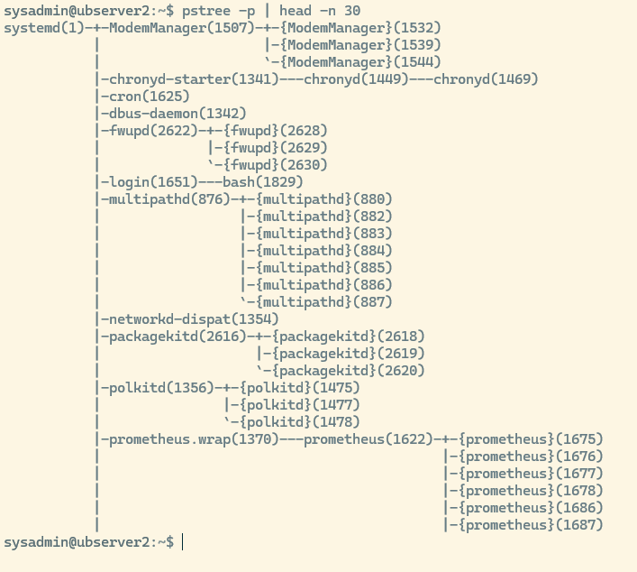

# Memoria y swap con free y vmstat

free: Muestra memoria total, usada, libre, compartida, caché y disponible. `free -h`


| **Columna** | **Significado** | **Cómo interpretarlo** |
|--------------------|--------------------|---------------------------------|
| **r** | Procesos esperando CPU | Si es mayor que el número de CPUs, hay **cola de ejecución** y posible saturación. |
| **b** | Procesos bloqueados | Valores altos indican **esperas de E/S** o procesos atascados. |
| **swpd** | Swap usada | Si crece, el sistema está **swapeando**; puede causar lentitud. |
| **free** | Memoria libre | No es crítico si es bajo: Linux usa RAM para cache. |
| **buff** | Memoria usada como buffers | Normalmente estable; buffers ayudan a la E/S. |
| **cache** | Memoria usada como caché | Cuanto más alto, mejor rendimiento; se libera si hace falta. |
| **si** | Swap in (swap → RAM) | Si es \>0 de forma continua, hay **presión de memoria**. |
| **so** | Swap out (RAM → swap) | Si aumenta, el sistema está expulsando páginas; puede ser grave. |
| **bi** | Bloques leídos desde disco | Alto = mucha lectura; puede indicar procesos intensivos de E/S. |
| **bo** | Bloques escritos a disco | Alto = mucha escritura; puede ser por logs, BD, backups, etc. |
| **us** | CPU usada por usuario | Alto = procesos de usuario consumiendo CPU (normal en cargas). |
| **sy** | CPU usada por el sistema | Alto = kernel ocupado; puede indicar E/S intensa o interrupciones. |
| **id** | CPU inactiva | Alto = sistema relajado; bajo = CPU ocupada. |
| **wa** | CPU esperando E/S | Alto = **cuello de botella en disco** o almacenamiento lento. |

## Disco y entrada/salida

Pre requisitos: instalar sysstat si es necesario: `sudo apt install -y sysstat`

Ejecutar: `iostat -xz 1 5`

Muestra estadísticas de CPU y dispositivos de almacenamiento

Opciones:

- -x: estadísticas extendidas del disco (await, util, r/s, w/s, etc.)

- -z: oculta dispositivos sin actividad.

- 1: intervalo de 1 segundo.

- 5: cinco mediciones.

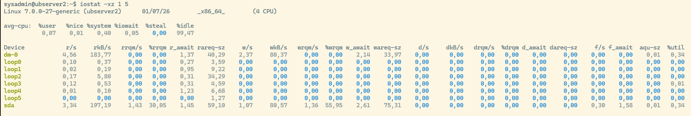

Dispositivos:

La columna **Device** te dice *dónde mirar* cuando analizas rendimiento de disco:

- Si ves `sda` → estás viendo el disco físico entero.

- Si ves `sda1` → estás viendo la partición.

- Si ves `dm-0` → probablemente es tu volumen raíz (`/`), aunque físicamente esté en `sda`.

- Si ves `nvme0n1` → es un NVMe, así que esperas latencias más bajas.

- Si ves `loop0` → es un archivo montado como disco, normalmente usado por snaps o contenedores.

| **Columna** | **Significado** | **Cómo leerlo / Interpretación** |
|-------------------|---------------------|--------------------------------|
| **r/s** | Lecturas por segundo | Alto = mucha carga de lectura; útil para ver si un proceso está leyendo intensivamente. |
| **w/s** | Escrituras por segundo | Alto = mucha carga de escritura; típico en BD, logs, backups. |
| **rkB/s** | KB leídos por segundo | Mide el volumen real de lectura; alto = operaciones pesadas. |
| **wkB/s** | KB escritos por segundo | Mide el volumen real de escritura; alto = procesos que generan muchos datos. |
| **rrqm/s** | Lecturas fusionadas por el scheduler | Alto = el kernel está agrupando lecturas, mejora rendimiento. |
| **wrqm/s** | Escrituras fusionadas por el scheduler | Alto = el kernel está agrupando escrituras, mejora rendimiento. |
| **%rrqm** | \% de lecturas fusionadas | \>20% suele indicar buena optimización del scheduler. |
| **%wrqm** | \% de escrituras fusionadas | \>20% indica que el disco está recibiendo operaciones agrupadas. |
| **r_await** | Tiempo medio de espera de lecturas (ms) | \<10 ms excelente; \>50 ms indica disco lento o saturado. |
| **w_await** | Tiempo medio de espera de escrituras (ms) | Igual que r_await: \>50 ms es señal de cuello de botella. |
| **await** | Tiempo medio total de espera (lectura+escritura) | Métrica clave: \>100 ms = saturación clara del dispositivo. |
| **aqu-sz** | Tamaño medio de la cola de I/O | \>3–5 indica que el disco no da abasto. |
| **svctm** | Tiempo medio de servicio del disco (ms) | Si await ≫ svctm, el problema es la cola (no el disco). |
| **%util** | Porcentaje de uso del dispositivo | \>90% = disco saturado; \<60% = saludable. |

# Red y conexiones

## Mostrar la tabla de enrutamiento del sistema:

`ip route`

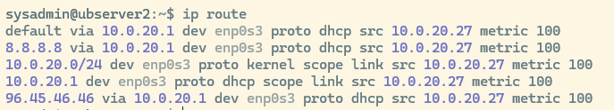

Vamos a ver lo que significa línea por línea

**Ruta por defecto (default)**

```         
default via 10.0.20.1 dev enp0s3 proto dhcp src 10.0.20.27 metric 100
```

- **default** → todo tráfico que no tenga una ruta más específica

- **via 10.0.20.1** → se envía al router/gateway (puerta de enlace)

- **dev enp0s3** → por la interfaz de red enp0s3

- **src 10.0.20.27** → tu IP local

- **proto dhcp** → esta ruta la creó el DHCP

- **metric 100** → prioridad (100 es normal)

**Ruta específica**

```         
8.8.8.8 via 10.0.20.1 dev enp0s3 proto dhcp src 10.0.20.27 metric 100
```

Algunos DHCP añaden rutas específicas hacia DNS externos. Tu router quiere asegurarse de que **8.8.8.8 siempre se alcanza por la puerta de enlace**, sin depender de la ruta por defecto.

- **8.8.8.8** → Google DNS

- **via 10.0.20.1** → se envía al mismo gateway

- **proto dhcp** → la añadió el servidor DHCP

**Ruta de tu red local**: Tu servidor sabe que **todo lo que sea 10.0.20.x está en la red local**, así que lo envía directamente por enp0s3.

```         
10.0.20.0/24 dev enp0s3 proto kernel scope link src 10.0.20.27 metric 100
```

- **10.0.20.0/24** → tu red local

- **dev enp0s3** → está directamente conectada

- **scope link** → no necesita gateway

- **proto kernel** → la creó el kernel automáticamente

**Ruta directa hacia el gateway**: Ruta específica hacia el router.

```         
10.0.20.1 dev enp0s3 proto dhcp scope link src 10.0.20.27 metric 100
```

**Ruta específica hacia 96.45.46.46:** Tu router quiere que ese host concreto (96.45.46.46) vaya por la puerta de enlace. Puede ser un DNS, un servidor de la operadora, o un servicio de red.

```         
96.45.46.46 via 10.0.20.1 dev enp0s3 proto dhcp src 10.0.20.27 metric 100
```

::: summary
Tu tabla de rutas dice:

- Tu servidor está en la red **10.0.20.0/24**

- Tu IP es **10.0.20.27**

- Tu puerta de enlace es **10.0.20.1**

- El DHCP ha añadido rutas específicas hacia:

  - **8.8.8.8** (Google DNS)

  - **96.45.46.46** (probablemente otro DNS o servicio del ISP)

Todo el tráfico que no sea de la red local va a **10.0.20.1**.
:::

Mostrar la tabla de enrutamiento del sistema: `ip route`


Vamos a ver lo que significa línea por línea

**Ruta por defecto (default)**

```         
default via 10.0.20.1 dev enp0s3 proto dhcp src 10.0.20.27 metric 100
```

- **default** → todo tráfico que no tenga una ruta más específica

- **via 10.0.20.1** → se envía al router/gateway (puerta de enlace)

- **dev enp0s3** → por la interfaz de red enp0s3

- **src 10.0.20.27** → tu IP local

- **proto dhcp** → esta ruta la creó el DHCP

- **metric 100** → prioridad (100 es normal)

**Ruta específica**

```         
8.8.8.8 via 10.0.20.1 dev enp0s3 proto dhcp src 10.0.20.27 metric 100
```

Algunos DHCP añaden rutas específicas hacia DNS externos. Tu router quiere asegurarse de que **8.8.8.8 siempre se alcanza por la puerta de enlace**, sin depender de la ruta por defecto.

- **8.8.8.8** → Google DNS

- **via 10.0.20.1** → se envía al mismo gateway

- **proto dhcp** → la añadió el servidor DHCP

**Ruta de tu red local**: Tu servidor sabe que **todo lo que sea 10.0.20.x está en la red local**, así que lo envía directamente por enp0s3.

```         
10.0.20.0/24 dev enp0s3 proto kernel scope link src 10.0.20.27 metric 100
```

- **10.0.20.0/24** → tu red local

- **dev enp0s3** → está directamente conectada

- **scope link** → no necesita gateway

- **proto kernel** → la creó el kernel automáticamente

**Ruta directa hacia el gateway**: Ruta específica hacia el router.

```         
10.0.20.1 dev enp0s3 proto dhcp scope link src 10.0.20.27 metric 100
```

**Ruta específica hacia 96.45.46.46:** Tu router quiere que ese host concreto (96.45.46.46) vaya por la puerta de enlace. Puede ser un DNS, un servidor de la operadora, o un servicio de red.

```         
96.45.46.46 via 10.0.20.1 dev enp0s3 proto dhcp src 10.0.20.27 metric 100
```

::: summary
Tu tabla de rutas dice:

- Tu servidor está en la red **10.0.20.0/24**

- Tu IP es **10.0.20.27**

- Tu puerta de enlace es **10.0.20.1**

- El DHCP ha añadido rutas específicas hacia:

  - **8.8.8.8** (Google DNS)

  - **96.45.46.46** (probablemente otro DNS o servicio del ISP)

Todo el tráfico que no sea de la red local va a **10.0.20.1**.
:::

## Ver estadísticas de interfaces

Ejecutar: `ip -s link`Este comando muestra **todas las interfaces de red** del sistema junto con **estadísticas de tráfico** (RX/TX), errores, paquetes descartados, etc. Es una herramienta muy útil para diagnosticar problemas de red.\
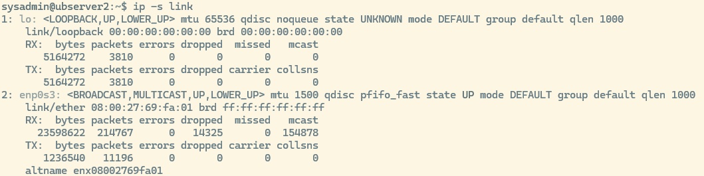

Voy a explicarlo **por partes**, **interfaz por interfaz**, y **línea por línea**.

### loopback

```         
lo: <LOOPBACK,UP,LOWER_UP> mtu 65536 qdisc noqueue state UNKNOWN mode DEFAULT group default qlen 1000
```

- **lo** → interfaz de loopback (127.0.0.1)

- **UP, LOWER_UP** → está activa y funcionando

- **mtu 65536** → tamaño máximo de paquete (muy grande, típico del loopback)

- **qdisc noqueue** → no usa cola de paquetes (no la necesita)

- **qlen 1000** → tamaño de cola teórica

#### RX (recepción)

| **bytes** | **packets** | **errors** | **dropped** | **missed** | **mcast** |
|-----------|-------------|------------|-------------|------------|-----------|
| 5164272   | 3810        | 0          | 0           | 0          | 0         |

- **bytes** → 5.1 MB recibidos

- **packets** → 3810 paquetes recibidos

- **errors** → 0 → perfecto

- **dropped** → 0 → no se han descartado paquetes

- **missed** → 0 → no se han perdido por falta de buffer

- **mcast** → 0 → no recibe multicast (normal en loopback)

#### TX (envío)

| **bytes** | **packets** | **errors** | **dropped** | **carrier** | **collsns** |
|-----------|-------------|------------|-------------|-------------|-------------|
| 5164272   | 3810        | 0          | 0           | 0           | 0           |

```         
```

- Igual que RX → tráfico interno del sistema

- **carrier** y **collsns** siempre 0 en loopback

### **Interfaz 2:** `enp0s3` **(tu interfaz de red real)**

```         
enp0s3: <BROADCAST,MULTICAST,UP,LOWER_UP> mtu 1500 qdisc pfifo_fast state UP mode DEFAULT group default qlen 1000 
```

- **enp0s3** → interfaz física (probablemente Ethernet virtual de VirtualBox)

- **BROADCAST, MULTICAST** → soporta broadcast y multicast

- **UP, LOWER_UP** → está activa y conectada

- **mtu 1500** → tamaño estándar de paquete Ethernet

- **qdisc pfifo_fast** → cola FIFO por defecto

- **qlen 1000** → cola de 1000 paquetes

#### RX (recepción)

| **bytes** | **packets** | **errors** | **dropped** | **missed** | **mcast** |
|-----------|-------------|------------|-------------|------------|-----------|
| 23598622  | 214767      | 0          | 14325       | 0          | 154878    |

| Campo       | Significado                  |
|-------------|------------------------------|
| **bytes**   | tráfico recibido             |
| **packets** | paquetes recibidos           |
| **errors**  | perfecto                     |
| **dropped** | ⚠️ paquetes descartados      |
| **missed**  | no se han perdido por buffer |
| **mcast**   | paquetes multicast           |

##### 🔥 Interpretación importante:

- **dropped = 14,325** → esto sí es relevante Significa que la interfaz **ha descartado paquetes** antes de entregarlos al kernel.

Esto suele deberse a:

- Saturación de la cola de red

- Paquetes multicast/broadcast excesivos

- Problemas de rendimiento en la VM

- Tráfico de red muy alto en la LAN

#### TX (envío)

| **bytes** | **packets** | **errors** | **dropped** | **carrier** | **collsns** |
|-----------|-------------|------------|-------------|-------------|-------------|
| 1236540   | 11196       | 0          | 0           | 0           |             |

| Campo       | Significado                               |
|-------------|-------------------------------------------|
| **bytes**   | tráfico enviado                           |
| **packets** | paquetes enviados                         |
| **errors**  | perfecto                                  |
| **dropped** | no se han descartado                      |
| **carrier** | sin problemas físicos                     |
| **collsns** | sin colisiones (normal en redes modernas) |

**Conclusión:** La interfaz **envía sin problemas**, pero **recibe con descartes**.

### **Línea final: altname**

Código

```         
altname enx08002769fa01 
```

Esto es simplemente un **nombre alternativo** que el kernel asigna automáticamente basado en la MAC:

- MAC: `08:00:27:69:fa:01`

- Nombre alternativo: `enx08002769fa01`

## Ver conexiones activas

`ss -tuna`

lista **todas las conexiones TCP y UDP**, tanto:

- abiertas

- escuchando

- establecidas

- sockets internos del sistema

Con columnas:

- **Netid** → tipo de socket (tcp/udp)

- **State** → estado (LISTEN, ESTAB, UNCONN…)

- **Recv-Q** → cola de recepción

- **Send-Q** → cola de envío

- **Local Address:Port** → IP y puerto local

- **Peer Address:Port** → IP y puerto remoto

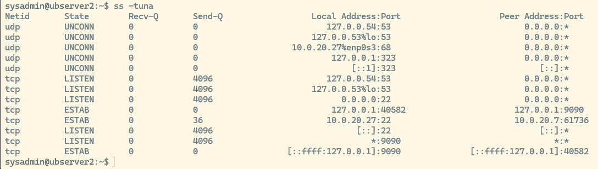

**Servicios escuchando**

- **SSH** → puertos 22 (IPv4 e IPv6)

- **DNS (systemd-resolved)** → puertos 53 TCP/UDP en loopback

- **Servicio en puerto 9090** → activo y con conexiones internas

**Conexiones activas**

- **SSH** desde 10.0.20.7 → tu sesión actual

- **Conexión interna** al servicio en 9090

**UDP sockets**

- DHCP cliente (puerto 68)

- NTP (puerto 323)

- DNS (puerto 53)

# Servicios con systemctl

## Listar servicios en ejecución

`systemctl list-units --type=service --state=running` te muestra **todos los servicios que están cargados y ejecutándose ahora mismo** en tu sistema. La tabla tiene tres columnas importantes: **LOAD**, **ACTIVE**, **SUB**. Si sabes leer esas tres, sabes interpretar cualquier servicio de systemd.\
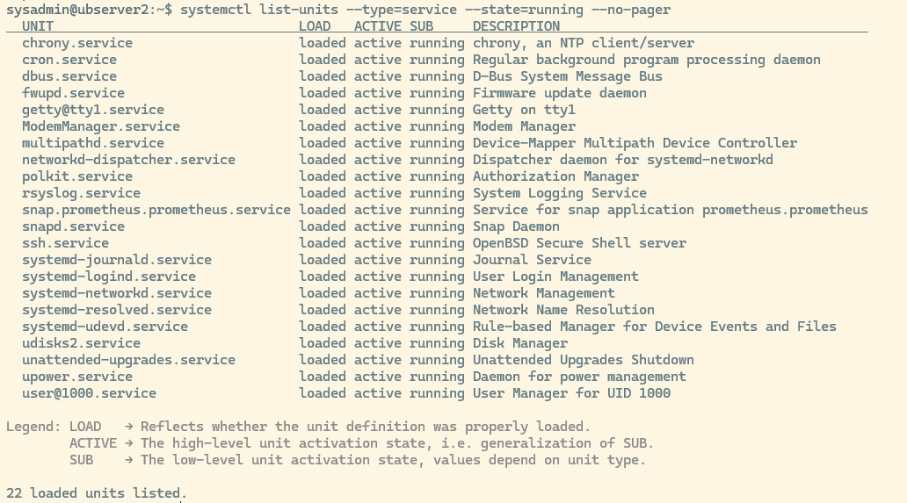

### Load

| **Valor** | **Significado** |
|---------------------|---------------------------------------------------|
| **loaded** | El archivo `.service` existe y systemd lo ha leído correctamente. |
| **not-found** | El archivo del servicio no existe, está corrupto o no se pudo cargar. |
| **masked** | El servicio está deshabilitado a propósito; no puede iniciarse. |

### Active

| **Valor**        | **Significado**               |
|------------------|-------------------------------|
| **active**       | El servicio está funcionando. |
| **inactive**     | El servicio está detenido.    |
| **failed**       | El servicio ha fallado.       |
| **activating**   | El servicio está arrancando.  |
| **deactivating** | El servicio está parando.     |

### Sub

| **Valor** | **Significado** |
|---------------------|---------------------------------------------------|
| **running** | El proceso del servicio está en ejecución. |
| **exited** | El servicio terminó correctamente (normal en servicios tipo “oneshot”). |
| **dead** | El servicio no está ejecutándose. |
| **start-pre** | Script previo al arranque del servicio. |
| **start-post** | Script posterior al arranque del servicio. |
| **reload** | El servicio está recargando su configuración. |

## Ver servicios fallidos

`systemctl --failed --no-pager`

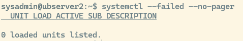

Consultar un servicio concreto\
El comando `systemctl status` te da un **informe completo** del estado de un servicio gestionado por systemd. La salida siempre se divide en **5 partes**:

1.  **Cabecera del servicio**

2.  **Estado (LOAD / ACTIVE / SUB)**

3.  **Información del proceso**

4.  **Dependencias**

5.  **Logs recientes del servicio**

`systemctl status {nombre_servicio} --no-pager`. Ejemplo `systemctl status systemd-journald.service --no-pager`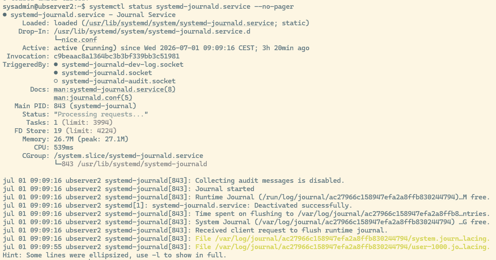

- Cabecera del servicio

  ```         
  systemd-journald.service - Journal Service
  ```

- Estado (Loaded / Active / Sub)

  ```         
  Loaded: loaded (/usr/lib/systemd/system/systemd-journald.service; static)
  Active: active (running) since Wed 2026-07-01 09:09:16 CEST; 3h 20min ago
  ```

- Drop-In (si existe): El servicio tiene configuración adicional en un directorio

- Invocation ID: sirve para correlacionar logs

- TriggeredBy (sockets asociados) : Esto te dice qué sockets activan este servicio. ● → activos ○ → inactivos

- Documentación: enlaces a documentación del servicio

- Información del proceso: PID, estado interno, número de tareas, memoria usada, cpu consumida, ruta del proceso en cgroups y el comando exacto que se está ejecutando.

- Logs recientes

## Ver el archivo de unidad del servicio

`systemctl cat {nombre_servicio}` Ejemplo: `systemctl cat systemd-journald.service` muestra el archivo printipal del servicio

sirve para **ver el contenido completo del archivo de unidad** de un servicio de systemd.

Para:

- Ver **cómo está configurado** un servicio.

- Ver qué **comando ejecuta**.

- Ver si tiene **parámetros especiales**.

- Ver si tiene **drop-ins** (archivos adicionales que modifican la configuración).

- Ver si el servicio está **modificado por el administrador**.

Es la forma más directa de inspeccionar la configuración real de un servicio.

## Ver dependencias del servicio

`systemctl list-dependencies {nombre_servicio} --no-pager` . Ejemplo: `systemctl list-dependencies systemd-journald.service --no-pager`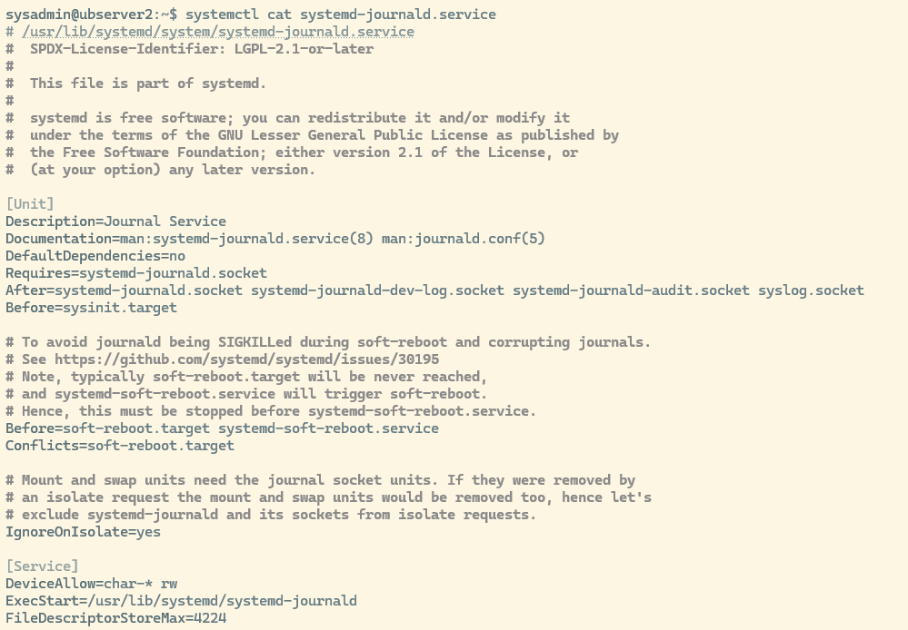

# Logs y eventos con journalctl

\
Muestra eventos del arranque actual con prioridad desde advertencia hasta alerta.

`journalctl -b -p warning..alert --no-pager`\

Opciones:

- `-b`: arranque actual.

- `-p` warning..alert: filtra por prioridad.

- `--no-pager`: muestra la salida directamente sin paginador.

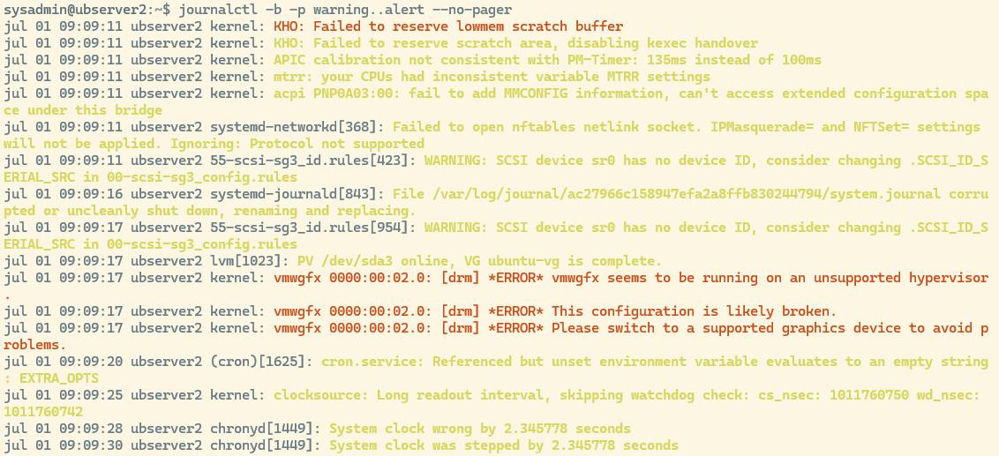

## Ver logs de un servicio concreto

`journalctl -u {nombre_servicio} -n {numero_lineas} --no-pager` Ejemplo: `journalctl -u systemd-journald.service -n 5 --no-pager` Muestra los últimos 5 eventos del servicio indicado.\
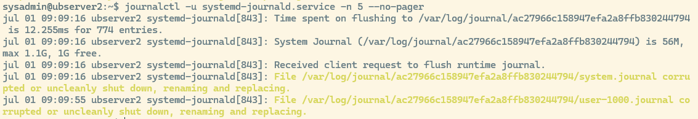

## Ver mensajes del kernel

`journalctl -k -n {numero_lineas} --no-pager`. Ejemplo `journalctl -k -n 30 --no-pager` Muestra los últimos n mensajes del kernel.

### Qué se espera ver

Mensajes relacionados con hardware, drivers, red, discos o arranque.