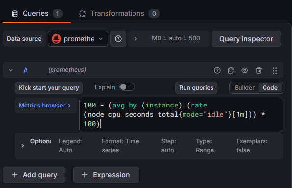
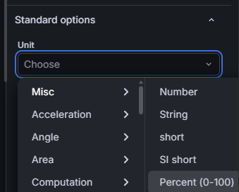
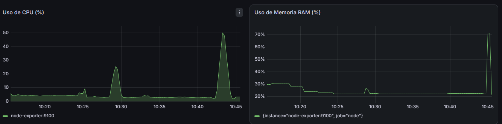
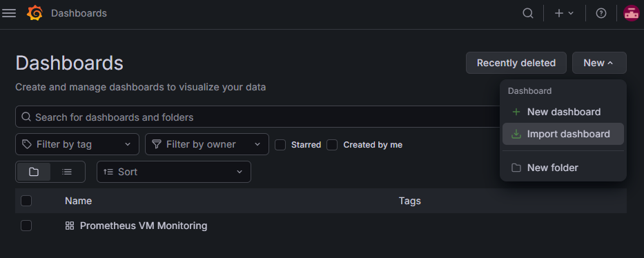
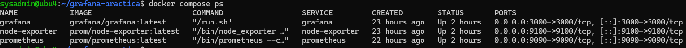
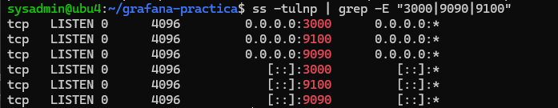
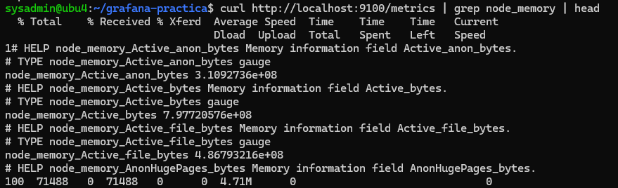
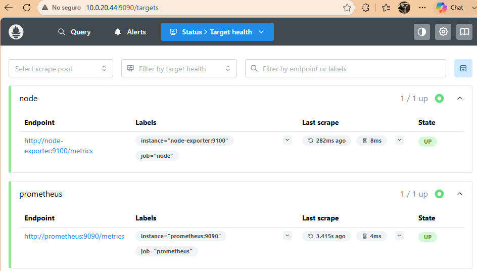

Vamos a monitorizar el sistema operativo Linux de nuestro servidor virtual desde el host (Windows) y para eso usaremos:

- Node Exporter: expone las métricas del sistema operativo Linux en un endpoint HTTP.

- Prometheus: lee las métricas de Node Exporter y las almacena en una base de datos de series temporales.

- Grafana: se conecta a Prometheus y permite crear dashboards para visualizar las métricas.

La práctica se realizará con **Docker Compose**, porque permite levantar varios servicios mediante un único fichero YAML. Docker Compose está pensado precisamente para definir y ejecutar aplicaciones formadas por varios contenedores desde un único archivo de configuración. ([Docker Documentation](https://docs.docker.com/compose/)) Grafana dispone de instalación oficial mediante imágenes Docker y docker-compose; además, actualmente la imagen OSS recomendada es grafana/grafana. ([Grafana Labs](https://grafana.com/docs/grafana/latest/setup-grafana/installation/docker/))

**Escenario de la práctica**

Vamos a simular una pequeña infraestructura empresarial. Tendremos un servidor Ubuntu que queremos monitorizar.

- ¿Cuánta CPU está consumiendo el servidor?

- ¿Cuánta memoria RAM queda disponible?

- ¿Cuánto espacio de disco se está utilizando?

- ¿Hay tráfico de red?

- ¿Podemos ver estos datos en un dashboard?\

# Creamos un servidor ubuntu con ip fija

La configuración de red será en adaptador puente

Para evitar que se nos rompa el monitor, necesitaremos tener la misma ip siempre, para eso vamos a cambiar la configuración ip de automática asignada por DHCP a manual

Para introducir una dirección ip manual paramos en este punto de la instalación y seleccionamos para editar enp0s3


y ponemos la configuración de red de forma manual, aunque usamos la misma que nos ha dado por defecto el DHCP


Comprobar que es *static* aquí después de configurar.

\


## Cambiar a ip fija un servidor existente.

Los pasos anteriores funcionarán para una instalación limpia, pero si ya tienes un servidor ubuntu con DHCP activo, tendrás que cambiarlo usando el yaml.

### Editar el archivo de configuración de Netplan

Normalmente está en:

```         
/etc/netplan/00-installer-config.yaml 
```

O algo similar dentro de `/etc/netplan/`.


Ábrelo:

```         
sudo nano /etc/netplan/00-installer-config.yaml 
```


### Configurar la IP fija

Ejemplo de configuración estática:

yaml

``` bash
network:
  ethernets:
    enp0s3:
      addresses:
      - 10.0.20.44/24
      match:
        macaddress: 08:00:27:b5:78:28
      nameservers:
        addresses:
        - 8.8.8.8
        - 1.1.1.1
        search: []
      routes:
      - to: default
        via: 10.0.20.1
      set-name: enp0s3
  version: 2
```

Cambia `ens33` por tu interfaz y ajusta la IP, gateway y DNS a tu red.

### Aplicar los cambios

``` bash
sudo netplan apply 
```

Si por alguna razón falla:

``` bash
sudo netplan try 
```

### Verificar que funciona

``` bash
ping 8.8.8.8 ping google.com 
```

Si responde, ya tienes tu IP fija funcionando.

# Instalación de Docker y Docker Compose

## Instalar actualizaciones

Como siempre, antes de instalar nada actualizamos el sistema:

``` bash

sudo apt update
sudo apt upgrade -y
```

- **apt update**: actualiza la lista de paquetes disponibles en los repositorios.

- **apt upgrade**: instala las versiones más recientes de los paquetes ya instalados.

Es importante hacerlo antes de instalar Docker para evitar conflictos con dependencias antiguas.

## Instalar paquetes necesarios

``` bash
sudo apt install -y ca-certificates curl gnupg
```

- **ca-certificates**: permite validar certificados HTTPS (sin esto no puedes descargar cosas de forma segura).

- **curl**: herramienta para descargar archivos desde Internet.

- **gnupg**: permite manejar claves GPG (necesarias para verificar que los paquetes de Docker son auténticos).

  

## Crear directorio para la clave GPG de Docker

``` bash
sudo install -m 0755 -d /etc/apt/keyrings
```

Ubuntu ahora recomienda guardar las claves GPG en `/etc/apt/keyrings` en lugar de `/etc/apt/trusted.gpg`. Este comando:

- Crea el directorio si no existe.

- Le da permisos seguros (0755).

## Descargar la clave oficial de Docker

``` bash
curl -fsSL https://download.docker.com/linux/ubuntu/gpg | \ 
sudo gpg --dearmor -o /etc/apt/keyrings/docker.gpg 
```

- Descarga la clave GPG de Docker.

- La convierte al formato `.gpg` (binario) con `gpg --dearmor`.

- La guarda en `/etc/apt/keyrings/docker.gpg`.

Esta clave sirve para verificar que los paquetes que instales realmente vienen de Docker y no están manipulados.

## Dar permisos a la clave

``` bash
sudo chmod a+r /etc/apt/keyrings/docker.gpg 
```

APT necesita poder leer la clave para validar los paquetes. Sin este permiso, el repositorio no funcionaría.

## Añadir el repositorio oficial de Docker

``` bash
echo "deb [arch=$(dpkg --print-architecture) signed-by=/etc/apt/keyrings/docker.gpg] https://download.docker.com/linux/ubuntu $(. /etc/os-release && echo "$VERSION_CODENAME") stable" | sudo tee /etc/apt/sources.list.d/docker.list > /dev/null
```

Crea un archivo llamado `/etc/apt/sources.list.d/docker.list`

Con el contenido:

- **deb** → indica que es un repositorio de paquetes binarios.

- **arch=\$(dpkg --print-architecture)** → detecta si tu sistema es amd64, arm64, etc.

- **signed-by=...** → indica qué clave GPG debe usarse para verificar este repositorio.

- **VERSION_CODENAME** → detecta tu versión de Ubuntu (ej. jammy, focal).

Esto añade el repositorio oficial de Docker, que contiene las versiones más recientes.

## Actualizar repositorios

``` bash
sudo apt update 
```

Ahora que has añadido un repositorio nuevo, apt debe volver a actualizar la lista de paquetes.

## Instalar Docker y Docker Compose

``` bash
sudo apt install -y docker-ce docker-ce-cli containerd.io docker-buildx-plugin docker-compose-plugin 
```


### ¿Qué instala cada paquete?

- **docker-ce** → Docker Community Edition (el motor principal).

- **docker-ce-cli** → comandos de Docker (`docker run`, `docker ps`, etc.).

- **containerd.io** → el runtime que gestiona los contenedores.

- **docker-buildx-plugin** → herramienta avanzada para construir imágenes.

- **docker-compose-plugin** → versión moderna de Docker Compose (`docker compose`).

## Comprobar que Docker funciona

``` bash
docker --version docker compose version 
```


Si ves versiones, todo está bien.

## Probar Docker

``` bash
sudo docker run hello-world 
```

Esto descarga una imagen mínima y la ejecuta. Si funciona, Docker está correctamente instalado.

\


## Usar Docker sin sudo

``` bash
sudo usermod -aG docker $USER 
```

Añade tu usuario al grupo `docker`.

Docker solo permite ejecutar comandos sin sudo si perteneces a ese grupo. Después debes **cerrar sesión y volver a entrar** para que el cambio se aplique. (para hacer logout usa `exit` y luego `login` para entrar de nuevo)


Este bloque de comandos:

::: summary
- Actualiza Ubuntu.

- Instala herramientas necesarias.

- Añade la clave GPG de Docker.

- Añade el repositorio oficial.

- Instala Docker + Compose.

- Verifica que funciona.

- Te permite usar Docker sin sudo.

Es la forma **correcta, segura y recomendada** de instalar Docker en Ubuntu.
:::

## Crear la estructura de trabajo

Creamos una carpeta (directorio) para la práctica:

``` bash
 mkdir -p ~/grafana-practica/prometheus
```

- `mkdir` → crea directorios

- `-p` → *parents*, crea también los directorios padre si no existen

``` bash
 cd ~/grafana-practica
```

# Crear el fichero de configuración de Prometheus

Este fichero le dice a Prometheus **qué debe monitorizar** y **cada cuánto tiempo**.

Primero asegúrate de estar en tu carpeta de práctica. Comprobamos dónde estamos con `pwd`

## Crear el fichero

``` bash
nano prometheus/prometheus.yml 
```

### Pegar el contenido

``` yaml
global:
  scrape_interval: 5s

scrape_configs:
  - job_name: "prometheus"
    static_configs:
      - targets: ["prometheus:9090"]

  - job_name: "node"
    static_configs:
      - targets: ["node-exporter:9100"]
```

**global.scrape_interval: 5s :** Prometheus recogerá métricas **cada 5 segundos**.

**job_name: "prometheus":** Prometheus también se monitoriza a sí mismo. El target `"prometheus:9090"` funciona porque en `Docker Compose` el servicio se llama `prometheus`, y Docker crea una red interna donde los contenedores se ven por nombre.

**job_name: "node" :**Este es el trabajo que recoge métricas del servidor Linux.

**targets: \["node-exporter:9100"\]:** Prometheus irá al contenedor llamado `node-exporter` en el puerto 9100.

### Guardar el fichero

En nano:

- **CTRL + O** → guardar

- **ENTER** → confirmar

- **CTRL + X** → salir

# Crear el fichero de configuración de docker compose

`docker-compose.yml`

Este fichero define **los tres servicios**:

- Prometheus

- Node Exporter

- Grafana

Y cómo deben ejecutarse juntos.

**Crear el fichero**

Asegúrate de estar en la carpeta correcta `cd ~/grafana-practica`

``` bash
nano docker-compose.yml 
```

**Pegar el contenido**

``` yaml
services:
  prometheus:
    image: prom/prometheus:latest
    container_name: prometheus
    ports:
      - "9090:9090"
    volumes:
      - ./prometheus/prometheus.yml:/etc/prometheus/prometheus.yml:ro
      - prometheus-data:/prometheus
    command:
      - "--config.file=/etc/prometheus/prometheus.yml"
      - "--storage.tsdb.retention.time=15d"
    restart: unless-stopped

  node-exporter:
    image: prom/node-exporter:latest
    container_name: node-exporter
    ports:
      - "9100:9100"
    volumes:
      - /:/host:ro,rslave
    command:
      - "--path.rootfs=/host"
    restart: unless-stopped

  grafana:
    image: grafana/grafana:latest
    container_name: grafana
    ports:
      - "3000:3000"
    environment:
      - GF_SECURITY_ADMIN_USER=admin
      - GF_SECURITY_ADMIN_PASSWORD=Admin123*
    volumes:
      - grafana-data:/var/lib/grafana
    restart: unless-stopped

volumes:
  prometheus-data:
  grafana-data:
```

::: {.nota-importante .extra}
🔐 **Nota importante sobre seguridad en producción**

Hasta ahora hemos usado en `docker-compose.yml` credenciales como:

GF_SECURITY_ADMIN_USER=admin\
GF_SECURITY_ADMIN_PASSWORD=Admin123\*

Esto está bien para una **práctica**, pero **en producción nunca se deben usar credenciales por defecto ni contraseñas en texto plano dentro del compose**. Es un riesgo grave porque:

- cualquiera que vea el archivo puede leer la contraseña

- si el repositorio se publica, la contraseña queda expuesta

- si el servidor tiene varios usuarios, todos pueden verla

- las contraseñas en texto plano son un vector de ataque muy común

Por eso, en entornos reales se usan **variables de entorno externas** o **gestores de secretos**.

✔️ **Alternativa recomendada: archivo** `.env` **(seguro y sencillo)**

La forma más práctica y segura de gestionar credenciales en Docker es usar un archivo `.env` que **no se sube al repositorio**.

1\. Crear un archivo `.env` en la misma carpeta del compose

Contenido del `.env`:

```         
GF_SECURITY_ADMIN_USER=admin 
```

```         
GF_SECURITY_ADMIN_PASSWORD=MiPasswordSegura123! 
```

Este archivo **no se publica** y solo existe en el servidor donde se despliega.

2\. Modificar el `docker-compose.yml` para usar variables

``` yaml
environment:
  - GF_SECURITY_ADMIN_USER
  - GF_SECURITY_ADMIN_PASSWORD
```

Docker sustituirá automáticamente las variables por los valores del `.env`.

3\. Asegurarse de que `.env` no se sube a GitHub

En tu `.gitignore` añade:

```         
.env 
```

Con esto, aunque publiques tu proyecto, **las credenciales nunca salen del servidor**.

✔️ **Alternativa 2: variables de entorno del sistema**

En el servidor:

``` bash
export GF_SECURITY_ADMIN_USER=admin export GF_SECURITY_ADMIN_PASSWORD=$(openssl rand -base64 32) 
```

Y en el compose:

``` yaml
environment:
  - GF_SECURITY_ADMIN_USER
  - GF_SECURITY_ADMIN_PASSWORD
```

Docker toma las variables directamente del entorno del sistema.

✔️ **Alternativa 3: gestores de secretos (producción real)**

En entornos profesionales como Azure, AWS o Kubernetes se usan:

- Azure Key Vault

- AWS Secrets Manager

- HashiCorp Vault

- Docker Swarm Secrets

- Kubernetes Secrets

Ejemplo con Docker Swarm:

``` bash
docker secret create grafana_admin_password password.txt 
```

Y en el compose:

``` yaml
secrets:
  - grafana_admin_password
```

La contraseña nunca aparece en texto plano.

**Resumen**

> **En producción nunca se deben usar credenciales por defecto ni contraseñas dentro del docker-compose.** **La alternativa correcta es usar variables de entorno externas, preferiblemente en un archivo** `.env` **que no se sube al repositorio.** **En entornos avanzados se usan gestores de secretos como Azure Key Vault o Docker Swarm Secrets.**
:::

## Contenedores que estamos configurando en este archivo:

### **Prometheus**

- Usa la imagen oficial `prom/prometheus`.

- Expone el puerto **9090** para acceder a la interfaz web.

- Monta tu fichero `prometheus.yml` dentro del contenedor.

- Guarda los datos en un volumen persistente `prometheus-data`.

- Retiene datos durante **15 días**.

### **Node Exporter**

- Es el agente de monitorización del servidor

- Expone el puerto **9100**.

- Monta `/` del host en modo lectura para poder leer métricas del sistema.

- Docker lo aísla, pero con `--path.rootfs=/host` puede acceder a la información del host.

### **Grafana**

- Usa la imagen oficial `grafana/grafana`.

- Expone el puerto **3000**.

- Usuario y contraseña inicial:

  - **admin**

  - **Admin123**\*

- Guarda dashboards y configuración en `grafana-data`.

# Levantar todo el stack

Desde la carpeta `~/grafana-practica`:

``` bash
docker compose up -d 
```

Docker Compose realiza **tres tareas fundamentales**:

## **Descarga las imágenes necesarias (si no existen en el sistema)**

``` yaml
image: prom/prometheus:latest
image: grafana/grafana:latest
image: prom/node-exporter:latest
```

Si estas imágenes no están ya en tu máquina, Docker las descarga automáticamente desde Docker Hub. Esto sustituye completamente la instalación manual de Prometheus, Grafana o Node Exporter en Ubuntu. No instalamos nada en el sistema operativo, todo viene dentro de las imágenes.

## Crea los contenedores a partir de esas imágenes

Cada servicio del YAML se convierte en un contenedor:

- `prometheus` → contenedor Prometheus

- `grafana` → contenedor Grafana

- `node-exporter` → contenedor Node Exporter

Cada uno es un entorno aislado, con su propio filesystem, su propio proceso y su propia configuración.

## **Configura redes, puertos y volúmenes automáticamente**

Esto es clave: **los contenedores se comunican entre sí por nombre**, no por IP.

Ejemplos:

- `ports: "3000:3000"` → expone Grafana al exterior

- `volumes:` → monta configuraciones persistentes

- `command:` → pasa parámetros a Prometheus o Node Exporter

- **red interna de Docker** → permite que Grafana acceda a Prometheus usando `http://prometheus:9090`


## Verificar que funciona

### Contenedores

Comprobar los logs del contenedor: `docker compose logs -f` y `CTRL + C` para salir

### Prometheus:

http://{TU_IP}:9090 por ejemplo <http://10.0.20.44:9090/>

Si estamos dentro de la propia máquina: `http://localhost:9090`\
\


Entramos en: `Status > Target health`

O directamente: http://{IP_DEL_SERVIDOR}:9090/targets\


#### **Hacer una primera consulta en Prometheus**

En Prometheus, vamos a la pestaña de consulta y probamos: `up`

Pulsamos **Execute**.


Interpretación:

- 1 = el servicio está accesible

- 0 = el servicio no está accesible

Probamos ahora: `node_memory_MemTotal_bytes`


Y después: `node_cpu_seconds_total`


Estas métricas serán las que luego usaremos en Grafana.

### Node Exporter:

http://{TU_IP}:9100/metrics\


Node Exporter debería estar exponiendo métricas en el puerto 9100.

Ejecutamos: `curl http://localhost:9100/metrics | head`

Si queremos ver solo métricas relacionadas con el sistema: `curl http://localhost:9100/metrics | grep node_cpu | head`

### Grafana:

http://{TU_IP}:3000 Usuario: **admin** Contraseña: **Admin123**\*\


# Trabajar en Grafana

Grafana puede pedir cambiar la contraseña. Para la práctica podemos cambiarla por otra sencilla o saltar el cambio si nos lo permite.

## Añadir Prometheus como fuente de datos en Grafana

Dentro de Grafana: `Connections / Data sources -> Add data source -> Prometheus`

Importante: dentro de Docker **no usamos** localhost:9090 como aparece por defecto, porque localhost sería la máquina desde donde nos estamos conectando mediante el navegador web. Docker Compose crea una red interna donde cada servicio se resuelve por su nombre. Usamos el nombre del servicio Docker: (prometheus)

En la URL ponemos: http://prometheus:9090\


Pulsamos: `Save & test`


## Crear nuestro primer dashboard manual

### Añadir una visualización nueva

Entramos en: Dashboards \> New \> New dashboard \> Add visualization


#### Seleccionamos la fuente de datos:

Prometheus


Tipo de visualización recomendado para todos los graficos: Time series\
\
En todas las métricas daremos una ventana de tiempo para los intervalos de tiempo a mostrar:

La ventana `[1m]` suaviza picos y evita que las métricas fluctúen demasiado. Se pueden usar intervalos menores si se desea `[5s]` o `[30s]`. Prometheus **no** está calculando una media de los valores durante 1 minuto. Está calculando **la velocidad de cambio por segundo**, usando **todos los puntos de datos recogidos en ese minuto**. Es decir: **Prometheus mira cómo ha cambiado la métrica en los últimos 60 segundos y calcula la pendiente (slope) de esa serie.**

::: extra
### Ejemplo sencillo con 5 mediciones y un pico

Vamos a imaginar una métrica de **CPU idle** (porcentaje de tiempo que la CPU está “sin hacer nada”) medida cada 15 segundos durante 1 minuto:

- Tiempo total: 60 segundos

- 5 puntos: t0,t15,t30,t45,t60

Supongamos estos valores de **idle%**:

| **Instante** | **Idle (%)**                              |
|--------------|-------------------------------------------|
| t0           | 90                                        |
| t15          | 90                                        |
| t30          | 10 ← pico de actividad (CPU casi ocupada) |
| t45          | 90                                        |
| t60          | 90                                        |

### 1. Media simple de los valores

Calculamos la media aritmética:

media=90+90+10+90+905=3705=74

- **Idle medio**: 74%

- **Uso medio de CPU**: 100−74=26%

La media “se come” el pico y lo reparte por todo el minuto.

### 2. Qué hace `rate()` bajo el capó (versión conceptual)

En realidad, `rate(node_cpu_seconds_total{mode="idle"}[1m])` no trabaja con porcentajes, sino con un **contador de segundos idle**. Simplifiquemos con un ejemplo equivalente:

Supongamos que el contador de segundos idle (`node_cpu_seconds_total{mode="idle"}`) tiene estos valores:

| **Instante** | **Idle seconds (contador)** |
|--------------|-----------------------------|
| t0           | 0                           |
| t15          | 13.5                        |
| t30          | 14.0                        |
| t45          | 27.5                        |
| t60          | 41.0                        |

Interpretación:

- Entre t0 y t15: la CPU ha estado idle el 90% del tiempo → 13.5 s

- Entre t15 y t30: idle baja mucho (pico de actividad) → solo 0.5 s más

- Entre t30 y t45: vuelve a estar muy idle → suma 13.5 s

- Entre t45 y t60: otra vez muy idle → suma 13.5 s

`rate()` hace, conceptualmente, esto:

1.  Mira todos los puntos en la ventana `[1m]`.

2.  Ajusta una **recta** (regresión lineal) al contador.

3.  Calcula la **pendiente** de esa recta → segundos idle por segundo.

Podemos aproximar la pendiente usando el primer y último punto:

pendiente≈41.0−060=4160≈0.6833

Eso significa:

- **Idle rate**: 0.6833 segundos idle por segundo → 68.33% idle

- **Uso de CPU**: 100−68.33≈31.67%

### 3. Comparación media vs `rate()` en tabla

| **Método** | **Qué hace** | **Resultado idle** | **Resultado uso CPU** |
|------------------|------------------|------------------|------------------|
| **Media simple** | Promedia los 5 valores de idle% | 74% | 26% |
| `rate()` **+ 1m** | Calcula la pendiente del contador en 60 s | ≈68.33% | ≈31.67% |

### Idea clave

- La **media** trata el pico como un valor más y lo reparte uniformemente.

- `rate()` mira **cómo ha evolucionado el contador en todo el minuto** y devuelve una **tendencia** (derivada), que refleja mejor el comportamiento global, sin reaccionar de forma exagerada a un solo punto.
:::

#### **Panel 1:** Uso de CPU (%)

Consulta PromQL: `100 - (avg by (instance) (rate(node_cpu_seconds_total{mode="idle"}[1m])) * 100)`



Unidad: Percent (0-100)



##### Explicación de la métrica:

`node_cpu_seconds_total{mode="idle"}`

Esta métrica mide **cuántos segundos de CPU** ha pasado el sistema **en estado idle** (sin hacer nada).

`rate(...[1m])`

`rate()` calcula la **velocidad de cambio por segundo** en los últimos 1 minuto. En este caso: **Qué porcentaje del tiempo reciente la CPU ha estado idle.**

`avg by (instance)(...)`Prometheus tiene varios cores por instancia. Este `avg` calcula el **promedio de idle** entre todos los cores de la máquina.

Multiplicación por 100: Convierte el valor en porcentaje: `idle% = avg(rate(idle)) * 100`

`100 - idle%`Si restas el porcentaje de idle a 100 obtienes: **CPU usada (%)**

Ejemplo: Si la CPU está idle un 20% → 100 - 20 = **80% de uso**.

**Por qué se usa el modo** `idle` **en lugar de** `user`**,** `system`**, etc.**

Porque:

- La suma de todos los modos (user, system, iowait, idle…) es 100%.

- Idle es el más fácil de interpretar.

- Si sabes cuánto está idle, sabes cuánto está ocupada.

Es la forma más robusta de medir uso real de CPU.

**La fórmula calcula el porcentaje de CPU usada restando el porcentaje de tiempo idle al 100%. Usa** `rate()` **para medir actividad reciente y** `avg` **para promediar todos los cores de la instancia.**

#### **Panel 2:** Uso de memoria RAM (%)

Consulta: `100 * (1 - (node_memory_MemAvailable_bytes / node_memory_MemTotal_bytes))`

Unidad: Percent (0-100)

Interpretación: Muestra qué porcentaje de RAM está en uso. MemAvailable es la métrica recomendada por el kernel para medir memoria realmente libre, porque incluye caché y buffers reutilizables.

#### **Panel 3:** Uso de disco raíz (%)

Consulta: `100 * (1 - (node_filesystem_avail_bytes{mountpoint="/",fstype!~"tmpfs|overlay|squashfs"}/node_filesystem_size_bytes{mountpoint="/",fstype!~"tmpfs|overlay|squashfs"}))`

Explicación: `node_filesystem_avail_bytes`Es el **espacio disponible** (libre) en bytes. `node_filesystem_size_bytes`Es el **tamaño total** del filesystem.`mountpoint="/"`esto especifica el disco raíz.

Esto excluye los ficheros temporales o virtuales porque no representan almacenamiento real en el disco:

```         
fstype!~"tmpfs|overlay|squashfs"
```

Unidad:Percent (0-100):

Interpretación: Muestra cuánto espacio se está usando en la partición principal.

#### **Panel 4: tráfico de red recibido**

Consulta: `rate(node_network_receive_bytes_total{device!="lo"}[1m])`

Unidad: bytes/sec

#### **Panel 5:** Tráfico de red enviado

Consulta: `rate(node_network_transmit_bytes_total{device!="lo"}[1m])`

Unidad: bytes/sec

#### **Panel 6:** Escritura en disco (B/s)

Consulta: `sum by (instance) ( rate(node_disk_written_bytes_total{device!~"loop.*|ram.*"}[1m]) )`

Tipo de visualización: Time series

Unidad: bytes/sec

#### **Resultado esperado**

Este panel debería mostrar picos cuando el sistema escriba datos en disco. Por ejemplo, al crear un fichero grande, instalar paquetes o realizar operaciones intensivas de escritura.

#### **Panel 7: Lectura en disco** (B/s)

Consulta: `sum by (instance) ( rate(node_disk_read_bytes_total{device!~"loop.*|ram.*"}[1m]) )`

Tipo de visualización: Time series

Unidad: bytes/sec

#### **Resultado esperado**

Este panel debería mostrar picos cuando el sistema lea datos del disco. Por ejemplo, al abrir ficheros grandes, cargar datos o leer información desde una base de datos.

#### **Guardar el dashboard**

**Monitorización básica del servidor Ubuntu**

Descripción: Dashboard básico para visualizar CPU, memoria, disco y red mediante Grafana, Prometheus y Node Exporter.

### **Generar carga para ver cambios en el dashboard**

Ahora vamos a provocar algo de actividad para que el dashboard lo muestre

Generamos carga de CPU durante 60 segundos:

`timeout 60s bash -c 'while true; do true; done' &timeout 60s bash -c 'while true; do true; done' &wait`

Esto genera carga de CPU durante **60 segundos** usando **dos** procesos.

Volvemos a Grafana y observamos el panel de CPU.

Ahora generamos algo de uso de disco:

`dd if=/dev/zero of=/tmp/prueba-grafana.dat bs=1M count=512 oflag=direct`

Eliminamos el fichero:

`rm /tmp/prueba-grafana.dat`

Ahora vamos a provocar actividad de **escritura** para comprobar que el panel funciona.

Ejecutamos:

`sudo dd if=/dev/zero of=/tmp/prueba-escritura.img bs=1M count=2048 status=progress conv=fsync`

Una vez creado el fichero anterior, vamos a **leerlo** para comprobar el panel de lectura.

Ejecutamos:

`sudo dd if=/tmp/prueba-escritura.img of=/dev/null bs=1M status=progress iflag=direct`

**Limpiar la prueba**

Cuando terminemos, eliminamos el fichero de prueba:

`sudo rm /tmp/prueba-escritura.img`

### Preguntas para responder:

1\. ¿Qué panel ha cambiado al ejecutar stress-ng?\


2\. ¿Qué métrica permite ver el uso de CPU? `node_cpu_seconds_total`

3\. ¿Qué diferencia hay entre ver la información en Prometheus y verla en Grafana? grafana permite crear graficas

4\. ¿Qué ventaja tiene guardar un dashboard? poder agrupar metricas similares y monitorizar actividad relacionada

5\. ¿Qué problemas podríamos detectar antes de que el usuario final se queje? creando alertas podemos saber cuando un recurso esta bajo presión

## Importar un dashboard ya preparado

Además del dashboard manual, podemos importar un dashboard ya creado por la comunidad.

En Grafana: Dashboards \>New\> Import\


En el campo de ID ponemos: **1860**

Ese dashboard corresponde a **Node Exporter Full**, preparado para mostrar muchas métricas de Linux usando Prometheus Node Exporter. La propia página del dashboard indica que usa el job_name: node, por eso en esta práctica hemos llamado node al trabajo de Prometheus. ([[Grafana Labs]{.underline}](https://grafana.com/grafana/dashboards/1860-node-exporter-full/))

Es posible que algunos paneles aparezcan vacíos si esperan métricas avanzadas no activadas. No pasa nada: para esta práctica lo importante es entender el flujo de monitorización.

# Comprobaciones finales

## Estado de los contenedores

Ejecutamos: `docker compose ps`



## Puertos

Comprobamos los puertos: `ss -tulnp | grep -E "3000|9090|9100"`

Deberíamos ver:

- 3000 → Grafana

- 9090 → Prometheus

- 9100 → Node Exporter

## Métricas Node Exporter

Comprobamos métricas: `curl http://localhost:9100/metrics | grep node_memory | head`Este comando está consultando **las métricas de memoria** que expone **Node Exporter** en el endpoint `/metrics`, y luego filtrando solo las que empiezan por `node_memory_`.\
`head` hará que sólo se muestren las 10 primeras filas de información.

Lo que dará es **información detallada del estado de la memoria RAM** de tu máquina, desglosada en diferentes categorías internas del kernel de Linux.



**Explicación del output**

1\. `# HELP node_memory_Active_anon_bytes`

> **Descripción de la métrica** Prometheus siempre incluye una línea `HELP` explicando qué es la métrica.

2\. `# TYPE node_memory_Active_anon_bytes gauge`

> **Tipo de métrica** Es un **gauge**, es decir, un valor que sube y baja (no es un contador).

3\. `node_memory_Active_anon_bytes 3.1092736e+08`

> **Valor actual de la métrica** Aquí tienes el valor en bytes: `3.1092736e+08` ≈ **310 MB**

¿Qué significa *Active_anon_bytes*?

- **Active** = páginas de memoria que el kernel considera “activas”, es decir, que se han usado recientemente y no se pueden descartar.

- **anon** = *anonymous memory*, memoria que no pertenece a ningún archivo (por ejemplo, variables de procesos, heap, stack).

**En resumen:** **Memoria activa usada por procesos (no asociada a archivos).**

4\. `node_memory_Active_bytes 7.97720576e+08`

**Memoria activa total que el sistema está usando y no puede liberar.** Esto incluye **toda la memoria activa**, tanto:

- anónima (`Active_anon`)

- de archivos (`Active_file`)

5\. `node_memory_Active_file_bytes 4.86793216e+08`Esto es la parte de la memoria activa que **sí está asociada a archivos**, por ejemplo:

- binarios cargados

- bibliotecas dinámicas

- páginas de archivos que se han usado recientemente

6\. `node_memory_AnonHugePages_bytes`Aquí empieza la siguiente métrica, pero tu `head` corta justo después.

## Comprobamos Prometheus:

http://{IP_DEL_SERVIDOR}:9090/targets



Comprobamos Grafana:

http://IP_DEL_SERVIDOR:3000

# Entregables de la práctica

**Preguntas de reflexión**

1\. **¿Qué función cumple Grafana?** Grafana es la herramienta que visualiza las métricas. Permite crear dashboards, gráficas, paneles y alertas para interpretar los datos que recoge Prometheus.

2\. **¿Qué función cumple Prometheus?** Prometheus es el sistema que recoge, almacena y consulta las métricas. Lee los endpoints de Node Explorer, guarda las series temporales y permite hacer consultas PromQL

3\. **¿Qué función cumple Node Exporter?** Node Exporter es el sistema que métricas del sistema operativo en /metrics

4\. **¿Por qué Grafana necesita una fuente de datos?** Porque Grafana **no almacena métricas**. Solo las visualiza. Necesita conectarse a Prometheus para obtener los datos que mostrará en los paneles.

5\. **¿Qué significa que un target esté en estado UP?** Significa que Prometheus **puede acceder** al endpoint del target y está recibiendo métricas correctamente.

6\. ¿Qué métrica usaríamos para detectar falta de memoria?

```         
node_memory_MemAvailable_bytes
```

7\. ¿Qué métrica usaríamos para detectar falta de espacio en disco? Las métricas del filesystem:

- `node_filesystem_avail_bytes` → espacio libre

- `node_filesystem_size_bytes` → tamaño total

8\. ¿Qué ventaja tiene observar tendencias en lugar de mirar solo el estado actual? Observar tendencias permite:

- detectar problemas **antes** de que ocurran

- ver si un recurso se está agotando progresivamente

- anticipar fallos (disco llenándose, RAM consumiéndose, CPU saturándose)

9\. ¿Por qué sería útil este sistema en un servidor de bases de datos? Porque un servidor de bases de datos depende críticamente de:

- CPU

- RAM

- disco (lectura/escritura)

- red

Monitorizar estos recursos permite:

- detectar cuellos de botella

- anticipar saturación

- evitar caídas

- mantener el rendimiento de consultas

- reaccionar antes de que los usuarios sufran lentitud

Es exactamente el tipo de servidor donde Prometheus + Grafana + Node Exporter es más útil.

# Problemas frecuentes

## Grafana no abre

Comprobar que el contenedor está activo: `docker compose ps`

Comprobar logs: `docker compose logs grafana`

Comprobar puerto: `ss -tulnp | grep 3000`

## Prometheus no muestra el target node en UP

Revisar el fichero: `cat prometheus/prometheus.yml`

Debe aparecer:

\- job_name: "node"

static_configs:

- targets: \["node-exporter:9100"\]

Reiniciar:

`docker compose restart prometheus`

## Grafana no conecta con Prometheus

La URL correcta dentro de Grafana es: `http://prometheus:9090` No usar: `http://localhost:9090`

## En VirtualBox no puedo acceder desde el equipo anfitrión

Opciones:

1\. Usar Adaptador Puente en la VM.

2\. Usar red NAT con redirección de puertos.

3\. Abrir Grafana desde el navegador dentro de la propia VM, si tiene entorno gráfico.

# Parar o eliminar la práctica

Para parar los contenedores: `docker compose stop`

Para volver a arrancarlos: `docker compose start`

Para eliminarlos sin borrar los datos: `docker compose down`

Para eliminar contenedores y datos persistentes: `docker compose down -v`