Vamos a moninotizar el sistema operativo Linux de nuestro servidor virtual desde el host (Windows) y para eso usaremos: - Node Exporter: expone las métricas del sistema operativo Linux en un endpoint HTTP. - Prometheus: lee las métricas de Node Exporter y las almacena en una base de datos de series temporales. - Grafana: se conecta a Prometheus y permite crear dashboards para visualizar las métricas.

La práctica se realizará con **Docker Compose**, porque permite levantar varios servicios mediante un único fichero YAML. Docker Compose está pensado precisamente para definir y ejecutar aplicaciones formadas por varios contenedores desde un único archivo de configuración. ([Docker Documentation](https://docs.docker.com/compose/)) Grafana dispone de instalación oficial mediante imágenes Docker y docker-compose; además, actualmente la imagen OSS recomendada es grafana/grafana. ([Grafana Labs](https://grafana.com/docs/grafana/latest/setup-grafana/installation/docker/))

**Escenario de la práctica**

Vamos a simular una pequeña infraestructura empresarial. Tendremos un servidor Ubuntu que queremos monitorizar.

- ¿Cuánta CPU está consumiendo el servidor?

- ¿Cuánta memoria RAM queda disponible?

- ¿Cuánto espacio de disco se está utilizando?

- ¿Hay tráfico de red?

- ¿Podemos ver estos datos en un dashboard?\

# Creamos un servidor ubuntu

La configuración de red será en adaptador puente

## Usar una ip fija

Para evitar que se nos rompa el monitor, necesitaremos tener la misma ip siempre, para eso vamos a cambiar la configuración ip de automática asignada por DHCP a manual

Para introducir una dirección ip manual paramos en este punto de la instalación y seleccionamos para editar enp0s3

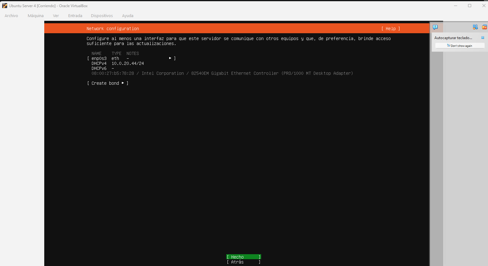

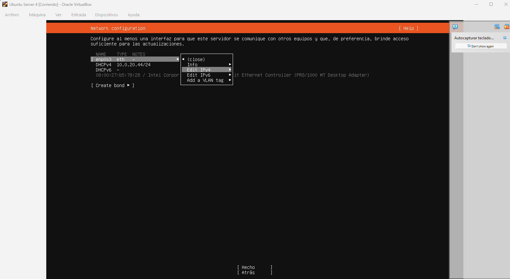

y ponemos la configuración de red de forma manual, aunque usamos la misma que nos ha dado por defecto el DHCP

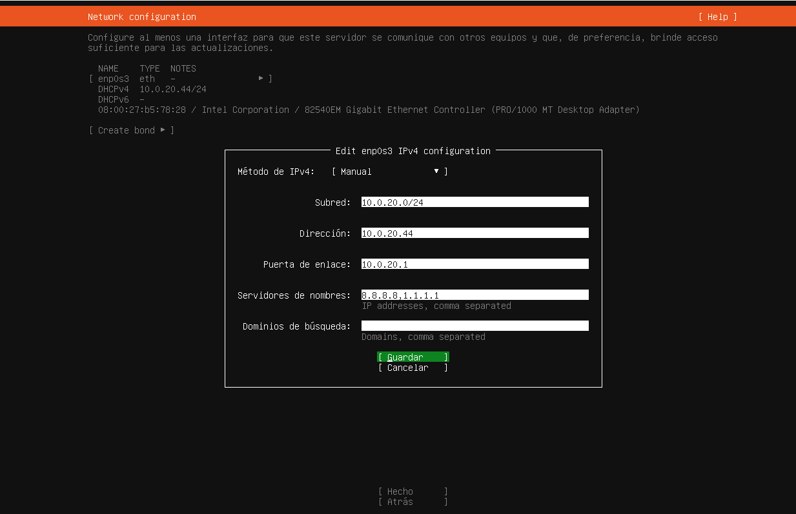

Comprobar que es *static* aquí después de configurar.

\
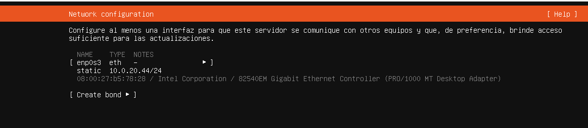

## Cambiar a ip fija un servidor existente.

Los pasos anteriores funcionarán para una instalación limpia, pero si ya tienes un servidor ubuntu con DHCP activo, tendrás que cambiarlo usando el yaml.

### Editar el archivo de configuración de Netplan

Normalmente está en:

```         
/etc/netplan/00-installer-config.yaml 
```

O algo similar dentro de `/etc/netplan/`.

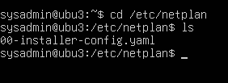

Ábrelo:

```         
sudo nano /etc/netplan/00-installer-config.yaml 
```

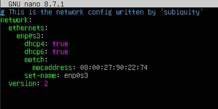

### Configurar la IP fija

Ejemplo de configuración estática:

yaml

``` bash
network:
  ethernets:
    enp0s3:
      addresses:
      - 10.0.20.44/24
      match:
        macaddress: 08:00:27:b5:78:28
      nameservers:
        addresses:
        - 8.8.8.8
        - 1.1.1.1
        search: []
      routes:
      - to: default
        via: 10.0.20.1
      set-name: enp0s3
  version: 2
```

Cambia `ens33` por tu interfaz y ajusta la IP, gateway y DNS a tu red.

### Aplicar los cambios

``` bash
sudo netplan apply 
```

Si por alguna razón falla:

``` bash
sudo netplan try 
```

### Verificar que funciona

``` bash
ping 8.8.8.8 ping google.com 
```

Si responde, ya tienes tu IP fija funcionando.

# Instalación de Docker y Docker Compose

## Instalar actualizaciones

Como siempre, antes de instalar nada actualizadmos el sistema:

``` bash

sudo apt update
sudo apt upgrade -y
```

- **apt update**: actualiza la lista de paquetes disponibles en los repositorios.

- **apt upgrade**: instala las versiones más recientes de los paquetes ya instalados.

Es importante hacerlo antes de instalar Docker para evitar conflictos con dependencias antiguas.

## Instalar paquetes necesarios

``` bash
sudo apt install -y ca-certificates curl gnupg
```

- **ca-certificates**: permite validar certificados HTTPS (sin esto no puedes descargar cosas de forma segura).

- **curl**: herramienta para descargar archivos desde Internet.

- **gnupg**: permite manejar claves GPG (necesarias para verificar que los paquetes de Docker son auténticos).

  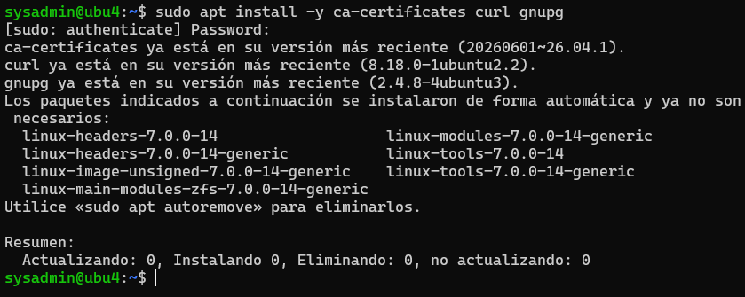

## Crear directorio para la clave GPG de Docker

``` bash
sudo install -m 0755 -d /etc/apt/keyrings
```

Ubuntu ahora recomienda guardar las claves GPG en `/etc/apt/keyrings` en lugar de `/etc/apt/trusted.gpg`. Este comando:

- Crea el directorio si no existe.

- Le da permisos seguros (0755).

## Descargar la clave oficial de Docker

``` bash
curl -fsSL https://download.docker.com/linux/ubuntu/gpg | \ 
sudo gpg --dearmor -o /etc/apt/keyrings/docker.gpg 
```

- Descarga la clave GPG de Docker.

- La convierte al formato `.gpg` (binario) con `gpg --dearmor`.

- La guarda en `/etc/apt/keyrings/docker.gpg`.

Esta clave sirve para verificar que los paquetes que instales realmente vienen de Docker y no están manipulados.

## Dar permisos a la clave

``` bash
sudo chmod a+r /etc/apt/keyrings/docker.gpg 
```

APT necesita poder leer la clave para validar los paquetes. Sin este permiso, el repositorio no funcionaría.

## Añadir el repositorio oficial de Docker

``` bash
echo "deb [arch=$(dpkg --print-architecture) signed-by=/etc/apt/keyrings/docker.gpg] https://download.docker.com/linux/ubuntu $(. /etc/os-release && echo "$VERSION_CODENAME") stable" | sudo tee /etc/apt/sources.list.d/docker.list > /dev/null
```

Crea un archivo llamado `/etc/apt/sources.list.d/docker.list`

Con el contenido:

- **deb** → indica que es un repositorio de paquetes binarios.

- **arch=\$(dpkg --print-architecture)** → detecta si tu sistema es amd64, arm64, etc.

- **signed-by=...** → indica qué clave GPG debe usarse para verificar este repositorio.

- **VERSION_CODENAME** → detecta tu versión de Ubuntu (ej. jammy, focal).

Esto añade el repositorio oficial de Docker, que contiene las versiones más recientes.

## Actualizar repositorios

``` bash
sudo apt update 
```

Ahora que has añadido un repositorio nuevo, apt debe volver a actualizar la lista de paquetes.

## Instalar Docker y Docker Compose

``` bash
sudo apt install -y docker-ce docker-ce-cli containerd.io docker-buildx-plugin docker-compose-plugin 
```

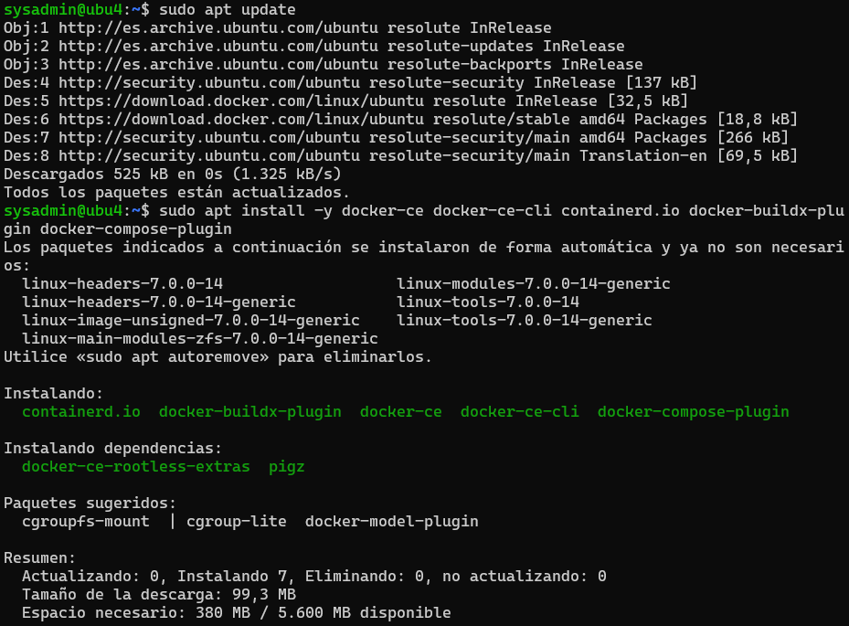

### ¿Qué instala cada paquete?

- **docker-ce** → Docker Community Edition (el motor principal).

- **docker-ce-cli** → comandos de Docker (`docker run`, `docker ps`, etc.).

- **containerd.io** → el runtime que gestiona los contenedores.

- **docker-buildx-plugin** → herramienta avanzada para construir imágenes.

- **docker-compose-plugin** → versión moderna de Docker Compose (`docker compose`).

## Comprobar que Docker funciona

``` bash
docker --version docker compose version 
```

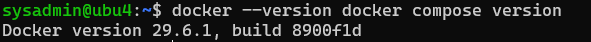

Si ves versiones, todo está bien.

## Probar Docker

``` bash
sudo docker run hello-world 
```

Esto descarga una imagen mínima y la ejecuta. Si funciona, Docker está correctamente instalado.

\
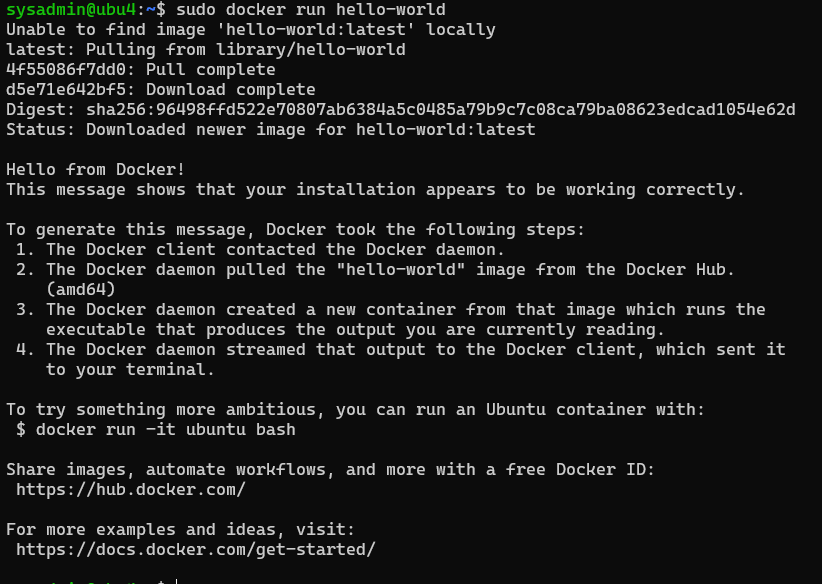

## Usar Docker sin sudo

``` bash
sudo usermod -aG docker $USER 
```

Añade tu usuario al grupo `docker`.

Docker solo permite ejecutar comandos sin sudo si perteneces a ese grupo.

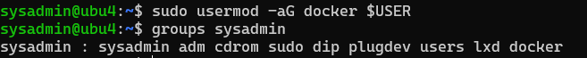

Después debes **cerrar sesión y volver a entrar** para que el cambio se aplique.

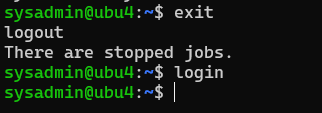

::: summary
Este bloque de comandos:

- Actualiza Ubuntu.

- Instala herramientas necesarias.

- Añade la clave GPG de Docker.

- Añade el repositorio oficial.

- Instala Docker + Compose.

- Verifica que funciona.

- Te permite usar Docker sin sudo.

Es la forma **correcta, segura y recomendada** de instalar Docker en Ubuntu.
:::

## Crear la estructura de trabajo

Creamos una carpeta (directorio) para la práctica:

``` bash
 mkdir -p ~/grafana-practica/prometheus
```

``` bash
 cd ~/grafana-practica
```

Comprobamos dónde estamos con pwd

# Crear el fichero de configuración de Prometheus

Este fichero le dice a Prometheus **qué debe monitorizar** y **cada cuánto tiempo**.

Primero asegúrate de estar en tu carpeta de práctica.

## Crear el fichero

``` bash
nano prometheus/prometheus.yml 
```

### Pegar el contenido

``` yaml
global:
  scrape_interval: 5s

scrape_configs:
  - job_name: "prometheus"
    static_configs:
      - targets: ["prometheus:9090"]

  - job_name: "node"
    static_configs:
      - targets: ["node-exporter:9100"]
```

**global.scrape_interval: 5s :** Prometheus recogerá métricas **cada 5 segundos**.

**job_name: "prometheus":** Prometheus también se monitoriza a sí mismo. El target `"prometheus:9090"` funciona porque en `Docker Compose` el servicio se llama `prometheus`, y Docker crea una red interna donde los contenedores se ven por nombre.

**job_name: "node" :**Este es el trabajo que recoge métricas del servidor Linux.

**targets: \["node-exporter:9100"\]:** Prometheus irá al contenedor llamado `node-exporter` en el puerto 9100.

### Guardar el fichero

En nano:

- **CTRL + O** → guardar

- **ENTER** → confirmar

- **CTRL + X** → salir

# Crear el fichero `docker-compose.yml`

Este fichero define **los tres servicios**:

- Prometheus

- Node Exporter

- Grafana

Y cómo deben ejecutarse juntos.

## Crear el fichero

Asegúrate de estar en la carpeta correcta `cd ~/grafana-practica`

``` bash
nano docker-compose.yml 
```

## Pegar el contenido

``` yaml
services:
  prometheus:
    image: prom/prometheus:latest
    container_name: prometheus
    ports:
      - "9090:9090"
    volumes:
      - ./prometheus/prometheus.yml:/etc/prometheus/prometheus.yml:ro
      - prometheus-data:/prometheus
    command:
      - "--config.file=/etc/prometheus/prometheus.yml"
      - "--storage.tsdb.retention.time=15d"
    restart: unless-stopped

  node-exporter:
    image: prom/node-exporter:latest
    container_name: node-exporter
    ports:
      - "9100:9100"
    volumes:
      - /:/host:ro,rslave
    command:
      - "--path.rootfs=/host"
    restart: unless-stopped

  grafana:
    image: grafana/grafana:latest
    container_name: grafana
    ports:
      - "3000:3000"
    environment:
      - GF_SECURITY_ADMIN_USER=admin
      - GF_SECURITY_ADMIN_PASSWORD=Admin123*
    volumes:
      - grafana-data:/var/lib/grafana
    restart: unless-stopped

volumes:
  prometheus-data:
  grafana-data:
```

### Explicación detallada de cada servicio

#### **Prometheus**

- Usa la imagen oficial `prom/prometheus`.

- Expone el puerto **9090** para acceder a la interfaz web.

- Monta tu fichero `prometheus.yml` dentro del contenedor.

- Guarda los datos en un volumen persistente `prometheus-data`.

- Retiene datos durante **15 días**.

#### **Node Exporter**

- Es el “chivato” del servidor Linux.

- Expone el puerto **9100**.

- Monta `/` del host en modo lectura para poder leer métricas del sistema.

- Docker lo aísla, pero con `--path.rootfs=/host` puede acceder a la información del host.

## **Grafana**

- Usa la imagen oficial `grafana/grafana`.

- Expone el puerto **3000**.

- Usuario y contraseña inicial:

  - **admin**

  - **Admin123**\*

- Guarda dashboards y configuración en `grafana-data`.

## Guardar el fichero

En nano:

- **CTRL + O**

- **ENTER**

- **CTRL + X**

# Levantar todo el stack

Desde la carpeta `~/grafana-practica`:

``` bash
docker compose up -d 
```

Esto arrancará en segundo plano.:

- Prometheus

- Node Exporter

- Grafana

  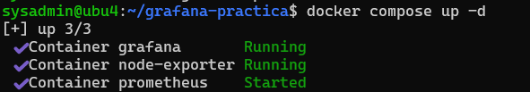

Verificar que funciona\
Comprobar los logs del contenedor: `docker compose logs -f` y `CTRL + C` para salir

## Prometheus:

http://{TU_IP}:9090 por ejemplo <http://10.0.20.44:9090/>

Si estamos dentro de la propia máquina: `http://localhost:9090`\
\
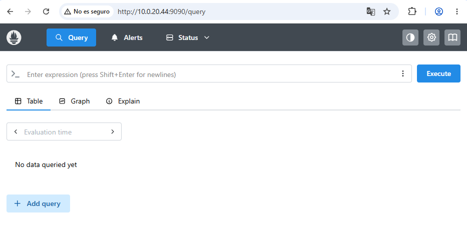

Entramos en: `Status > Target health`

O directamente: http://{IP_DEL_SERVIDOR}:9090/targets\
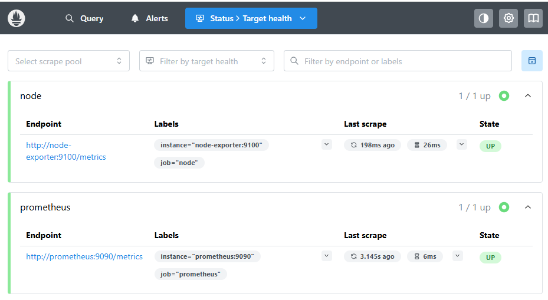

### **Hacer una primera consulta en Prometheus**

En Prometheus, vamos a la pestaña de consulta y probamos: `up`

Pulsamos **Execute**.

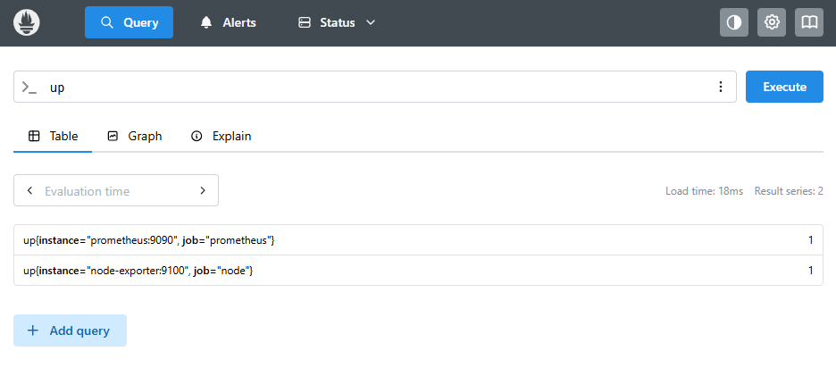

Interpretación:

1 = el servicio está accesible

0 = el servicio no está accesible

Probamos ahora:

`node_memory_MemTotal_bytes`

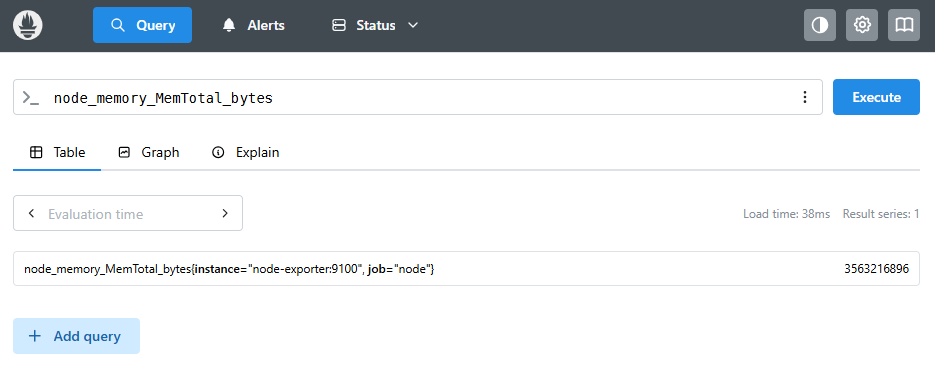

Y después: `node_cpu_seconds_total`

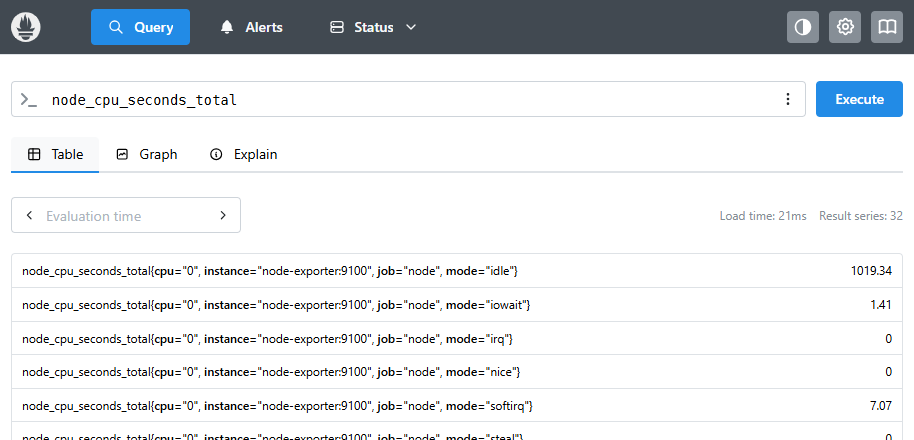

Estas métricas serán las que luego usaremos en Grafana.

## Node Exporter:

http://{TU_IP}:9100/metrics\
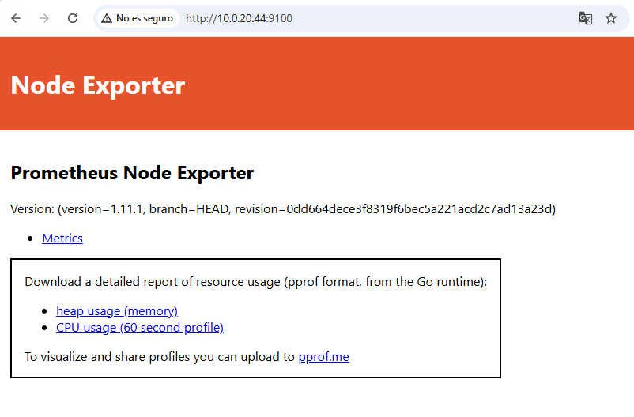

Node Exporter debería estar exponiendo métricas en el puerto 9100.

Ejecutamos: `curl http://localhost:9100/metrics | head`

Si queremos ver solo métricas relacionadas con el sistema: `curl http://localhost:9100/metrics | grep node_cpu | head`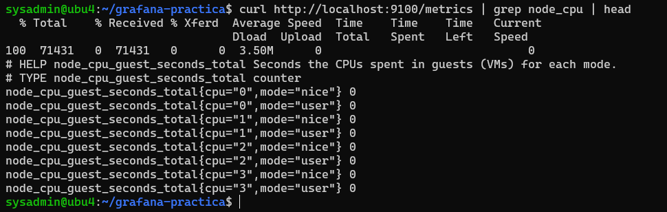

## Grafana:

http://{TU_IP}:3000 Usuario: **admin** Contraseña: **Admin123\\**\*\
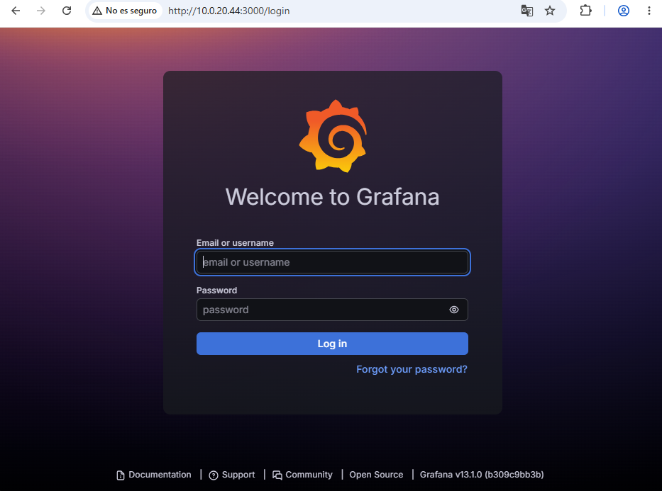

# Trabajar en Grafana

Grafana puede pedir cambiar la contraseña. Para la práctica podemos cambiarla por otra sencilla o saltar el cambio si nos lo permite.

## **Añadir Prometheus como fuente de datos en Grafana**

Dentro de Grafana: `Connections / Data sources -> Add data source -> Prometheus`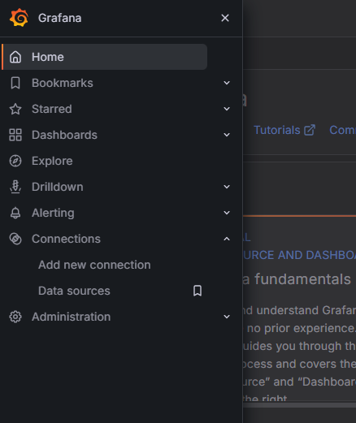

Importante: dentro de Docker **no usamos** localhost:9090, porque localhost sería el propio contenedor de Grafana. Usamos el nombre del servicio Docker:

En la URL ponemos: http://prometheus:9090\
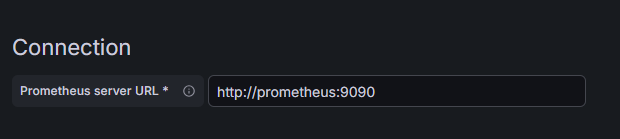

Pulsamos: `Save & test`

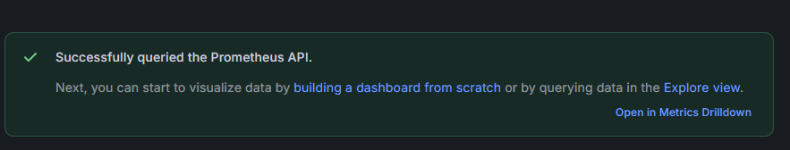

## **Crear nuestro primer dashboard manual**

### Añadir una visualización nueva

Entramos en: Dashboards \> New \> New dashboard \> Add visualization

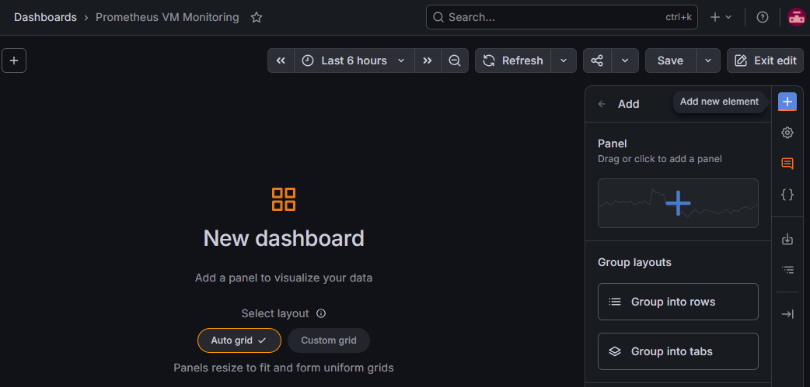

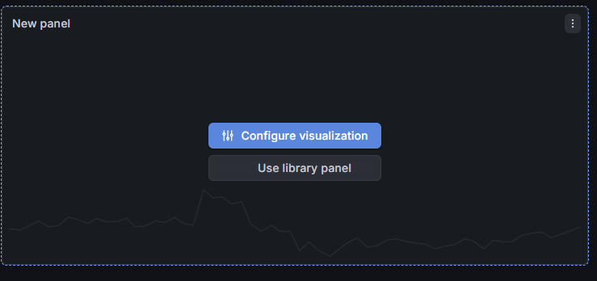

#### Seleccionamos la fuente de datos:

Prometheus

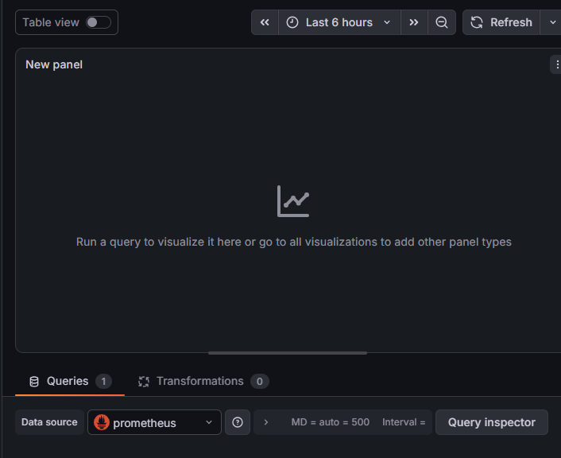

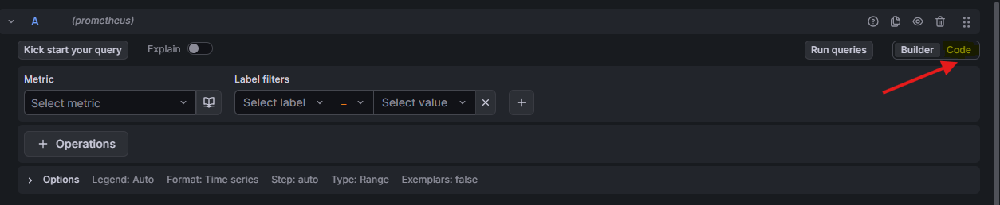

**Panel 1: uso de CPU**

Consulta PromQL:

100 - (avg by (instance) (rate(node_cpu_seconds_total{mode="idle"}\[1m\])) \* 100)

Título del panel:

Uso de CPU (%)

Tipo de visualización recomendado:

Time series

Unidad:

Percent (0-100)

Interpretación:

Cuanto más alto sea el valor, más ocupada está la CPU.

**Panel 2: uso de memoria RAM**

Creamos otro panel con esta consulta:

100 \* (1 - (node_memory_MemAvailable_bytes / node_memory_MemTotal_bytes))

Título:

Uso de memoria RAM (%)

Unidad:

Percent (0-100)

Interpretación:

Muestra qué porcentaje de RAM está en uso.

**Panel 3: uso de disco raíz**

Consulta:

100 \* (1 - (

node_filesystem_avail_bytes{mountpoint="/",fstype!\~"tmpfs\|overlay\|squashfs"}

/

node_filesystem_size_bytes{mountpoint="/",fstype!\~"tmpfs\|overlay\|squashfs"}

))

Título:

Uso de disco raíz (%)

Unidad:

Percent (0-100)

Interpretación:

Muestra cuánto espacio se está usando en la partición principal.

**Panel 4: tráfico de red recibido**

Consulta:

rate(node_network_receive_bytes_total{device!="lo"}\[1m\])

Título:

Tráfico de red recibido

Unidad:

bytes/sec

**Panel 5: tráfico de red enviado**

Consulta:

rate(node_network_transmit_bytes_total{device!="lo"}\[1m\])

Título:

Tráfico de red enviado

Unidad:

bytes/sec

**Panel 6: Escritura en disco**

Consulta:

sum by (instance) ( rate(node_disk_written_bytes_total{device!\~"loop.\*\|ram.\*"}\[1m\]) )

Título: Escritura en disco (B/s)

Tipo de visualización: Time series

Unidad: bytes/sec

**Resultado esperado**

Este panel debería mostrar picos cuando el sistema escriba datos en disco. Por ejemplo, al crear un fichero grande, instalar paquetes o realizar operaciones intensivas de escritura.

**Panel 7: Lectura en disco**

Consulta:

sum by (instance) ( rate(node_disk_read_bytes_total{device!\~"loop.\*\|ram.\*"}\[1m\]) )

Título: Escritura en disco (B/s)

Tipo de visualización: Time series

Unidad: bytes/sec

**Resultado esperado**

Este panel debería mostrar picos cuando el sistema lea datos del disco. Por ejemplo, al abrir ficheros grandes, cargar datos o leer información desde una base de datos.

**15. Guardar el dashboard**

Pulsamos:

**Save dashboard**

Nombre recomendado:

**Monitorización básica del servidor Ubuntu**

Descripción:

Dashboard básico para visualizar CPU, memoria, disco y red mediante Grafana, Prometheus y Node Exporter.

**16. Generar carga para ver cambios en el dashboard**

Ahora vamos a provocar algo de actividad para que el dashboard no parezca un electrocardiograma de un muñeco de cera.

Generamos carga de CPU durante 60 segundos:

timeout 60s bash -c 'while true; do true; done' &\
timeout 60s bash -c 'while true; do true; done' &\
wait

Esto genera carga de CPU durante **60 segundos** usando **dos** procesos.

Volvemos a Grafana y observamos el panel de CPU.

Ahora generamos algo de uso de disco:

dd if=/dev/zero of=/tmp/prueba-grafana.dat bs=1M count=512 oflag=direct

Eliminamos el fichero:

rm /tmp/prueba-grafana.dat

Ahora vamos a provocar actividad de **escritura** para comprobar que el panel funciona.

Ejecutamos:

sudo dd if=/dev/zero of=/tmp/prueba-escritura.img bs=1M count=2048 status=progress conv=fsync

Una vez creado el fichero anterior, vamos a **leerlo** para comprobar el panel de lectura.

Ejecutamos:

sudo dd if=/tmp/prueba-escritura.img of=/dev/null bs=1M status=progress iflag=direct

**Limpiar la prueba**

Cuando terminemos, eliminamos el fichero de prueba:

sudo rm /tmp/prueba-escritura.img

Preguntas para responder:

1\. ¿Qué panel ha cambiado al ejecutar stress-ng?

2\. ¿Qué métrica permite ver el uso de CPU?

3\. ¿Qué diferencia hay entre ver la información en Prometheus y verla en Grafana?

4\. ¿Qué ventaja tiene guardar un dashboard?

5\. ¿Qué problemas podríamos detectar antes de que el usuario final se queje?

**17. Importar un dashboard ya preparado**

Además del dashboard manual, podemos importar un dashboard ya creado por la comunidad.

En Grafana:

Dashboards

New

Import

En el campo de ID ponemos:

**1860**

Ese dashboard corresponde a **Node Exporter Full**, preparado para mostrar muchas métricas de Linux usando Prometheus Node Exporter. La propia página del dashboard indica que usa el job_name: node, por eso en esta práctica hemos llamado node al trabajo de Prometheus. ([[Grafana Labs]{.underline}](https://grafana.com/grafana/dashboards/1860-node-exporter-full/))

Seleccionamos la fuente de datos:

Prometheus

Pulsamos:

Import

Es posible que algunos paneles aparezcan vacíos si esperan métricas avanzadas no activadas. No pasa nada: para esta práctica lo importante es entender el flujo de monitorización.

**18. Comprobaciones finales**

Ejecutamos:

docker compose ps

Comprobamos los puertos:

ss -tulnp \| grep -E "3000\|9090\|9100"

Deberíamos ver:

3000 → Grafana

9090 → Prometheus

9100 → Node Exporter

Comprobamos métricas:

curl http://localhost:9100/metrics \| grep node_memory \| head

Comprobamos Prometheus:

http://IP_DEL_SERVIDOR:9090/targets

Comprobamos Grafana:

http://IP_DEL_SERVIDOR:3000

**19. Entregables de la práctica**

Cada estudiante debería entregar:

1\. Captura de docker compose ps con los tres contenedores en ejecución.

2\. Captura de Prometheus mostrando los targets en estado UP.

3\. Captura de Grafana con la fuente de datos Prometheus configurada correctamente.

4\. Captura del dashboard creado manualmente.

5\. Respuestas a las preguntas de reflexión.

**20. Preguntas de reflexión**

1\. ¿Qué función cumple Grafana?

2\. ¿Qué función cumple Prometheus?

3\. ¿Qué función cumple Node Exporter?

4\. ¿Por qué Grafana necesita una fuente de datos?

5\. ¿Qué significa que un target esté en estado UP?

6\. ¿Qué métrica usaríamos para detectar falta de memoria?

7\. ¿Qué métrica usaríamos para detectar falta de espacio en disco?

8\. ¿Qué ventaja tiene observar tendencias en lugar de mirar solo el estado actual?

9\. ¿Por qué sería útil este sistema en un servidor de bases de datos?

**21. Problemas frecuentes**

**Grafana no abre**

Comprobar que el contenedor está activo:

docker compose ps

Comprobar logs:

docker compose logs grafana

Comprobar puerto:

ss -tulnp \| grep 3000

**Prometheus no muestra el target node en UP**

Revisar el fichero:

cat prometheus/prometheus.yml

Debe aparecer:

\- job_name: "node"

static_configs:

- targets: \["node-exporter:9100"\]

Reiniciar:

docker compose restart prometheus

**Grafana no conecta con Prometheus**

La URL correcta dentro de Grafana es:

http://prometheus:9090

No usar:

http://localhost:9090

Dentro de contenedores, localhost suele ser la trampa clásica. Es como llamar a casa del vecino marcando tu propio timbre.

**En VirtualBox no puedo acceder desde el equipo anfitrión**

Opciones:

1\. Usar Adaptador Puente en la VM.

2\. Usar red NAT con redirección de puertos.

3\. Abrir Grafana desde el navegador dentro de la propia VM, si tiene entorno gráfico.

**22. Parar o eliminar la práctica**

Para parar los contenedores:

docker compose stop

Para volver a arrancarlos:

docker compose start

Para eliminarlos sin borrar los datos:

docker compose down

Para eliminar contenedores y datos persistentes:

docker compose down -v

**23. Ampliación (para más adelante)**

Una vez entendida esta práctica, podemos ampliarla añadiendo:

PostgreSQL Exporter

MySQL/MariaDB Exporter

Alertas en Grafana

Notificaciones por correo

Monitorización de logs con Loki

Monitorización de varios servidores Linux

Monitorización de Windows con Windows Exporter