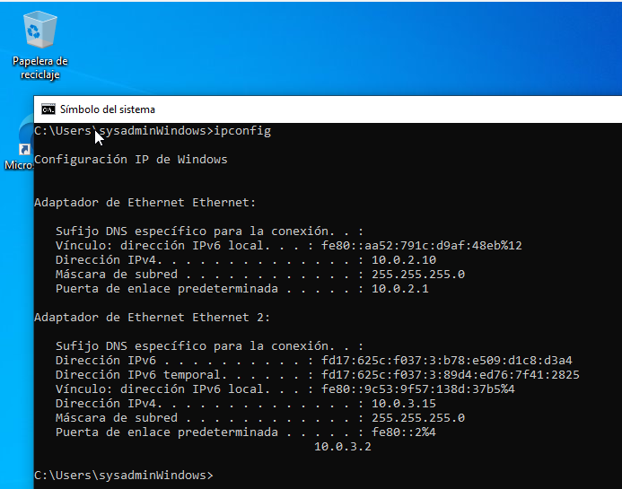

## Objetivo de la práctica

En esta práctica configuraremos un entorno de monitorización donde una máquina **Ubuntu Server** actuará como servidor de monitorización utilizando **Prometheus** y **Grafana** en contenedores Docker. Desde esta máquina monitorizaremos:

- Una máquina **Windows 10 Pro** mediante **Windows Exporter** (como servicio).

- Una máquina **Ubuntu Server** mediante **Node Exporter** (sin Docker).

- La propia máquina de monitorización (Ubuntu Server) mediante **Node Exporter** en contenedor.

El acceso a Grafana desde el host se realizará mediante **SSH port forwarding**.

# Arquitectura del escenario

```{┌──────────────────────────┐}
                │   Windows 10 Pro         │
                │   Windows Exporter       │
                │   IP: 10.0.2.10          │
                └──────────────┬───────────┘
                               │
                               │
                ┌──────────────┴───────────┐
                │   Ubuntu Server           │
                │   Node Exporter           │
                │   IP: 10.0.2.11           │
                └──────────────┬───────────┘
                               │
                               │
                ┌──────────────┴───────────┐
                │   Ubuntu Server           │
                │   Prometheus + Grafana    │
                │   Docker                  │
                │   IP: 10.0.2.12           │
                └──────────────────────────┘


```

# Configuración de IP fija en las máquinas

## 3.1 Windows 10 Pro

1.  Abrir **Configuración → Red e Internet → Cambiar opciones del adaptador**

2.  Clic derecho en el adaptador → **Propiedades**

3.  Seleccionar **Protocolo de Internet versión 4 (TCP/IPv4)**

4.  Configurar:

    - IP: **10.0.2.10**

    - Máscara: **255.255.255.0**

    - Puerta de enlace: **10.0.2.1**

    - DNS: **8.8.8.8**

La máquina virtual en Red NAT por defecto no va a tener acceso a internet, tendremos que configurar un segundo adaptador NAT. Una vez hecho esto tendremos internet.



Comprobar conectividad:

```{ping 1.1.1.1}
```

##  3.2 Ubuntu Server monitorizado (Node Exporter)

Durante la instalación del sistema:

1.  Seleccionar **Configurar red manualmente**

2.  Asignar:

    - IP: **10.0.2.11**

    - Máscara: **255.255.255.0**

    - Gateway: **10.0.2.1**

    - DNS: **8.8.8.8\**
      

Comprobar conectividad con la primera máquina


## 3.3 Ubuntu Server monitorización (Prometheus + Grafana)

Durante la instalación:

- IP: **10.0.2.12**

- Máscara: **255.255.255.0**

- Gateway: **10.0.2.1**

- DNS: **8.8.8.8**


Comprobar conectividad con las otras máquinas:

- Desde Windows `ping 10.0.2.11` y `ping 10.0.2.12`

- Desde Ubuntu deberíamos poder hacer ping a la otra Ubuntu.

- Los pings a windows fallarán porque no hemos configurado la regla de firewall para permitirlos.

# Instalación de Windows Exporter (como servicio)

Descargar el instalador MSI desde: `https://github.com/prometheus-community/windows_exporter/releases` [(github.com in Bing)](https://www.bing.com/search?q="https%3A%2F%2Fgithub.com%2Fprometheus-community%2Fwindows_exporter%2Freleases")

Ejecutar el instalador:

- Aceptar licencia

- Seleccionar los collectors por defecto

- Finalizar\
  \
  

Verificar que el servicio está activo:

En un navegador introduce `localhost:9182/metrics`\


o en PowerShell (no la consola)

``` bash
Get-Service -Name windows_exporter
```

 \
Comprobar que expone metricas desde power shell

```{Invoke-WebRequest http://localhost:9182/metrics}
```

## 

# Instalación de Node Exporter en Ubuntu monitorizado

En la máquina **10.0.2.11**:

``` bash
sudo apt update 
sudo apt upgrade
sudo apt install prometheus-node-exporter -y 
```

Comprobar que está activo:

``` bash
systemctl status prometheus-node-exporter 
```

\
Comprobar métricas:

```         
curl http://localhost:9100/metrics 
```


# Redireccionamiento de puertos

Para poder cortar y pegar codigo y facilitar la configuración de la maquina virtual nos vamos a conectar desde el host usando ssh. \
El problema es que en RED NAT el host no tiene conectividad con las maquinas de la Red Nat, así que vamos a necesitar configurar una redirección de puertos. Esto lo podemos hacer con la interfaz grafica de Virtual Box o


ahora para conectarnos desde el host a la maquina virtual lo que hacemos es conectarnos a ese puerto anfitrion desde nuestra propia ip (localhost) y eso nos redirigirá al puerto 22 (el que usa SSH) en la maquina virtual

``` bash
ssh -p 2222 sysadmin@localhost
```

# Instalación de Prometheus y Grafana con Docker

En la máquina **10.0.2.12**:

## Instalar Docker y Docker Compose 

```         
sudo apt update 
sudo apt install docker.io docker-compose-plugin -y 
sudo systemctl enable --now docker 
```

## Crear directorio de trabajo

```         
mkdir monitoring 
cd monitoring 
```

## 6.3 Crear archivo `prometheus.yml`

en el directorio

``` yaml
global:
  scrape_interval: 5s

scrape_configs:
  - job_name: 'prometheus'
    static_configs:
      - targets: ['localhost:9090']

  - job_name: 'node_exporter_ubuntu'
    static_configs:
      - targets: ['10.0.2.11:9100']

  - job_name: 'windows_exporter'
    static_configs:
      - targets: ['10.0.2.10:9182']

```

## 6.4 Crear archivo `docker-compose.yml`

``` yaml

services:
  prometheus:
    image: prom/prometheus:latest
    container_name: prometheus
    ports:
      - "9090:9090"
    volumes:
      - ./prometheus.yml:/etc/prometheus/prometheus.yml:ro
      - prometheus-data:/prometheus
    command:
      - "--config.file=/etc/prometheus/prometheus.yml"
      - "--storage.tsdb.retention.time=15d"
    restart: unless-stopped

  grafana:
    image: grafana/grafana:latest
    container_name: grafana
    ports:
      - "3000:3000"
    environment:
      - GF_SECURITY_ADMIN_USER=admin
      - GF_SECURITY_ADMIN_PASSWORD=Admin123*
    volumes:
      - grafana-data:/var/lib/grafana
    restart: unless-stopped

volumes:
  prometheus-data:
  grafana-data:
```

Añadimos el usuario al grupo docker: `sudo usermod -aG docker $USER`\

## 6.5 Levantar los contenedores

```         
docker compose up -d 
```

# 7. Acceso desde el host mediante SSH port forwarding

Desde el host:

bash

```         
ssh -L 3000:localhost:3000 -L 9090:localhost:9090 usuario@10.0.2.12 
```

Ahora puedes abrir en el navegador del host:

- Prometheus → http://localhost:9090

- Grafana → http://localhost:3000

# 8. Importación de dashboards en Grafana

1.  Entrar en Grafana → **Dashboards → Import**

2.  Importar:

    - Dashboard oficial de Node Exporter → ID **1860**

    - Dashboard oficial de Windows Exporter → ID **13978**

3.  Seleccionar la fuente de datos **Prometheus**.

# 9. Verificación de métricas

### Windows

- CPU usage

- Memory

- Disk I/O

- Network

### Ubuntu monitorizado

- CPU

- Load average

- Filesystem

- Network

### Ubuntu monitorización

- Métricas del contenedor Node Exporter

- Métricas del propio sistema

# 10. Preguntas de reflexión

1.  ¿Qué diferencias observas entre las métricas de Windows y Ubuntu?

2.  ¿Qué ventajas aporta usar exporters sin Docker en máquinas monitorizadas?

3.  ¿Por qué es útil usar SSH port forwarding en entornos NAT?

4.  ¿Qué ocurre si Prometheus no puede alcanzar uno de los targets?

5.  ¿Cómo podrías añadir alertas en Prometheus?