Antes de realizar esta práctica se recomienda realizar la práctica anterior: [Crear un monitor sencillo con Grafana en Ubuntu Sever](monitor_Grafana_Ubuntu.html) que tiene instrucciones y explicaciones completas.

# Objetivo de la práctica

En esta práctica configuraremos un entorno de monitorización donde una máquina **Ubuntu Server** actuará como servidor de monitorización utilizando **Prometheus** y **Grafana** en contenedores Docker. Desde esta máquina monitorizaremos:

- Una máquina **Windows 10 Pro** mediante **Windows Exporter** (como servicio).

- Una máquina **Ubuntu Server** mediante **Node Exporter** (sin Docker).

El acceso a Grafana desde el host se realizará mediante **SSH port forwarding** .

# Arquitectura del escenario

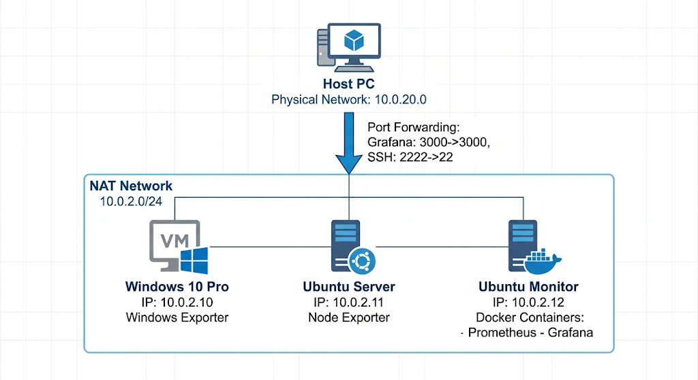

# Configuración de IP fija en las máquinas

Se da por hecho que se han creado las máquinas virtuales y que todas están conectadas a la misma Red NAT en VirtualBox.

## Windows 10 Pro

1.  Abrir **Configuración → Red e Internet → Cambiar opciones del adaptador**

2.  Clic derecho en el adaptador → **Propiedades**

3.  Seleccionar **Protocolo de Internet versión 4 (TCP/IPv4)**

4.  Configurar:

    - IP: **10.0.2.10**

    - Máscara: **255.255.255.0**

    - Puerta de enlace: **10.0.2.1**

    - DNS: **8.8.8.8**

::: {.callout-note title="Nota sobre Internet en Red NAT"}
La Red NAT de VirtualBox sí proporciona salida a Internet por defecto. Si al configurar la IP estática en Windows te quedas sin conexión, asegúrate de haber introducido correctamente el DNS (8.8.8.8). Además, a veces Windows se "atasca" al cambiar de IP dinámica a manual; si eso pasa, simplemente deshabilita el adaptador de red y vuélvelo a habilitar para que aplique bien la nueva ruta.
:::

Comprobar conectividad:

``` bash
ping 1.1.1.1
```

## 3.2 Ubuntu Server monitorizado

Durante la instalación del sistema o mediante Netplan (como vimos en prácticas anteriores).

- Seleccionar **Configurar red manualmente**

- Asignar:

  - IP: **10.0.2.11**

  - Máscara: **255.255.255.0**

  - Gateway: **10.0.2.1**

  - DNS: **8.8.8.8**

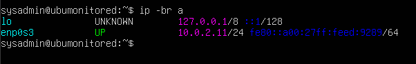{fig-align="center"}

Comprobar conectividad con la primera máquina, para ello haremos ping desde Windows a esta.

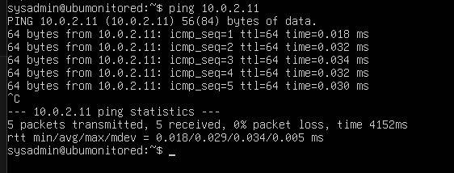{fig-align="center"}

## Ubuntu Server monitorización (Prometheus + Grafana)

Durante la instalación:

- IP: **10.0.2.12**

- Máscara: **255.255.255.0**

- Gateway: **10.0.2.1**

- DNS: **8.8.8.8**

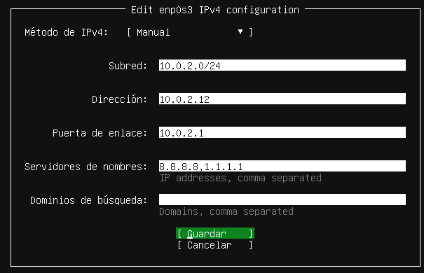

Comprobar conectividad cruzada: Desde Windows: ping 10.0.2.11 y ping 10.0.2.12 Desde Ubuntu deberíamos poder hacer ping a la otra Ubuntu. Nota: Los pings hacia Windows pueden fallar porque el Firewall de Windows bloquea ICMP (Ping) por defecto.

Recuerda que si no configuras la ip durante la instalación o necesitas cambiar la configuración luego, puedes usar la configuración netplan\
como se explicó en la [practica anterior](https://vegaper.github.io/DBA-Study-Guide/monitor_Grafana_Ubuntu.html#cambiar-a-ip-fija-un-servidor-existente.)

# Instalación de Windows Exporter (como servicio)

Descargar el instalador **MSI** desde: `https://github.com/prometheus-community/windows_exporter/releases` [(github.com in Bing)](https://www.bing.com/search?q=%22https%3A%2F%2Fgithub.com%2Fprometheus-community%2Fwindows_exporter%2Freleases%22)

::: nota
- **El archivo `.msi` (Microsoft Installer):** Está programado específicamente por los creadores de Windows Exporter para hacer todo el trabajo sucio. Cuando le das a "Siguiente \> Siguiente", el instalador automáticamente coge el programa, lo esconde en el sistema, crea un **Servicio de Windows** oficial que arranca solo cada vez que enciendes el ordenador, y lo deja funcionando en segundo plano.

- **El archivo `.exe` (Ejecutable binario):** Si descargas el `.exe` y le haces doble clic, se abrirá una ventana de consola negra (MS-DOS). El exporter funcionará, sí, pero en el momento en que cierres esa ventana negra o reinicies el ordenador, el monitorizador se apagará.
:::

Ejecutar el instalador:

- Aceptar licencia

- Seleccionar los collectors por defecto

- [Activar Firewal Exception!]{.highlight}

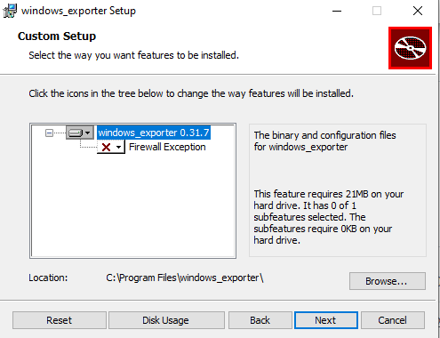{fig-align="center"}

Durante la instalación te dice qué puerto va a usar, luego vamos a necesitar este puerto para configurar prometheus en la máquina monitor: 9182

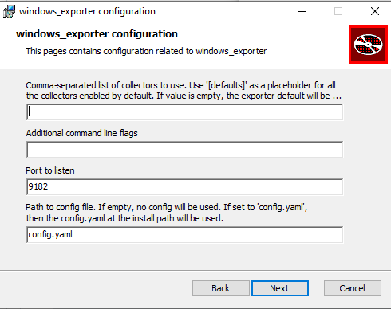{fig-align="center"}

**Verificar que el servicio está activo:**

En un navegador introduce `localhost:9182/metrics`

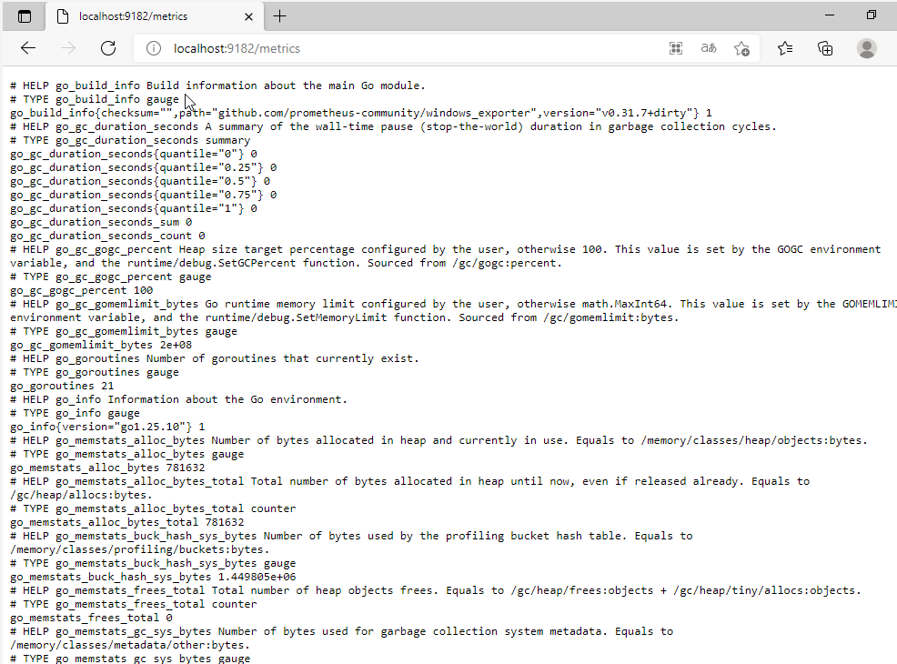

o en PowerShell (no la consola)

``` powershell
Get-Service -Name windows_exporter
```

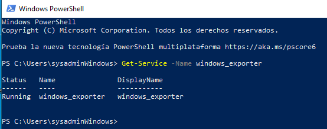{fig-align="center"}

Comprobar que expone métricas. Desde PowerShell

``` powershell
Invoke-WebRequest http://localhost:9182/metrics
```

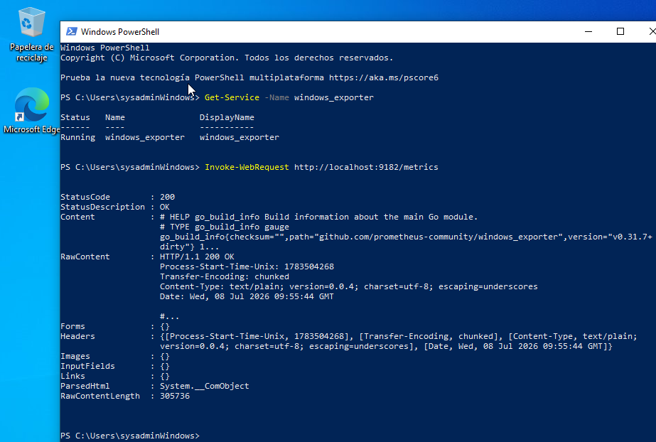

# Instalación de Node Exporter (Nativo)

En la práctica anterior no instalamos node exporter en la maquina virtual, sino que lo hicimos mediante una imagen docker. En esta ocasión vamos a inslalarlo directamente sobre el SO de la máquina virtual:

En la máquina **10.0.2.11**:

``` bash
sudo apt update 
sudo apt upgrade
sudo apt install prometheus-node-exporter -y 
```

Comprobar que está activo:

``` bash
systemctl status prometheus-node-exporter 
```

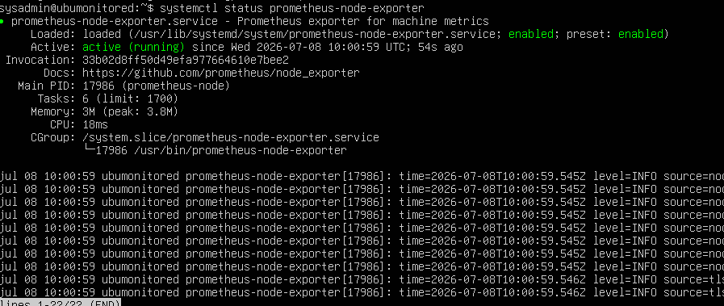\
Comprobar métricas:

``` bash
curl http://localhost:9100/metrics 
```

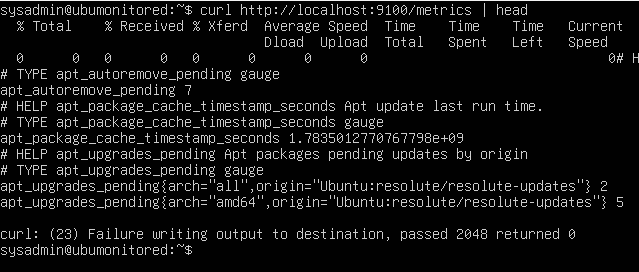{fig-align="center"}

# Redireccionamiento de puertos

Para facilitar la configuración, vamos a conectarnos al servidor principal de monitorización (10.0.2.12) desde nuestro Host (Windows real) usando SSH.

El problema es que en Red NAT el Host no tiene conectividad directa con las IP internas de las máquinas virtuales. Necesitamos configurar una **redirección de puertos** en VirtualBox:

1.  Ve a la configuración de la Red NAT en VirtualBox.

2.  Añade una regla de reenvío de puertos:

    - **Host IP:** {la ip del host} (o vacío 0.0.0.0)\| **Host Port:** `2222` (vale cualquier puerto que no esté en uso)

    - **Guest IP:** `10.0.2.12` \| **Guest Port:** `22` (el puerto 22 es el puerto SSH por defecto)

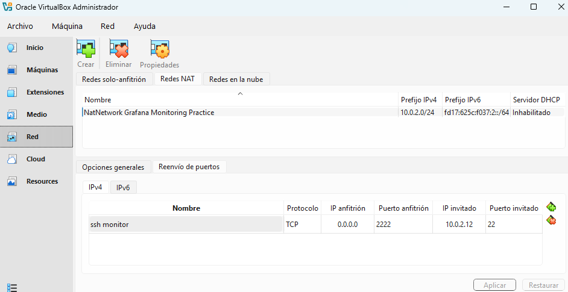

Ahora podemos conectarnos desde nuestro Host usando el puerto redirigido:

``` bash
ssh -p 2222 sysadmin@localhost
```

::: nota
**Ver conexiones y puertos activos (TCP y UDP):** Usa `ss -tuna` (donde `-t` es TCP, `-u` es UDP, `-n` muestra los puertos en números y `-a` todas las conexiones).

**Saber qué programas están usando esos puertos:** Usa el comando **`lsof`**: `sudo lsof -i -P -n | grep LISTEN`
:::

# Despliegue de Prometheus y Grafana (Docker)

En la máquina **10.0.2.12**:

## Instalar Docker y Docker Compose

::: {.callout-note title="Versión Ubuntu vs Oficial"}
Aquí usaremos docker.io, que es la versión mantenida por Ubuntu. Es más rápida de instalar para un laboratorio. Para entornos de producción críticos, se recomienda el método largo de la [práctica anterior](./monitor_Grafana_Ubuntu.html) (instalando docker-ce desde el repositorio oficial).
:::

``` bash
sudo apt update 
sudo apt install docker.io docker-compose-plugin -y 
sudo systemctl enable --now docker 
sudo usermod -aG docker $USER 
```

(Recuerda que para usar Docker sin sudo debes cerrar sesión exit y volver a entrar).

## Estructura y Configuración

``` bash
mkdir monitoring 
cd monitoring 
```

## Crear archivo de configuración de prometheus

en el directorio de trabajo creamos el archivo `prometheus.yml` mediante `nano prometheus.yml` con el siguiente contenido:

``` yaml
global:
  scrape_interval: 5s

scrape_configs:
  - job_name: 'prometheus'
    static_configs:
      - targets: ['localhost:9090']

  - job_name: 'node_exporter_ubuntu'
    static_configs:
      - targets: ['10.0.2.11:9100']
        labels:
          sistema: "linux"
          servidor: "ubuntu-server"

  - job_name: 'windows_exporter'
    static_configs:
      - targets: ['10.0.2.10:9182']
        labels:
          sistema: "windows"
          servidor: "windows-vm"
```

Al contrario que en la práctica anterior aqui usamos las ips de las maquinas y su puerto en lugar de usar el nombre del contenedor como usamos en la práctica de monitorización anterior. Además vamos a añadir etiquetas para poder identificar facilmente las máquinas dentro de grafana.

::: extra
### Explicación del archivo de configuración de prometheus:

#### Bloque Global (`global`)

Define la configuración por defecto para todo el servidor Prometheus.

- **`global:`**: Inicia la sección de directivas globales. Lo que definas aquí se aplicará a todos los jobs de monitorización a menos que un job lo sobrescriba específicamente.

- **`scrape_interval: 5s`**: Es la frecuencia de muestreo. Le dice a Prometheus que cada 5 segundos debe ir a los servidores que has configurado a pedirles sus métricas. *(Nota: 5 segundos es muy rápido, ideal para laboratorios o pruebas, pero en producción se suele usar entre `15s` y `1min` para no saturar la red ni el disco).*

### Bloque de Configuración de Rastreo (`scrape_configs`)

Aquí es donde le dices a Prometheus **a quién** tiene que vigilar. Cada "quién" es un `job`.

- **`scrape_configs:`**: Inicia la lista de objetivos (targets) a monitorizar.

- **`- job_name: 'prometheus'`**: Define el nombre del primer trabajo. Los nombres de los jobs sirven para agrupar métricas (por ejemplo, en Grafana puedes filtrar todo por `job="prometheus"`). Este en concreto monitoriza al propio Prometheus.

- **`static_configs:`**: Indica que la lista de servidores que viene a continuación es estática; es decir, que tú escribes las IPs a mano en este archivo y no van a cambiar dinámicamente.

- **`- targets: ['localhost:9090']`**: La dirección URL/IP y el puerto donde Prometheus va a buscar sus propias métricas internas.

### Los Jobs de los Exporters (`node_exporter` y `windows_exporter`)

Estos bloques siguen la misma lógica que el anterior, pero añaden **etiquetas (labels)**.

- **`- job_name: 'node_exporter_ubuntu'`**: El trabajo para tu servidor Linux.

- **`- targets: ['10.0.2.11:9100']`**: La IP de tu máquina Ubuntu. El puerto `9100` es el puerto por defecto de **Node Exporter** (el agente de Linux).

- **`labels:`**: Abre la sección para añadir metadatos personalizados a todas las métricas que vengan de esta máquina.

- **`sistema: "linux"`** y **`servidor: "ubuntu-server"`**: Son etiquetas inventadas por ti. Esto es utilísimo porque cuando estés en Grafana o haciendo consultas en PromQL, podrás escribir cosas como `{sistema="linux"}` para ver solo los servidores Linux de golpe.

- **`- job_name: 'windows_exporter'`**: El trabajo para tu máquina Windows.

- **`- targets: ['10.0.2.10:9182']`**: La IP de tu máquina Windows. El puerto `9182` es el puerto por defecto de **Windows Exporter** (antiguamente conocido como WMI Exporter).

#### Otras opciones útiles que no estás usando (y deberías conocer)

A medida que tu entorno crezca, el archivo actual se te puede quedar corto. Aquí tienes las opciones más habituales e interesantes para añadir:

**`evaluation_interval` (En el bloque `global`)**

Al igual que defines cada cuánto tiempo recoges métricas (`scrape_interval`), necesitas definir cada cuánto tiempo comprueba Prometheus si se cumple alguna regla de alerta.

``` yaml
global:
  scrape_interval: 5s
  evaluation_interval: 15s # Evalúa las reglas de alerta cada 15 segundos
```

**`scrape_timeout` (En `global` o por `job`)**

Si un servidor está muy saturado o la red va lenta, Prometheus podría quedarse esperando eternamente. Con esto le pones un límite de tiempo a la petición de métricas.

``` yaml

global:
  scrape_timeout: 10s # Si en 10 segundos el servidor no responde, desiste
```

Alertas con Alertmanager (`alerting`)

Prometheus solo recoge métricas y evalúa si hay problemas, pero **no envía correos ni mensajes de Telegram/Slack**. Para eso necesita conectarse a **Alertmanager**. Se configura con un bloque raíz como este:

``` yaml
alerting:
  alertmanagers:
    - static_configs:
        - targets: ['localhost:9093'] # El puerto por defecto de Alertmanager
```

Reglas de Alerta y de Grabación (`rule_files`)

Para decirle a Prometheus *cuándo* algo va mal (por ejemplo, si el disco de Ubuntu pasa del 90% o la VM de Windows se apaga), necesitas cargar archivos con esas reglas:

``` yaml
rule_files:
  - "alert_rules.yml" # Un archivo externo donde escribes tus condiciones de alerta
```

**`metrics_path` (Dentro de un `job`)**

Por defecto, Prometheus siempre va a buscar las métricas a la ruta `/metrics` (ej: `http://10.0.2.11:9100/metrics`). Si tienes un servicio o un script propio que las publica en otra ruta (como `/stats`), se lo indicas así:

``` yam
- job_name: 'mi_aplicacion'
    metrics_path: '/stats'
    static_configs:
      - targets: ['10.0.2.15:8080']
```

**Descubrimiento de Servicios (`file_sd_configs`)**

Escribir las IPs a mano (`static_configs`) está bien para 2 o 3 máquinas. Pero si tienes 20, modificar este archivo y reiniciar Prometheus cada vez es un dolor. Puedes hacer que Prometheus lea las IPs de un archivo JSON o YAML aparte que se actualice automáticamente:

``` yaml
- job_name: 'nodos_dinamicos'
    file_sd_configs:
      - files:
          - 'targets.json' # Prometheus vigila este archivo; si cambia, añade los hosts sin reiniciar
```
:::

## Crear archivo `docker-compose.yml`

``` bash
nano docker-compose.yml
```

``` yaml

services:
  prometheus:
    image: prom/prometheus:latest
    container_name: prometheus
    ports:
      - "9090:9090"
    volumes:
      - ./prometheus.yml:/etc/prometheus/prometheus.yml:ro
      - prometheus-data:/prometheus
    command:
      - "--config.file=/etc/prometheus/prometheus.yml"
      - "--storage.tsdb.retention.time=15d"
    restart: unless-stopped

  grafana:
    image: grafana/grafana:latest
    container_name: grafana
    ports:
      - "3000:3000"
    environment:
      - GF_SECURITY_ADMIN_USER=admin
      - GF_SECURITY_ADMIN_PASSWORD=Admin123*
    volumes:
      - grafana-data:/var/lib/grafana
    restart: unless-stopped

volumes:
  prometheus-data:
  grafana-data:
```

## Levantar los contenedores

``` bash
docker compose up -d 
```

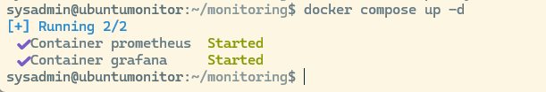{fig-align="center"}

# Acceso a grafana desde el host

Grafana se maneja desde una interfaz gráfica, y el ubuntu server que estamos usando para monitorear no permite usar interfaz gráfica, asi que nos tenemos que conectar desde el host que está en Windows. Tenemos varias opciones\

## Mediante redirección de puertos en la interfaz gráfica de Virtual Box

Podemos hacerlo creando una nueva redirección de puertos en la que el puerto X del host se conecte de forma remota al puerto de grafana del servidor monitor.

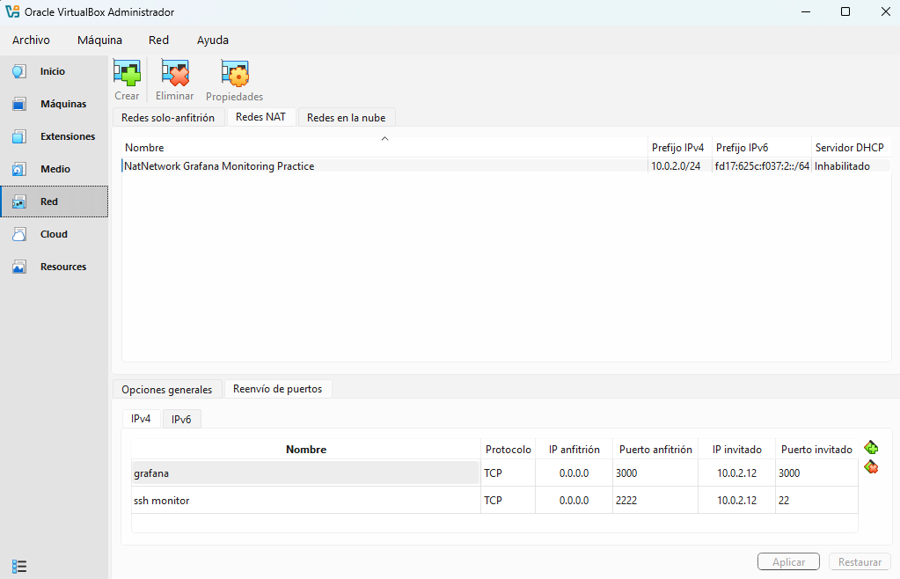

Ahora en el ordenador host podemos conectarnos a grafana usando el navegador: `http://localhost:3000/`

Si además queremos conectarnos a la interfaz de prometheus desde el host tendremos que redireccionar también ese puerto:

\
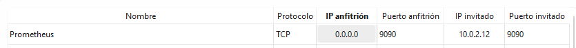

Pero esto no es necesario para que prometheus funcione dentro de grafana, sólo si queremos ver prometheus directamente.

::: extra
## Acceso Seguro con Túnel SSH (SSH Port Forwarding)

Otra opción es usar la shell en la maquina host.

Para abrir la interfaz web de Grafana o Prometheus sin exponer esos puertos a Internet ni configurar reglas adicionales en VirtualBox, podemos crear un túnel seguro a través de SSH desde nuestro PC Host.

Abre **otra** terminal en tu Windows (Host) y ejecuta:

``` bash
ssh -p 2222 -L 3000:localhost:3000 -L 9090:localhost:9090 sysadmin@localhost 
```

*Explicación: Nos conectamos al puerto 2222 (que VirtualBox redirige a la máquina `.12`) y hacemos que nuestros puertos locales 3000 y 9090 viajen encriptados por el túnel hasta los servicios de la máquina virtual.*

Ahora puedes abrir en tu navegador (en tu PC físico):

- **Prometheus:** `http://localhost:9090`

- **Grafana:** `http://localhost:3000`
:::

# Importación de dashboards en Grafana

## Crear un nuevo origen de datos para conectar grafana a prometheus.

\
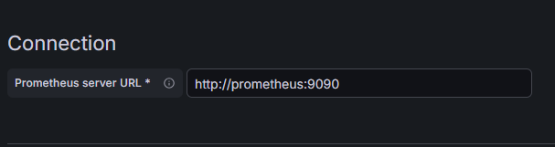

::: extra
En la casilla de Prometheus server URL podemos poner la ip de la máquina virtual que está hospedando a grafana y prometeus `http://10.0.20.12:9090` o usar el nombre que le hemos dado al contenedor en el archivo de configuración yaml de docker:\
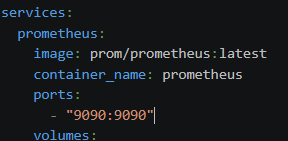

En este caso no podemos poner `http://localhost:9090` porque estamos dentro del contenedor docker de grafana, y tiene su propia ip privada, independiente de la de la maquina virtual que lo aloja. Vamos a explicarlo con más detalle.\
\
Dentro de un contenedor de Docker **estás en una red completamente diferente**.

Para entenderlo a la perfección, imagina que tu Máquina Virtual (`10.0.2.12`) es un **edificio de oficinas**.

### La perspectiva desde fuera (La IP de la VM)

La IP `10.0.2.12` es la dirección postal del edificio (la VM). Si alguien desde tu ordenador real quiere enviar algo a Grafana, lo envía a esa dirección postal y entra por el número de puerta que tú abriste (el puerto `3000`).

### La perspectiva desde dentro (La red de Docker)

Una vez que cruzas la puerta del edificio y entras en el "universo Docker", la cosa cambia. Docker monta **su propia red interna privada** dentro de la máquina virtual.

Dentro de esa red interna:

- El contenedor de Grafana tiene su propia IP interna invisible (por ejemplo, `172.18.0.3`).

- El contenedor de Prometheus tiene otra IP interna invisible (por ejemplo, `172.18.0.2`).

Como Grafana está *dentro* del edificio, si quiere hablar con Prometheus, no tiene que salir a la calle (a la IP `10.0.2.12`) para volver a entrar. Se comunican por los pasillos internos de Docker.

### ¿Por qué no se usan esas IPs internas (`172.x.x.x`)?

Porque Docker es inteligente: cada vez que apagas o enciendes los contenedores con `docker compose`, esas IPs internas pueden cambiar de orden. Hoy Grafana puede ser la `.3` y mañana la `.4`.

Para que no te vuelvas loco persiguiendo IPs que cambian, Docker te permite usar el **nombre del servicio** como si fuera el número de la oficina:

- Grafana simplemente busca a `http://prometheus:9090`.

- El "recepcionista" de Docker intercepta la palabra `prometheus` y lo redirige internamente a la oficina correcta en ese momento.

Por eso, la IP de la VM (`10.0.2.12`) solo sirve para que **tú** entres desde fuera. Una vez dentro de la configuración de Grafana, te olvidas de las IPs y usas los nombres de los contenedores.

Si hubiéramos instalado grafana y prometheus directamente sobre el SO y no mediante contenedores, ambos procesos corren en el **mismo espacio de red** y comparten la misma interfaz de bucle local (*loopback*).

- Cuando Grafana (instalado nativamente) busca algo en `localhost:9090`, pregunta dentro de la propia máquina virtual. Como Prometheus también está instalado nativamente ahí y escuchando en ese puerto, se encuentran de inmediato.

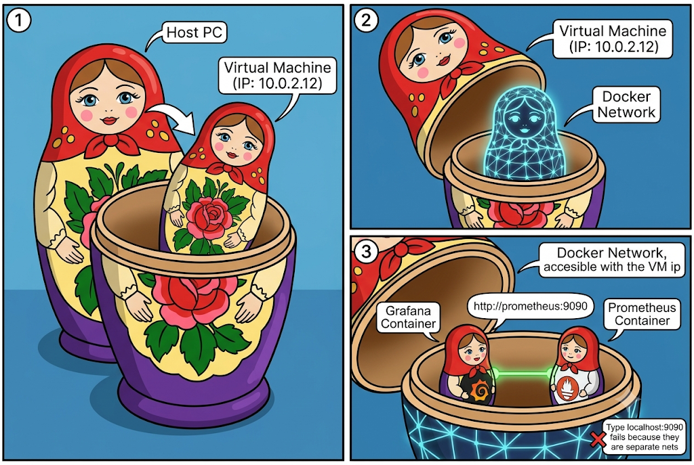

### Comparativa rápida

|  |  |  |
|------------------------|------------------------|------------------------|
| **Tipo de Instalación** | **¿Qué significa localhost para Grafana?** | **¿Cómo se conectaría a Prometheus?** |
| **Con Docker** | El propio contenedor aislado de Grafana. | `http://prometheus:9090` *(Usa el DNS de Docker)* |
| **Sin Docker (Nativo)** | La máquina virtual entera (`10.0.2.12`). | `http://localhost:9090` *(Comparten la misma máquina)* |
:::

## Importar un Dashboard desde una plantilla.

1.  Entrar en Grafana → **Dashboards → Import**

2.  Importar:

    - Dashboard oficial de Node Exporter → ID **1860**

    - Dashboard oficial de Windows Exporter → ID **14694**

3.  Seleccionar la fuente de datos **Prometheus**.

# Verificación de métricas

# **CPU usada**

**Ubuntu Server**

```         
100 - (avg by (servidor) (rate(node_cpu_seconds_total{mode="idle", servidor="ubuntu-server-2604"}[1m])) * 100)
```

**Windows Server**

```         
100 - (avg by (servidor) (rate(windows_cpu_time_total{mode="idle", servidor="windows-server-2025"}[1m])) * 100)
```

**Unidad en Grafana:**

Percent (0-100)

Windows Exporter documenta windows_cpu_time_total como el tiempo que el procesador pasa en distintos modos, incluido idle.

## **RAM usada**

**Ubuntu Server**

``` bash
node_memory_MemTotal_bytes{servidor="ubuntu-server-2604"}-node_memory_MemAvailable_bytes{servidor="ubuntu-server-2604"}
```

**Windows Server**

```         
windows_memory_physical_total_bytes{servidor="windows-server-2025"}-windows_memory_physical_free_bytes{servidor="windows-server-2025"}
```

**Unidad en Grafana:**

bytes(IEC)

En Linux usamos MemAvailable porque representa mejor la memoria disponible real que MemFree. En Windows Exporter, las métricas actuales documentadas son windows_memory_physical_total_bytes y windows_memory_physical_free_bytes.

## **Disco — lectura**

**Ubuntu Server**

```         
sum by (servidor) (rate(node_disk_read_bytes_total{servidor="ubuntu-server-2604",device!~"loop.*|ram.*"}[1m]))
```

**Windows Server**

```         
sum by (servidor) (rate(windows_logical_disk_read_bytes_total{servidor="windows-server-2025",volume=~"C:"}[1m]))
```

**Unidad en Grafana:**

bytes/sec

## **Disco — escritura**

**Ubuntu Server**

```         
sum by (servidor) (rate(node_disk_written_bytes_total{servidor="ubuntu-server-2604",device!~"loop.*|ram.*"}[1m]))
```

**Windows Server**

```         
sum by (servidor) (rate(windows_logical_disk_write_bytes_total{servidor="windows-server-2025",volume=~"C:"}[1m]))
```

**Unidad en Grafana:**

bytes/sec

Windows Exporter documenta las métricas de disco lógico, incluyendo lectura, escritura, espacio libre y tamaño de volumen. ([GitHub](https://github.com/prometheus-community/windows_exporter/blob/master/docs/collector.logical_disk.md?utm_source=chatgpt.com))

## **Red — entrada / recibida**

**Ubuntu Server**

```         
sum by (servidor) (rate(node_network_receive_bytes_total{servidor="ubuntu-server-2604",device!="lo"}[1m]))
```

**Windows Server**

```         
sum by (servidor) (rate(windows_net_bytes_received_total{servidor="windows-server-2025"}[1m]))
```

**Unidad en Grafana:**

bytes/sec

## **Red — salida / enviada**

**Ubuntu Server**

```         
sum by (servidor) (rate(node_network_transmit_bytes_total{servidor="ubuntu-server-2604",device!="lo"}[1m]))
```

**Windows Server**

```         
sum by (servidor) (rate(windows_net_bytes_sent_total{servidor="windows-server-2025"}[1m]))
```

**Unidad en Grafana:**

bytes/sec

Windows Exporter documenta windows_net_bytes_received_total y windows_net_bytes_sent_total para bytes recibidos y enviados por interfaz.