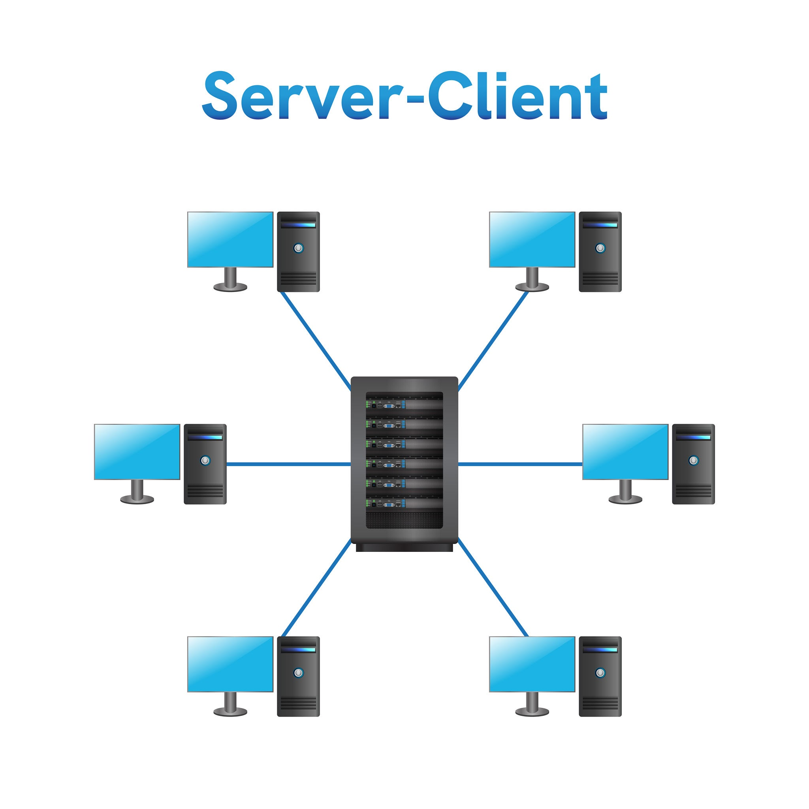

# Arquitectura Cliente - Servidor en SGBD

Esta lección teórica va acompañada de las prácicas: [Práctica guiada: Instalación de MySQL 8.4 en Ubuntu Server 26.04](mysqlubuntu.html) y [Práctica guiada: Aplicación web con MySQL y PHP](practica_guiada_aplicaci_n_web_mysql_php.html)

En los Sistemas de Gestión de Bases de Datos Relacionales (SGBDR), el software no se ejecuta como una aplicación aislada de un solo bloque, sino bajo una **arquitectura distribuida cliente-servidor**

{width="424"}

## El Servidor de Base de Datos (*Database Engine / Daemon*)

````         
-   Es el proceso o servicio que se ejecuta continuamente en segundo plano (ejemplo: `mysqld` en Linux).

-   Administra el almacenamiento físico en disco, la concurrencia de accesos, las transacciones, los permisos de seguridad y el procesamiento de sentencias SQL.

-   Requiere un equipo o sistema operativo activo para escuchar y responder a peticiones de red.

## El Cliente de Base de Datos

-   Es la herramienta o programa que envía instrucciones SQL al servidor a través de la red y recibe los resultados estructurados.

-   **Tipos de clientes más habituales:**

    1.  **Clientes CLI (Línea de comandos):** `mysql`, `mysqlsh`.

    2.  **Interfaces Gráficas (GUI):** DBeaver, MySQL Workbench, phpMyAdmin.

    3.  **Aplicaciones o conectores de código:** Scripts y programas en PHP (PDO), Python (mysql-connector), Java (JDBC) o Node.js.

### Aclaración Clave: El cliente y el servidor en la misma máquina

Estar en el mismo equipo **no elimina la relación cliente-servidor**. Cuando instalamos un servidor en Linux y ejecutamos en la consola `sudo mysql` o `mysql -u root -p`, estamos arrancando un **programa cliente** que se conecta al **servicio servidor** (`mysqld`).

Aunque no haya un cable de red de por medio, ambos programas son procesos independientes que se comunican internamente mediante la red local de *loopback* (`127.0.0.1`) o mediante un archivo de *socket* UNIX.

### La Arquitectura Multicapa en Aplicaciones Web

Cuando introducimos un servidor web (Apache2) y un lenguaje de programación (PHP), el cliente del SGBD ya no es el navegador del usuario final, sino la propia aplicación PHP.

```         
[ Navegador Cliente ]
         |
         | (Petición HTTP / Port 80)
         v
[ Servidor Web: Apache2 ]
         |
         | (Ejecución del script)
         v
[ Lenguaje: PHP (Módulo PDO) ]  <-- Funciona como CLIENTE de MySQL
         |
         | (Protocolo MySQL / TCP 3306 ó Socket)
         v
[ Servidor SGBD: MySQL 8.4 (mysqld) ]
         |
         v
[ Disco / Base de Datos: 'museo' ]
```
````

🔗 **Enlace a la Práctica:** Puedes consultar la implementación real de esta arquitectura multicapa y el flujo completo de datos de un formulario en la sección **"Idea general y arquitectura"** de la *Práctica Guiada: Aplicación web con Apache2, PHP y MySQL*.

# Instalación Inicial, Usuarios por Defecto y Primer Acceso

Al instalar MySQL 8.4 por primera vez en un sistema operativo como Ubuntu Server, el proceso de instalación crea de forma automática una cuenta de administración por defecto:

## El Usuario Administrador por Defecto (`root`)

- **Identidad:** `'root'@'localhost'`.

- **Método de Autenticación (`auth_socket`):** Por defecto en Ubuntu, la cuenta `root` de MySQL no utiliza contraseña al principio, sino el plugin `auth_socket`. Este plugin delega la autenticación en el propio sistema operativo: solo el usuario root del sistema de archivos (o alguien que ejecute `sudo`) puede entrar al cliente de MySQL ejecutando únicamente:

``` bash
sudo mysql
```

- **Rol en el sistema:** Es el superusuario con todos los privilegios (`ALL PRIVILEGES`) sobre todo el motor.

## Flujo habitual de administración:

1.  **Paso 1:** Se instala el servidor de base de datos (`sudo apt install mysql-server`).

2.  **Paso 2:** Se accede al servidor utilizando el cliente CLI con elevación de privilegios (`sudo mysql`).

3.  **Paso 3:** Desde el cliente, el administrador crea la estructura de la base de datos y define **nuevos usuarios específicos** limitados para las aplicaciones finales.

# Usuarios, Host y Seguridad (Autenticación y Permisos)

A diferencia de los sistemas operativos tradicionales, donde un usuario se identifica únicamente por su nombre, en motores como MySQL la identidad de una cuenta es **bidimensional**:

$$\text{Cuenta} = \text{'Usuario'}@\text{'Host'}$$

| **Componente** | **Definición** | **Ejemplo** | | **Usuario** | Nombre de la cuenta o aplicación. | `'root'`, `'museo_app'` | | **Host** | La dirección IP o interfaz desde la cual tiene permitido conectar. | `'localhost'`, `'127.0.0.1'`, `'192.168.1.50'`, `'%'` |

## Los tipos de Host más comunes

- `'localhost'`: Permite el acceso únicamente desde el propio equipo mediante el archivo de socket UNIX local.

- `'127.0.0.1'`: Obliga a realizar la conexión mediante la interfaz TCP/IP de *loopback* local.

- `'192.168.X.X'`: Restringe la autenticación a una máquina específica de la red local.

- `'%'`: Comodín (*wildcard*) que permite al usuario conectarse desde cualquier dirección IP remota.

## El Principio de Mínimo Privilegio (*Least Privilege*)

Nunca se deben utilizar las credenciales del usuario `root` para conectar una aplicación web (PHP, Python, Java) a la base de datos. Si un atacante lograra explotar una vulnerabilidad en la aplicación web, obtendría control total sobre todo el motor de bases de datos.

Lo correcto es crear un usuario dedicado para la aplicación, restringido a su IP de origen y con permisos (*Grants*) estrictamente limitados a las operaciones requeridas.

> 🔗 **Enlace a la Práctica:** En la sección **"Crear un usuario específico para la aplicación"** de la práctica guiada, se muestra el ejemplo práctico de cómo crear el usuario `'museo_app'@'127.0.0.1'` con contraseña y cómo limitarle los permisos otorgando únicamente las operaciones `SELECT` e `INSERT` sobre la tabla `Objetos`:
>
> ``` sql
> CREATE USER 'museo_app'@'127.0.0.1' IDENTIFIED BY 'ContraseñaSegura';
> GRANT SELECT, INSERT ON museo.Objetos TO 'museo_app'@'127.0.0.1';
> ```

Para interactuar con la base de datos con el nuevo usuario:

``` bash
mysql -u museo_app -p
```

# Interfaces de Escucha y Red (`bind-address` y Puertos)

Para que el servidor acepte o rechace conexiones de red, entran en juego los parámetros del protocolo TCP/IP:

- **Puerto de Servicio:** Punto lógico de comunicación. Por defecto, MySQL escucha en el puerto **TCP 3306**.

- **Dirección de Escucha (`bind-address`):** Indica qué tarjetas de red o interfaces del servidor procesarán tráfico entrante:

  - `127.0.0.1` (**Loopback**): El servidor ignora las peticiones que vengan del exterior y solo escucha las internas de la propia máquina.

  - `0.0.0.0` (**Todas las interfaces**): Permite recibir peticiones procedentes de cualquier tarjeta de red o IP pública/privada configurada.

# Archivos de Configuración y Protección de Credenciales

Un SGBD y sus aplicaciones asociadas utilizan archivos de texto plano para ajustar sus parámetros.

## Configuración del Servidor SGBD

- En sistemas Linux/Ubuntu, los archivos de configuración se estructuran modularmente en `/etc/mysql/` (por ejemplo, `mysqld.cnf`).

- Cualquier modificación en estos archivos requiere reiniciar el demonio (`sudo systemctl restart mysql`) para aplicar los cambios.

## Configuración de la Aplicación y Seguridad en el Sistema de Archivos

Cuando un script de backend (como PHP) necesita guardar la contraseña de la base de datos, el archivo de configuración nunca debe alojarse en la carpeta pública del servidor web (como `/var/www/html/`). Si el motor de PHP fallase o fuera malconfigurado, Apache podría servir la contraseña como texto plano a cualquier visitante en Internet.

Por ello, se utiliza la regla de **almacenamiento externo y permisos octales reducidos** en Linux:

1.  Guardar el archivo en `/etc/` (ejemplo: `/etc/museo/config.php`).

2.  Asignar la propiedad a `root` y al grupo del servidor web (`www-data`).

3.  Aplicar permisos de lectura estricta (`chmod 640`):

    - **Propietario (`root` - 6):** Lectura y escritura.

    - **Grupo (`www-data` - 4):** Solo lectura (para que el servidor web pueda ejecutar la conexión).

    - **Otros (0):** Sin ningún tipo de acceso.

> 🔗 **Enlace a la Práctica:** Consulta el apartado **"Crear la conexión con MySQL mediante PDO"** de la práctica para ver la aplicación técnica de `chown root:www-data` y `chmod 640` sobre el archivo de credenciales.

# Estructura Interna: Bases de Datos de Sistema y de Usuario

Al instalar el motor, este crea de forma automática un catálogo del sistema con metadatos indispensables para su funcionamiento:

## Esquemas del Sistema

- `mysql`: Contiene las tablas internas del motor, como `mysql.user` (donde se guardan los usuarios, sus contraseñas encriptadas y sus permisos globales).

- `information_schema` y `performance_schema`: Vistas de solo lectura con metadatos sobre la estructura de tablas, tipos de datos, índices y métricas de rendimiento en tiempo real.

## Esquemas de Usuario

Son las bases de datos creadas explícitamente para almacenar los datos de un negocio o aplicación (ejemplo: `CREATE DATABASE museo;`).

# Modelado de Datos y Restricciones de Integridad

En la capa teórica del diseño de tablas, la base de datos es la encargada de mantener la **integridad de los datos** mediante restricciones (*constraints*). Las comprobaciones de las aplicaciones web (validaciones de formularios) ayudan al usuario, pero **la base de datos es la última línea de defensa**.

## Resumen Teórico de Restricciones y Tipos de Datos Avanzados


|------------------|-------------------------------------|------------------|
| **Restricción / Tipo** | **Función Teórica** | **Aplicación en el Modelo del Museo** |
| `PRIMARY KEY` | Identificador único irrepetible de cada fila. Garantiza que no haya duplicados y crea un índice primario de búsqueda rápida. | `id_objeto INT UNSIGNED AUTO_INCREMENT` |
| `UNIQUE` | Garantiza que no existan dos filas con el mismo valor en una columna clave alternativa. | `codigo_inventario VARCHAR(50)` (ej. 'MED-0001') |
| `CHECK` | Expresión lógica que debe cumplirse obligatoriamente para que el `INSERT` o `UPDATE` sea aceptado. | `CHECK (mes_inicio BETWEEN 1 AND 12)` |
| `ENUM` | Lista cerrada de valores permitidos. Cualquier otro texto es rechazado. | `era ENUM('a.C.', 'd.C.')` |
| `NULL` | Representa la **ausencia de valor** o información desconocida (se diferencia claramente de `0` o de una cadena vacía `""`). | Campos opcionales de datación histórica. |

> 🔗 **Enlace a la Práctica:** Revisa la sentencia SQL de creación de la tabla en el apartado **"Crear la base de datos y la tabla Objetos"** de la práctica para observar cómo se traducen estos conceptos en una tabla real de MySQL.

# Interacción Seguro mediante PDO y Consultas Preparadas

Cuando un script de backend envía consultas a la base de datos con información que proviene del usuario final, existe un grave riesgo de **Inyección SQL (SQLi)** si se concatenan cadenas de texto directamente.

## ¿Qué son las Consultas Preparadas?

Una consulta preparada compila la estructura lógica de la sentencia SQL en el servidor de base de datos **antes** de recibir los valores introducidos por el usuario. De esta forma, el motor trata los datos únicamente como valores literales, impidiendo que código malicioso altere la orden SQL original.

```         
1. Preparación (SQL estático):   INSERT INTO Objetos (nombre) VALUES (:nombre)
2. Asignación de Parámetros:  :nombre = "Manuscrito' OR '1'='1"
3. Ejecución Segura:           El motor inserta el texto exacto sin interpretar la comilla.
```

> 🔗 **Enlace a la Práctica:**
>
> - Ver el script **`guardar.php`** para comprender la inserción de datos usando `PDO::prepare()` y la conversión de campos vacíos a `NULL`.
>
> - Ver el script **`buscar.php`** para observar cómo se realizan búsquedas dinámicas con `bindValue()` filtrando por clave primaria (`id_objeto`) o clave única (`codigo_inventario`).

# Resumen Integrado de Conceptos

```         
┌────────────────────────────────────────────────────────────────────────┐
│                        UBUNTU SERVER 26.04                             │
│                                                                        │
│  [ Servidor Web Apache2 ]                                              │
│        │                                                               │
│        ├─► /var/www/html/museo/ (Archivos públicos: index, html, css)  │
│        │                                                               │
│  [ Módulo PHP + PDO ]                                                  │
│        │                                                               │
│        ├─► /etc/museo/config.php (Credenciales protegidas: chmod 640)  │
│        │                                                               │
│        ▼ (Conexión TCP/IP 127.0.0.1:3306)                              │
│                                                                        │
│  [ SGBD MySQL 8.4 (mysqld) ]                                           │
│        │                                                               │
│        ├─► Usuario App: 'museo_app'@'127.0.0.1' (Permisos SELECT, INSERT)
│        └─► Base de Datos: 'museo' ──► Tabla: 'Objetos'                 │
└────────────────────────────────────────────────────────────────────────┘
```

------------------------------------------------------------------------