En este capítulo abordaremos la base común a todas las variantes de SQL. Aunque cada SGBD tiene sus particularidades, la sintaxis fundamental es universal. Para los ejemplos prácticos utilizaremos datasets reales de películas (`imdb_movies.csv`) y de salud mundial (`world_health_org.csv`).

Para empezar, antes de usar un gestor de bases de datos vamos a usar la web <https://sqliteonline.com/> que nos permite trabajar en SQLite, MariaDB, PostgreSQL y MS SQL.

Nosotros en esta introducción a SQL vamos a trabajar con SQLite porque es muy amigable para una primera toma de contacto.

::: {.callout-note title="Nota sobre el Estándar SQL, los Dialectos y la Portabilidad"}
### ¿Por qué lo que lees aquí puede variar según el motor de base de datos?

El lenguaje SQL está regulado por un estándar internacional (ANSI/ISO SQL). Sin embargo, ningún motor de base de datos lo implementa al 100% de la misma manera. Cada motor (**SQLite, PostgreSQL, MySQL, SQL Server, Oracle**) añade sus propias funciones, optimizaciones o flexibilidades sintácticas. A estas variaciones las llamamos **dialectos de SQL**.

Durante el curso trabajaremos principalmente con **SQLite** por su sencillez y rapidez de despliegue, pero nuestro objetivo es que aprendas a escribir **SQL portable**: consultas que funcionen con los mínimos cambios posibles en cualquier entorno profesional.

------------------------------------------------------------------------

### Buenas prácticas para escribir SQL portable

1.  **Respeta el orden de ejecución lógico:** Aunque algunos motores (como SQLite) sean permisivos con ciertos atajos —por ejemplo, permitir alias de columnas en el `WHERE`—, acostúmbrate a seguir la norma general para evitar que tus consultas fallen en otros sistemas.
2.  **Usa sintaxis explícita:** Prefiere siempre `JOIN ... ON` en lugar de relacionar tablas en la cláusula `WHERE`. Es la norma estándar y hace las consultas más legibles y mantenibles.
3.  **Cuidado con las comillas:**
    - Usa **comillas simples** (`'texto'`) para valores de texto/cadenas.
    - Usa **comillas dobles** (`"columna"`) o directamente nada para los nombres de tablas y columnas.
4.  **Atención a las funciones de fecha, texto y paginación:** Son las que más varían entre motores. Mientras en SQLite o PostgreSQL usamos `LIMIT` para paginar, SQL Server usa `TOP` y Oracle `FETCH FIRST`.
:::

------------------------------------------------------------------------

# La Estructura Básica y el Uso de Alias (`SELECT`, `FROM`, `WHERE`, `AS`)

Toda consulta relacional parte de tres pilares:

- **`SELECT`**: Define qué columnas queremos recuperar.

- **`FROM`**: Especifica la tabla origen de los datos.

- **`WHERE`**: Filtra las filas según una condición lógica.

## Los Alias (`AS`) y el orden de ejecución

Podemos renombrar temporalmente las columnas o las tablas usando la palabra clave `AS` para que los resultados sean más legibles.

``` sql
SELECT movie_title AS titulo, imdb_score AS puntuacion 
FROM imdb_movies 
WHERE COUNTry = 'USA';
```

> **¡Uso de alias en el WHERE!**\
> Podrías pensar que si has llamado `puntuacion` a la columna, puedes usarla en el `WHERE` así: `WHERE puntuacion > 8.0`. **Esto dará error**.\
> El motor SQL ejecuta las instrucciones en este orden: `FROM` $\rightarrow$ `WHERE` $\rightarrow$ `SELECT`. Cuando el motor está evaluando el `WHERE`, todavía no ha llegado al `SELECT`, por lo que **aún no sabe que ese alias existe**. En el `WHERE` siempre debes usar el nombre original de la columna.

::: {.note title="La excepción de SQLite"}
Aunque el estándar SQL prohíbe usar alias en el WHERE debido al orden de ejecución, SQLite incluye una excepción especial y sí lo permite para hacer la escritura más rápida.

Sin embargo, \*\*es una mala práctica depender de esto\*\*. Acostúmbrate a usar siempre el nombre original en el WHERE; de lo contrario, tus consultas fallarán cuando trabajes con otros motores como PostgreSQL, Oracle o SQL Server.
:::


# Operadores Lógicos y de Comparación

Disponemos de operadores como `=`, `!=` (o `<>`), `>`, `<`, `>=`, `<=` y `BETWEEN` (que es inclusivo).

## Operadores en campos no numéricos (Texto y Fechas)

Los operadores de comparación no se LIMITan a números. Si los usamos con texto o fechas, SQL aplica un orden lexicográfico (alfabético) o cronológico.

## El Operador `BETWEEN` (Rangos inclusivos)

El operador `BETWEEN` se utiliza en la cláusula `WHERE` para filtrar datos que caen dentro de un rango específico. Es muy versátil porque se puede aplicar a números, textos y fechas.

**Regla fundamental de Inclusión:** `BETWEEN` es **completamente inclusivo**. Esto significa que los valores que defines como límite inferior (el de la izquierda) y límite superior (el de la derecha) **sí se incluyen** en los resultados.

Escribir `columna BETWEEN valor_A AND valor_B` es matemáticamente y lógicamente equivalente a escribir: `columna >= valor_A AND columna <= valor_B`.

``` sql
-- Este ejemplo INCLUYE las películas que duran exactamente 90 minutos y también las de 120 minutos.
SELECT movie_title, duration 
FROM imdb_movies 
WHERE duration BETWEEN 90 AND 120;
```

> **¡Trampas comunes con `BETWEEN`!**
>
> 1.  **El orden estricto de los límites:** Siempre debes poner primero el valor más pequeño y luego el más grande. Si por error escribes `WHERE duration BETWEEN 120 AND 90`, el motor SQL buscará valores que sean mayores o iguales a 120 y, al mismo tiempo, menores o iguales a 90. Como esto es imposible, te devolverá cero resultados, ¡y lo peor es que no te dará ningún error de sintaxis para avisarte!
>
> 2.  **El peligro invisible de las fechas con horas (Datetimes):** Si tu columna guarda fecha y hora (por ejemplo, `2026-06-15 14:30:00`), usar `BETWEEN '2026-06-01' AND '2026-06-15'` te dará un susto. SQL traduce la última fecha a `'2026-06-15 00:00:00'` (la medianoche exacta). Por lo tanto, cualquier registro del día 15 que haya ocurrido a las 00:00:01 o más tarde, **quedará excluido**. Para incluir el día 15 completo, el estándar profesional es abandonar `BETWEEN` y usar: `WHERE fecha >= '2026-06-01' AND fecha < '2026-06-16'`.
>
> 3.  El comportamiento de `BETWEEN` con cadenas de texto (Strings)
>
>     Aquí es donde la regla de inclusión de `BETWEEN` choca con el **orden lexicográfico** (alfabético) de las bases de datos. -- Buscar países cuyo nombre empiece por letras entre la 'A' y la 'C'
>
>     ``` sql
>     SELECT Country 
>     FROM world_health_org 
>     WHERE Country BETWEEN 'A' AND 'D'; 
>     -- Nota: 'D' se usa como límite superior para incluir a todos los países con 'C'.
>     ```
>
>     Cuando SQL compara textos, lo hace letra por letra, exactamente igual que si estuviera ordenando palabras en un diccionario. El texto `'C'` (una sola letra) es estrictamente menor que el texto `'Canada'`. ¿Por qué? Porque la palabra "Canada" tiene más letras después de la 'C'. En el diccionario interno de SQL, `'Canada'` va *después* de `'C'` pero *antes* de `'D'`.
>
>     Si escribiéramos lo que dicta la intuición:
>
>     ``` sql
>     WHERE Country BETWEEN 'A' AND 'C'
>     ```
>
>     El motor SQL incluirá a "Argentina" y "Bolivia", pero cuando evalúe "Canada", "Chile" o "Colombia", el sistema dirá: *"Un momento, estas palabras son mayores que 'C' (están más adelante en el alfabeto), así que quedan fuera"*. El único país con la letra C que pasaría el filtro sería uno que se llamase literalmente "C", a secas.
>
>     **Por eso el límite superior se establece en 'D':** Al poner `BETWEEN 'A' AND 'D'`, el límite superior es exactamente el carácter 'D'. - "Canada" se incluye porque alfabéticamente es menor que 'D'. - "Colombia" se incluye porque alfabéticamente es menor que 'D'. - "Denmark" (Dinamarca) **queda excluido** porque "Denmark" tiene más letras y, por tanto, es mayor que 'D' a secas. - El único país con 'D' que se colaría en los resultados sería uno que se llamase exactamente "D".
>
>     > **La alternativa profesional (y menos confusa):** Aunque el truco de `BETWEEN 'A' AND 'D'` funciona para atrapar todo lo que empieza por A, B y C, suele generar esta misma confusión que has tenido tú al leerlo. Por eso, para evitar malentendidos, en entornos profesionales se suele preferir usar operadores matemáticos o comodines para los textos:
>     >
>     > ``` sql
>     > -- Opción 1: Desigualdad (Mucho más claro a la hora de leer el código)
>     > WHERE Country >= 'A' AND Country < 'D';
>     >
>     > -- Opción 2: El uso de LIKE (Más explícito si son pocas letras)
>     > WHERE Country LIKE 'A%' OR Country LIKE 'B%' OR Country LIKE 'C%';
>     > ```

*Si fuera una fecha: `WHERE fecha_estreno > '2020-01-01'` traería las películas posteriores a esa fecha.*

## Las trampas lógicas (`NOT`, `AND`, `OR` y `NULL`)

1.  **El peligro de los nulos con `NOT`:** El valor `NULL` en SQL significa "desconocido". Si evalúas `WHERE NOT (Adult_literacy_rate = 96.7)`, las filas con `NULL` **desaparecerán**. Cualquier comparación directa con un nulo da como resultado nulo, y el `WHERE` solo deja pasar lo que es estrictamente `TRUE`. Para trabajar con nulos hay que usar `IS NULL` o `IS NOT NULL`.

2.  **La prioridad de `AND` sobre `OR`:** Si mezclas ambos sin paréntesis: `WHERE Country = 'USA' OR Country = 'UK' AND duration > 120`, el motor evaluará primero el `AND`.\
    Esto significa: *"Tráeme cualquier película de USA (dure lo que dure) O BIEN películas de UK que duren más de 120 min"*.\
    **Solución:** Usa siempre paréntesis para forzar la lógica que deseas: `WHERE (Country = 'USA' OR Country = 'UK') AND duration > 120`.

::: nota
La trampa de los tipos de datos en SQLite:

En esta tabla tenemos un actor cuyo salario es 'NA' (como cadena de texto, no un nulo) 

Si quiero seleccionar aquellas filas donde el salario no sea desconocido y uso esta condición mi filtro falla: 

¿Por qué `"NA" > 0` es verdadero?

En motores estrictos (como PostgreSQL o SQL Server), intentar comparar texto puro como `"NA"` con un número `0` te devolvería un error de sintaxis o de conversión. Sin embargo, SQLite utiliza un sistema de **tipado dinámico**, lo que significa que es extremadamente permisivo e intenta resolver la comparación basándose en una jerarquía de clases de almacenamiento.

Cuando comparas distintos tipos de datos, SQLite los ordena de menor a mayor siguiendo esta regla estricta: `NULL` \< `NÚMEROS (Integer/Real)` \< `TEXTO` \< `BLOB`

**¿Qué pasa exactamente en la consulta `WHERE bondactorsalary > 0`?**

1\. El campo `bondactorsalary` es de tipo `TEXT`.

2\. Al evaluar las filas, si SQLite detecta un número en formato texto (por ejemplo `"-5"`), es lo bastante inteligente como para convertirlo a número temporalmente y evaluar `-5 > 0` (lo cual es Falso, y queda excluido).

3\. Sin embargo, cuando llega a la fila con el valor `"NA"`, intenta convertirlo a número y falla, por lo que **lo deja como `TEXTO`**.

4\. Al hacer la comparación final, se enfrenta a la pregunta: *¿Es el `TEXTO` ("NA") mayor que el `NÚMERO` (0)?* Según la jerarquía de SQLite mencionada arriba, **cualquier texto siempre es estrictamente mayor que cualquier número**.

5\. Por lo tanto, `"NA" > 0` se evalúa como **Verdadero (`TRUE`)**, y esa fila se cuela en tus resultados a pesar de ser texto.

> **¿Cómo solucionarlo y hacer la consulta segura?** Para forzar a SQLite a evaluar todo matemáticamente y evitar que las cadenas de texto puro se cuelen en filtros numéricos, debes castear (convertir) explícitamente la columna. En SQLite, si fuerzas un texto como `"NA"` a número, se convierte en `0`, lo que permite que tu filtro funcione como esperabas, pero cuidado, porque esto no va a ser así en todos los motores
>
> ``` sql
> -- Forma correcta de filtrar excluyendo textos no numéricos
> WHERE CAST(bondactorsalary AS REAL) > 0;
> ```

¿Por qué `CAST('texto' AS REAL)` se convierte en `0` y no en `NULL` en SQLite?

Cuando haces un `CAST` explícito de texto a número en SQLite, el motor nunca devuelve `NULL` (a menos que el valor original ya fuera `NULL`). En lugar de eso, o te da un número, o te da un `0`. Esto se debe a su **"Regla del Prefijo"**:

1.  **Lectura de izquierda a derecha:** Cuando SQLite intenta convertir un texto a número (ya sea `INTEGER` o `REAL`), empieza a leer la cadena de texto desde el primer carácter de la izquierda.
2.  **Extracción de números:** Toma todos los caracteres válidos que formen un número y **descarta todo lo demás**.
    - `CAST('120usd' AS INTEGER)` se convierte en `120`.
    - `CAST('3.14espacio' AS REAL)` se convierte en `3.14`.
3.  **El caso de 'NA' (Fallo de conversión):** Si SQLite empieza a leer de izquierda a derecha y el *primer* carácter ya no es un número (como en la palabra `"NA"`, o `"Hola"`), no puede extraer ningún prefijo numérico. En lugar de detener la consulta con un error o devolver `NULL`, **la especificación oficial de SQLite dicta que el resultado por defecto ante un fallo de conversión siempre es `0` (o `0.0`)**.

**¿Por qué no usa `NULL`?** En la lógica de bases de datos, `NULL` significa estrictamente *"Ausencia de valor"* (desconocido). Sin embargo, `"NA"` sí es un valor conocido (es un texto explícito). Como el motor no puede convertir ese texto a matemáticas, asume el valor matemático nulo por defecto: el cero.

> **¡Cuidado con la media (AVG)!** Esto es muy peligroso si estás calculando promedios. Si tus textos `"NA"` se convierten en `0` silenciosamente, tu denominador será mayor y el promedio final bajará artificialmente.
>
> Si realmente quieres que los textos inválidos sean ignorados en matemáticas, tienes que convertirlos a `NULL` usando `NULLIF` o un `CASE WHEN`:
>
> ``` sql
> -- Esto convierte el texto 'NA' explícitamente en NULL real, 
> -- por lo que las funciones matemáticas (SUM, AVG) simplemente lo ignorarán.
> SELECT AVG(CAST(NULLIF(bondactorsalary, 'NA') AS REAL)) FROM jamesbond;
> ```
:::

# Valores Únicos (`DISTINCT`)

Si queremos saber qué continentes distintos hay en nuestra tabla, un `SELECT Continent` nos devolverá cientos de filas repetidas. `DISTINCT` elimina los duplicados del conjunto de resultados.

``` sql
SELECT DISTINCT Continent 
FROM world_health_org;
```

# Ordenación y Límites (`ORDER BY`, `LIMIT`)

- **`ORDER BY`**: Ordena por una o varias columnas de forma ascendente (`ASC`, por defecto) o descendente (`DESC`).
- **`LIMIT`**: Restringe el número de filas devueltas. (En SQL Server se usa `TOP`).

> **¡Trampa del LIMIT huérfano!**\
> Si ejecutas `SELECT movie_title FROM imdb_movies LIMIT 5;` sin usar `ORDER BY`, **el resultado es no determinista**. El motor te devolverá las primeras 5 filas que encuentre en la memoria o en el disco duro en ese microsegundo. Puede que hoy te devuelva unas películas y mañana otras distintas. **Regla de oro: Nunca uses `LIMIT` sin acompañarlo de un `ORDER BY`** si quieres resultados consistentes.

``` sql
-- Forma correcta de obtener el "Top 5"
SELECT movie_title, budget 
FROM imdb_movies 
ORDER BY budget DESC 
LIMIT 5;
```

# Lógica Condicional

## (`CASE WHEN`)

`CASE WHEN` permite crear nuevas columnas evaluando condiciones fila a fila.

> **¡Trampa de la ejecución en cascada (Cortocircuito)!**\
> El `CASE` evalúa las condiciones de arriba a abajo y **se detiene en la primera que resulta verdadera (TRUE)**. El orden importa muchísimo.

Observa este ejemplo MAL diseñado:

``` sql
SELECT movie_title, imdb_score,
    CASE 
        WHEN imdb_score >= 5.0 THEN 'Aprobada'
        WHEN imdb_score >= 8.0 THEN 'Obra Maestra' -- ¡ESTO NUNCA SE EJECUTARÁ!
        ELSE 'Suspenso'
    END AS categoria
FROM imdb_movies;
```

Una película con puntuación `9.0` cumple la primera condición (`>= 5.0`), así que SQL le asignará 'Aprobada', sale del `CASE` y la línea de 'Obra Maestra' jamás llegará a evaluarse. **Siempre debes ordenar del caso más restrictivo al más general.**

``` sql
-- Forma correcta
SELECT movie_title, imdb_score,
    CASE 
        WHEN imdb_score >= 8.0 THEN 'Obra Maestra'
        WHEN imdb_score >= 5.0 THEN 'Aprobada'
        ELSE 'Suspenso'
    END AS categoria
FROM imdb_movies;
```

## Lógica condicional rápida: `IF` e `IIF`

A diferencia del clásico bloque `if (condicion) { ... } else { ... }` o los operadores ternarios (`condicion ? verdadero : falso`) tan comunes en lenguajes como C# y JavaScript, o la función `ifelse()` de R, el lenguaje SQL estándar fue diseñado principalmente en torno a la estructura `CASE WHEN` que ya hemos visto.

Sin embargo, escribir un `CASE WHEN` completo puede ser tedioso cuando solo necesitas evaluar una condición binaria rápida (verdadero o falso). Para solucionar esto, varios motores de bases de datos han introducido funciones de conveniencia de una sola línea, aunque **no son un estándar universal**.

**La función `IF()` (Exclusiva de MySQL y MariaDB)** En MySQL, puedes usar la función `IF` que recibe tres parámetros: la condición, el valor si es verdadera y el valor si es falsa.

``` sql
-- Ejemplo en MySQL
SELECT 
    movie_title,
    duration,
    IF(duration > 120, 'Larga', 'Estándar') AS categoria_duracion
FROM imdb_movies;
```

**La función `IIF()` (SQL Server, SQLite, Access)** Otros motores implementaron exactamente la misma idea, pero bajo el nombre `IIF` (Immediate IF). Afortunadamente, SQLite (desde su versión 3.32.0) y SQL Server comparten esta sintaxis.

``` sql
-- Ejemplo en SQLite y SQL Server
SELECT 
    Country,
    Population_in_th,
    IIF(Population_in_th > 50000, 'Alta Población', 'Baja Población') AS tipo_poblacion
FROM world_health_org;
```

**¿Qué pasa con PostgreSQL y Oracle?** Motores muy apegados al estándar estricto como PostgreSQL no tienen una función `IF()` ni `IIF()` nativa. En estos motores, la única forma oficial de hacer un if/else es utilizar la sintaxis CASE WHEN

``` sql
-- La alternativa universal (funciona en TODOS los motores, incluyendo SQLite)
SELECT 
    Country,
    Population_in_th,
    CASE 
        WHEN Population_in_th > 50000 THEN 'Alta Población'
        ELSE 'Baja Población'
    END AS tipo_poblacion
FROM world_health_org;
```

> **Consejo de diseño para tus consultas:** Si estás preparando material o consultas que necesitan ejecutarse en diferentes entornos sin romperse, lo más seguro es usar siempre `CASE WHEN`. Si sabes que vas a trabajar exclusivamente dentro de SQLite o SQL Server, usar `IIF()` te ahorrará mucho espacio y hará que el código se lea de forma mucho más directa.

# Agrupación y Funciones de Agregación (`GROUP BY`, `HAVING`)

Las funciones de agregación (`MAX`, `MIN`, `COUNT`, `SUM`, `AVG`) reducen múltiples filas a un solo valor.

## Variantes importantes del `COUNT`

- `COUNT(*)`: Cuenta todas las filas, incluyendo aquellas que tienen todos sus valores nulos.
- `COUNT(columna)`: Cuenta cuántos valores **no nulos** hay en esa columna.
- `COUNT(DISTINCT columna)`: Cuenta cuántos valores **únicos y no nulos** existen en esa columna.

## La regla de oro del `GROUP BY`

Cuando agrupas datos, hay una regla estricta en SQL estándar que genera muchísimos errores de principiante: **Cualquier columna que pongas en el `SELECT` debe estar dentro de una función de agregación (SUM, COUNT...) o debe aparecer explícitamente en la cláusula `GROUP BY`.**

``` sql
-- INCORRECTO: Dará error porque 'Country' no está agrupado ni agregado. (excepto en SQLite y MySQL antiguo)
SELECT 
Continent
, Country
, SUM(Population_in_th) FROM world_health_org 
GROUP BY Continent;

-- CORRECTO
SELECT Continent
, COUNT(CountryID) AS total_paises
, SUM(Population_in_th) AS poblacion_total_miles 
FROM world_health_org 
GROUP BY Continent;
```

:::: nota
**La excepción a la regla: SQLite y MySQL antiguo** En motores como **SQLite** (y versiones anteriores a la 5.7 de MySQL), el código incorrecto **sí se ejecutará sin dar error**. A estas columnas no agrupadas ni agregadas se las conoce técnicamente como *"bare columns"* (columnas desnudas). Lo que hace SQLite es simplemente devolver un valor arbitrario (normalmente el de la última o primera fila que procesa dentro de ese grupo) para la columna `Country`. **Peligro:** Aunque el motor te permita ejecutarlo, es una mala práctica profesional depender de este comportamiento, ya que el dato que te devuelve para esa columna extra es impredecible y no determinista.

### Cómo adaptar las "Bare Columns" a SQL Estándar (SQL Server, PostgreSQL, etc.)

Como vimos, SQLite te permite poner `Country` en el `SELECT` sin agruparlo, devolviéndote un país aleatorio de ese continente. Como los motores estrictos (SQL Server, PostgreSQL, Oracle) no permiten ambigüedades, tienes que decirle explícitamente **qué quieres hacer** con los países de ese continente.

Aquí tienes las tres soluciones equivalentes y estándar, dependiendo de lo que realmente necesites conseguir:

**1. Opción rápida: Usar una agregación básica (MIN / MAX)** Si solo quieres que el motor no dé error y te devuelva *un* país válido de ese grupo (por ejemplo, el primero alfabéticamente), usas `MIN()`.

``` sql
SELECT 
    Continent, 
    MIN(Country) AS un_pais_de_muestra, 
    SUM(Population_in_th) AS poblacion_total_miles 
FROM world_health_org 
GROUP BY Continent;
```

**2. Opción de lista: Concatenar todos los valores (`STRING_AGG`)** Si quieres agrupar la población pero no quieres perder la información de los países, puedes juntarlos todos en una sola celda separados por comas. *(Nota: En PostgreSQL y SQL Server se usa `STRING_AGG`, en MySQL se llama `GROUP_CONCAT`)*.

``` sql
SELECT 
    Continent, 
    STRING_AGG(Country, ', ') AS lista_de_paises, 
    SUM(Population_in_th) AS poblacion_total_miles 
FROM world_health_org 
GROUP BY Continent;
```

::: extra
**El enfoque profesional: Window Functions (esta variante la veremos más adelante)** En el mundo real, cuando alguien escribe esa consulta en SQLite, suele estar intentando buscar **"el país con más población de cada continente"**. Para hacer esto correctamente en SQL estándar sin errores, no usamos un simple `GROUP BY`, usamos funciones de ventana (Window Functions) combinadas con una CTE (Common Table Expression):

``` sql
WITH PaisesClasificados AS (
    SELECT 
        Continent,
        Country,
        Population_in_th,
        -- Esto numera los países (1, 2, 3...) dentro de cada continente, 
        -- ordenándolos de mayor a menor población.
        ROW_NUMBER() OVER(PARTITION BY Continent ORDER BY Population_in_th DESC) AS ranking
    FROM world_health_org
)
SELECT 
    Continent, 
    Country AS pais_mas_poblado, 
    Population_in_th
FROM PaisesClasificados
WHERE ranking = 1; -- Filtramos para quedarnos solo con el número 1 de cada continente
```
:::
::::

## `WHERE` vs `HAVING`

¿Qué pasa si queremos mostrar solo los continentes que tengan más de 20 países? No podemos usar `WHERE COUNT(CountryID) > 20` porque el `WHERE` actúa **antes** de que se hagan las agrupaciones.\
Para filtrar datos **después** de agruparlos, usamos `HAVING`. La clausula que usemos en el Having debe ser una función de agregación (COUNT, SUM, AVG...) o una columna que esté en el `GROUP BY`.

``` sql
SELECT Continent, COUNT(CountryID) AS total_paises 
FROM world_health_org 
GROUP BY Continent 
HAVING COUNT(CountryID) > 20;
```

### El orden de ejecución: `WHERE` vs `HAVING`

Where se aplica como filtro a los registros ANTES de que se produzcan los cálculos de agregación. Having se aplica como filtro a los resultados de la agregación, después de que se han agrupado los datos.

Observa esta sencilla tabla:


veamos que pasa si ponemos la condicion de que las ventas sean mayores de 15 en el WHERE:\


Ahora veamos que pasa si la condición en la cláusula HAVING, como ya hemos dicho, para usarla correctamente en el having, tenemos que usar el valor agregado, en este caso suma:\


Qué pasa si usamos la condición en el HAVING pero sin la función de agregación?\
\
En este caso no obtenemos ningún resultado, pero esto puede variar dependiendo del orden de los valores en la tabla, por lo que está totalmente desaconsejado usar condiciones en el having así. En la siguiente nota se explica con más detalle.\

::: nota
### El peligro de las "Bare Columns" en el HAVING

Un error muy común al empezar con SQL es confundir dónde poner las condiciones: ¿en el `WHERE` o en el `HAVING`? Aunque a veces parezca que dan el mismo resultado, funcionan en momentos completamente distintos de la ejecución de la consulta.

El caso de los salarios de "Roger Moore" es el ejemplo perfecto para entender la diferencia. Si revisamos sus datos en crudo, vemos que tiene varias películas donde el salario es `'NA'` y otras dos donde sí cobró (7.8 y 9.1).


**Correcto: Usando `WHERE`**

``` sql
SELECT actor, round(sum(bondactorsalary),1)
FROM jamesbond
WHERE bondactorsalary <> 'NA'
GROUP BY actor
ORDER BY round(sum(bondactorsalary),1) DESC
```


El `WHERE` actúa como un **portero de discoteca**. Filtra las filas individuales *antes* de que se agrupen.

1\. El motor lee todas las filas de Roger Moore.

2\. El `WHERE` elimina inmediatamente las filas que tienen `'NA'`.

3\. Solo pasan las filas con `7.8` y `9.1`.

4\. El `GROUP BY` junta esas dos filas supervivientes y el `SUM()` da el resultado correcto: `16.9`.

**La trampa: Usando la condición en el `HAVING` (y por qué desaparece el actor)**

``` sql
SELECT actor, round(sum(bondactorsalary),1)
FROM jamesbond
GROUP BY actor
HAVING bondactorsalary <> 'NA'
ORDER BY round(sum(bondactorsalary),1) DESC
```


El `HAVING` evalúa las condiciones *después* de haber hecho el `GROUP BY`. Sirve para filtrar **grupos enteros**, no filas individuales.

¿Por qué desaparece Roger Moore aquí?

1\. El motor agrupa *todas* las filas de Roger Moore (incluyendo los `'NA'`).

2\. Llega al `HAVING` y le pedimos que evalúe `bondactorsalary <> 'NA'`. ¡Pero un momento! La condición sobre la columna `bondactorsalary` no está agregada (no tiene un `SUM`, `MAX`, etc en el *Having* ) y hay muchas filas distintas dentro del grupo de Roger Moore.

3\. Como vimos antes, SQLite permite esto (las famosas *"Bare Columns"*). Para resolverlo, SQLite elige una fila aleatoria del grupo de Roger Moore para representar a todo el grupo en la evaluación del `HAVING`.

4\. En este caso, la fila que SQLite escogió al azar resultó ser una de las que tenía el valor `'NA'`.

5\. Al evaluar la condición, se preguntó: *¿Es `'NA' <> 'NA'`?* Como es Falso, el `HAVING` **descartó a todo el grupo de Roger Moore** de un plumazo.

> **Nota para otros motores SQL:** Esta trampa del `HAVING` solo te ocurrirá en SQLite o en versiones antiguas de MySQL. Si intentas ejecutar la consulta del `HAVING` en SQL Server, PostgreSQL u Oracle, te lanzará un error de sintaxis avisándote de que no puedes poner la columna `bondactorsalary` en el `HAVING` a menos que uses una función de agregación (como `MAX`, `MIN`, etc.) o la incluyas en el `GROUP BY`.
:::

# Agregaciones Condicionales

En unaq agregación condicional restringimos la variable sobre la cual buscamos operar al cumplimiento de una o más condiciones. En otras palabras, realizarmos una operación sobre un subconjunto de observaciones (filas) que cumplan con una o más condiciones especfícas. Para implementar una agreagación condicional podemos usar la función `CASE WHEN` dentro de la función de agregación.

En la siguiente query contamos cuántas películas duran más de 120 minutos y cuántas duran menos o igual a 120 minutos.

``` sql

SELECT 
    SUM(CASE WHEN duration > 120 THEN 1 ELSE 0 END) AS peliculas_largas,   
    SUM(CASE WHEN duration <= 120 THEN 1 ELSE 0 END) AS peliculas_cortas
FROM imdb_movies;
```

En la siguiente query calculamos la suma de los ingresos por sector, usando `CASE WHEN` dentro de la función `SUM`.

``` sql
SELECT 
    SUM(CASE WHEN SECTOR 0 'Technology' THEN Revenue END) AS Revenue_Technology,
    SUM(CASE WHEN SECTOR = 'Healthcare' THEN Revenue END) AS Revenue_Healthcare,
    SUM(CASE WHEN SECTOR = 'Finance' THEN Revenue END) AS Revenue_Finance
FROM fortune;
```

# Trabajando con Fechas y Tiempos en SQL Lite

Trabajar con fechas en SQLite tiene una gran particularidad que suele confundir bastante al principio: SQLite no tiene un tipo de datos nativo para fechas (a diferencia de otros motores como PostgreSQL o SQL Server, que tienen DATE o TIMESTAMP).

En su lugar, SQLite almacena las fechas como datos de tipo texto, entero o decimal, usando sus funciones de fecha incorporadas para operar con ellas.

El estándar recomendado: Cadenas de texto (ISO-8601) La mejor práctica en SQLite es guardar las fechas como texto en formato estándar ISO-8601:

Solo fecha: 'YYYY-MM-DD' (ej. '2026-07-28')

Fecha y hora: 'YYYY-MM-DD HH:MM:SS' (ej. '2026-07-28 10:30:00')

¿Por qué este formato? Porque al usar la estructura año-mes-día, el orden alfabético coincide exactamente con el orden cronológico. Eso permite filtrar con \< o \> y usar ORDER BY directamente sin problemas.

En SQL Lite tenemos que extraer la fecha de una columna de tipo `DATETIME` para poder trabajar con ella. Para ello podemos usar la función `DATE()`.

**Insertar la fecha actual automáticamente**

``` sql
CREATE TABLE usuarios (
    id INTEGER PRIMARY KEY AUTOINCREMENT,
    nombre TEXT,
    fecha_registro TEXT DEFAULT CURRENT_DATE,          -- Solo 'YYYY-MM-DD'
    creado_en TEXT DEFAULT CURRENT_TIMESTAMP          -- 'YYYY-MM-DD HH:MM:SS'
);
```

**Funciones principales para manipular fechas**

|  |  |  |  |
|------------------|------------------|------------------|------------------|
| **Función** | **¿Qué devuelve?** | **Ejemplo** | **Resultado** |
| `date(...)` | La fecha | `SELECT date('now');` | `'2026-07-28'` |
| `time(...)` | La hora | `SELECT time('now');` | `'10:30:00'` |
| `datetime(...)` | Fecha y hora | `SELECT datetime('now');` | `'2026-07-28 10:30:00'` |
| `strftime(...)` | Formato personalizado | `SELECT strftime('%Y', 'now');` | `'2026'` |
| `julianday(...)` | Días julianos (decimal) | `SELECT julianday('now');` | `2461250.93...` |

**Modificadores (Añadir o restar tiempo)**

```{sql}
-- Sumar o restar días, meses o años
SELECT date('now', '+7 days');             -- Fecha dentro de una semana
SELECT date('now', '-1 month');            -- Fecha hace un mes
SELECT date('now', '+1 year', '-2 days');  -- Combinación de varios modificadores

-- Buscar inicios de periodo
SELECT date('now', 'start of month');      -- Primer día del mes actual
SELECT date('now', 'start of year');       -- 1 de enero del año actual
```

String function time: `strftime()`

STRFTIME() nos permite formatear la fecha a nuestro gusto, y podemos usarla para extraer el año, mes o día de una fecha, el resultado es un texto, por lo que si queremos hacer comparaciones con números, debemos castear el resultado a `INTEGER` o `REAL`

ejemplo: `SELECT cast (STRFTIME('%m', fecha) AS integer) AS mes_numerico`

- `STRFTIME('%m', fecha)` nos devuelve el mes de la fecha,

- `STRFTIME('%Y', fecha)` nos devuelve el año de la fecha,

- `STRFTIME('%d', fecha)` nos devuelve el día de la fecha,

- `STRFTIME('%H', fecha)` nos devuelve la hora de la fecha,

- `STRFTIME('%M', fecha)` nos devuelve los minutos de la fecha,

- `STRFTIME('%S', fecha)` nos devuelve los segundos de la fecha,

- `STRFTIME('%W', fecha)` nos devuelve el número de semana del año de la fecha,

- `STRFTIME('%j', fecha)` nos devuelve el número de día del año de la fecha,

- `STRFTIME('%w', fecha)` nos devuelve el número de día de la semana de la fecha (0=domingo, 1=lunes, ..., 6=sábado).

```{sql}
SELECT 
    strftime('%Y-%m', fecha_venta) AS mes,
    COUNT(*) AS total_ventas
FROM ventas
GROUP BY mes;
```

**Calcular la diferencia de días entre dos fechas**

Dado que las fechas en texto no se pueden restar directamente, convertimos la fecha a días julianos con `julianday()`:

```{sql}
SELECT 
    nombre_tarea,
    CAST(julianday(fecha_fin) - julianday(fecha_inicio) AS INTEGER) AS dias_duracion
FROM proyectos;
```

Añadir or restar de fechas

```{sql}
-- Restar 1 día
SELECT date('now', '-1 day');

-- Restar 1 mes a una fecha específica
SELECT date('2026-09-02', '-1 month');

-- Restar 1 año
SELECT date('now', '-1 year');

-- Combinar varias restas (ej. restar 1 año y 2 meses)
SELECT date('2026-09-02', '-1 year', '-2 month');
```

# Funciones y Comandos Esenciales de SQL

## Manejo de valores nulos

### COALESCE()

Coalesce(valor1, valor2, ....)

Lo que hace esta función es devolver el primero valor NO NULO de la lista que le pasamos. Normalmente introduciremos campos en los valores, y como último valor introduciremos un valor que queramos poner por defecto si todos los demás son nulos, pero no es obligatorio este último.

``` sql
coalesce(telefono_movil, telefono_fijo, 'sin teléfono de contacto.')
```

Una nota importante es que coalesce va a devolver cualquier valor que no sea nulo, incluyendo celdas en blanco.

## Funcines de ventana

### OVER()

Define una ventana de filas sobre la que se aplica una función, sin colapsar el resultado en una sola fila como haría el group by.

``` sql
SELECT 
    vendedor
    ,SUM(ventas) OVER() as total_general
    ,ventas *100 /  SUM(ventas) OVER() as porcentaje
 FROM datos_analisis
```

### PARTITION BY()

La funcion OVER se aplica sobre un grupo definido en Partition By

``` sql
SELECT 
    vendedor
    ,SUM(ventas) OVER() as total_general
    ,ventas *100 /  SUM(ventas) OVER(PARTITION BY region) as porcentaje_regional
 FROM datos_analisis
```

### DENSE_RANK()

Asigna un rango consecutivo a cada fila. Si hay empate, les asigna el mismo ranking y al siguiente le asigna el siguiente rango disponible, es decir, puede haber 1,1,1,1,2,2,3,4,4,4,5....

``` sql
SELECT 
    empleado
    , salario
    , DENSE_RANK() OVER(ORDER BY salario DESC) AS ranking 
FROM datos_analisis
```

### ROW_NUMBER()

Asigna un número secuencial único a cada fila dentro de la ventana, sin importar los empates. Cada fila tiene un número distinto.

``` sql
SELECT 
    cliente_id
   , nombre
   , fecha
   , ROW_NUMBER () OVER(
        PARTITION BY cliente_id
        ORDER BY fecha DESC
   ) as rn
FROM datos_analisis
```

### LAG() y LEAD()

Accede a valores de filas anteriores o siguientes.

``` sql
select 
    ventas - LAG(ventas, 1) OVER (order by mes) as variacion
from datos_analisis
```

::::: practica
# Práctica Individual SQL 02

Ejercicios prácticos de consultas SQL sobre bases de datos reales. Pon a prueba tus conocimientos de agregación, filtrado y análisis de datos .

------------------------------------------------------------------------

## EJERCICIO 1: Duración de Películas

**Tabla:** `imdb_movies`

Analiza la distribución de películas según su duración utilizando la tabla `imdb_movies` .

- **Menos de 60 min:** ¿Cuántas películas tienen una duración inferior a 60 minutos?
- **Entre 60 y 100 min:** ¿Cuántas películas se encuentran en el rango de 60 a 100 minutos?
- **Más de 100 min:** ¿Cuántas películas superan los 100 minutos de duración?

``` sql
SELECT 
    COUNT (CASE WHEN duration >100 THEN 1 END) AS duracion_mayor_100,
    COUNT (CASE WHEN duration BETWEEN 60 AND 100 THEN 1 END) AS duracion_60_100,
    COUNT (CASE WHEN duration <60 THEN 1 END) AS duracion_menor_60
FROM imdb_movies  ;
```

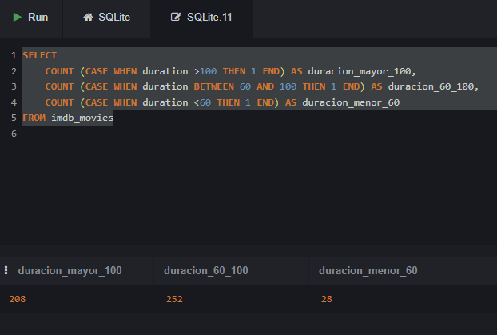

Otra forma de hacerlo es usando `CASE WHEN` en el `SELECT` y luego agrupando por el mismo `CASE WHEN` en el `GROUP BY`:

``` sql
SELECT 
    Case 
        WHEN imdb_movies.duration <60 THEN '<60'
        WHEN imdb_movies.duration BETWEEN 60 AND 100 THEN '60-100'
        WHEN imdb_movies.duration >100 THEN '>100'
        ELSE 'Duración desconocida' 
    END as rango_duracion
    ,COUNT(*) AS n
FROM imdb_movies
GROUP by 
    Case 
        WHEN imdb_movies.duration <60 THEN '<60'
        WHEN imdb_movies.duration BETWEEN 60 AND 100 THEN '60-100'
        WHEN imdb_movies.duration >100 THEN '>100'
    END ;
```

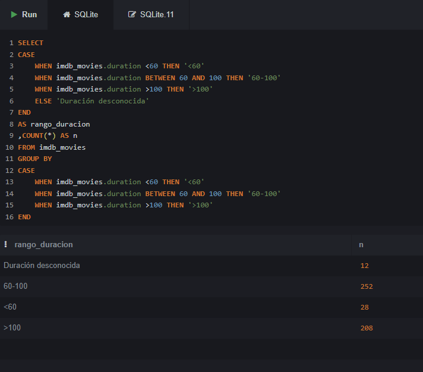

------------------------------------------------------------------------

## EJERCICIO 2: Películas de Acción Cortas

**Tabla:** `imdb_movies`

Filtra las películas del género acción que tengan una duración inferior a 60 minutos en la tabla `imdb_movies` .

- **Contar:** ¿Cuántas películas de acción duran menos de 60 minutos?

  ``` sql
  SELECT
      COUNT (*)
  FROM imdb_movies
  WHERE 
          duration <60 
          AND gender LIKE '%Action%' ;
  ```

- **Listar:** Obtén un listado completo con los títulos de dichas películas .

  ``` sql
  SELECT 
      duration
      ,movie_title
      ,gender
  FROM imdb_movies
  WHERE 
      duration <60 
      AND gender LIKE '%Action%' ;
  ```

  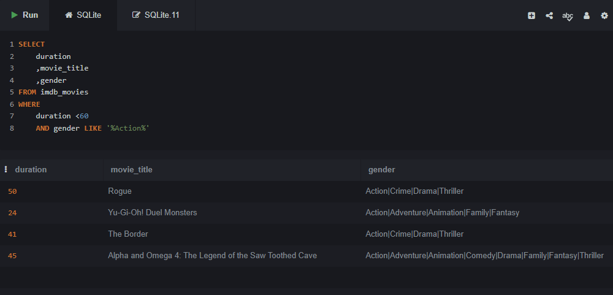

------------------------------------------------------------------------

## EJERCICIO 3: Bitcoin - Tendencia Alcista en 2018

**Tabla:** `bitcoin_daily_rates_formatdate`

Trabaja con la tabla `bitcoin_daily_rates_formatdate` para analizar el campo `High` durante el año 2018 .

- **Mínimo de cotización:** ¿Cuál sería el día con la cotización más baja dentro de una tendencia alcista (campo `High`) en 2018?

  Nota: hacemos LIMIT 5 para asegurarnos de que no hay empate y por lo tanto más de un día con la mínima, pero luego seleccionaremos sólo el día que tenga el mínimo valor.\

  Podemos simplemente ordenar y ver cuál o cuáles son los valores más bajos

  ``` sql
  SELECT * 
  FROM bitcoin_daily_rates_formatdate
  WHERE 
      date BETWEEN '2018-00-00' AND '2018-99-99'
  ORDER BY high ASC
  LIMIT 5 ;
  ```

  O podemos usar la agregación MIN para conseguirlo

  ``` sql
  SELECT 
      date
      , min(high) as cotización_mínima
  FROM bitcoin_daily_rates_formatdate
  WHERE 
      date BETWEEN '2018-00-00' AND '2018-99-99' ;
  ```

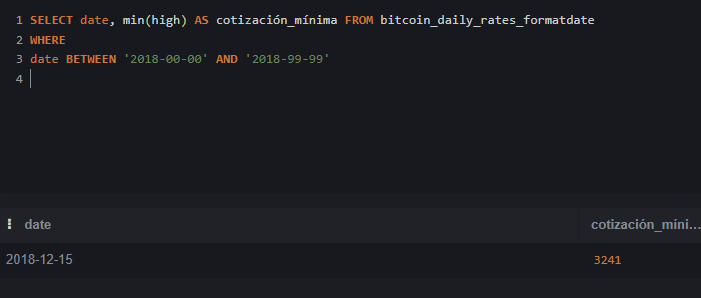

- **Media ese día:** ¿Cuál es la media de cotización correspondiente a ese mismo día?

  ``` sql
  SELECT 
    date
    , min(high) as cotización_mínima 
    , (open + high +low + close )/4 AS media_cotización
  FROM bitcoin_daily_rates_formatdate
  WHERE 
    date BETWEEN '2018-00-00' AND '2018-99-99' ;
  ```

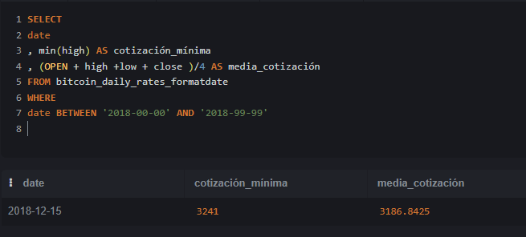

## EJERCICIO 4: Películas por Género y Votos

**Tabla:** `imdb_movies`

Muestra el número de películas por género y la película con mayor número de votos (`num_voted_users`) en cada caso . Respeta el orden indicado: `Action` \| `Crime` \| `Comedy` \| `Drama` \| `Romance` y asigna cada película al primero de estos géneros en los que aparezca. Ignora los demás géneros para las agregaciones.

- Para cada género, indica el total de películas y el título con mayor número de votos.

  ``` sql
  SELECT 
     CASE 
        WHEN  gender LIKE '%Action%' THEN 'Action'
        WHEN  gender LIKE '%Crime%' THEN  'Crime' 
        WHEN  gender LIKE '%Comedy%' THEN 'Comedy'
        WHEN  gender LIKE '%Drama%' THEN  'Drama' 
        WHEN  gender LIKE '%Romance%' THEN 'Romance' 
     END AS primera_categoria   
     , MAX(num_voted_users) AS mas_votada  
     , COUNT(*) as n_pelis
     , movie_title

  FROM imdb_movies
  GROUP BY 
   CASE 
       WHEN  gender LIKE '%Action%' THEN 'Action'
       WHEN  gender LIKE '%Crime%' THEN  'Crime' 
       WHEN  gender LIKE '%Comedy%' THEN 'Comedy'
       WHEN  gender LIKE '%Drama%' THEN  'Drama' 
       WHEN  gender LIKE '%Romance%' THEN 'Romance' 
   END
  HAVING 
      primera_categoria != 'NULL'
  ORDER BY 
      num_voted_users DESC ;
  ```

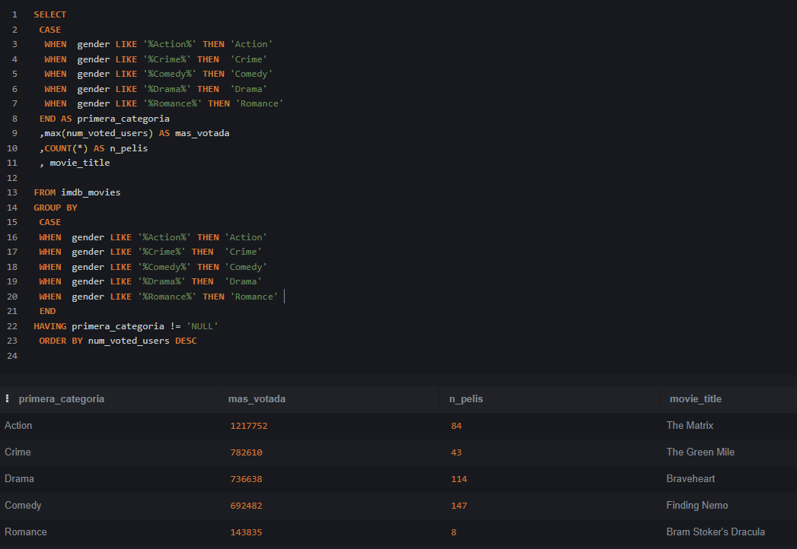

------------------------------------------------------------------------

## EJERCICIO 5: Personajes de Star Wars

**Tabla:** `star_wars_characters`

Usando la tabla `star_wars_characters`, agrupa los personajes por color de ojos (`eye_color`) y planeta de origen (`homeworld`) .

- **Contar personajes:** Muestra cuántos personajes comparten el mismo color de ojos y planeta de origen .
- **Filtrar datos:** Excluir colores de ojos `unknown` y planetas sin datos o nombre (`NA`).

El truco aquí está en que al pedirnos personajes que compartan color de ojos y planeta, tenemos que eliminar los que sean solo 1.

``` sql
SELECT 
    eye_color
    ,homeworld
    ,COUNT (*) AS N
FROM star_wars_characters_2 
WHERE 
    homeworld != 'NA' 
    AND eye_color != 'unknown'
GROUP BY 
    eye_color
    , homeworld
HAVING 
    count(*) >1
ORDER BY 
    COUNT(*) DESC ;
```

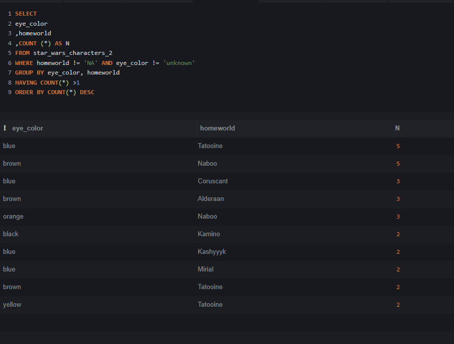

## EJERCICIO 6: James Bond - Presupuesto de Películas

**Tabla:** `jamesbond`

Identifica y calcula el presupuesto de las películas de la saga James Bond que cumplan las siguientes condiciones, usando la tabla `jamesbond` :

- **Director:** Dirigidas por John Glen .
- **Actor protagonista:** Protagonizadas por Timothy Dalton .
- **Cálculo:** Calcula el presupuesto total de dichas películas.

``` sql
SELECT 
    director
    ,actor
    ,SUM(budget) as presupuesto_combinado
    ,COUNT(DISTINCT jamesbond.film) as películas
FROM jamesbond
WHERE 
    director = 'John Glen' 
    AND actor = 'Timothy Dalton' ;
```

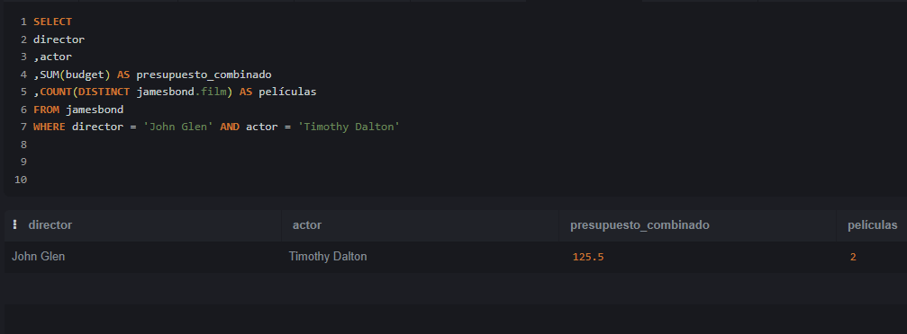

## EJERCICIO 7: Créditos por Estado Personal

**Tabla:** `loan-data`

Analiza la tabla `loan-data` para obtener información sobre los créditos según el estado personal del solicitante .

- **Créditos otorgados:** ¿Cuál es la cantidad y el número de créditos concedidos, agrupados por estado personal?
- **Créditos no otorgados:** ¿Cuál es la cantidad y el número de créditos denegados, agrupados por estado personal?

``` sql
SELECT 
    personal_status
    , class
    , SUM (credit_amount)
    , COUNT(*)
FROM LoanData
GROUP BY 
    personal_status
    , class ;
```

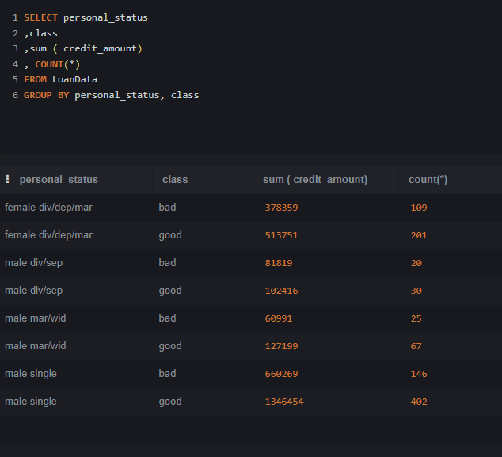

``` sql
SELECT 
    personal_status
    ,SUM (CASE WHEN class = 'good' THEN credit_amount END) AS prestamo_concedido
    ,SUM (CASE WHEN class = 'good' THEN 1 END) AS n_prestamos_concedidos
    ,SUM (CASE WHEN class = 'bad' THEN credit_amount END ) AS prestamo_rechazados
    ,SUM (CASE WHEN class = 'bad' THEN 1 END) AS n_prestamos_rechazados
FROM LoanData
GROUP BY personal_status ;
```

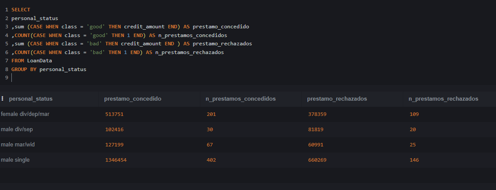

## EJERCICIO 8: Películas de Acción con Alta Valoración

**Tabla:** `imdb_movies`

Obtén un listado de películas de acción de la tabla `imdb_movies` que cumplan todos los criterios siguientes :

1.  **Likes del actor protagonista:** Más de 10.000 likes en Facebook .
2.  **Valoración en IMDb:** Puntuación de al menos 8 sobre 10 .
3.  **Fecha de estreno:** Películas con fecha anterior a 2012 .

``` sql
SELECT 
    movie_title
    , gender
    , imdb_score
    , actor_1_facebook
    , title_year 
FROM imdb_movies
WHERE   
    imdb_movies.actor_1_facebook > 10000
AND imdb_movies.imdb_score >=8
AND imdb_movies.title_year < 2012
AND imdb_movies.gender LIKE '%Action%' ;
```

## 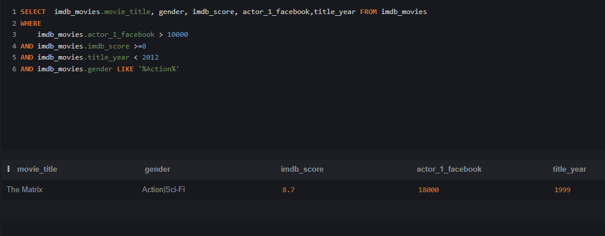

## EJERCICIO 9: Top 20 Películas por Presupuesto y Beneficio

**Tabla:** `imdb_movies`

Usando la tabla `imdb_movies`, obtén las 20 películas junto a su género en cada uno de los siguientes rankings :

- **Mayor presupuesto:** Las 20 películas con el presupuesto más elevado y el género al que pertenecen .
- **Mayor beneficio:** Las 20 películas con el mayor beneficio obtenido y el género al que pertenecen .

``` sql
SELECT 
    movie_title
    , gender AS genero
    , budget AS presupuesto
    , gross AS beneficio
FROM imdb_movies
ORDER BY budget DESC 
LIMIT 20 ;
```

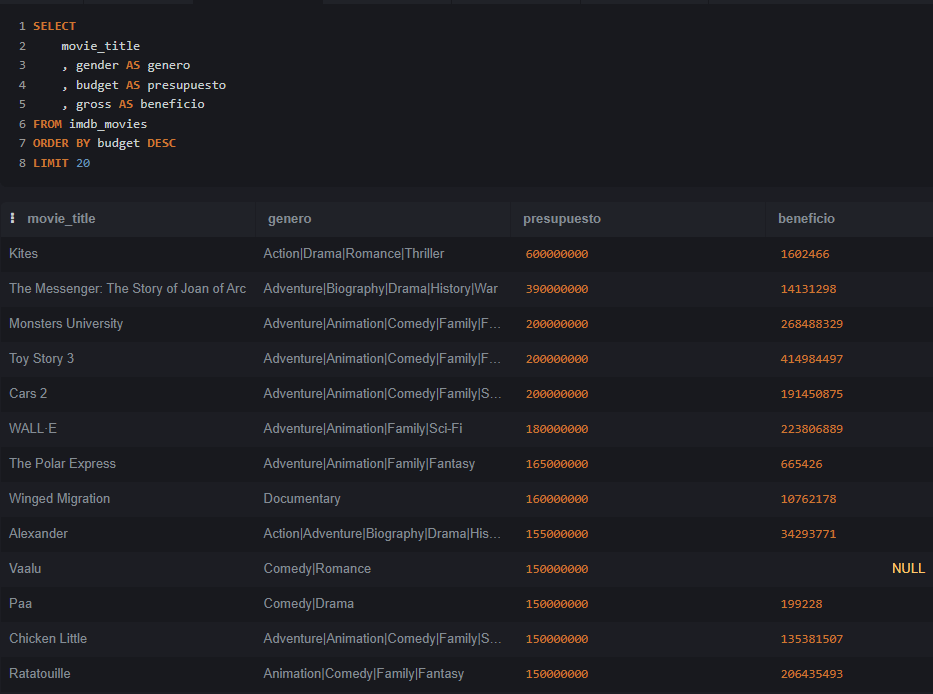

``` sql
SELECT 
    movie_title
    , gender AS genero
    , budget AS presupuesto
    , gross AS beneficio
FROM imdb_movies
ORDER BY gross DESC 
LIMIT 20 ;
```

------------------------------------------------------------------------

## Propuesta Adicional: ¡Regala un Ejercicio a tus Compañeros!

Como parte de esta práctica individual, cada estudiante deberá crear y proponer un ejercicio SQL original para compartir con el resto de la clase .

- **Sé creativo:** Diseña una consulta interesante y retadora usando cualquiera de las tablas trabajadas .
- **Comparte y aprende:** El intercambio de ejercicios enriquece el aprendizaje colectivo y refuerza los conceptos.

------------------------------------------------------------------------

## Ejercicios de los Alumnos:

Usando la tabla fortune:

Clasifica las empresas en tres categorías según su número de empleados (Employees):

- Pequeña: Menos de 10.000 empleados.

- Mediana: Entre 10.000 y 50.000 empleados.

- Grande: Más de 50.000 empleados.

Muestra para cada categoría el número total de empresas, el beneficio total acumulado y el beneficio medio.

Filtra únicamente las empresas del sector *Financials* que pertenezcan a la industria *Commercial Banks* o *Diversified Financials*, Y cuyo volumen de ingresos (Revenue) sea superior a 20.000 millones.

``` sql
SELECT 
    CASE 
        WHEN Employees < 10000 THEN 'Pequeña (<10k)'
        WHEN Employees BETWEEN 10000 AND 50000 THEN 'Mediana (10k-50k)'
        WHEN Employees > 50000 THEN 'Grande (>50k)'
    END AS tamano_empresa,
    COUNT(*) AS total_empresas,
    ROUND(SUM(Profits),1) AS beneficio_total,
    ROUND(AVG(Profits),1) AS beneficio_medio

FROM fortune

WHERE Sector = 'Financials' 
  AND Industry IN ('Commercial Banks', 'Diversified Financials') 
  AND Revenue > 20000
  
GROUP BY 
    CASE 
        WHEN Employees < 10000 THEN 'Pequeña (<10k)'
        WHEN Employees BETWEEN 10000 AND 50000 THEN 'Mediana (10k-50k)'
        WHEN Employees > 50000 THEN 'Grande (>50k)'
    END
ORDER BY beneficio_medio DESC;
```

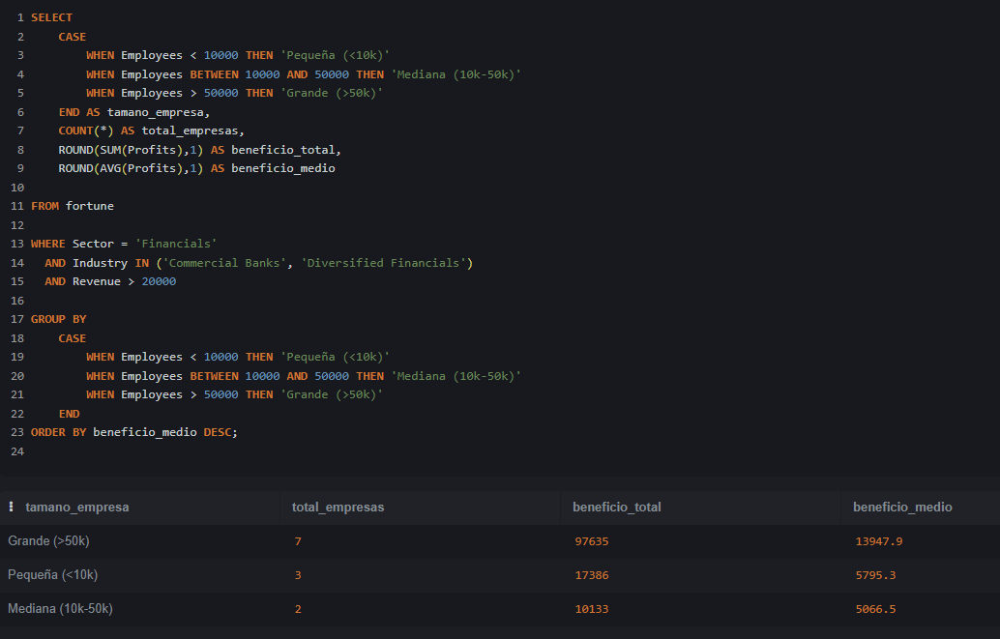

------------------------------------------------------------------------

Usando la tabla jamesbond:

¿Cuales son las 5 películas de James Bond con mayor margen sobre ingresos (% del beneficio)? Indicar película, director, actor y margen.

Antes de poder hacer esta query tenemos que explicar la fórmula del margen ya que no esperamos que el alumno la conozca:

La lógica del Margen (El "quesito" de las ganancias): El margen sobre ingresos responde a esta pregunta sencilla: "De cada 100 € que entran por taquilla, ¿cuántos euros nos quedan limpios en el bolsillo?"

Si analizamos Dr. No:

- Ingresos (Boxoffice): 448,8 M€ (este es el 100% del dinero recaudado)

- Gasto (Budget): 7,0 M€ (lo que costó hacerla)

- Beneficio (Profit): 441,8 M€ (lo que queda limpio)

Si repartimos la tarta de esos 448,8 M€ recaudados:

- Tan solo el 1,56% de la recaudación sirvió para cubrir los costes de producción ($7 / 448,8$).

- El 98,44% restante ($441,8 / 448,8$) es beneficio puro.

En resumen: De cada 100 € que la gente se gastó en el cine para ver la película, 1,56 € sirvieron para pagar el presupuesto y 98,44 € fueron ganancia neta. De ahí sale ese 98,44%.

Si expresamos esto en una fórmula para poder aplicarlo a cada observación: $\frac{(\text{recaudación} - \text{coste}) \times 100}{\text{recaudación}}$

Otras formas de analizar el beneficio:

**Rentabilidad sobre el gasto (ROI)** o el **multiplicador de la inversión**:

|  |  |  |  |
|------------------|------------------|------------------|------------------|
| **Métrica** | **¿Qué pregunta responde?** | **Cálculo en Dr. No** | **Resultado** |
| **Margen sobre Ingresos** | De lo recaudado, ¿qué % es beneficio? | $441,8 / 448,8 \times 100$ | **98,44%** |
| **Rentabilidad (ROI)** | Del dinero invertido, ¿qué % hemos ganado? | $441,8 / 7,0 \times 100$ | **6.311%** |
| **Multiplicador** | ¿Por cuánto se multiplicó el presupuesto? | $448,8 / 7,0$ | **64,1 veces** |

``` sql
SELECT 
film
, director
, boxoffice
, budget
, round ((boxoffice - budget),0) as profit 
, round ((((boxoffice - budget)*100) /boxoffice),2)  as margen
FROM jamesbond
ORDER BY  margen DESC
LIMIT 5 ;
```

------------------------------------------------------------------------

Usando la tabla LoanData: Calcular la cantidad de créditos concedidos según hombres y mujeres, clasificados por tres grupos de edad: menos de 30 años, de 30 a 40 años y más de 40 años

Selecciona sólo aquellos que tienen un coche en propiedad y viven en la casa propia.

``` sql
SELECT 
    CASE 
        WHEN age <30 THEN '<30' 
        WHEN age <=40 THEN '30>=40' 
        ELSE '>40' 
    END AS grupo 
    ,COUNT(CASE WHEN class = 'good' THEN 1 END) AS concecidos 
    ,COUNT(CASE WHEN class = 'bad' THEN 1 END) AS denegados 
FROM LoanData 
WHERE housing = 'own' 
    AND property_magnitu = 'car' 
GROUP BY 
    CASE WHEN age <30 THEN '<30' 
         WHEN age <=40 THEN '30>=40' 
         ELSE '>40' 
    END  ;
```

------------------------------------------------------------------------

Tabla: gobierno_paro Muestra la cantidad de hombres y mujeres, entre 25 y 45 años de Galicia que están de paro desde marzo de 2018 y cuántos de ellos son del municipio 'Lugo'.

*NOTA: al importar la tabla los hombres de 25 a 45 años aparecen como ¨paro_hombre_edad_10¨ y las mujeres de 25 a 45 años aparecen como ¨paro_mujer_edad_13¨*

``` sql
SELECT 
    SUM(paro_hombre_edad_10) AS hombres25a45
  , SUM(paro_mujer_edad_13) AS mujeres25a45
  , sum (CASE WHEN municipio = 'Lugo' THEN paro_hombre_edad_10 END) aS hombres25a45_LugoMun
  , sum (CASE WHEN municipio = 'Lugo' THEN paro_mujer_edad_13 END) aS mujeres25a45_LugoMun
FROM gobierno_paro
WHERE 
    comunidad_autono = 'Galicia'
    AND codigo_mes >=201803 ;
```

------------------------------------------------------------------------

Utilizando la tabla bitcoin_daily_rates_formatdate

Analiza las cotizaciones desde el año 2016.

Para cada año muestra:

- Número de días analizados.

- Número de días alcistas, cuando Close es mayor que Open.

- Número de días bajistas, cuando Close es menor que Open.

- Número de días sin variación, cuando Close es igual a Open.

- Valor medio de cierre.

- Cotización máxima anual del campo High.

- Cotización mínima anual del campo Low.

Muestra solamente los años que contengan al menos 50 días de datos y ordénalos cronológicamente.

``` sql
SELECT  
    count(DISTINCT bitcoin_daily_rates_formatdate.date) as dias
    ,SUM(CASE WHEN close > bitcoin_daily_rates_formatdate.open THEN 1 end) as alcistas
    ,SUM(CASE WHEN close < bitcoin_daily_rates_formatdate.open THEN 1 end) as bajistas
    ,SUM(CASE WHEN close = bitcoin_daily_rates_formatdate.open THEN 1 end) as no_variacion
    ,max (high) as cotizacion_maxima
    ,min (low) as cotizacion_minima 
    ,round(avg(close),2) as media_cierre
FROM bitcoin_daily_rates_formatdate
WHERE date > '2016-00-00'
group by STRFTIME('%Y', date) 
having count(DISTINCT bitcoin_daily_rates_formatdate.date) >=50
ORDER BY bitcoin_daily_rates_formatdate.date ;
```

------------------------------------------------------------------------

Obten de la tabla ‘jamesbond’:

Las películas de Sean Connery con una recaudación de taquilla de la siguiente manera:  - Mayor a 800=Recaudación_exitosa,

- entre 800 y 500=Recaudación_normal y

- menor a 500=Recaudación_baja

``` sql
SELECT film
,CASE WHEN  boxoffice >800 THEN 'exito'
 WHEN boxoffice between 500 and 800 THEN 'normal' 
 WHEN boxoffice < 500 THEN 'baja'
 END
 ,boxoffice
FROM jamesbond
WHERE actor= 'Sean Connery' ;
```

| Utilizando la tabla fortune, |
|:-----------------------------------------------------------------------|
| Utilizando la tabla videogames_games: |
| Crea una consulta que muestre el nombre del videojuego, su plataforma, sus ventas en Europa y una columna nueva llamada categoría_éxito usando las siguientes condiciones : -superventas si son mayores a 3.0 millones -exitoso si están entre 1.0 y 3.0millones -venta moderada si son menor de 1.0 millones muestra únicamente el top15 de juegos con mayor venta en Europabetw |
| `sql select videogames_games.name , platform_code , eu_sales ,case WHEN eu_sales >3 THEN 'SUPERVENTAS' WHEN eu_sales BETWEEN 1 AND 3 THEN 'EXITOSO' WHEN eu_sales <1 THEN 'VENTA MODERADA' END as categoria_exito from videogames_games ORDER BY eu_sales DESC LIMIT 15` |

Utilizando la tabla videogames_games:

Queremos saber el nombre los videojuegos y plataforma que tuvieron mayor número de ventas global según su generación:

- Gen Y: Juegos lanzados entre 1989 y 1996.

- Gen Z: Juegos lanzados entre 1997 y 2012.

- Gen Alfa: Juegos lanzados a partir de 2013.

``` sql
select 
  name
, platform_code
, max(round(eu_sales + na_sales + jp_sales + other_sales, 2)) as total_ventas
,case 
  WHEN YEAR BETWEEN 1989 AND 1996 THEN 'GEN Y' 
  WHEN YEAR BETWEEN 1997 AND 2012 THEN 'GEN Z' 
  WHEN YEAR >2013 THEN 'GEN ALPHA' 
END as generacion
from videogames_games
group by 
  case 
    WHEN YEAR BETWEEN 1989 AND 1996 THEN 'GEN Y' 
    WHEN YEAR BETWEEN 1997 AND 2012 THEN 'GEN Z' 
    WHEN YEAR >=2013 THEN 'GEN ALPHA' 
  END 

ORDER BY eu_sales + na_sales + jp_sales + other_sales desc
```

::: nota-importante
Esta consulta solo va a funcionar en SQLite, dará error en los otros motores ya que los campos name y platform_code no están incluidos en la agregación y por lo tanto son 'bare columns' como ya vimos.

PostgreSQL, SQL Server y Oracle:

Darán ERROR. El estándar de SQL (ANSI SQL) exige estrictamente que cualquier columna que no esté dentro de una función de agregación (como MAX, SUM) DEBE estar en la cláusula GROUP BY. Al ver name y platform_code fuera del GROUP BY, la consulta directamente no se ejecutará.

MySQL:

Por defecto (con la regla ONLY_FULL_GROUP_BY activada desde MySQL 5.7), también te dará un error.

Si la regla está desactivada, la consulta se ejecutará pero te devolverá valores aleatorios/indeterminados para name y platform_code (no necesariamente los del juego con el máximo de ventas).

SQLite (Tu caso actual):

SQLite tiene una excepción documentada: cuando usas MAX() o MIN() sobre columnas no agrupadas, garantiza que los demás campos extraídos (name, platform_code) pertenezcan a la misma fila donde se encontró ese máximo. Es cómodo para prototipar, pero te genera "malos hábitos" si luego migras a PostgreSQL u otros.

Conseguir el mismo resultado en mySQL puede complicarse mucho y requiere funciones ventana que aún no hemos estudiado:

``` sql
WITH juegos_clasificados AS (
    SELECT 
        name,
        platform_code,
        ROUND(eu_sales + na_sales + jp_sales + other_sales, 2) AS total_ventas,
        CASE 
            WHEN year BETWEEN 1989 AND 1996 THEN 'GEN Y' 
            WHEN year BETWEEN 1997 AND 2012 THEN 'GEN Z' 
            WHEN year >= 2013 THEN 'GEN ALPHA' 
        END AS generacion,
        -- Numeramos los juegos de 1 a N dentro de cada generación, ordenados por ventas
        ROW_NUMBER() OVER (
            PARTITION BY 
                CASE 
                    WHEN year BETWEEN 1989 AND 1996 THEN 'GEN Y' 
                    WHEN year BETWEEN 1997 AND 2012 THEN 'GEN Z' 
                    WHEN year >= 2013 THEN 'GEN ALPHA' 
                END
            ORDER BY (eu_sales + na_sales + jp_sales + other_sales) DESC
        ) AS posicion
    FROM videogames_games
)
SELECT 
    name,
    platform_code,
    total_ventas,
    generacion
FROM juegos_clasificados
WHERE posicion = 1 AND generacion IS NOT NULL
ORDER BY total_ventas DESC;
```
:::

Más ejercicios desde internet:

<https://datalemur.com/questions/matching-skills>

``` sql
SELECT candidate_id
FROM candidates
WHERE skill IN ('Python', 'Tableau', 'PostgreSQL')
GROUP BY candidate_id
HAVING COUNT(skill) = 3
ORDER BY candidate_id;
```

<https://datalemur.com/questions/sql-page-with-no-likes>

``` sql
SELECT page_id 
FROM pages
WHERE page_id NOT IN  (SELECT page_id FROM page_likes) ;
```

| <https://datalemur.com/questions/tesla-unfinished-parts> |
|:-----------------------------------------------------------------------|
| <https://datalemur.com/questions/laptop-mobile-viewership> |
| `sql SELECT SUM(CASE WHEN device_type IN ('tablet','phone') THEN 1 END) AS 'mobile_views' ,SUM(CASE WHEN device_type = 'laptop' THEN 1 END) AS 'laptop_views' FROM viewership;` |

<https://datalemur.com/questions/sql-average-post-hiatus-1>

::: nota
nota: MySQL o PostGre no usan las fechas como SQLite, así que tendrás que goglear como se usan las fechas en una de esas variantes, por ejemplo para mySQL: Calcular diferencia en días usa la función DATEDIFF() Ejemplo: Resta la segunda fecha de la primera y da el total de días:SELECT DATEDIFF('2026-12-31', '2026-12-25');year Extraer el año de una fecha usa la función YEAR() Ejemplo: SELECT YEAR('07/10/2021 12:00:00')
:::

``` sql
SELECT 
    user_id
    ,DATEDIFF(max(post_date),min(post_date)) as days_between
FROM posts 
where YEAR(post_date) = 2021
group by user_id
having count(*) >1;
```

<https://datalemur.com/questions/teams-power-users>

NOTA, esta require subqueries que no hemos dado aún. <https://datalemur.com/questions/sql-histogram-tweets>

``` sql
select 
   t.posts as tweet_bucket ,count(*) as users_num 
   from ( SELECT count (*) as posts 
   FROM tweets where year(tweet_date) =2022 group by user_id ) as t group by posts 
```
:::::