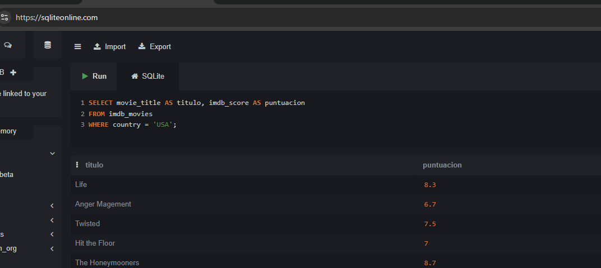
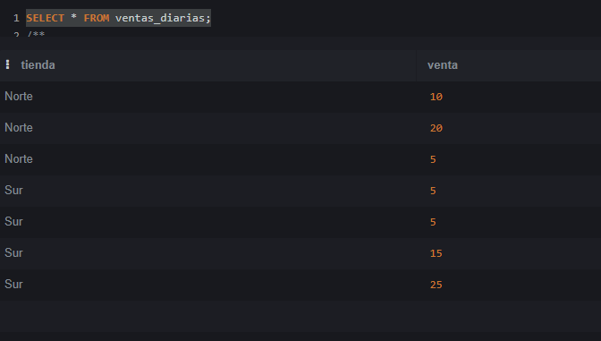
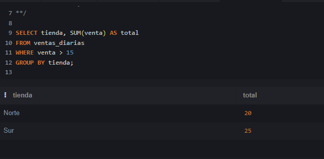
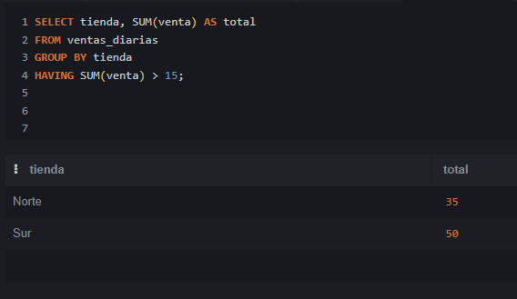
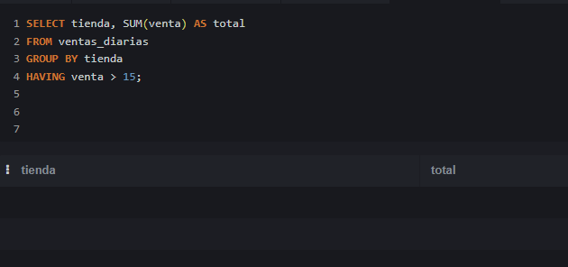

En este capítulo abordaremos la base común a todas las variantes de SQL. Aunque cada SGBD tiene sus particularidades, la sintaxis fundamental es universal. Para los ejemplos prácticos utilizaremos datasets reales de películas (`imdb_movies.csv`) y de salud mundial (`world_health_org.csv`).

Para empezar, antes de usar un gestor de bases de datos vamos a usar la web <https://sqliteonline.com/>

------------------------------------------------------------------------

# La Estructura Básica y el Uso de Alias (`SELECT`, `FROM`, `WHERE`, `AS`)

Toda consulta relacional parte de tres pilares:

\* **`SELECT`**: Define qué columnas queremos recuperar.

\* **`FROM`**: Especifica la tabla origen de los datos.

\* **`WHERE`**: Filtra las filas según una condición lógica.

## Los Alias (`AS`) y el orden de ejecución

Podemos renombrar temporalmente las columnas o las tablas usando la palabra clave `AS` para que los resultados sean más legibles.

``` sql
SELECT movie_title AS titulo, imdb_score AS puntuacion 
FROM imdb_movies 
WHERE country = 'USA';
```

> **¡Uso de alias en el WHERE!**\
> Podrías pensar que si has llamado `puntuacion` a la columna, puedes usarla en el `WHERE` así: `WHERE puntuacion > 8.0`. **Esto dará error**.\
> El motor SQL ejecuta las instrucciones en este orden: `FROM` $\rightarrow$ `WHERE` $\rightarrow$ `SELECT`. Cuando el motor está evaluando el `WHERE`, todavía no ha llegado al `SELECT`, por lo que **aún no sabe que ese alias existe**. En el `WHERE` siempre debes usar el nombre original de la columna.



# Operadores Lógicos y de Comparación

Disponemos de operadores como `=`, `!=` (o `<>`), `>`, `<`, `>=`, `<=` y `BETWEEN` (que es inclusivo).

## Operadores en campos no numéricos (Texto y Fechas)

Los operadores de comparación no se limitan a números. Si los usamos con texto o fechas, SQL aplica un orden lexicográfico (alfabético) o cronológico.

## El Operador `BETWEEN` (Rangos inclusivos)

El operador `BETWEEN` se utiliza en la cláusula `WHERE` para filtrar datos que caen dentro de un rango específico. Es muy versátil porque se puede aplicar a números, textos y fechas.

**Regla fundamental de Inclusión:** `BETWEEN` es **completamente inclusivo**. Esto significa que los valores que defines como límite inferior (el de la izquierda) y límite superior (el de la derecha) **sí se incluyen** en los resultados.

Escribir `columna BETWEEN valor_A AND valor_B` es matemáticamente y lógicamente equivalente a escribir: `columna >= valor_A AND columna <= valor_B`.

``` sql
-- Este ejemplo INCLUYE las películas que duran exactamente 90 minutos y también las de 120 minutos.
SELECT movie_title, duration 
FROM imdb_movies 
WHERE duration BETWEEN 90 AND 120;
```

> **¡Trampas comunes con `BETWEEN`!**
>
> 1.  **El orden estricto de los límites:** Siempre debes poner primero el valor más pequeño y luego el más grande. Si por error escribes `WHERE duration BETWEEN 120 AND 90`, el motor SQL buscará valores que sean mayores o iguales a 120 y, al mismo tiempo, menores o iguales a 90. Como esto es imposible, te devolverá cero resultados, ¡y lo peor es que no te dará ningún error de sintaxis para avisarte!
>
> 2.  **El peligro invisible de las fechas con horas (Datetimes):** Si tu columna guarda fecha y hora (por ejemplo, `2026-06-15 14:30:00`), usar `BETWEEN '2026-06-01' AND '2026-06-15'` te dará un susto. SQL traduce la última fecha a `'2026-06-15 00:00:00'` (la medianoche exacta). Por lo tanto, cualquier registro del día 15 que haya ocurrido a las 00:00:01 o más tarde, **quedará excluido**. Para incluir el día 15 completo, el estándar profesional es abandonar `BETWEEN` y usar: `WHERE fecha >= '2026-06-01' AND fecha < '2026-06-16'`.
>
> 3.  El comportamiento de `BETWEEN` con cadenas de texto (Strings)
>
>     Aquí es donde la regla de inclusión de `BETWEEN` choca con el **orden lexicográfico** (alfabético) de las bases de datos. -- Buscar países cuyo nombre empiece por letras entre la 'A' y la 'C'
>
>     ``` sql
>     SELECT Country 
>     FROM world_health_org 
>     WHERE Country BETWEEN 'A' AND 'D'; 
>     -- Nota: 'D' se usa como límite superior para incluir a todos los países con 'C'.
>     ```
>
>     Cuando SQL compara textos, lo hace letra por letra, exactamente igual que si estuviera ordenando palabras en un diccionario. El texto `'C'` (una sola letra) es estrictamente menor que el texto `'Canada'`. ¿Por qué? Porque la palabra "Canada" tiene más letras después de la 'C'. En el diccionario interno de SQL, `'Canada'` va *después* de `'C'` pero *antes* de `'D'`.
>
>     Si escribiéramos lo que dicta la intuición:
>
>     ``` sql
>     WHERE Country BETWEEN 'A' AND 'C'
>     ```
>
>     El motor SQL incluirá a "Argentina" y "Bolivia", pero cuando evalúe "Canada", "Chile" o "Colombia", el sistema dirá: *"Un momento, estas palabras son mayores que 'C' (están más adelante en el alfabeto), así que quedan fuera"*. El único país con la letra C que pasaría el filtro sería uno que se llamase literalmente "C", a secas.
>
>     **Por eso el límite superior se establece en 'D':** Al poner `BETWEEN 'A' AND 'D'`, el límite superior es exactamente el carácter 'D'. \* "Canada" se incluye porque alfabéticamente es menor que 'D'. \* "Colombia" se incluye porque alfabéticamente es menor que 'D'. \* "Denmark" (Dinamarca) **queda excluido** porque "Denmark" tiene más letras y, por tanto, es mayor que 'D' a secas. \* El único país con 'D' que se colaría en los resultados sería uno que se llamase exactamente "D".
>
>     > **La alternativa profesional (y menos confusa):** Aunque el truco de `BETWEEN 'A' AND 'D'` funciona para atrapar todo lo que empieza por A, B y C, suele generar esta misma confusión que has tenido tú al leerlo. Por eso, para evitar malentendidos, en entornos profesionales se suele preferir usar operadores matemáticos o comodines para los textos:
>     >
>     > ``` sql
>     > -- Opción 1: Desigualdad (Mucho más claro a la hora de leer el código)
>     > WHERE Country >= 'A' AND Country < 'D';
>     >
>     > -- Opción 2: El uso de LIKE (Más explícito si son pocas letras)
>     > WHERE Country LIKE 'A%' OR Country LIKE 'B%' OR Country LIKE 'C%';
>     > ```

*Si fuera una fecha: `WHERE fecha_estreno > '2020-01-01'` traería las películas posteriores a esa fecha.*

## Las trampas lógicas (`NOT`, `AND`, `OR` y `NULL`)

1.  **El peligro de los nulos con `NOT`:** El valor `NULL` en SQL significa "desconocido". Si evalúas `WHERE NOT (Adult_literacy_rate = 96.7)`, las filas con `NULL` **desaparecerán**. Cualquier comparación directa con un nulo da como resultado nulo, y el `WHERE` solo deja pasar lo que es estrictamente `TRUE`. Para trabajar con nulos hay que usar `IS NULL` o `IS NOT NULL`.

2.  **La prioridad de `AND` sobre `OR`:** Si mezclas ambos sin paréntesis: `WHERE country = 'USA' OR country = 'UK' AND duration > 120`, el motor evaluará primero el `AND`.\
    Esto significa: *"Tráeme cualquier película de USA (dure lo que dure) O BIEN películas de UK que duren más de 120 min"*.\
    **Solución:** Usa siempre paréntesis para forzar la lógica que deseas: `WHERE (country = 'USA' OR country = 'UK') AND duration > 120`.

::: nota
La trampa de los tipos de datos en SQLite:

En esta tabla tenemos un actor cuyo salario es 'NA' (como cadena de texto, no un nulo) 

Si quiero seleccionar aquellas filas donde el salario no sea desconocido y uso esta condición mi filtro falla: 

¿Por qué `"NA" > 0` es verdadero?

En motores estrictos (como PostgreSQL o SQL Server), intentar comparar texto puro como `"NA"` con un número `0` te devolvería un error de sintaxis o de conversión. Sin embargo, SQLite utiliza un sistema de **tipado dinámico**, lo que significa que es extremadamente permisivo e intenta resolver la comparación basándose en una jerarquía de clases de almacenamiento.

Cuando comparas distintos tipos de datos, SQLite los ordena de menor a mayor siguiendo esta regla estricta: `NULL` \< `NÚMEROS (Integer/Real)` \< `TEXTO` \< `BLOB`

**¿Qué pasa exactamente en la consulta `WHERE bondactorsalary > 0`?**

1\. El campo `bondactorsalary` es de tipo `TEXT`.

2\. Al evaluar las filas, si SQLite detecta un número en formato texto (por ejemplo `"-5"`), es lo bastante inteligente como para convertirlo a número temporalmente y evaluar `-5 > 0` (lo cual es Falso, y queda excluido).

3\. Sin embargo, cuando llega a la fila con el valor `"NA"`, intenta convertirlo a número y falla, por lo que **lo deja como `TEXTO`**.

4\. Al hacer la comparación final, se enfrenta a la pregunta: *¿Es el `TEXTO` ("NA") mayor que el `NÚMERO` (0)?* Según la jerarquía de SQLite mencionada arriba, **cualquier texto siempre es estrictamente mayor que cualquier número**.

5\. Por lo tanto, `"NA" > 0` se evalúa como **Verdadero (`TRUE`)**, y esa fila se cuela en tus resultados a pesar de ser texto.

> **¿Cómo solucionarlo y hacer la consulta segura?** Para forzar a SQLite a evaluar todo matemáticamente y evitar que las cadenas de texto puro se cuelen en filtros numéricos, debes castear (convertir) explícitamente la columna. En SQLite, si fuerzas un texto como `"NA"` a número, se convierte en `0`, lo que permite que tu filtro funcione como esperabas, pero cuidado, porque esto no va a ser así en todos los motores
>
> ``` sql
> -- Forma correcta de filtrar excluyendo textos no numéricos
> WHERE CAST(bondactorsalary AS REAL) > 0;
> ```

¿Por qué `CAST('texto' AS REAL)` se convierte en `0` y no en `NULL` en SQLite?

Cuando haces un `CAST` explícito de texto a número en SQLite, el motor nunca devuelve `NULL` (a menos que el valor original ya fuera `NULL`). En lugar de eso, o te da un número, o te da un `0`. Esto se debe a su **"Regla del Prefijo"**:

1.  **Lectura de izquierda a derecha:** Cuando SQLite intenta convertir un texto a número (ya sea `INTEGER` o `REAL`), empieza a leer la cadena de texto desde el primer carácter de la izquierda.
2.  **Extracción de números:** Toma todos los caracteres válidos que formen un número y **descarta todo lo demás**.
    - `CAST('120usd' AS INTEGER)` se convierte en `120`.
    - `CAST('3.14espacio' AS REAL)` se convierte en `3.14`.
3.  **El caso de 'NA' (Fallo de conversión):** Si SQLite empieza a leer de izquierda a derecha y el *primer* carácter ya no es un número (como en la palabra `"NA"`, o `"Hola"`), no puede extraer ningún prefijo numérico. En lugar de detener la consulta con un error o devolver `NULL`, **la especificación oficial de SQLite dicta que el resultado por defecto ante un fallo de conversión siempre es `0` (o `0.0`)**.

**¿Por qué no usa `NULL`?** En la lógica de bases de datos, `NULL` significa estrictamente *"Ausencia de valor"* (desconocido). Sin embargo, `"NA"` sí es un valor conocido (es un texto explícito). Como el motor no puede convertir ese texto a matemáticas, asume el valor matemático nulo por defecto: el cero.

> **¡Cuidado con la media (AVG)!** Esto es muy peligroso si estás calculando promedios. Si tus textos `"NA"` se convierten en `0` silenciosamente, tu denominador será mayor y el promedio final bajará artificialmente.
>
> Si realmente quieres que los textos inválidos sean ignorados en matemáticas, tienes que convertirlos a `NULL` usando `NULLIF` o un `CASE WHEN`:
>
> ``` sql
> -- Esto convierte el texto 'NA' explícitamente en NULL real, 
> -- por lo que las funciones matemáticas (SUM, AVG) simplemente lo ignorarán.
> SELECT AVG(CAST(NULLIF(bondactorsalary, 'NA') AS REAL)) FROM jamesbond;
> ```
:::

# Valores Únicos (`DISTINCT`)

Si queremos saber qué continentes distintos hay en nuestra tabla, un `SELECT Continent` nos devolverá cientos de filas repetidas. `DISTINCT` elimina los duplicados del conjunto de resultados.

``` sql
SELECT DISTINCT Continent 
FROM world_health_org;
```

# Ordenación y Límites (`ORDER BY`, `LIMIT`)

- **`ORDER BY`**: Ordena por una o varias columnas de forma ascendente (`ASC`, por defecto) o descendente (`DESC`).
- **`LIMIT`**: Restringe el número de filas devueltas. (En SQL Server se usa `TOP`).

> **¡Trampa del LIMIT huérfano!**\
> Si ejecutas `SELECT movie_title FROM imdb_movies LIMIT 5;` sin usar `ORDER BY`, **el resultado es no determinista**. El motor te devolverá las primeras 5 filas que encuentre en la memoria o en el disco duro en ese microsegundo. Puede que hoy te devuelva unas películas y mañana otras distintas. **Regla de oro: Nunca uses `LIMIT` sin acompañarlo de un `ORDER BY`** si quieres resultados consistentes.

``` sql
-- Forma correcta de obtener el "Top 5"
SELECT movie_title, budget 
FROM imdb_movies 
ORDER BY budget DESC 
LIMIT 5;
```

# Lógica Condicional

## (`CASE WHEN`)

`CASE WHEN` permite crear nuevas columnas evaluando condiciones fila a fila.

> **¡Trampa de la ejecución en cascada (Cortocircuito)!**\
> El `CASE` evalúa las condiciones de arriba a abajo y **se detiene en la primera que resulta verdadera (TRUE)**. El orden importa muchísimo.

Observa este ejemplo MAL diseñado:

``` sql
SELECT movie_title, imdb_score,
    CASE 
        WHEN imdb_score >= 5.0 THEN 'Aprobada'
        WHEN imdb_score >= 8.0 THEN 'Obra Maestra' -- ¡ESTO NUNCA SE EJECUTARÁ!
        ELSE 'Suspenso'
    END AS categoria
FROM imdb_movies;
```

Una película con puntuación `9.0` cumple la primera condición (`>= 5.0`), así que SQL le asignará 'Aprobada', sale del `CASE` y la línea de 'Obra Maestra' jamás llegará a evaluarse. **Siempre debes ordenar del caso más restrictivo al más general.**

``` sql
-- Forma correcta
SELECT movie_title, imdb_score,
    CASE 
        WHEN imdb_score >= 8.0 THEN 'Obra Maestra'
        WHEN imdb_score >= 5.0 THEN 'Aprobada'
        ELSE 'Suspenso'
    END AS categoria
FROM imdb_movies;
```

## Lógica condicional rápida: `IF` e `IIF`

A diferencia del clásico bloque `if (condicion) { ... } else { ... }` o los operadores ternarios (`condicion ? verdadero : falso`) tan comunes en lenguajes como C# y JavaScript, o la función `ifelse()` de R, el lenguaje SQL estándar fue diseñado principalmente en torno a la estructura `CASE WHEN` que ya hemos visto.

Sin embargo, escribir un `CASE WHEN` completo puede ser tedioso cuando solo necesitas evaluar una condición binaria rápida (verdadero o falso). Para solucionar esto, varios motores de bases de datos han introducido funciones de conveniencia de una sola línea, aunque **no son un estándar universal**.

**La función `IF()` (Exclusiva de MySQL y MariaDB)** En MySQL, puedes usar la función `IF` que recibe tres parámetros: la condición, el valor si es verdadera y el valor si es falsa.

``` sql
-- Ejemplo en MySQL
SELECT 
    movie_title,
    duration,
    IF(duration > 120, 'Larga', 'Estándar') AS categoria_duracion
FROM imdb_movies;
```

**La función `IIF()` (SQL Server, SQLite, Access)** Otros motores implementaron exactamente la misma idea, pero bajo el nombre `IIF` (Immediate IF). Afortunadamente, SQLite (desde su versión 3.32.0) y SQL Server comparten esta sintaxis.

``` sql
-- Ejemplo en SQLite y SQL Server
SELECT 
    Country,
    Population_in_th,
    IIF(Population_in_th > 50000, 'Alta Población', 'Baja Población') AS tipo_poblacion
FROM world_health_org;
```

**¿Qué pasa con PostgreSQL y Oracle?** Motores muy apegados al estándar estricto como PostgreSQL no tienen una función `IF()` ni `IIF()` nativa. En estos motores, la única forma oficial de hacer un if/else es utilizar la sintaxis case when

``` sql
-- La alternativa universal (funciona en TODOS los motores, incluyendo SQLite)
SELECT 
    Country,
    Population_in_th,
    CASE 
        WHEN Population_in_th > 50000 THEN 'Alta Población'
        ELSE 'Baja Población'
    END AS tipo_poblacion
FROM world_health_org;
```

> **Consejo de diseño para tus consultas:** Si estás preparando material o consultas que necesitan ejecutarse en diferentes entornos sin romperse, lo más seguro es usar siempre `CASE WHEN`. Si sabes que vas a trabajar exclusivamente dentro de SQLite o SQL Server, usar `IIF()` te ahorrará mucho espacio y hará que el código se lea de forma mucho más directa.

# Agrupación y Funciones de Agregación (`GROUP BY`, `HAVING`)

Las funciones de agregación (`MAX`, `MIN`, `COUNT`, `SUM`, `AVG`) reducen múltiples filas a un solo valor.

## Variantes importantes del `COUNT`

- `COUNT(*)`: Cuenta todas las filas, incluyendo aquellas que tienen todos sus valores nulos.
- `COUNT(columna)`: Cuenta cuántos valores **no nulos** hay en esa columna.
- `COUNT(DISTINCT columna)`: Cuenta cuántos valores **únicos y no nulos** existen en esa columna.

## La regla de oro del `GROUP BY`

Cuando agrupas datos, hay una regla estricta en SQL estándar que genera muchísimos errores de principiante: **Cualquier columna que pongas en el `SELECT` debe estar dentro de una función de agregación (SUM, COUNT...) o debe aparecer explícitamente en la cláusula `GROUP BY`.**

``` sql
-- INCORRECTO: Dará error porque 'Country' no está agrupado ni agregado. (excepto en SQLite y MySQL antiguo)
SELECT 
Continent
, Country
, SUM(Population_in_th) FROM world_health_org 
GROUP BY Continent;

-- CORRECTO
SELECT Continent
, COUNT(CountryID) AS total_paises
, SUM(Population_in_th) AS poblacion_total_miles 
FROM world_health_org 
GROUP BY Continent;
```

:::: nota
**La excepción a la regla: SQLite y MySQL antiguo** En motores como **SQLite** (y versiones anteriores a la 5.7 de MySQL), el código incorrecto **sí se ejecutará sin dar error**. A estas columnas no agrupadas ni agregadas se las conoce técnicamente como *"bare columns"* (columnas desnudas). Lo que hace SQLite es simplemente devolver un valor arbitrario (normalmente el de la última o primera fila que procesa dentro de ese grupo) para la columna `Country`. **Peligro:** Aunque el motor te permita ejecutarlo, es una mala práctica profesional depender de este comportamiento, ya que el dato que te devuelve para esa columna extra es impredecible y no determinista.

### Cómo adaptar las "Bare Columns" a SQL Estándar (SQL Server, PostgreSQL, etc.)

Como vimos, SQLite te permite poner `Country` en el `SELECT` sin agruparlo, devolviéndote un país aleatorio de ese continente. Como los motores estrictos (SQL Server, PostgreSQL, Oracle) no permiten ambigüedades, tienes que decirle explícitamente **qué quieres hacer** con los países de ese continente.

Aquí tienes las tres soluciones equivalentes y estándar, dependiendo de lo que realmente necesites conseguir:

**1. Opción rápida: Usar una agregación básica (MIN / MAX)** Si solo quieres que el motor no dé error y te devuelva *un* país válido de ese grupo (por ejemplo, el primero alfabéticamente), usas `MIN()`.

``` sql
SELECT 
    Continent, 
    MIN(Country) AS un_pais_de_muestra, 
    SUM(Population_in_th) AS poblacion_total_miles 
FROM world_health_org 
GROUP BY Continent;
```

**2. Opción de lista: Concatenar todos los valores (`STRING_AGG`)** Si quieres agrupar la población pero no quieres perder la información de los países, puedes juntarlos todos en una sola celda separados por comas. *(Nota: En PostgreSQL y SQL Server se usa `STRING_AGG`, en MySQL se llama `GROUP_CONCAT`)*.

``` sql
SELECT 
    Continent, 
    STRING_AGG(Country, ', ') AS lista_de_paises, 
    SUM(Population_in_th) AS poblacion_total_miles 
FROM world_health_org 
GROUP BY Continent;
```

::: extra
**El enfoque profesional: Window Functions (esta variante la veremos más adelante)** En el mundo real, cuando alguien escribe esa consulta en SQLite, suele estar intentando buscar **"el país con más población de cada continente"**. Para hacer esto correctamente en SQL estándar sin errores, no usamos un simple `GROUP BY`, usamos funciones de ventana (Window Functions) combinadas con una CTE (Common Table Expression):

``` sql
WITH PaisesClasificados AS (
    SELECT 
        Continent,
        Country,
        Population_in_th,
        -- Esto numera los países (1, 2, 3...) dentro de cada continente, 
        -- ordenándolos de mayor a menor población.
        ROW_NUMBER() OVER(PARTITION BY Continent ORDER BY Population_in_th DESC) AS ranking
    FROM world_health_org
)
SELECT 
    Continent, 
    Country AS pais_mas_poblado, 
    Population_in_th
FROM PaisesClasificados
WHERE ranking = 1; -- Filtramos para quedarnos solo con el número 1 de cada continente
```
:::
::::

## `WHERE` vs `HAVING`

¿Qué pasa si queremos mostrar solo los continentes que tengan más de 20 países? No podemos usar `WHERE COUNT(CountryID) > 20` porque el `WHERE` actúa **antes** de que se hagan las agrupaciones.\
Para filtrar datos **después** de agruparlos, usamos `HAVING`. La clausula que usemos en el Having debe ser una función de agregación (COUNT, SUM, AVG...) o una columna que esté en el `GROUP BY`.

``` sql
SELECT Continent, COUNT(CountryID) AS total_paises 
FROM world_health_org 
GROUP BY Continent 
HAVING COUNT(CountryID) > 20;
```

### El orden de ejecución: `WHERE` vs `HAVING`

Where se aplica como filtro a los registros ANTES de que se produzcan los cálculos de agregación. Having se aplica como filtro a los resultados de la agregación, después de que se han agrupado los datos.

Observa esta sencilla tabla:



veamos que pasa si ponemos la condicion de que las ventas sean mayores de 15 en el where:\


Ahora veamos que pasa si la condición en la cláusula HAVING, como ya hemos dicho, para usarla correctamente en el having, tenemos que usar el valor agregado, en este caso suma:\


Qué pasa si usamos la condición en el HAVING pero sin la función de agregación?\
\
En este caso no obtenemos ningún resultado, pero esto puede variar dependiendo del orden de los valores en la tabla, por lo que está totalmente desaconsejado usar condiciones en el having así. En la siguiente nota se explica con más detalle.\

::: nota
### El peligro de las "Bare Columns" en el HAVING

Un error muy común al empezar con SQL es confundir dónde poner las condiciones: ¿en el `WHERE` o en el `HAVING`? Aunque a veces parezca que dan el mismo resultado, funcionan en momentos completamente distintos de la ejecución de la consulta.

El caso de los salarios de "Roger Moore" es el ejemplo perfecto para entender la diferencia. Si revisamos sus datos en crudo, vemos que tiene varias películas donde el salario es `'NA'` y otras dos donde sí cobró (7.8 y 9.1).


**Correcto: Usando `WHERE`**

``` sql
SELECT actor, round(sum(bondactorsalary),1)
FROM jamesbond
WHERE bondactorsalary <> 'NA'
GROUP BY actor
ORDER BY round(sum(bondactorsalary),1) DESC
```


El `WHERE` actúa como un **portero de discoteca**. Filtra las filas individuales *antes* de que se agrupen.

1\. El motor lee todas las filas de Roger Moore.

2\. El `WHERE` elimina inmediatamente las filas que tienen `'NA'`.

3\. Solo pasan las filas con `7.8` y `9.1`.

4\. El `GROUP BY` junta esas dos filas supervivientes y el `SUM()` da el resultado correcto: `16.9`.

**La trampa: Usando la condición en el `HAVING` (y por qué desaparece el actor)**

``` sql
SELECT actor, round(sum(bondactorsalary),1)
FROM jamesbond
GROUP BY actor
HAVING bondactorsalary <> 'NA'
ORDER BY round(sum(bondactorsalary),1) DESC
```


El `HAVING` evalúa las condiciones *después* de haber hecho el `GROUP BY`. Sirve para filtrar **grupos enteros**, no filas individuales.

¿Por qué desaparece Roger Moore aquí?

1\. El motor agrupa *todas* las filas de Roger Moore (incluyendo los `'NA'`).

2\. Llega al `HAVING` y le pedimos que evalúe `bondactorsalary <> 'NA'`. ¡Pero un momento! La condición sobre la columna `bondactorsalary` no está agregada (no tiene un `SUM`, `MAX`, etc en el *Having* ) y hay muchas filas distintas dentro del grupo de Roger Moore.

3\. Como vimos antes, SQLite permite esto (las famosas *"Bare Columns"*). Para resolverlo, SQLite elige una fila aleatoria del grupo de Roger Moore para representar a todo el grupo en la evaluación del `HAVING`.

4\. En este caso, la fila que SQLite escogió al azar resultó ser una de las que tenía el valor `'NA'`.

5\. Al evaluar la condición, se preguntó: *¿Es `'NA' <> 'NA'`?* Como es Falso, el `HAVING` **descartó a todo el grupo de Roger Moore** de un plumazo.

> **Nota para otros motores SQL:** Esta trampa del `HAVING` solo te ocurrirá en SQLite o en versiones antiguas de MySQL. Si intentas ejecutar la consulta del `HAVING` en SQL Server, PostgreSQL u Oracle, te lanzará un error de sintaxis avisándote de que no puedes poner la columna `bondactorsalary` en el `HAVING` a menos que uses una función de agregación (como `MAX`, `MIN`, etc.) o la incluyas en el `GROUP BY`.
:::