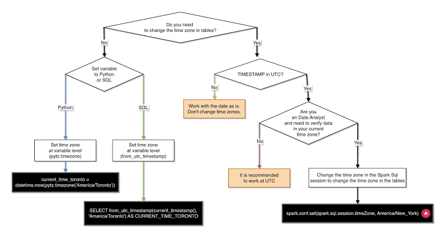

# Tipo de Dato Bit (`BIT`)

El tipo de dato `BIT` se utiliza para almacenar valores binarios o secuencias de bits (ceros y unos). A diferencia del booleano (que guarda una intención lógica de Verdadero/Falso), el tipo `BIT` está pensado para guardar números binarios o patrones de flags (banderas de estado).

## Límites y Valores Permitidos

- **BIT(1):** Almacena un solo bit: `0` o `1` (y `NULL` si la columna lo permite).

``` sql
-- Ejemplo en SQL Server / MySQL 
CREATE TABLE dispositivos (
    id INT PRIMARY KEY,
    nombre VARCHAR(50),
    encendido BIT
);

-- Insertar valores binarios
INSERT INTO dispositivos (id, nombre, encendido)
VALUES (1, 'Sensor Temperatura', 1);

-- Consulta
SELECT nombre, encendido FROM dispositivos WHERE encendido = 1;
```

## Motores SQL donde existe


|---------------------|---------------------|------------------------------|
| **Motor SQL** | **Soporte** | **Observaciones** |
| **SQL Server** | Sí | Se utiliza comunmente en lugar del tipo `BOOLEAN`. |
| **MySQL / MariaDB** | Sí | Permite definir `BIT(M)` de 1 a 64 bits. |
| **PostgreSQL** | Sí | Permite cadenas de bits de longitud fija `BIT(n)` o variable `BIT VARYING(n)`. |
| **Oracle** | No nativo | Se suelen usar tipos numéricos `NUMBER(1)` o tipos RAW. |

# BIT(M):

En motores como MySQL, $M$ representa la longitud en bits. $M$ suele ir de **1 a 64 bits**.

Piensa en la $M$ como la **"cantidad de casillas o interruptores"** que quieres reservar dentro de la misma columna.

Si solo pones un bit: `BIT(1)`

Es **1 sola casilla**. Solo cabe un `0` o un `1`.

- Es decir, la columna almacena solo: `0` o `1`. Si pones varios bits: BIT(4) o BIT(8)Estás reservando una tira de ceros y unos. La $M$ indica cuántos ceros/unos exactos puedes meter alineados.

Un ejemplo: Días de la semana que abre un restaurante

Imagina que estás diseñando una base de datos para restaurantes y quieres guardar qué días de la semana abre cada lugar (de Lunes a Domingo = 7 días).

En lugar de crear 7 columnas distintas (abre_lunes, abre_martes, ...), creas una sola columna llamada dias_abierto usando BIT(7):

``` sql
SQL 

CREATE TABLE restaurantes 
    ( id INT PRIMARY KEY
    , nombre VARCHAR(50)
    , dias_abierto BIT(7) -- Reserva 7 casillas (1 por cada día de la semana) ); 
    
    INSERT INTO restaurantes
           (id, nombre, dias_abierto) 
    VALUES (2, 'Brunch del Domingo', b'0000011');

--- encontrar restaurantes abiertos los domingos

SELECT nombre, BIN(dias_abierto) AS dias 
FROM restaurantes 
WHERE (dias_abierto & b'0000001') > 0;

--- encontrar restaurantes que cierren los lunes

SELECT nombre, BIN(dias_abierto) AS dias 
FROM restaurantes
 WHERE (dias_abierto & b'1000000') = 0;

--- encontrar restaurantes que cierran SOLO los lunes

SELECT nombre, BIN(dias_abierto) AS dias 
FROM restaurantes 
WHERE dias_abierto = b'0111111';

---- encontrar restaurantes que abran SOLO los fines de semana

SELECT nombre, BIN(dias_abierto) AS dias 
FROM restaurantes 
WHERE dias_abierto = b'0000011';
```

Cada posición de la tira representa un día (Lunes, Martes, Miércoles, Jueves, Viernes, Sábado, Domingo):

- Restaurante 1 (Abre todos los días): Guardas: b'1111111' (7 unos).

- Restaurante 2 (Solo abre fines de semana): Guardas: b'0000011' (5 ceros para entre semana, 2 unos para Sábado y Domingo).

- Restaurante 3 (Cierra los Lunes): Guardas: b'0111111' (0 el lunes, 1 el resto).

El máximo permitido es 64 (BIT(64)), que te daría una cadena de 64 ceros y unos seguidos.

::: nota
¿Qué ganas usando esto?

Ahorro de espacio enorme: En lugar de gastar mucho espacio con 7 campos separados, guardas 7 opciones dentro de un espacio minúsculo en memoria.

Consultas rapidísimas: La base de datos lee esa tira de bits de golpe sin tener que procesar múltiples campos.
:::

## Espacio que ocupa en la Base de Datos

- **SQL Server:** Optimiza el espacio agrupando columnas `BIT`.

  - De 1 a 8 columnas de tipo `BIT` en una misma tabla ocupan **1 byte** en total.

  - De 9 a 16 columnas `BIT` ocupan **2 bytes**, y así sucesivamente.

- **MySQL / MariaDB:** Ocupa aproximadamente `(M + 7) / 8` bytes. Para un `BIT(1)`, se reserva 1 byte de almacenamiento por fila.

- **PostgreSQL:** Soporta `BIT(n)` y `BIT VARYING(n)`. Ocupa 1 byte por cada 8 bits completos, más un pequeño costo de cabecera (*overhead*).

## El tipo de dato `BIT` y los operadores `&`

El tipo de dato `BIT` y las operaciones a nivel de bit (`&`, `|`, `~`) **están permitidos en casi todos los SGBD principales**, aunque con diferencias en cómo lo manejan:

  |
|------------------|------------------|------------------|------------------|
| **Motor SQL** | **¿Soporta BIT?** | **¿Soporta cadenas como BIT(7) o b'1111111'?** | **¿Soporta el operador &?** |
| **Microsoft SQL Server** | **Sí**, pero es solo `BIT` (1 bit: `0` o `1`). | No admite longitud `BIT(M)` ni literales `b'111'`. | **Sí**, soporta `&`, \` |
| **MySQL / MariaDB** | **Sí**, soporta `BIT(M)` de 1 a 64 bits. | **Sí**, admite `b'1010101'`. | **Sí**, soporta `&`, \` |
| **PostgreSQL** | **Sí**, soporta `BIT(n)` y `BIT VARYING(n)`. | **Sí**, pero la sintaxis es `B'1010101'` (con **B** mayúscula). | **Sí**, soporta `&`, \` |
| **SQLite** | **No** existe el tipo `BIT` explícito (usa enteros). | No admite sintaxis `BIT(M)`. | **Sí**, el operador `&` funciona con enteros (`INTEGER`). |
| **Oracle** | **No** existe el tipo `BIT` explícito (usa `NUMBER(1)` o `RAW`). | No admite sintaxis `BIT(M)`. | Usa funciones como `BITAND(a, b)` en lugar de `&`. |

::: extra
El operador & (BITWISE AND) en motores con BIT(n) En motores como MySQL y PostgreSQL, el operador & realiza una comparación posición por posición entre dos cadenas de bits de igual longitud.

Regla de evaluación Compara los dígitos alineados bajo la regla lógica de la puerta AND: solo mantiene un 1 si ambos bits en la misma posición son 1. Si cualquiera es 0, el resultado en esa posición pasa a ser 0.

```         
  1 & 1 = 1   (Solo esta combinación da 1)
  1 & 0 = 0
  0 & 1 = 0
  0 & 0 = 0
```

Concepto de "Máscara de Bits" El operador & se utiliza junto con una máscara (una tira binaria donde ponemos un 1 en el bit que nos interesa evaluar y 0 en todos los demás). Esto permite aislar y comprobar un estado concreto sin importar qué contengan los otros bits.

Ejemplo práctico con BIT(7) (Días de la semana) Queremos evaluar si el restaurante abre el Domingo usando la máscara del Domingo (b'0000001'):

```         
  1 1 1 1 1 1 1  (Abre todos los días)
& 0 0 0 0 0 0 1  (Máscara del Domingo)
-----------------
  0 0 0 0 0 0 1  => Resultado > 0 (Cumple la condición)
```

```         
  1 1 1 1 1 0 0  (Cierra Sábado y Domingo)
& 0 0 0 0 0 0 1  (Máscara del Domingo)
-----------------
  0 0 0 0 0 0 0  => Resultado = 0 (No cumple la condición)
```

Resumen de condiciones en consultas SQL Para comprobar si un bit está encendido (1): (columna & mascara) \> 0

Para comprobar si un bit está apagado (0): (columna & mascara) = 0
:::

::: extra
Como funciona en motores que no admiten bit(n) pero admiten el operador &?

En SQL Server usas el tipo **`TINYINT`** (que es un entero pequeño de 1 byte = 8 bits):

**Traduces los días a su equivalente en número entero**

Cada día de la semana corresponde a una potencia de 2 en binario:

  |
|------------------|------------------|------------------|------------------|
| **Día** | **Posición binaria** | **Valor en Binario** | **Valor Decimal a guardar** |
| **Domingo** | Posición 1 | `0000001` | **1** |
| **Sábado** | Posición 2 | `0000010` | **2** |
| **Viernes** | Posición 3 | `0000100` | **4** |
| **Jueves** | Posición 4 | `0000000` | **8** |
| **Miércoles** | Posición 5 | `0001000` | **16** |
| **Martes** | Posición 6 | `0010000` | **32** |
| **Lunes** | Posición 7 | `0100000` | **64** |

**Insertar registros usando números enteros**

Sumas los valores decimales de los días que abren:

- **Pizzería (Abre todos los días):** $64 + 32 + 16 + 8 + 4 + 2 + 1 =$ **127**

- **Brunch (Solo Sábado y Domingo):** $2 + 1 =$ **3**

- **Menú Ejecutivo (Lunes a Viernes):** $64 + 32 + 16 + 8 + 4 =$ **124**

``` sql
INSERT INTO restaurantes (id, nombre, dias_abierto)
VALUES 
(1, 'Pizzería Napoletana', 127),
(2, 'Brunch del Domingo', 3),
(3, 'Menú Ejecutivo', 124);
```

**La consulta con el operador `&` en SQL Server** La consulta funciona **exactamente igual que en MySQL**, pero en lugar de usar `b'0000001'` usas su número entero **`1`** (que representa al Domingo):

``` sql
-- Crear tabla en SQL Server
CREATE TABLE restaurantes (
    id INT PRIMARY KEY,
    nombre VARCHAR(50),
    dias_abierto TINYINT -- Guarda el patrón de 7 días como un número entero (0 a 255)
);

-- Insertar datos
INSERT INTO restaurantes (id, nombre, dias_abierto) 
VALUES 
(1, 'Pizzería Napoletana', 127), -- Todos los días (64+32+16+8+4+2+1 = 127)
(2, 'Brunch del Domingo', 3),     -- Solo Sábado y Domingo (2+1 = 3)
(3, 'Menú Ejecutivo', 124),       -- Lunes a Viernes (64+32+16+8+4 = 124)
(4, 'Bar Trattoria', 63);         -- Cierra solo el Lunes (32+16+8+4+2+1 = 63)

-- Restaurantes abiertos los domingos
SELECT nombre, dias_abierto 
FROM restaurantes 
WHERE (dias_abierto & 1) > 0;

--- restaurantes que cierren los lunes
SELECT nombre, dias_abierto 
FROM restaurantes 
WHERE (dias_abierto & 64) = 0;

--- restaurantes que cierren SOLO los lunes
--- Comparar directamente con la suma exacta de Martes a Domingo (32+16+8+4+2+1 = 63)
SELECT nombre, dias_abierto 
FROM restaurantes 
WHERE dias_abierto = 63;

-- restaurantes que abran los lunes
SELECT nombre, dias_abierto 
FROM restaurantes 
WHERE (dias_abierto & 64) > 0;
```
:::

# Tipo de Dato Lógico (`BOOLEAN` / `BOOL`)

El tipo de dato lógico representa valores de verdad binarios. Sirve para almacenar estados afirmativos o negativos, como si un usuario está activo, si un pedido ha sido pagado o si una opción está habilitada.

En el estándar SQL y en lógica de tres valores (3VL), puede almacenar tres estados: `TRUE` (Verdadero), `FALSE` (Falso) y `NULL` (Desconocido / Sin valor).

## Límites y Valores Permitidos

- `TRUE` `1`

- `FALSE` `0`

- `NULL`

## Espacio que ocupa en la Base de Datos

- **PostgreSQL:** Ocupa **1 byte** por cada valor.

- **MySQL / MariaDB:** Internamente no tiene un tipo booleano puro nativo; `BOOLEAN` es un alias de `TINYINT(1)`, por lo que ocupa **1 byte** (valores del `-128` al `127` o `0`/`1`).

- **SQL Server:** No tiene tipo `BOOLEAN`. Utiliza `BIT` para cumplir esta función (ocupa de 1 a 8 bits por grupo en disco).

## Motores SQL donde existe


|---------------------|----------------------|-----------------------------|
| **Motor SQL** | **Soporte** | **Tipo Interno / Nota** |
| **PostgreSQL** | Sí (Nativo) | `BOOLEAN` o `BOOL` |
| **MySQL / MariaDB** | Sí (Como alias) | Se convierte a `TINYINT(1)` |
| **SQLite** | No nativo | Usa enteros (`1` para TRUE, `0` para FALSE) |
| **SQL Server** | No nativo | Se sustituye por el tipo `BIT` |
| **Oracle Database** | Sí (A partir de 23c) | En versiones anteriores se usaba `NUMBER(1)` o `VARCHAR2(1)` |

## Ejemplo en SQL

``` sql
-- Crear tabla de usuarios con estado activo (Booleano)
CREATE TABLE usuarios (
    id INT PRIMARY KEY,
    nombre VARCHAR(50),
    es_activo BOOLEAN DEFAULT TRUE
);

-- Insertar valores
INSERT INTO usuarios (id, nombre, es_activo) 
VALUES (1, 'Ana', TRUE), (2, 'Carlos', FALSE);

-- Consulta filtrando por el campo lógico
SELECT * FROM usuarios WHERE es_activo = TRUE;
```

## Resumen (Puntos clave)

- **Diferencia principal:** `BOOLEAN` está pensado para la lógica del negocio (`TRUE`/`FALSE`), mientras que `BIT` está pensado para almacenamiento binario compacto o un solo dígito binario (`0`/`1`).

- **Inconsistencia entre motores:** SQL Server no admite `BOOLEAN` y usa `BIT` en su lugar; MySQL admite `BOOLEAN` pero por dentro lo convierte a un número entero pequeño (`TINYINT`).

- **Eficiencia:** El tipo `BIT` en motores como SQL Server es muy eficiente porque agrupa hasta 8 columnas distintas de tipo `BIT` en un solo byte físico.

# Tipos de Datos Enteros (INTEGER)

Los tipos de datos enteros se utilizan para almacenar **números exactos sin parte decimal** (positivos, negativos o cero). Son los tipos de datos numéricos más eficientes a nivel de cómputo y almacenamiento en cualquier base de datos, por lo que se emplean como clave primaria (`PRIMARY KEY`), identificadores, contadores y claves foráneas (`FOREIGN KEY`).

Existen varios subtipos que varían principalmente en la **cantidad de bytes que ocupan** y, por tanto, en el **rango de números que pueden almacenar**.

## Clasificación y Rangos (Con signo / *Signed*)

Por defecto, los enteros en SQL permiten valores positivos y negativos (*Signed*).

  |
|------------------|------------------|------------------|------------------|
| **Tipo de Dato** | **Espacio** | **Rango con Signo (Signed)** | **Caso de Uso Típico** |
| **`TINYINT`** | **1 Byte** (8 bits) | -128 a 127 | Estados, meses (1-12), edades, días de la semana. |
| **`SMALLINT`** | **2 Bytes** (16 bits) | -32.768 a 32.767 | Años, recuentos pequeños, códigos postales cortos. |
| **`INT` / `INTEGER`** | **4 Bytes** (32 bits) | -2.147.483.648 a 2.147.483.647 ($\approx \pm 2,14$ mil millones) | IDs estándar de tablas, contadores de usuarios, stocks. |
| **`BIGINT`** | **8 Bytes** (64 bits) | -9.223.372.036.854.775.808 a 9.223.372.036.854.775.807 | Transacciones financieras, clicks de la web, datos masivos (*Big Data*). |

*(Nota: En MySQL/MariaDB existe también `MEDIUMINT` de 3 Bytes, de -8.388.608 a 8.388.607).*

### La opción `UNSIGNED` (Sin Signo)

`UNSIGNED` es un modificador que elimina la capacidad de almacenar números negativos y desplaza todo el rango hacia la zona positiva.

Al no tener que reservar un bit para el signo +/- (el bit más significativo o *sign bit*), **duplica el valor máximo positivo** que cabe en el mismo espacio físico de bytes.


|------------------------|------------------------|------------------------|
| **Tipo de Dato** | **Rango Con Signo (Signed)** | **Rango Sin Signo (UNSIGNED)** |
| **`TINYINT`** | -128 a 127 | **0 a 255** |
| **`SMALLINT`** | -32.768 a 32.767 | **0 a 65.535** |
| **`INT`** | -2.147.483.648 a 2.147.483.647 | **0 a 4.294.967.295** ($\approx 4,29$ mil millones) |
| **`BIGINT`** | $-9,22 \times 10^{18}$ a $9,22 \times 10^{18}$ | **0 a 18.446.744.073.709.551.615** ($\approx 18,4$ quintillones) |

::: nota
**¿Cuándo usar `UNSIGNED`?**

Es ideal para columnas que por su naturaleza **jamás pueden ser negativas**, como por ejemplo: un `ID` autoincremental, el precio de un producto en céntimos, la edad de una persona o el stock de inventario.
:::

## Motores SQL donde existe


|------------------------|------------------------|------------------------|
| **Motor SQL** | **Soporte de TINYINT, SMALLINT, INT, BIGINT** | **Soporte de la opción UNSIGNED** |
| **MySQL / MariaDB** | **Sí**, soporta todos los tipos. | **Sí**, soporte completo para todos los enteros. |
| **PostgreSQL** | Soporta `SMALLINT`, `INT`, `BIGINT`. **No** tiene `TINYINT` nativo. | **No** soporta la palabra clave `UNSIGNED` (se usan restricciones `CHECK (col >= 0)`). |
| **SQL Server** | Soporta `BIGINT`, `INT`, `SMALLINT` y `TINYINT`. | **No** soporta la palabra clave `UNSIGNED`. *(Curiosidad: en SQL Server, `TINYINT` es `UNSIGNED` por defecto, de 0 a 255)*. |
| **SQLite** | Todos se convierten internamente al tipo dinámico `INTEGER` (1 a 8 bytes según el valor). | **No** soporta la sintaxis `UNSIGNED`. |

## Ejemplo en SQL

``` sql
-- Ejemplo de creación de tabla en MySQL/MariaDB
CREATE TABLE productos (
    id BIGINT UNSIGNED AUTO_INCREMENT PRIMARY KEY, -- Permite el doble de IDs positivos (hasta 4,29 mil mill.)
    nombre VARCHAR(100) NOT NULL,
    stock INT UNSIGNED DEFAULT 0,                 -- El stock no puede ser negativo
    mes_temporada TINYINT UNSIGNED,                -- Valores del 1 al 12 (1 byte de espacio)
    codigo_categoria SMALLINT                     -- Admite categorías negativas si fuera necesario
);

-- Inserción de datos
INSERT INTO productos (nombre, stock, mes_temporada, codigo_categoria)
VALUES ('Portátil Gaming', 150, 11, -500);

-- Intentar insertar un valor fuera de rango o negativo en un UNSIGNED (Dará error)
-- INSERT INTO productos (nombre, stock) VALUES ('Error', -10);
```

# Tipos de Datos Numéricos Decimales

## Decimales Exactos (`DECIMAL` / `NUMERIC`)

El tipo de dato `DECIMAL` (o su alias equivalente `NUMERIC`) almacena valores numéricos con coma flotante **exacta** (coma fija). Al no realizar aproximaciones binarias, garantiza que el número guardado en disco sea exactamente el mismo que introdujo el usuario, lo que resulta fundamental para cálculos financieros, contabilidad o presupuestos.

Se define bajo la sintaxis **`DECIMAL(P, S)`**:

- **Precisión (**$P$): Cantidad **total de dígitos** que se pueden almacenar en el número (sumando los dígitos antes y después de la coma).

- **Escala (**$S$): Cantidad de dígitos reservados **a la derecha de la coma decimal**.

> **Ejemplo:** En un campo `DECIMAL(6, 2)`:
>
> - $P = 6$ (6 dígitos en total).
>
> - $S = 2$ (2 de esos dígitos son decimales).
>
> - Máximo número entero permitido: $6 - 2 = 4$ dígitos enteros (hasta `9999.99`).

**¿Qué ocurre si intentas introducir un número distinto de decimales a los establecidos?**

1.  **Si pasas más decimales que la escala definida (**$S$):

    El motor **redondea el número automáticamente** al número de decimales permitido.

    - *Ejemplo:* Si en `DECIMAL(5, 2)` insertas `123.456`, la base de datos guardará `123.46`.

2.  **Si pasas más dígitos enteros de los permitidos (**$P - S$):

    Provoca un **error de desbordamiento (*Overflow / Out of range*)** y la consulta falla.

    - *Ejemplo:* Si en `DECIMAL(5, 2)` intentas guardar `1234.5` (4 enteros), el motor no puede alojarlo porque solo admite 3 enteros ($5 - 2 = 3$).

## Límites y Espacio de Almacenamiento

- **Límites:** La precisión máxima varía según el gestor. Por ejemplo, en MySQL y PostgreSQL el límite es de **65 dígitos**, mientras que en SQL Server el máximo es de **38 dígitos**.

- **Almacenamiento (Bytes):** No utiliza un número fijo de bytes. La base de datos agrupa los dígitos en bloques para calcular el espacio consumido.

  - **MySQL / MariaDB:** Almacena cada 9 dígitos usando 4 bytes.

  - **SQL Server:**

    - Precisión 1 a 9 dígitos: **5 bytes**.

    - Precisión 10 a 19 dígitos: **9 bytes**.

    - Precisión 20 a 28 dígitos: **13 bytes**.

    - Precisión 29 a 38 dígitos: **17 bytes**.

## Decimales Aproximados (`FLOAT`, `REAL` y `DOUBLE`)

Los datos en punto flotante (`FLOAT`, `REAL`, `DOUBLE PRECISION`) guardan una **aproximación** del número real mediante notación científica binaria basada en el estándar IEEE 754. Se utilizan para magnitudes físicas, mediciones de sensores o coordenadas geográficas donde se prima la rapidez de cómputo sobre la precisión exacta.

- **`REAL` / `FLOAT(p)` (Precisión Simple):**

  - **Espacio:** **4 bytes** (32 bits).

  - **Precisión:** Garantiza unos **7 dígitos decimales** de precisión.

- **`DOUBLE` / `DOUBLE PRECISION` / `FLOAT` (Precisión Doble):**

  - **Espacio:** **8 bytes** (64 bits).

  - **Precisión:** Garantiza aproximadamente **15 a 17 dígitos decimales** de precisión.

## El problema de la aproximación

Debido a que los ordenadores representan los números en base 2 (binario), ciertos números decimales periódicos en base 10 (como `0.1` o `0.2`) no pueden representarse de forma exacta en binario.

``` sql
-- Ejemplo típico de imprecisión en punto flotante
SELECT 0.1 + 0.2; 
-- En tipos FLOAT, el procesador puede devolver 0.30000000000000004
```

## Exactos vs aproximados ¿Cuándo elegir cada uno?

| Criterio | Exactos (`DECIMAL` / `NUMERIC`) | Aproximados (`FLOAT` / `DOUBLE`) |
|:-----------------------|:-----------------------|:-----------------------|
| **Precisión** | **100% exacta.** Sin pérdidas ni redondeos impredecibles. | **Aproximada.** Puede acumular errores al sumar o multiplicar. |
| **Rendimiento** | **Más lento.** Las operaciones aritméticas se procesan por software en la CPU. | **Extremadamente rápido.** La CPU/FPU procesa punto flotante por hardware. |
| **Almacenamiento** | Variable y superior (de 5 a 17+ bytes). | Fijo y compacto (4 u 8 bytes). |
| **Uso Recomendado** | Dinero, impuestos, transacciones bancarias, inventarios. | Lecturas de sensores (temperatura, velocidad), física, astronomía, coordenadas GPS. |

``` sql
CREATE TABLE mediciones (
    id INT PRIMARY KEY,
    -- Tipo Exacto: Precio máximo 999999.99 €
    precio DECIMAL(8, 2), 
    
    -- Tipo Aproximado: Temperatura de un sensor con margen de precisión
    temperatura_sensor REAL, 
    
    -- Tipo Aproximado: Coordenada de alta precisión para cartografía
    latitud DOUBLE PRECISION 
);

-- Inserción demostrando el redondeo de DECIMAL(8,2)
INSERT INTO mediciones (id, precio, temperatura_sensor, latitud)
VALUES (1, 19.999, 36.6543, 40.416775);

-- En el campo precio se guardará 20.00 por el redondeo automático
SELECT precio FROM mediciones WHERE id = 1;
```

## ¿Por qué NUNCA usar `FLOAT` para dinero?

Si te preguntan en clase por qué no se debe usar `FLOAT` en una tienda online, la respuesta es el **efecto de acumulación de error de redondeo**:

Si sumas millones de transacciones pequeñas guardadas en `FLOAT` (como `0.01` € por clic), las pequeñas diferencias binarias en el último decimal se van acumulando. Al final del año, la contabilidad puede descuadrar por varios cientos o miles de euros. En finanzas **siempre se exige `DECIMAL` o almacenar los importes en céntimos como `INTEGER`**.

# Tipos de Datos de Cadena de Texto (`CHAR`, `VARCHAR`, `TEXT`)

## `CHAR(n)` – Longitud Fija

- **Descripción:** Almacena cadenas de texto de longitud constante definida por $n$. Si el texto introducido es más corto que $n$, la base de datos **rellena el espacio restante con espacios en blanco a la derecha** hasta completar los $n$ caracteres.

- **Límites:** Normalmente $n$ va de **1 a 255 caracteres**.

- **Espacio que ocupa:** Ocupa siempre $n$ bytes/caracteres fijos, sin importar el texto introducido.

- **Casos de uso:** Datos con longitud estrictamente uniforme: códigos ISO de país (`ES`, `MX`), DNI/NIF, códigos hash MD5/SHA256, códigos postales fijos.

## `VARCHAR(n)` – Longitud Variable

- **Descripción:** Almacena cadenas de texto de longitud variable hasta un máximo de $n$ caracteres. Solo consume el espacio equivalente a los caracteres realmente escritos, más un pequeño costo adicional para registrar la longitud del texto (*prefix length*).

- **Límites:** Hasta **65.535 bytes** en MySQL/MariaDB o **8.000 caracteres** en SQL Server (`VARCHAR(8000)` o `VARCHAR(MAX)`).

- **Espacio que ocupa:** **Longitud del texto guardado + 1 o 2 bytes de cabecera** (1 byte si la longitud máxima es menor que 255, 2 bytes si es mayor).

- **Casos de uso:** Nombres de usuario, correos electrónicos, direcciones, títulos de artículos.

## ¿Qué ocurre si intentas introducir un texto distinto a la longitud establecida?

1.  **Si el texto es más corto:**

    - En `CHAR(10)`: Al guardar `'Hola'`, el motor guarda `'Hola      '` (4 letras + 6 espacios).

    - En `VARCHAR(10)`: Al guardar `'Hola'`, el motor guarda `'Hola'` y registra que la longitud es de 4 caracteres.

2.  **Si el texto excede el límite** $n$:

    - **Modo Estricto (Por defecto):** Lanza un error de truncado (*Data too long for column*) y cancela la transacción.

    - **Modo No Estricto:** Trunca el texto automáticamente cortando las letras sobrantes a partir del carácter $n$.

## Textos Largos (`TEXT` / `CLOB`)

Diseñado para almacenar grandes volúmenes de texto no estructurado donde la longitud máxima no se conoce de antemano o supera los límites de un `VARCHAR`.

### Subtipos en MySQL / MariaDB


|------------------------|------------------------|------------------------|
| **Tipo** | **Longitud Máxima en Bytes / Caracteres** | **Espacio Real Consumido** |
| **`TINYTEXT`** | Hasta 255 bytes | Longitud real + 1 byte |
| **`TEXT`** | Hasta 65.535 bytes ($\approx 65$ KB) | Longitud real + 2 bytes |
| **`MEDIUMTEXT`** | Hasta 16.777.215 bytes ($\approx 16$ MB) | Longitud real + 3 bytes |
| **`LONGTEXT`** | Hasta 4.294.967.295 bytes ($\approx 4$ GB) | Longitud real + 4 bytes |

*(Nota: En SQL Server se utiliza `VARCHAR(MAX)` y en PostgreSQL se usa `TEXT` de longitud ilimitada dinámicamente).*

## Ventajas e Inconvenientes: ¿Cuándo elegir cada uno?

\|------------------\|------------------\|------------------\|------------------\| \| **Criterio** \| **CHAR** \| **VARCHAR** \| **TEXT** \| \| **Velocidad / Rendimiento** \| **Más rápido.** Al tener un tamaño fijo por fila, el motor calcula de forma directa la posición en memoria. \| **Moderado.** Requiere leer la cabecera para determinar el fin de la cadena. \| **Más lento.** Se almacena fuera del bloque principal de la fila (*Off-page storage*). \| \| **Uso de Espacio** \| Ineficiente si los datos varían mucho de tamaño. \| **Muy eficiente.** No desperdicia espacio en blanco. \| Eficiente para grandes volúmenes, pero añade *overhead* de punteros. \| \| **Indexación y Búsquedas** \| Búsquedas muy rápidas. \| Permite índices estándar. \| Requiere **índices de texto completo (*Full-Text Index*)** para búsquedas eficientes. \| \| **Uso Típico** \| Códigos de país (`CHAR(2)`), Hashes. \| Nombres, Emails, URLs. \| Artículos de blog, JSON en texto, descripciones. \|

## Motores SQL y la opción `NVARCHAR` / Unicode

### El prefijo `N` (`NCHAR`, `NVARCHAR`)

En motores como **SQL Server** o **Oracle**, las variantes que empiezan por `N` representan texto **Unicode (National Language Set)**.

- `VARCHAR`: Usa codificación de 1 byte por carácter (no soporta ciertos alfabetos complejos sin configurar la página de códigos).

- `NVARCHAR`: Usa codificación UTF-16 (**2 bytes por carácter**), permitiendo guardar cualquier alfabeto del mundo (chino, cirílico, árabe) y emojis.

| **Tipo** | **Almacenamiento** | **Capacidad** | **Ejemplo** |
|------------------|------------------|------------------|------------------|
| **`VARCHAR(n)`** | 1 byte por carácter\* | Hasta **`n`** bytes | **`"Hola"`** → 4 bytes |
| **`NVARCHAR(n)`** | 2 bytes por carácter\* | Hasta **`n`** caracteres | **`"Hola"`** → 8 bytes |

### Ejemplo en SQL

``` sql
CREATE TABLE publicaciones (
    id INT PRIMARY KEY,
    codigo_iso_pais CHAR(2),            -- Longitud fija siempre de 2 letras ('ES', 'MX')
    titulo VARCHAR(150) NOT NULL,        -- Longitud variable hasta 150 caracteres
    contenido TEXT,                      -- Texto largo de extensión variable
    autor_soporte_multilenguaje NVARCHAR(100) -- Soporta caracteres internacionales
);

INSERT INTO publicaciones (id, codigo_iso_pais, titulo, contenido)
VALUES (
    1, 
    'ES', 
    'Aprender SQL en 2026', 
    'Este es el contenido detallado de la lección sobre tipos de datos...'
);
```

# Tipos de Datos de Fecha y Hora en SQL (`DATE`, `TIME`, `DATETIME` y `TIMESTAMP`)

  |  |
|---------|---------------|---------------|----------|-------------------------|
| **Tipo de Dato** | **Formato** | **Rango Típico (ej. MySQL/MariaDB)** | **Tamaño en Disco** | **Caso de Uso Principal** |
| **`DATE`** | `YYYY-MM-DD` | `1000-01-01` a `9999-12-31` | **3 bytes** | Fechas de nacimiento, fechas de contratación, vencimientos sin hora. |
| **`TIME`** | `HH:MM:SS` (o `HH:MM:SS.p`) | `-838:59:59` a `838:59:59` | **3 bytes** | Horarios fijados (ej. inicio de turno), intervalos de tiempo transcurrido. |
| **`DATETIME`** | `YYYY-MM-DD HH:MM:SS` | `1000-01-01 00:00:00` a `9999-12-31 23:59:59` | **5 a 8 bytes** | Reservas de hotel, eventos del calendario, citas programadas. |
| **`TIMESTAMP`** | `YYYY-MM-DD HH:MM:SS` | `1970-01-01 00:00:01` UTC a `2038-01-19 03:14:07` UTC | **4 bytes** | Auditoría, marcas de tiempo de modificación, registros (*logs*). |

## `DATE` (Solo Fecha)

- **Formato estándar:** `YYYY-MM-DD` (ej. `'2026-09-28'`).

- **Características:** Ignora por completo cualquier componente de hora. Si intentas insertar una hora en un campo `DATE`, la parte temporal se descarta.

- **Almacenamiento:** Consume solo 3 bytes por fila, lo que optimiza significativamente el espacio en grandes volúmenes de datos.

## `TIME` (Solo Hora o Intervalo)

- **Formato estándar:** `HH:MM:SS` (opcionalmente con microsegundos `HH:MM:SS.ffffff`).

- **Peculiaridad:** En muchos SGBD (como MySQL), `TIME` no solo representa la hora del día (00:00:00 a 23:59:59), sino también **tiempo transcurrido o duraciones**. Por este motivo, su rango permite horas negativas y valores superiores a 24 horas (desde `-838:59:59` hasta `838:59:59`).

## La Gran Diferencia: `DATETIME` vs `TIMESTAMP`

Aunque ambos almacenan tanto la fecha como la hora, existen diferencias críticas en el manejo de zonas horarias (*Time Zones*) y almacenamiento interno.



## `DATETIME` (Constante e Independiente)

- **Comportamiento:** Guarda el valor exacto tal como se introduce. **No realiza ninguna conversión de zona horaria.**

- **Ejemplo:** Si guardas `'2026-05-10 14:00:00'` en Madrid y un usuario consulta esa fila desde Tokio, verá exactamente `'2026-05-10 14:00:00'`.

- **Ventaja:** Ideal para eventos futuros programados donde la hora local no debe cambiar independientemente de la configuración del servidor.

## `TIMESTAMP` (Dinámico y Basado en UTC)

- **Comportamiento:**

  1.  Al **insertar/escribir**, convierte la fecha/hora de la zona horaria del servidor/sesión actual a **UTC (Tiempo Universal Coordinado)** y guarda el número de segundos desde la época Unix (`1970-01-01 00:00:00 UTC`).

  2.  Al **consultar/leer**, convierte ese valor UTC de nuevo a la zona horaria de la sesión que realiza la consulta.

- **Ejemplo:** Si un servidor en Madrid (UTC+2 en verano) guarda `'2026-06-01 12:00:00'`, se almacena como `10:00:00 UTC`. Si un cliente consulta la base de datos desde Londres (UTC+1 en verano), obtendrá automáticamente `'2026-06-01 11:00:00'`.

- **Limitación importante (El problema del año 2038):** Dado que muchos motores emplean un entero de 32 bits con signo para almacenar el `TIMESTAMP`, el valor máximo que puede registrar es el **19 de enero de 2038 a las 03:14:07 UTC**.

## Tabla Comparativa: `DATETIME` vs `TIMESTAMP`

| Característica | DATETIME | TIMESTAMP |
|:----------------|:-----------------------|:------------------------------|
| **Zona Horaria** | Ignora la zona horaria (almacena texto/número literal). | **Sensible a la zona horaria** (convierte a UTC internamente). |
| **Rango de Fechas** | Amplio (`1000-01-01` a `9999-12-31`). | Reducido (`1970-01-01` a `2038-01-19`). |
| **Almacenamiento** | 5 bytes (en versiones modernas de MySQL) a 8 bytes. | **4 bytes fijo.** |
| **Actualización Automática** | Opcional según la versión de SQL. | Muy común para columnas tipo `DEFAULT CURRENT_TIMESTAMP ON UPDATE CURRENT_TIMESTAMP`. |

**Sintaxis en SQL de Ejemplo**

``` sql
CREATE TABLE registros_eventos (
    id INT PRIMARY KEY AUTO_INCREMENT,
    
    -- Solo fecha de nacimiento
    fecha_nacimiento DATE NOT NULL,
    
    -- Solo la hora de inicio de una reunión
    hora_inicio TIME NOT NULL,
    
    -- Cita médica programada (debe permanecer fija a las 10:00 local)
    cita_programada DATETIME NOT NULL,
    
    -- Auditar cuándo se insertó el registro (conversión automática con UTC)
    fecha_creacion TIMESTAMP DEFAULT CURRENT_TIMESTAMP,
    
    -- Auditar la última modificación del registro
    fecha_actualizacion TIMESTAMP DEFAULT CURRENT_TIMESTAMP ON UPDATE CURRENT_TIMESTAMP
);

-- Ejemplo de inserción
INSERT INTO registros_eventos (fecha_nacimiento, hora_inicio, cita_programada)
VALUES ('1992-04-15', '09:30:00', '2026-10-15 10:00:00');
```

## ¿Por qué en aplicaciones globales multi-región se prefiere `TIMESTAMP` o guardar en UTC?

Si la aplicación tiene usuarios en España, México y Japón, guardar fechas de compras en `DATETIME` sin zona horaria provocaría un caos analítico (no sabrías qué compra ocurrió antes que otra en tiempo absoluto).

Usar `TIMESTAMP` garantiza que **todas las transacciones queden alineadas en un tiempo universal (UTC)**, mostrándose ajustadas a la hora local de cada usuario cuando abren la app.

## Manipulación de Fechas en MySQL

En MySQL, los principales tipos de datos para almacenar información temporal son:


|------------------|------------------|------------------------------------|
| **Tipo** | **Formato Estándar** | **Descripción** |
| `DATE` | `YYYY-MM-DD` | Solo fecha (año, mes, día). |
| `TIME` | `HH:MM:SS` | Solo hora (horas, minutos, segundos). |
| `DATETIME` | `YYYY-MM-DD HH:MM:SS` | Fecha y hora combinadas (fijo, sin zona horaria). |
| `TIMESTAMP` | `YYYY-MM-DD HH:MM:SS` | Fecha y hora (almacenado en UTC, se convierte a la zona horaria de la sesión). |

### Obtener la Fecha y Hora Actual

Funciones más habituales para consultar la fecha u hora del sistema en tiempo real:

``` sql

-- Fecha y hora actuales
SELECT NOW();               -- '2026-10-07 13:09:00'
SELECT CURRENT_TIMESTAMP(); -- Equivalente a NOW()

-- Solo la fecha actual
SELECT CURDATE();           -- '2026-10-07'
SELECT CURRENT_DATE();      -- Equivalente a CURDATE()

-- Solo la hora actual
SELECT CURTIME();           -- '13:09:00'
SELECT CURRENT_TIME();      -- Equivalente a CURTIME()
```

### Extraer Partes de una Fecha

Para obtener componentes específicos de un valor temporal (`YEAR`, `MONTH`, `DAY`, etc.):

``` sql

SET @fecha = '2026-10-07 15:30:45';

SELECT YEAR(@fecha);        -- 2026
SELECT MONTH(@fecha);       -- 10
SELECT DAY(@fecha);         -- 7 (ó DAYOFMONTH)
SELECT HOUR(@fecha);        -- 15
SELECT MINUTE(@fecha);      -- 30
SELECT SECOND(@fecha);      -- 45

-- Funciones complementarias útiles
SELECT DAYNAME(@fecha);     -- 'Wednesday' (nombre del día)
SELECT MONTHNAME(@fecha);   -- 'October' (nombre del mes)
SELECT DAYOFWEEK(@fecha);   -- 4 (1 = Domingo, 2 = Lunes, ..., 4 = Miércoles)
SELECT WEEKOFYEAR(@fecha);  -- Número de semana del año
```

La función genérica `EXTRACT()` permite obtener cualquier parte usando sintaxis estándar de SQL:

``` sql
SELECT EXTRACT(YEAR FROM @fecha);   -- 2026
SELECT EXTRACT(MONTH FROM @fecha);  -- 10
```

### Sumar y Restar Fechas (`DATE_ADD`, `DATE_SUB`)

Para realizar cálculos y desplazamientos de tiempo se utilizan `DATE_ADD()` y `DATE_SUB()`, o los operadores de intervalo directo:

``` sql

SET @fecha = '2026-10-07';

-- Sumar tiempo
SELECT DATE_ADD(@fecha, INTERVAL 10 DAY);     -- '2026-10-17'
SELECT DATE_ADD(@fecha, INTERVAL 2 MONTH);    -- '2026-12-07'
SELECT DATE_ADD(@fecha, INTERVAL 1 YEAR);     -- '2027-10-07'

-- Restar tiempo
SELECT DATE_SUB(@fecha, INTERVAL 5 DAY);     -- '2026-10-02'

-- Sintaxis alternativa con operadores + y -
SELECT @fecha + INTERVAL 1 MONTH;             -- '2026-11-07'
SELECT @fecha - INTERVAL 3 WEEK;              -- '2026-09-16'
```

### Diferencia entre Fechas (`DATEDIFF`, `TIMEDIFF`, `TIMESTAMPDIFF`)

#### Diferencia en días (`DATEDIFF`)

Devuelve la resta de `fecha1 - fecha2` únicamente en días:

``` sql

SELECT DATEDIFF('2026-10-10', '2026-10-07'); -- 3 (días positivos)
SELECT DATEDIFF('2026-10-07', '2026-10-10'); -- -3 (días negativos)
```

#### Diferencia en unidades específicas (`TIMESTAMPDIFF`)

Es la más versátil para calcular edades, meses pasados, horas de diferencia, etc.:

``` sql

-- TIMESTAMPDIFF(unidad, fecha_inicio, fecha_fin)

-- Edad o años transcurridos
SELECT TIMESTAMPDIFF(YEAR, '1995-05-20', CURDATE());

-- Horas transcurridas entre dos registros
SELECT TIMESTAMPDIFF(HOUR, '2026-10-07 08:00:00', '2026-10-07 14:30:00'); -- 6
```

### Formateo y Conversión de Fechas

#### Dar formato de texto a una fecha (`DATE_FORMAT`)

Convierte un tipo fecha en una cadena de texto personalizada según especificadores de formato:

|                   |                        |             |
|-------------------|------------------------|-------------|
| **Especificador** | **Descripción**        | **Ejemplo** |
| `%Y`              | Año (4 dígitos)        | `2026`      |
| `%y`              | Año (2 dígitos)        | `26`        |
| `%m`              | Mes numérico (01 a 12) | `10`        |
| `%d`              | Día del mes (01 a 31)  | `07`        |
| `%H`              | Hora (00 a 23)         | `14`        |
| `%i`              | Minutos (00 a 59)      | `30`        |
| `%s`              | Segundos (00 a 59)     | `45`        |
| `%W`              | Nombre del día         | `Wednesday` |
| `%M`              | Nombre del mes         | `October`   |

``` sql

SELECT DATE_FORMAT(NOW(), '%d/%m/%Y');             -- '07/10/2026'
SELECT DATE_FORMAT(NOW(), '%Y-%m-%d %H:%i:%s');     -- '2026-10-07 13:09:00'
SELECT DATE_FORMAT(NOW(), '%W, %d de %M de %Y');   -- 'Wednesday, 07 de October de 2026'
```

### Convertir texto a fecha (`STR_TO_DATE`)

Imprescindible cuando importas datos desde CSVs donde las fechas vienen en formatos como `DD/MM/YYYY`:

``` sql
-- Convierte la cadena '07/10/2026' a un tipo DATE válido de MySQL ('2026-10-07')
SELECT STR_TO_DATE('07/10/2026', '%d/%m/%Y');

-- Útil en cargas masivas con LOAD DATA
-- SET order_date = STR_TO_DATE(@v_order_date, '%d/%m/%Y');
```

## Buenas Prácticas y Filtros Frecuentes

### Evitar usar funciones sobre columnas indexadas en el `WHERE`

Aplicar funciones como `YEAR()` o `DATE_FORMAT()` sobre una columna en la cláusula `WHERE` impide que MySQL use los índices de esa columna:

``` sql
-- ❌ INEFICIENTE (No usa índice en order_date)
SELECT * FROM orders 
WHERE YEAR(order_date) = 2026;

-- ✅ RECOMENDADO (Utiliza índices de forma óptima)
SELECT * FROM orders 
WHERE order_date >= '2026-01-01' AND order_date <= '2026-12-31';
```

### Filtrar por rango de fechas en campos `DATETIME`

Cuando filtras un campo `DATETIME` usando solo fechas sin hora (`YYYY-MM-DD`), la fecha final por defecto asume `00:00:00`:

``` sql
-- ❌ Puede perder registros del día 31 después de las 00:00:00
SELECT * FROM payments 
WHERE paid_at BETWEEN '2026-10-01' AND '2026-10-31';

-- ✅ Captura todo el rango del mes completo
SELECT * FROM payments 
WHERE paid_at >= '2026-10-01' AND paid_at < '2026-11-01';
```

# Tipos de Datos LOB: Texto Largo (`CLOB` / `TEXT`) y Datos Binarios (`BLOB`)

## Concepto de LOB (*Large Objects*)

Los tipos de datos **LOB** (*Large Objects*) están diseñados para almacenar volúmenes masivos de datos no estructurados o semiestructurados que superan los límites habituales de las columnas convencionales.

Se dividen en dos categorías principales:

1.  **`CLOB` / `TEXT` (*Character Large Object*):** Cadenas de caracteres de gran longitud donde la base de datos aplica reglas de codificación de caracteres (*collation*, UTF-8, etc.).

2.  **`BLOB` (*Binary Large Object*):** Secuencias fijas de bytes binarios puros (secuencia de `0`s y `1`s) sin ninguna codificación de texto asociada.

## Tipos `BLOB` (Datos Binarios)

Almacenan información en formato binario crudo. Son ideales para archivos como imágenes, audios, documentos PDF, ejecutables o claves cifradas.


|------------------------|------------------------|------------------------|
| **Subtipo (MySQL / MariaDB)** | **Capacidad Máxima** | **Tamaño Típico de Ejemplo** |
| **`TINYBLOB`** | 255 bytes | Pequeños iconos, firmas digitales cortas |
| **`BLOB`** | 65.535 bytes ($\approx 65$ KB) | Miniaturas (*thumbnails*), archivos de configuración |
| **`MEDIUMBLOB`** | 16.777.215 bytes ($\approx 16$ MB) | Fotografías en alta resolución, canciones MP3 |
| **`LONGBLOB`** | 4.294.967.295 bytes ($\approx 4$ GB) | Vídeos, instaladores de software, bases de datos integradas |

*(Nota: En PostgreSQL el equivalente binario estándar se denomina `BYTEA` o `LARGE OBJECT`, mientras que en SQL Server se usa `VARBINARY(MAX)`).*

## Tipos `TEXT` / `CLOB` (Texto Largo)

Almacenan texto plano o marcado (HTML, XML, JSON en texto, código fuente) de gran extensión.


|------------------------|------------------------|------------------------|
| **Subtipo (MySQL / MariaDB)** | **Capacidad Máxima** | **Casos de Uso** |
| **`TINYTEXT`** | 255 bytes | Resúmenes breves, notas de una línea |
| **`TEXT`** | 65.535 bytes ($\approx 65$ KB) | Artículos de blog, descripciones de productos |
| **`MEDIUMTEXT`** | 16,7 MB | Capítulos de libros, documentos HTML complejos |
| **`LONGTEXT`** | 4 GB | Transcripciones completas, logs de sistema extensos |

## ¿Cómo funcionan internamente? (*Off-Page Storage*)

A diferencia de los enteros, fechas o `VARCHAR` pequeños, los datos de tipo `BLOB` y `TEXT` **no se guardan directamente dentro del bloque o página principal de la fila**:

- **Puntero en la fila:** La tabla principal solo almacena un **puntero o dirección de memoria** (de unos pocos bytes).

- **Página externa (*Off-page*):** El contenido real de la imagen o del texto largo se escribe en páginas de disco secundarias reservadas.

> **Consecuencia en el rendimiento:** Hacer un `SELECT *` sobre una tabla que contiene columnas `BLOB` o `TEXT` obliga al motor a realizar lecturas adicionales en disco para seguir los punteros, ralentizando drásticamente la consulta.

## Ventajas e Inconvenientes: ¿Cuándo usar `BLOB` y cuándo guardar la ruta en disco?

Esta es una de las preguntas de arquitectura más habituales en la administración de bases de datos.


|---------------------|------------------------|---------------------------|
| **Criterio** | **Guardar el archivo en la BD (BLOB)** | **Guardar en servidor/S3 y la ruta en la BD (VARCHAR)** |
| **Integridad Transaccional (ACID)** | **Excelente.** Si haces un `ROLLBACK`, el archivo se borra o restaura junto con el registro. | **Riesgo.** El archivo puede borrarse del disco y dejar un puntero "huérfano" en la base de datos. |
| **Copias de Seguridad (*Backups*)** | **Cómodo pero pesado.** Todo el sistema se respalda en un único archivo de base de datos. | **Rápido.** La base de datos ocupa pocos megabytes; los archivos se respaldan por separado. |
| **Rendimiento de la Base de Datos** | **Degradado.** Aumenta el consumo de RAM (memoria de búfer) e I/O de disco. | **Óptimo.** La base de datos gestiona solo texto corto (`VARCHAR(255)`) con las rutas. |
| **Seguridad / Control de Acceso** | **Alta.** Se aplican directamente los permisos de usuario de SQL. | **Media.** Depende del sistema de archivos o del almacenamiento en la nube (*Cloud Storage*). |

**Ejemplo de Sintaxis en SQL**

``` sql
CREATE TABLE documentos_expediente (
    id INT PRIMARY KEY AUTO_INCREMENT,
    nombre_archivo VARCHAR(100) NOT NULL,
    
    -- Texto largo para el contenido extraído del documento
    transcripcion_texto LONGTEXT, 
    
    -- Datos binarios puros para almacenar el archivo PDF original
    archivo_pdf_contenido LONGBLOB,
    
    -- Buenas prácticas: Guardar también el hash para verificar integridad
    hash_sha256 CHAR(64)
);

-- Ejemplo conceptual de inserción
INSERT INTO documentos_expediente (nombre_archivo, transcripcion_texto, archivo_pdf_contenido)
VALUES (
    'contrato_alquiler.pdf',
    'En la ciudad de Madrid, a 28 de septiembre...',
    -- En MySQL se pueden cargar archivos locales binarios mediante LOAD_FILE
    LOAD_FILE('/var/lib/mysql-files/contrato_alquiler.pdf')
);
```

## ¿Por qué NUNCA se debe hacer `SELECT *` en una tabla con columnas `BLOB` o `LONGTEXT`?

Si ejecutas `SELECT *` en una tabla con 100.000 registros que incluye una columna `LONGBLOB` con imágenes, el motor de la base de datos intentará cargar **todos esos megabytes/gigabytes de imágenes en la memoria RAM del servidor** para enviarlos por la red, colapsando el ancho de banda y la memoria caché (*buffer pool*).

La regla de oro es consultar siempre explícitamente las columnas necesarias: `SELECT id, nombre_archivo FROM documentos_expediente;`

# Tipo de Dato Enumerado (`ENUM`)

El tipo de dato `ENUM` es un objeto de cadena cuyo valor se elige explícitamente de una lista de valores permitidos predefinidos durante la creación de la tabla. Permite restringir una columna a **un único valor** dentro de un conjunto cerrado de opciones explícitas.

## Límites y Funcionamiento Interno

- **Elección Única:** Cada fila solo puede almacenar **un único elemento** del conjunto (o `NULL` si la columna lo permite).

- **Almacenamiento Numérico Interno:** A pesar de que los valores se definen como cadenas de texto, el motor los almacena internamente como **índices enteros (1, 2, 3...)**:

  - `1` corresponde al primer elemento de la lista.

  - `2` corresponde al segundo elemento, y así sucesivamente.

  - El índice `0` se reserva para un valor de cadena vacía especial de error (`''`) que se guarda si se inserta un valor no válido en modo no estricto.

  - `NULL` guarda su estado especial.

- **Límites:** Un tipo `ENUM` puede tener hasta **65.535 elementos distintos**.

## Espacio que Ocupa en la Base de Datos

El uso de memoria depende directamente del número de elementos definidos en la lista del `ENUM`:

- Hasta 255 miembros: Ocupa **1 byte** por fila.

- Entre 256 y 65.535 miembros: Ocupa **2 bytes** por fila.

## Motores SQL donde existe

| Motor SQL | Soporte | Observaciones |
|:-----------------------|:-----------------------|:-----------------------|
| **MySQL / MariaDB** | **Sí** (Nativo) | Muy utilizado para máquinas de estados, roles o niveles. |
| **PostgreSQL** | **Sí** (Mediante `CREATE TYPE`) | Requiere definir el tipo previamente con `CREATE TYPE nombre AS ENUM (...)`. |
| **SQL Server** | **No nativo** | Se simula usando `VARCHAR` + restricción `CHECK (col IN ('A', 'B', 'C'))`. |
| **Oracle** | **No nativo** | Se simula con restricciones `CHECK`. |
| **SQLite** | **No nativo** | Se simula con restricciones `CHECK`. |

## Ejemplo en SQL

``` sql
-- Ejemplo en MySQL/MariaDB
CREATE TABLE tareas (
    id INT PRIMARY KEY AUTO_INCREMENT,
    titulo VARCHAR(100) NOT NULL,
    prioridad ENUM('Baja', 'Media', 'Alta', 'Urgente') DEFAULT 'Media',
    estado ENUM('Pendiente', 'En Proceso', 'Completada', 'Cancelada') DEFAULT 'Pendiente'
);

-- Insertar valores válidos
INSERT INTO tareas (titulo, prioridad, estado)
VALUES 
('Corregir bug de login', 'Urgente', 'En Proceso'),
('Documentar API', 'Baja', 'Pendiente');

-- Ordenar por ENUM (se ordena según el índice entero del conjunto, no alfabéticamente)
SELECT * FROM tareas ORDER BY prioridad DESC;
```

::: nota
**Ordenación por ENUM:**

Al hacer un `ORDER BY` sobre una columna `ENUM`, MySQL ordena los registros según el **índice numérico interno** de los elementos según fueron definidos, **no según el orden alfabético** del texto. En el ejemplo anterior, `'Baja'` (1) \< `'Media'` (2) \< `'Alta'` (3) \< `'Urgente'` (4).
:::

**Índices vs Cadenas en ENUM:**

Si insertas un entero directamente en una columna `ENUM`, el motor lo interpretará como la **posición del índice**:

``` sql
-- Insertará 'Baja' porque ocupa el índice 1
INSERT INTO tareas (titulo, prioridad) VALUES ('Revisar logs', 1);
```

# Tipo de Dato Conjunto (`SET`)

El tipo de dato `SET` es un objeto de cadena que puede almacenar **cero, uno o múltiples valores** elegidos de una lista fija de valores permitidos definida al crear la tabla.

## Límites y Funcionamiento Interno

- **Selección Múltiple:** A diferencia de `ENUM`, una columna `SET` permite guardar **combinaciones de varios elementos** al mismo tiempo, separados por comas.

- **Representación Binaria (*Bitmask*):** Cada elemento del conjunto corresponde a un **bit** en un mapa binario interno:

  - Elemento 1 = Bit 1 (Valor $2^0 = 1$)

  - Elemento 2 = Bit 2 (Valor $2^1 = 2$)

  - Elemento 3 = Bit 3 (Valor $2^2 = 4$)

  - Elemento 4 = Bit 4 (Valor $2^3 = 8$)

- **Eliminación de Duplicados y Orden:** La base de datos elimina automáticamente duplicados e inserta los miembros guardándolos en el orden exacto en el que fueron definidos en la creación de la columna.

- **Límites:** Un campo de tipo `SET` puede contener hasta **64 miembros individuales**.

## Espacio que Ocupa en la Base de Datos

El consumo de almacenamiento depende del número de miembros definidos en el conjunto ($N$):

|                              |                       |
|------------------------------|-----------------------|
| **Número de Miembros (**$N$) | **Espacio que Ocupa** |
| **1 a 8 miembros**           | **1 byte**            |
| **9 a 16 miembros**          | **2 bytes**           |
| **17 a 24 miembros**         | **3 bytes**           |
| **25 a 32 miembros**         | **4 bytes**           |
| **33 a 64 miembros**         | **8 bytes**           |

## Motores SQL donde existe

| Motor SQL | Soporte | Observaciones |
|:-----------------------|:-----------------------|:-----------------------|
| **MySQL / MariaDB** | **Sí** (Nativo) | Tipo nativo específico de MySQL/MariaDB. |
| **PostgreSQL** | **No nativo** | Se implementa utilizando **Arrays** (`TEXT[]`) o tipos `BIT`. |
| **SQL Server** | **No nativo** | Se suele implementar mediante tablas intermedias relacionales (N:M) o máscaras de bits con `TINYINT`/`INT`. |
| **Oracle** | **No nativo** | Se implementa mediante tablas anidadas, `VARRAY` o relaciones N:M. |
| **SQLite** | **No nativo** | Se simula mediante textos separados por comas o enteros bitwise. |

## Ejemplo en SQL

``` sql
-- Ejemplo en MySQL/MariaDB
CREATE TABLE usuarios_preferencias (
    id INT PRIMARY KEY AUTO_INCREMENT,
    nombre VARCHAR(50) NOT NULL,
    -- Definimos un SET con hasta 8 miembros (Ocupará 1 byte)
    notificaciones SET('Email', 'SMS', 'Push', 'WhatsApp') DEFAULT 'Email'
);

-- Insertar combinaciones múltiples
INSERT INTO usuarios_preferencias (nombre, notificaciones)
VALUES 
('Laura', 'Email,Push,WhatsApp'),
('Pedro', 'SMS'),
('Ana', ''); -- Conjunto vacío (0 bytes/bits activos)

-- Búsqueda mediante la función FIND_IN_SET()
SELECT nombre, notificaciones 
FROM usuarios_preferencias 
WHERE FIND_IN_SET('SMS', notificaciones) > 0;

-- Búsqueda mediante operadores Bitwise (&)
-- 'Email' (1) + 'SMS' (2) + 'Push' (4) + 'WhatsApp' (8)
SELECT nombre, notificaciones 
FROM usuarios_preferencias 
WHERE notificaciones & 2; -- Busca los usuarios con 'SMS' activo
```

## Comparativa: `ENUM` vs `SET`


|-------------------|---------------------------|---------------------------|
| **Criterio** | **ENUM** | **SET** |
| **Selección** | Exclusiva (**Exactamente 1 valor** del conjunto). | Inclusiva (**Cero, 1 o múltiples valores** combinados). |
| **Almacenamiento Interno** | Índice entero consecutivo (`1, 2, 3...`). | Máscara de bits (*Bitmask*: `1, 2, 4, 8, 16...`). |
| **Límite de Miembros** | Hasta 65.535 elementos. | Hasta 64 elementos. |
| **Espacio de Memoria** | 1 a 2 bytes. | 1 a 8 bytes. |
| **Casos de Uso Típicos** | Estado de un pedido, tipo de usuario, género, nivel de acceso. | Permisos de usuario, días de la semana, etiquetas/tags, preferencias de notificaciones. |

::: nota
**Inconveniente en la Normalización (1FN):**

Aunque `ENUM` y `SET` son tipos prácticos y muy eficientes en consumo de espacio, **el uso de `SET` viola la Primera Forma Normal (1FN)** del modelo relacional al guardar múltiples valores atómicos dentro de una misma celda. Si el número de opciones es dinámico o cambia frecuentemente, la mejor práctica de diseño relacional es crear una tabla secundaria con una relación de Muchos a Muchos (N:M).
:::

CHECK CONSTRAINT vs ENUM

Usar una columna `VARCHAR` con una restricción `CHECK` para limitar el conjunto de valores permitidos es un patrón muy común en diseño de bases de datos, especialmente como alternativa a los tipos nativos `ENUM` o a tablas maestras de referencia (lookup tables).

A continuación se detallan las principales ventajas e inconvenientes de esta aproximación:

## Ventajas

- **Portabilidad entre SGBD:** La cláusula `CHECK` forma parte del estándar SQL ANSI. A diferencia del tipo de dato `ENUM` (que varía significativamente en implementación y sintaxis entre MySQL, PostgreSQL o SQL Server), un `VARCHAR` con `CHECK` funcionará de manera casi idéntica en cualquier sistema de gestión de bases de datos relacionales (RDBMS).

- **Validación e integridad a nivel de base de datos:** Garantiza que ningún valor no permitido entre en la base de datos, independientemente de la aplicación o cliente SQL que intente insertar o actualizar los datos.

- **Sencillez inicial:** Evita tener que crear tablas adicionales, definir claves foráneas (`FOREIGN KEY`) y realizar consultas con JOINs para validar o recuperar descripciones simples (por ejemplo: `estado VARCHAR(10) CHECK (estado IN ('PENDIENTE', 'PROCESANDO', 'COMPLETADO'))`).

- **Facilidad de consumo en la capa de aplicación:** Los ORM y controladores leen el campo directamente como una cadena de texto sin necesidad de mapeos especiales, conversiones de tipos o consultas adicionales a tablas maestras.

## Inconvenientes

- **Mantenimiento y evolución de valores:** Si necesitas añadir, modificar o eliminar un valor permitido, debes alterar el esquema de la tabla modificando la restricción (`DROP CONSTRAINT` seguido de `ADD CONSTRAINT`). En tablas con un volumen masivo de datos, esto puede requerir bloqueos (*locks*) o inspecciones pesadas de filas según el motor de base de datos.

- **Consumo de almacenamiento e índices:** Guardar cadenas de texto repetidas (`VARCHAR`) consume más espacio en disco y memoria RAM en los índices que utilizar tipos numéricos o claves primarias pequeñas (como `TINYINT` o `SMALLINT`) vinculadas a una tabla de referencia.

- **Dificultad para añadir metadatos:** Si con el tiempo necesitas asociar más información a cada opción (como una descripción traducida, un orden de visualización, una marca de "activo/inactivo" o un color para la interfaz), una restricción `CHECK` se queda corta y requiere migrar la estructura a una tabla de referencia.

- **Inconsistencia si se reutiliza en varias tablas:** Si el mismo conjunto de valores (por ejemplo, los estados de una transacción) se utiliza en múltiples tablas, la restricción `CHECK` debe duplicarse manualmente en cada una. Esto aumenta el riesgo de que las reglas de validación queden desincronizadas si se actualiza una tabla pero se olvida otra.

## Alternativas comunes y cuándo usarlas

1.  **Tabla de referencia + Clave foránea (`FOREIGN KEY`):**

    - **Recomendada cuando:** Los valores cambian con frecuencia, se comparten entre varias tablas o requieren metadatos adicionales (ej. descripciones, traducciones, flags).

    - **Ventaja:** Modificar los valores es un simple `INSERT` o `UPDATE` de datos, no una alteración del DDL/esquema.

2.  **Tipo de dato `ENUM` (si el SGBD lo soporta):**

    - **Recomendada cuando:** Se busca eficiencia máxima en almacenamiento en un motor específico (como PostgreSQL o MySQL).

    - **Inconveniente:** Menor portabilidad y posibles complicaciones en migraciones de esquema complejas.