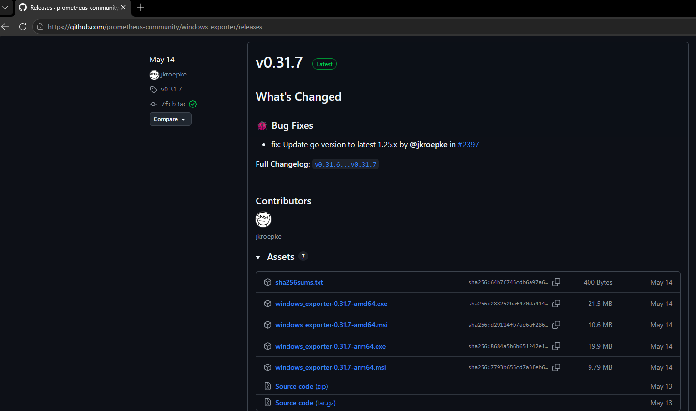
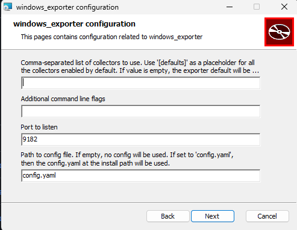
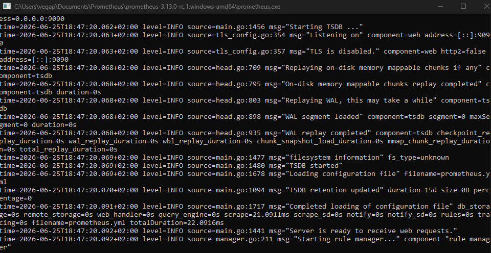
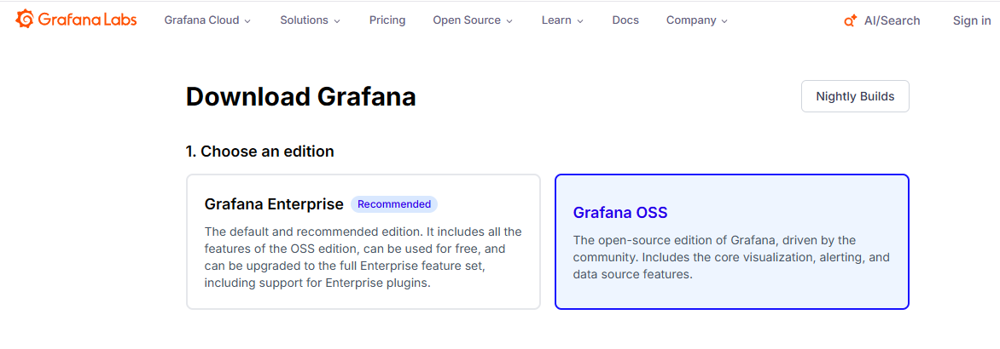
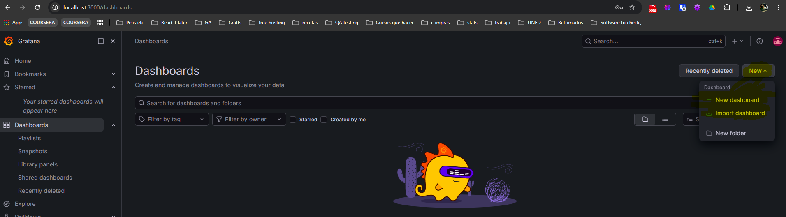

Esta lección es extra y no se vio en clase, aunque está basada en todo lo visto en clase.

# Guía Práctica: Montar un Monitor de Recursos preconfigurado con Grafana en Windows

Esta guía te ayudará a desplegar tu primer entorno de monitorización profesional usando el stack de código abierto más popular: **Grafana + Prometheus + Windows Exporter**. En este laboratorio vamos a usar un tablero preconfigurado creado por la comunidad, así que no entraremos en detalles sobre cómo configurar los dashboad de grafana porque no es el objetivo del curso.

Hasta ahora hemos utilizado herramientas locales de Windows (como el Administrador de Tareas, Resmon o Perfmon) para diagnosticar problemas en tiempo real. Sin embargo, en un entorno empresarial real, los administradores no entran servidor por servidor para ver cómo están; utilizan sistemas centralizados.

Para esta práctica, vamos a abandonar las herramientas locales y montaremos el estándar de la industria (el stack de código abierto más popular). Este entorno se compone de tres piezas fundamentales que trabajan en equipo:

1.  **El Recolector (Windows Exporter):** Es el agente o "chivato" que instalamos en la máquina que queremos vigilar. Las bases de datos modernas no saben leer métricas nativas de Windows directamente. El *Exporter* actúa como un **traductor**: extrae la información del núcleo de Windows (CPU, RAM, Disco) y la expone en una página web local en formato de texto plano estructurado.

2.  **El Almacenamiento (Prometheus):** Es el "cerebro" y la base de datos de series temporales (Time-Series Database). Su trabajo es conectarse cada pocos segundos a la página web que ha creado el Exporter, leer esos datos de texto plano y almacenarlos históricamente con su marca de tiempo exacta. A este modelo de ir a buscar los datos proactivamente se le llama *Pull Model* (modelo de extracción).

3.  **El Visualizador (Grafana):** Es "la cara bonita" del sistema. Grafana no recolecta ni almacena datos por sí mismo. Se conecta a la base de datos de Prometheus, le lanza consultas matemáticas y transforma esos datos crudos en paneles visuales, gráficos interactivos y alertas.

**¿Cómo es el flujo de datos?** El ciclo de vida de una métrica en nuestro sistema funciona así: `Windows genera los datos` ➡️ `Windows Exporter los traduce` ➡️ `Prometheus los recolecta y guarda` ➡️ `Grafana los consulta y los dibuja`.

Una vez entendida la arquitectura de estas tres capas, vamos a montarlas paso a paso.

## Paso 1: Instalar el Recolector (Windows Exporter)

Este será el "chivato" que leerá cómo está tu CPU, RAM, Disco y Red.

1.  Ve a la página oficial de versiones de Windows Exporter en GitHub: <https://github.com/prometheus-community/windows_exporter/releases>

2.  Descarga el archivo que termina en `.msi` (por ejemplo, `windows_exporter-x.xx.x-amd64.msi`). 

3.  Haz doble clic en el instalador y dale a Siguiente \> Instalar. (Se instala como un Servicio de Windows en segundo plano). Deja todo como está por defecto.\
    

4.  **Verificación:** Abre tu navegador de internet y entra en `http://localhost:9182/metrics`.

    - *Si ves una pantalla blanca llena de texto incomprensible con números, ¡funciona perfectamente! Esos son los datos en bruto.*

## Paso 2: Instalar la Base de Datos (Prometheus)

Aquí es donde guardaremos esos datos para poder ver el historial.

1.  Ve a la web oficial de descargas de Prometheus: <https://prometheus.io/download/>

2.  Busca la sección "Prometheus" y descarga la versión para **windows-amd64** (es un archivo `.zip`).

3.  Extrae la carpeta del `.zip` en tu disco duro (por ejemplo, en `C:\Prometheus\`).

4.  Entra en la carpeta y abre el archivo **`prometheus.yml`** con el Bloc de notas.

5.  Ve al final del archivo. Verás una sección llamada `scrape_configs:`. Añade tu Windows Exporter para que quede **exactamente así** (respeta los espacios):

```         
scrape_configs:
  - job_name: "prometheus"
    static_configs:
      - targets: ["localhost:9090"]

  # AÑADE ESTO:
  - job_name: "mi_ordenador_windows"
    static_configs:
      - targets: ["localhost:9182"]
```

6.  Guarda el archivo y haz doble clic en **`prometheus.exe`** para arrancarlo. Se quedará una ventana negra de consola abierta. Déjala ahí.

    

## Paso 3: Instalar el Visualizador (Grafana)

¡Hora de ponerlo bonito!

1.  Ve a la página de descarga de Grafana OSS: <https://grafana.com/grafana/download?platform=windows>

    

2.  Descarga el instalador de Windows (Windows Installer) y ejecútalo.

3.  Una vez instalado, abre tu navegador y ve a: **`http://localhost:3000`**

4.  Te pedirá usuario y contraseña. Pon **`admin`** en ambos. Luego te pedirá que cambies la contraseña (puedes saltarlo dándole a *Skip*).

## Paso 4: Conectar y Crear el Panel Mágico

Ahora tenemos que decirle a Grafana de dónde sacar los datos y qué plantilla usar.

**A. Conectar Prometheus:**

1.  En Grafana, ve al menú izquierdo, haz clic en **Connections** (Conexiones) y luego en **Data Sources** (Orígenes de datos).

2.  Haz clic en el botón azul **Add data source**.

3.  Elige **Prometheus**.

4.  En el campo "Prometheus server URL", escribe: `http://localhost:9090`

5.  Baja hasta el final del todo y haz clic en **Save & test**. (Debería salir un tick verde que dice "Data source is working").

**B. Importar el Panel (Dashboard):** Grafana tiene paneles ya creados por la comunidad para que no tengas que empezar de cero.

1.  En el menú izquierdo, ve a **Dashboards** (paneles) y haz clic en el botón **New** (Nuevo) en la esquina superior derecha, y elige **Import**.

    

2.  En la casilla que dice "Import via grafana.com", escribe el número **`14694`** y dale al botón "Load" a la derecha.

3.  En la siguiente pantalla, abajo del todo donde dice "Prometheus", despliega y selecciona la base de datos de Prometheus que creamos en el paso anterior.

4.  Haz clic en **Import**.

## Paso 5: Crear tu propio gráfico desde cero (Bonus)

Importar está genial, pero para dominar la herramienta hay que saber pescar los datos. Vamos a crear un panel muy sencillo que nos muestre una línea con la **Memoria RAM libre** de nuestro equipo.

1.  En tu dashboard actual (o en uno nuevo), haz clic en el botón *Edit* para poner el tablero en modo de edición

2.  **Add new element** en la barra lateral derecha y luego selecciona **+** en el panel y después *Edit visualization*

    {width="394"}

3.  Te aparecerá la pantalla de edición. En la mitad inferior, verás una pestaña llamada **Query**. Asegúrate de que el origen de datos (Data source) seleccionado sea **Prometheus**.

4.  En la caja de texto que dice *Metric* , escribe exactamente esta métrica que genera el Exporter: `windows_memory_physical_free_bites`

5.  Selecciona el tipo de grafico que quieres: time series.

6.  **¡A ponerlo bonito!** En el menú de la derecha, busca la sección **Panel options** y en *Title* escribe "RAM Libre".

7.  Baja un poco más en ese mismo menú derecho hasta la sección **Standard options**. En *Unit* (Unidad), haz clic en "Choose", escribe "bytes" y selecciona **Data \> bytes(IEC)**. Esto hará que Grafana traduzca automáticamente esos millones de bytes crudos a Gigabytes (GB) de forma legible.

8.  Para terminar, haz clic en el botón azul **Save** arriba a la derecha.

::: nota
Como hemos instalado Grafana y Windows Exporter usando instaladores oficiales, Windows ya los ha configurado automáticamente como **Servicios** (exactamente esos que estudiaste en tus apuntes). Es decir, arrancan solos de forma invisible cada vez que enciendes el PC.

Sin embargo, Prometheus lo descargamos en un `.zip` portátil. Ahora mismo está corriendo en esa ventana negra de consola. Si la cierras (o si reinicias el ordenador), Prometheus se apaga. Grafana seguirá funcionando y cargando la web, pero **las gráficas se quedarán congeladas** porque la base de datos no está recogiendo información nueva.

Para que tu monitor sea 100% autónomo y no tengas que abrir Prometheus a mano cada día, vamos a ver un truco de Administrador de Sistemas usando una herramienta nativa de Windows: el **Programador de tareas**.

Aquí tienes cómo hacerlo en un par de clics para que arranque solo y de forma invisible:

1.  Cierra la ventana negra de Prometheus (para apagarlo ahora mismo).

2.  Abre el menú de inicio de Windows, escribe **Programador de tareas** (o *Task Scheduler* si lo tienes en inglés) y ábrelo.

3.  En el menú de la derecha, haz clic en **"Crear tarea básica..."**.

4.  **Nombre:** Ponle algo como `Iniciar Prometheus` y dale a Siguiente.

5.  **Desencadenador:** Elige **"Al iniciar el equipo"** y dale a Siguiente.

6.  **Acción:** Elige **"Iniciar un programa"** y dale a Siguiente.

7.  **Programa/script:** Dale a "Examinar" y busca tu archivo `prometheus.exe`.

8.  **MUY IMPORTANTE - Iniciar en (opcional):** Aquí tienes que escribir la ruta de la carpeta donde está Prometheus (por ejemplo: `C:\Prometheus\`). Si no pones esto, Prometheus no sabrá dónde encontrar su archivo de configuración `.yml`. Dale a Siguiente y luego a Finalizar.

**El último toque maestro (para que sea invisible):**

- En la lista del Programador de tareas, busca la tarea que acabas de crear ("Iniciar Prometheus"), haz doble clic sobre ella para abrir sus Propiedades.

- En la pestaña *General*, marca la casilla **"Ejecutar tanto si el usuario inició sesión como si no"** y también marca **"Ejecutar con los privilegios más altos"**. (Te pedirá la contraseña de tu usuario de Windows para confirmar).

¡Y listo! Ya puedes reiniciar el ordenador tranquilamente. A partir de ahora, Grafana, Windows Exporter y Prometheus arrancarán solos en segundo plano sin que tú veas ninguna consola negra, y tendrás tu dashboard de métricas siempre disponible en `localhost:3000`.

------------------------------------------------------------------------

**Los datos de Prometheus**

- **¿Dónde se guardan?** Cuando arrancas Prometheus por primera vez, él crea automáticamente una carpeta llamada `data` justo al lado del archivo `prometheus.exe`. Ahí dentro es donde va escribiendo todo el historial en su propio formato. Aunque cierres la ventana negra y la vuelvas a abrir mañana, Prometheus leerá esa carpeta y el gráfico continuará donde lo dejaste.

- **El borrado automático (Retención):** Por defecto, Prometheus está configurado para guardar los datos durante **15 días**. Una vez que se alcanza el día 16, empieza a borrar automáticamente los datos más antiguos. Nunca va a crecer de forma descontrolada.

- **¿Cómo borrarlo tú manualmente?** Como esto es un laboratorio para hacer pruebas, si algún día quieres hacer "borrón y cuenta nueva", es súper sencillo:

  - Cierra la ventana negra de Prometheus.

  - Ve a la carpeta donde lo tienes guardado.

  - Selecciona la carpeta **`data`** y bórrala sin miedo.

  - La próxima vez que arranques Prometheus, creará una carpeta `data` nueva y empezará a grabar desde cero.
:::