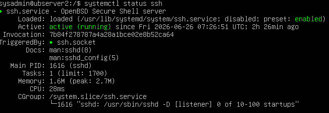

Para conectarnos a un servidor Linux de forma remota, podemos usar el protocolo SSH (Secure Shell). Para ello, necesitamos tener un cliente SSH instalado en nuestra máquina local y conocer la dirección IP o el nombre de dominio del servidor al que queremos conectarnos, así como las credenciales de usuario.

Para comprobar si tenemos un cliente SSH instalado, podemos abrir una terminal y ejecutar el comando `ssh -V`. Si el cliente está instalado, veremos la versión del mismo. Si no está instalado, podemos instalarlo usando el gestor de paquetes de nuestra distribución de Linux o descargarlo desde el sitio web oficial.

En Debian, Ubuntu, o Mint puedes instalarlo:

``` bash
sudo apt update # Actualiza la lista de paquetes disponibles (el catálogo). Este comando no instala nada.
sudo apt upgrade # Actualiza los paquetes instalados en tu sistema.
```

``` bash
sudo apt install openssh-server
```

Para ver si está habilitado o deshabilitado el servicio SSH en el servidor, podemos usar el comando `systemctl status ssh` o `systemctl status sshd`, dependiendo de la distribución de Linux. Si el servicio está activo, veremos un mensaje indicando que está en ejecución.



Si está instalado pero no está activo, podemos iniciarlo con `sudo systemctl start ssh` o `sudo systemctl start sshd`. También podemos usar `systemctl enable ssh` o `systemctl enable sshd` para habilitar el servicio SSH para que se inicie automáticamente al arrancar el sistema.

El comando básico para conectarse a un servidor remoto es:

``` bash
ssh usuario@direccion_ip_del_servidor
```

Por ejemplo, si nuestro nombre de usuario es "juan" y la dirección IP del servidor es "12.34.56.78", el comando sería:

``` bash
ssh juan@12.34.56.78
```

Si es la primera vez que nos conectamos a ese servidor, se nos pedirá que confirmemos la autenticidad del host y que aceptemos su clave pública. Una vez aceptada, se nos pedirá la contraseña del usuario para iniciar sesión. Si la autenticidad del host ya ha sido confirmada previamente, se nos pedirá directamente la contraseña del usuario.
