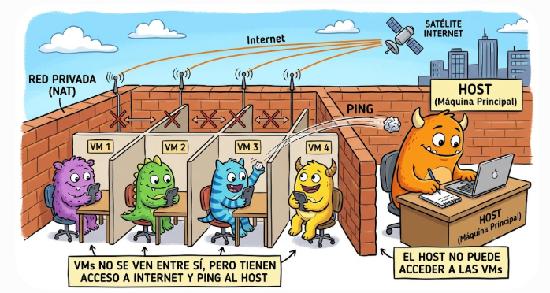
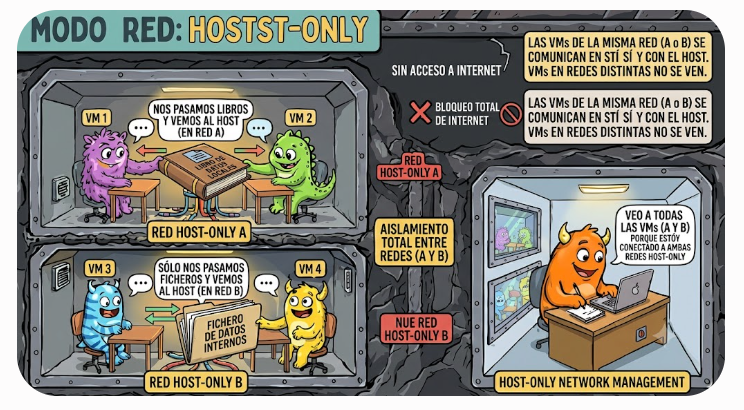
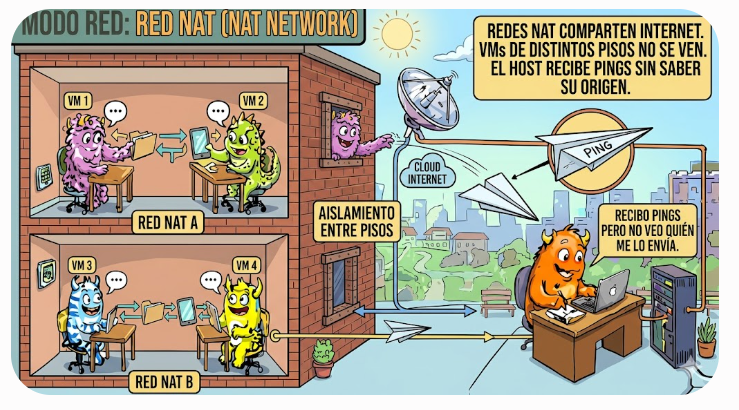
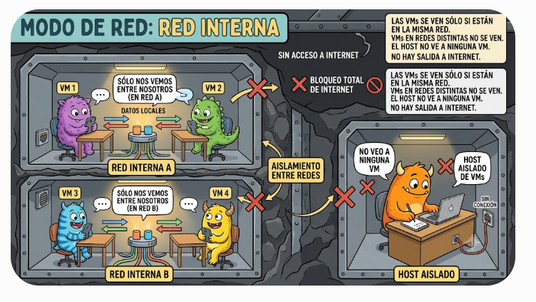

# Modelos de servicio en la nube: IaaS, PaaS y SaaS

Los servicios en la nube se organizan en tres grandes modelos según el nivel de control que tiene el usuario y el nivel de gestión que ofrece el proveedor. De menor a mayor abstracción:

-   IaaS -- Infraestructura como servicio.
-   PaaS -- Plataforma como servicio.
-   SaaS -- Software como servicio.

A medida que avanzamos hacia SaaS, el proveedor gestiona más cosas y el usuario se preocupa de menos.

## IaaS --- Infrastructure as a Service

El proveedor te da la infraestructura básica: máquinas virtuales, redes, almacenamiento. Tú instalas y gestionas todo lo demás. Se usa cuando necesitas control total sobre el sistema operativo, las aplicaciones y la configuración. Ejemplos: Microsoft Azure: máquinas virtuales (Azure VM), Amazon AWS EC2, Google Compute Engine

Ejemplo cotidiano: Es como alquilar un piso vacío: tú pones los muebles, la decoración y decides cómo usarlo.

## PaaS --- Platform as a Service

El proveedor te da una plataforma lista para desarrollar y desplegar aplicaciones. Tú solo te ocupas del código. ¿Cuándo se usa? Cuando quieres desarrollar aplicaciones sin preocuparte por servidores, actualizaciones o bases de datos. Ejemplos: Azure App Service, Google App Engine, Heroku

Ejemplo cotidiano: Es como alquilar un piso amueblado: tú solo te preocupas de vivir, no de comprar muebles ni hacer reformas.

## SaaS --- Software as a Service

El proveedor ofrece una aplicación completa lista para usar. Tú solo la utilizas desde el navegador o una app. Se usa cuando necesitas una herramienta sin instalar nada ni gestionar servidores. Ejemplos: Microsoft 365 (Word, Excel online), Google Workspace (Gmail, Drive), Dropbox, Salesforce.

Ejemplo cotidiano: Es como alojarte en un hotel: todo está listo, tú solo usas el servicio.

::: column-page
::: summary
| Modelo   | Significa                   | Qué gestiona el proveedor                      | Qué gestiona el usuario                            | Ejemplos                                     |
|---------------|---------------|---------------|---------------|---------------|
| **IaaS** | Infrastructure as a Service | Hardware, red, almacenamiento, virtualización  | SO, aplicaciones, configuración, seguridad interna | AWS EC2, Azure VM, Google Compute Engine     |
| **PaaS** | Platform as a Service       | Infraestructura + SO + runtime + base de datos | Solo el código y la lógica de la app               | Heroku, Azure App Service, Google App Engine |
| **SaaS** | Software as a Service       | Todo: infraestructura, plataforma y aplicación | Solo usar la aplicación                            | Gmail, Office 365, Dropbox                   |
:::
:::

```         
            Nivel de control del usuario
            ↑
            │   Más control
            │
            │   ┌───────────────────────────────┐
            │   │            IaaS                │
            │   │ Infraestructura como servicio  │
            │   │ Tú gestionas: SO y apps        │
            │   └───────────────────────────────┘
            │
            │   ┌───────────────────────────────┐
            │   │            PaaS                │
            │   │ Plataforma como servicio       │
            │   │ Tú gestionas: solo el código   │
            │   └───────────────────────────────┘
            │
            │   ┌───────────────────────────────┐
            │   │            SaaS                │
            │   │ Software como servicio         │
            │   │ Tú solo usas la aplicación     │
            │   └───────────────────────────────┘
            │
            └────────────────────────────────────────→
                       Más servicios gestionados
```

# Virtualización: Historia y Concepto

La virtualización surgió para **aprovechar mejor los recursos** de los servidores.

### Antes

Un servidor físico → 1 SO → 1 aplicación\
Resultado: recursos infrautilizados.

### Ahora

Un servidor físico → varias máquinas virtuales → múltiples servicios\
Resultado: mejor aprovechamiento y menor coste.

*Ejemplo:*\
En un solo servidor físico podemos tenerr, por ejemplo: un servidor de bases de datos ,un servidor web y un servidor de correo.

### Tipos de hipervisores

-   **Tipo 1 (bare metal)**\
    Se instalan directamente sobre el hardware.\
    Ej.: VMware ESXi, Hyper-V Server, Proxmox.\
    *Más eficientes.*
-   **Tipo 2 (sobre SO)**\
    Se instalan como una aplicación dentro del SO.\
    Ejemplos:
    -   **VirtualBox** → El más usado en general. Gratuito, fácil, multiplataforma.
    -   **VMware Workstation** → Muy popular en entornos profesionales. Player es gratis, Pro es de pago.
    -   **Hyper‑V** → Integrado en Windows Pro/Enterprise. Menos usado por estudiantes.
    -   **Parallels** → Muy usado en Mac, especialmente con Apple Silicon.
    -   **QEMU/KVM** → Popular en Linux y servidores, más técnico. *Menos eficientes.*

### Contenedores

Más ligeros que las VM.\
Comparten el kernel del SO anfitrión.\
Ejemplos: Docker, Podman.

------------------------------------------------------------------------

## Núcleos Virtuales (vCPU)

Una máquina virtual recibe recursos del servidor físico:

-   RAM
-   Almacenamiento
-   CPU (vCPU)

Para un DBA es importante saber cuántas vCPU tiene la máquina, ya que afecta directamente al rendimiento del motor de base de datos.

*Ejemplo:*\
Una base de datos con solo 2 vCPU puede saturarse rápidamente si hay muchas consultas concurrentes.

------------------------------------------------------------------------

## VLAN (virtual LAN, redes virtuales).

Una VLAN (Virtual LAN) es una forma de dividir una red física en varias redes lógicas independientes, aunque todos los dispositivos estén conectados al mismo switch. Es como si crearas "sub‑redes invisibles" dentro de una red más grande.

Una VLAN permite que un grupo de dispositivos se comuniquen como si estuvieran en su propia red privada, aunque físicamente compartan el mismo cableado y los mismos switches.

¿Por qué existen las VLAN? Porque en redes medianas o grandes necesitas orden, seguridad y eficiencia. Sin VLAN, todo estaría mezclado en un único dominio de broadcast, lo que genera ruido, riesgos y mala organización.

Los dispositivos solo pueden comunicarse con otros dentro de la misma VLAN. Para comunicar VLAN entre sí, necesitas un router o un switch capa 3 (inter‑VLAN routing).

Beneficios principales - Seguridad: Aísla grupos de dispositivos. Ejemplo: - VLAN 10: Administración - VLAN 20: Invitados - VLAN 30: Cámaras IP Los invitados no pueden ver los equipos de administración.

-   Rendimiento
    -   Reduce el tráfico innecesario (broadcast).
    -   Cada VLAN tiene su propio dominio de broadcast.
-   Organización
    -   Agrupa dispositivos por función, no por ubicación física.
    -   Puedes tener PCs en diferentes plantas pero en la misma VLAN.
-   Ahorro - No necesitas más switches físicos para separar redes.

Ejemplo: Imagina un switch con 8 puertos:

-   Puertos 1--4 → VLAN 10 (Oficina)
-   Puertos 5--6 → VLAN 20 (Invitados)
-   Puertos 7--8 → VLAN 30 (Cámaras)

Aunque todos estén en el mismo switch, cada grupo está aislado.

## Redes en la máquina virtual

### NAT

Cuando creas una máquina virtual en VirtualBox (o en la mayoría de hipervisores), el programa genera por defecto una red virtual privada llamada **NAT (Network Address Translation)**. Esta red funciona de manera aislada del resto del sistema.

¿Qué significa esto? VirtualBox crea un router virtual interno. Ese router asigna automáticamente direcciones IP privadas a las máquinas virtuales. Normalmente asigna direcciones del tipo: 10.0.2.15 (el ".15" suele ser la primera IP que entrega el DHCP interno).

Esta red no es la misma que la red del ordenador anfitrión.

La máquina virtual no puede comunicarse directamente con:

-   otras máquinas virtuales,
-   otros equipos de la red física,
-   ni siquiera con el propio host.

¿Por qué se hace así? Porque el modo NAT está pensado para:

-   garantizar aislamiento,
-   permitir que la VM tenga acceso a Internet sin exponerla a la red real,
-   evitar conflictos de direcciones IP,
-   simplificar la configuración para usuarios principiantes.

En este modo, la VM "sale a Internet" como si fuera el propio host, pero no es accesible desde fuera.

Resumen La VM recibe una IP privada automática (ej. 10.0.2.15)

Esa IP pertenece a una red virtual interna creada por VirtualBox

```         
            ┌──────────────────────────────┐
            │      Ordenador anfitrión     │
            │      (tu PC real)            │
            │  IP real: 192.168.1.x        │
            └──────────────┬───────────────┘                         
                           │  (No hay conexión directa)
            ┌──────────────┴───────────────┐
            │     Router virtual NAT       │
            │  (creado por VirtualBox)     │
            │  Red interna: 10.0.2.0/24    │
            │  DHCP interno: asigna IPs    │
            └──────────────┬───────────────┘
                           │  IP asignada por defecto
                           ▼
            ┌──────────────────────────────┐
            │     Máquina Virtual (VM)     │
            │     Windows 10               │
            │     IP: 10.0.2.15            │
            │     Aislada del host         │
            │     No accesible desde fuera │
            └──────────────────────────────┘
```

-   Esa red no se comunica con la red del host
-   Solo permite que la VM acceda a Internet a través del host
-   No permite conexiones entrantes hacia la VM



### Adaptador Puente  (Bridged )

Este modo conecta la máquina virtual directamente a la red física, como si fuera otro ordenador más conectado al router.

La VM obtiene una IP de la misma red que el host (por ejemplo, 192.168.1.x).

Puede comunicarse con:

-   el host,
-   otros equipos de la red,
-   otras VMs en modo puente.

Es accesible desde fuera (por ejemplo, para hacer ping o compartir carpetas).

```         
            ┌──────────────────────────────┐
            │      Ordenador anfitrión     │
            │   IP: 192.168.1.20           │
            └──────────────┬───────────────┘
                           │
                 Red física (router)
                           │
            ┌──────────────┴───────────────┐
            │     Máquina Virtual (VM)     │
            │   IP: 192.168.1.34           │
            │  (como otro equipo más)      │
            └──────────────────────────────┘
```

### Modo Sólo anfitrión (Host‑Only)

Este modo crea una red privada solo entre el host y la VM. No tiene acceso a Internet, pero sí permite comunicación directa entre ambos. - La VM obtiene una IP de una red privada creada por VirtualBox (por ejemplo, 192.168.56.x). - El adaptador virtual de red que crea VirtualBox pone al anfitrión en esa red. - Puede comunicarse solo con el host y con otras VM en su misma red. - No tiene acceso a la red física ni a Internet (a menos que se combine con NAT). - Aquí sí hay opción de habilitar DHCP para que asigne las ips de las máquinas vms.

```         
                         ┌──────────────────────────────────────┐
                         │          Ordenador anfitrión         │
                         │                                      │
                         │  Host‑Only Red A: 192.168.56.1       │
                         │  Host‑Only Red B: 192.168.57.1       │
                         └───────────────┬───────────────┬──────┘
                                         │               │
                                         │               │
                               Red A (Host‑Only)   Red B (Host‑Only)
                                         │               │
                     ┌───────────────────┘               └───────────────────┐
                     │                                                       │
                     ▼                                                       ▼
            ┌──────────────────────┐                           ┌──────────────────────┐
            │        VM1           │                           │        VM3           │
            │  Red A: 192.168.56.10│                           │  Red B: 192.168.57.10│
            │  Se comunica con VM2 │                           │  Solo habla con host │
            │  No ve a VM3         │                           │  No ve a VM1 ni VM2  │
            └──────────────────────┘                           └──────────────────────┘
                     ▼
            ┌──────────────────────┐
            │        VM2           │
            │  Red A: 192.168.56.11│
            │  Se comunica con VM1 │
            │  No ve a VM3         │
            └──────────────────────┘
```

### Red NAT (NAT Network)

La Red NAT es un modo de red diferente al NAT normal. En lugar de crear una red privada aislada para cada máquina virtual, VirtualBox crea una red virtual compartida, donde varias VMs pueden comunicarse entre sí como si estuvieran en una misma LAN virtual, pero sin comunicarse con el host ni con la red física.

En este modo, VirtualBox genera una red interna (por ejemplo, 10.0.2.0/24 o 10.0.3.0/24) y un router virtual que actúa como puerta de enlace para todas las máquinas conectadas a esa Red NAT. Todas las VMs reciben una IP del mismo rango mediante un servidor DHCP interno.

A diferencia del NAT normal:

-   Las VMs sí pueden comunicarse entre ellas (ping, compartir servicios, etc.).
-   Las VMs no pueden comunicarse con el host.
-   Las VMs no son accesibles desde la red física.
-   Todas comparten la misma salida a Internet a través del router virtual.

Este modo es útil cuando necesitas que varias máquinas virtuales trabajen juntas (por ejemplo, un servidor y un cliente) sin exponerlas a la red real.

```         

                     ┌──────────────────────────────┐
                     │     Ordenador anfitrión      │
                     │     (tu PC real)             │
                     │  Red física: 192.168.1.x     │
                     └──────────────┬───────────────┘
                                    │
                          (No hay conexión directa)
                                    │
                     ┌──────────────┴───────────────┐
                     │     Router virtual NAT       │
                     │   Red NAT: 10.0.3.0/24       │
                     │   DHCP interno activo        │
                     └──────────────┬───────────────┘
                                    │
                     ┌──────────────┼───────────────┐
                     │              │               │
                     ▼              ▼               ▼
       ┌────────────────┐  ┌────────────────┐  ┌────────────────┐
       │ VM 1           │  │ VM 2           │  │ VM 3           │
       │ IP: 10.0.3.10  │  │ IP: 10.0.3.11  │  │ IP: 10.0.3.12  │
       │ Se ven entre sí│  │ Se ven entre sí│  │ Se ven entre sí│
       │ No ven al host │  │ No ven al host │  │ No ven al host │
       └────────────────┘  └────────────────┘  └────────────────┘
```

### Red Interna (Internal Network)

El modo Red Interna crea una red completamente aislada dentro de VirtualBox, donde solo las máquinas virtuales conectadas a esa misma red interna pueden comunicarse entre sí. No hay acceso al host, ni a la red física, ni a Internet.

A diferencia de Red NAT, en la Red Interna no existe un router virtual que proporcione salida a Internet ni un servidor DHCP que asigne direcciones automáticamente. Por eso, si queremos que las máquinas virtuales se comuniquen entre sí, debemos configurar manualmente la dirección IP y la máscara de red en cada una de ellas. Cuando una tarjeta de red en Windows está configurada para obtener una IP automáticamente (DHCP), el sistema hace lo siguiente: - Envía una petición DHCP para pedir una dirección IP. - Si nadie responde (porque no hay router, no hay servidor DHCP o estás en una red interna sin servicios), Windows no puede obtener una IP válida. - Entonces se asigna a sí mismo una dirección APIPA (Automatic Private IP Addressing), del rango:169.254.0.0 -- 169.254.255.255. Cuando entras en Ethernet → Cambiar opciones del adaptador, ves algo como: 169.254.5.246 Estas direcciones solo sirven para comunicación local muy limitada, y en VirtualBox normalmente no sirven para nada, porque: - no permiten comunicación entre VMs (a menos que todas caigan por casualidad en el mismo rango APIPA), - no permiten comunicación con el host, - no permiten salir a Internet. Por eso, para configurarla correctamente, entramos en Propiedades → Protocolo de Internet versión 4 (TCP/IPv4) y asignamos manualmente la IP, la máscara de red y dejamos vacía la puerta de enlace predeterminada, ya que no vamos a salir a Internet.

Este modo es ideal para laboratorios cerrados, entornos de pruebas, simulaciones de redes o prácticas donde necesitas varias máquinas comunicándose entre sí sin ningún tipo de exposición externa.

Resumen: - Las VMs se ven entre ellas si están en la misma red interna. - No pueden comunicarse con el host. - No tienen acceso a Internet. - No hay DHCP salvo que lo configures tú. - Es la red más aislada de todas.

```         
                     ┌───────────────────────────────┐
                     │     Ordenador anfitrión       │
                     │  (sin acceso a la red interna)│
                     └───────────────────────────────┘
                                     
                            (Aislamiento total)
                                     
                     ┌───────────────────────────────┐
                     │       Red Interna             │
                     │    (sin router, sin DHCP)     │
                     └───────────────┬───────────────┘
                                     │
                     ┌───────────────┼───────────────┐
                     │               │               │
                     ▼               ▼               ▼
         ┌────────────────┐  ┌────────────────┐  ┌────────────────┐
         │ VM 1           │  │ VM 2           │  │ VM 3           │
         │ IP manual      │  │ IP manual      │  │ IP manual      │
         │ Se ven entre sí│  │ Se ven entre sí│  │ Se ven entre sí│
         │ No ven al host │  │ No ven al host │  │ No ven al host │
         └────────────────┘  └────────────────┘  └────────────────┘
```


## Tabla comparativa de modos de red en VirtualBox

::: {.column-page}
<table class="table table-striped table-hover">
  <thead>
    <tr>
      <th rowspan="2" style="vertical-align: middle;">Modo de red</th>
      <th colspan="4" style="text-align: center; border: 2px solid #ced4da; border-bottom: none; background-color: #f8f9fa;">Comunicación con...</th>
      <th rowspan="2" style="vertical-align: middle; padding-left: 20px;">Características principales</th>
    </tr>
    <tr>
      <th style="text-align: center; border-left: 2px solid #ced4da; border-bottom: 2px solid #ced4da; background-color: #f8f9fa;">El Host</th>
      <th style="text-align: center; border-bottom: 2px solid #ced4da; background-color: #f8f9fa;">Otras VMs</th>
      <th style="text-align: center; border-bottom: 2px solid #ced4da; background-color: #f8f9fa;">Red Física</th>
      <th style="text-align: center; border-right: 2px solid #ced4da; border-bottom: 2px solid #ced4da; background-color: #f8f9fa;">Internet</th>
    </tr>
  </thead>
  <tbody>
    <tr>
      <td><strong>NAT</strong></td>
      <td style="border-left: 2px solid #ced4da;">❌ No</td>
      <td>❌ No</td>
      <td>❌ No</td>
      <td style="border-right: 2px solid #ced4da;">✔️ Sí</td>
      <td style="padding-left: 20px;">Aislamiento total. La VM sale a Internet a través del host, pero no es accesible desde fuera.</td>
    </tr>
    <tr>
      <td><strong>Red NAT</strong></td>
      <td style="border-left: 2px solid #ced4da;">❌ No</td>
      <td>✔️ Sí</td>
      <td>❌ No</td>
      <td style="border-right: 2px solid #ced4da;">✔️ Sí</td>
      <td style="padding-left: 20px;">Red virtual compartida entre varias VMs. Se ven entre ellas, pero no ven al host ni a la red física.</td>
    </tr>
    <tr>
      <td><strong>Adaptador Puente</strong></td>
      <td style="border-left: 2px solid #ced4da;">✔️ Sí</td>
      <td>✔️ Sí</td>
      <td>✔️ Sí</td>
      <td style="border-right: 2px solid #ced4da;">✔️ Sí</td>
      <td style="padding-left: 20px;">La VM actúa como un equipo más de la red física. Recibe una IP del router real. Es accesible desde fuera.</td>
    </tr>
    <tr>
      <td><strong>Host‑Only</strong></td>
      <td style="border-left: 2px solid #ced4da;">✔️ Sí</td>
      <td>✔️ Sí (misma red Host-Only)</td>
      <td>❌ No</td>
      <td style="border-right: 2px solid #ced4da;">❌ No</td>
      <td style="padding-left: 20px;">Red privada entre host y VM. No tiene Internet. Útil para laboratorios locales.</td>
    </tr>
    <tr>
      <td><strong>Red Interna</strong></td>
      <td style="border-left: 2px solid #ced4da;">❌ No</td>
      <td>✔️ Sí (misma red interna)</td>
      <td>❌ No</td>
      <td style="border-right: 2px solid #ced4da;">❌ No</td>
      <td style="padding-left: 20px;">Red completamente aislada. Solo VMs entre sí. Sin host, sin Internet, sin DHCP salvo que lo configures.</td>
    </tr>
  </tbody>
</table>

:::

::: column-page
```         
                                 ┌───────────────────────────────┐
                                 │        Red física real        │
                                 │       (router 192.168.1.x)    │
                                 └───────────────┬───────────────┘
                                                 │
                                                 │
     ┌─────────────────────┬─────────────────────┴─────┬─────────────────────┬─────────────────────┐
     │                     │                           │                     │                     │
     ▼                     ▼                           ▼                     ▼                     ▼

┌──────────────────┐  ┌──────────────────┐  ┌──────────────────┐  ┌──────────────────┐  ┌───────────────────┐
│       NAT        │  │     Red NAT      │  │   Adaptador      │  │    Host‑Only     │  │   Red Interna     │
│ (aislado total)  │  │ (VMs juntas)     │  │     Puente       │  │ (host ↔ VM)      │  │(solo VMs entre sí)│
└──────────────────┘  └──────────────────┘  └──────────────────┘  └──────────────────┘  └───────────────────┘
          │                      │                     │                      │                     │
          │                      │                     │                      │                     │
Host  ❌  ┘         Host  ❌────┘         Host  ✔️────┘         Host  ✔️────┘         Host  ❌────┘
VMs   ❌  ┘         VMs  ✔️─────┘         VMs  ✔️─────┘         VMs  ✔️─────┘         VMs  ✔️─────┘
Física❌  ┘         Física❌────┘         Física✔️────┘         Física❌ ───┘         Física❌────┘
Internet✔️┘         Internet✔️──┘         Internet✔️──┘         Internet❌──┘         Internet❌──┘
```

HOST: comunicación entre la VM y el ordenador anfitrión (tu PC). VMS: comunicación entre máquinas virtuales dentro del mismo modo de red. FÍSICA: acceso a la red física real (router, otros PCs, impresoras). INTERNET: posibilidad de salir a Internet desde la VM.
:::

------------------------------------------------------------------------

::: practica

# Práctica: Instalar un hypervisor, crear una máquina virtual e instalar Windows 10

## Cambiar privilegios de usuario (si es necesario)

Antes de instalar software de virtualización, asegúrate de que tu cuenta tiene permisos suficientes.\
Si tu usuario no es administrador, puedes cambiar el tipo de cuenta desde una sesión con privilegios elevados.

### Cambiar permisos de cuentas de usuario (Administrador / Estándar)

Desde una cuenta con derechos de administrador: 1. Abre **Configuración**. 2. Ve a **Cuentas**. 3. Entra en **Otros usuarios**. 4. Selecciona el usuario que quieres modificar. 5. Haz clic en **Cambiar tipo de cuenta**. 6. Selecciona **Administrador**. 7. Acepta los cambios. 8. Reinincia el ordenador

## Habilitar la virtualización (si es necesario)

La virtualización suele venir activada por defecto, pero si no es así, debes habilitarla desde la BIOS/UEFI.\
Estas instrucciones son para equipos con procesadores **Intel**; en AMD la opción puede tener otro nombre.

### Comprobar si la virtualización ya está activada

Puedes verificarlo desde Windows:

-   Pulsa **Ctrl + Shift + Esc** → pestaña **Rendimiento** → **CPU**\
    Busca el campo **Virtualización**.\
    Si aparece *Habilitada*, no necesitas hacer nada.

O bien:

-   Ejecuta `msinfo32`\
    Revisa el campo **Virtualización habilitada en firmware**.

### Entrar en la BIOS/UEFI

1.  Reinicia el equipo.
2.  Durante el arranque, pulsa repetidamente una de estas teclas (según fabricante):\
    **F2**, **Supr**, **Esc**, **F10**, **F12**.

### Activar la opción de virtualización

Una vez dentro de la BIOS/UEFI:

-   Entra en menús como **Advanced**, **Advanced BIOS Features**, **Security**, **CPU Configuration** o **System Configuration**.
-   Busca opciones como:
    -   *Intel Virtualization Technology*
    -   *Intel VT‑x*
    -   *Intel VT‑d*
    -   *Virtualization Support*
-   Cambia el valor a **Enabled**.

### Guardar cambios y reiniciar

-   Selecciona **Save & Exit** o pulsa **F10**.
-   Confirma los cambios.

### Activar funciones opcionales de Windows (si las necesitas)

Algunos programas requieren componentes adicionales:

1.  Busca en Windows: **Activar o desactivar las características de Windows**.
2.  Marca según necesidad:
    -   **Hyper‑V** (solo Windows Pro/Enterprise)

    -   **Plataforma de máquina virtual** (para WSL2)

    -   **Plataforma del hipervisor de Windows**

## Instalar el programa de virtualización (Hipervisor)

Usaremos **Oracle VirtualBox**, disponible en: <https://www.virtualbox.org/wiki/Downloads>

Descarga el paquete correspondiente a tu sistema operativo:

-   Windows hosts
-   macOS (Intel o Apple Silicon)
-   Linux distributions
-   Solaris hosts
-   También descarga el **VirtualBox Extension Pack**, que añade funciones adicionales.
-   Instala primero **VirtualBox**.
-   Después instala el **Extension Pack**.

------------------------------------------------------------------------

## Descargar la ISO de Windows 10

Para obtener la imagen ISO oficial:

1.  Ve a la página de creación de medios:\
    https://support.microsoft.com/es-es/windows/crear-medios-de-instalación-para-windows-99a58364-8c02-206f-aa6f-40c3b507420d
2.  Descarga la herramienta **MediaCreationTool.exe**.
3.  Ejecútala y acepta los términos.
4.  Selecciona **Crear medios de instalación**.
5.  Elige idioma, edición y arquitectura (normalmente **x64**).
6.  En el último paso, selecciona **Archivo ISO**.
7.  Guarda el archivo, que tendrá un nombre similar a:\
    `Win10_22H2_Spanish_x64.iso`

------------------------------------------------------------------------

## Crear una máquina virtual para Windows 10 en Oracle VirtualBox

1.  Abre **Oracle VirtualBox**.
2.  Haz clic en **Nueva**.
3.  Configura la máquina virtual:
    -   **Nombre:** Windows 10
    -   **RAM:** 4 GB
    -   **CPU:** 2 núcleos
    -   **Almacenamiento:** 50 GB
4.  Cambia el **orden de arranque** a:
    1.  Disco duro
    2.  Óptica
5.  En **Configuración → Almacenamiento**, selecciona el **Puerto SATA1 (unidad óptica)**.
6.  Carga la **ISO de Windows 10** descargada anteriormente.
7.  Inicia la máquina virtual.
8.  Durante la instalación, selecciona la edición **Windows 10 Pro**.

Para activar la licencia de Windows 10 en google buscamos MAS 1.8. y descargamos el script correspondiente y seguimos las instrucciones para activar Windows. :::

## Instalación de Guest Additions (Complementos del Invitado) en VirtualBox

Instalar **Guest Additions** en una máquina virtual dentro de VirtualBox es un paso casi obligatorio si se desea:

-   Carpetas compartidas
-   Copiar y pegar entre host y VM
-   Pantalla completa
-   Mejor rendimiento gráfico
-   Drag & drop

------------------------------------------------------------------------

### Instalación en una máquina virtual con Windows

1.  En la VM, abrir el menú **Dispositivos**.\
2.  Seleccionar **Insertar imagen de CD de los complementos de invitado**.\
3.  Abrir el explorador de archivos.\
4.  En **Este equipo**, aparecerá un CD virtual.\
5.  Dentro del CD, seleccionar el instalador correspondiente al sistema operativo y arquitectura.

------------------------------------------------------------------------

### Instalación de Guest Additions en Linux Ubuntu

1.  Insertar la imagen de Guest Additions desde VirtualBox:

    -   Menú **Dispositivos**
    -   **Insertar imagen de CD de los complementos de invitado**

2.  Abrir el explorador de archivos.

    -   Normalmente aparece una ventana preguntando si se desea ejecutar el instalador.

    -   Si no aparece, montar el CD manualmente:

        ``` bash
        sudo mount /dev/cdrom /mnt
        ```

3.  En **Este equipo**, aparecerá un CD virtual.

    -   Los ejecutables en Linux terminan en `.sh` en lugar de `.exe`.

4.  Hacer clic derecho en `autorun.sh` y seleccionar **Ejecutar como programa**.

    -   Si no se permite la ejecución, el sistema avisará que es necesario instalar `bzip2.tar`.

4.1. Abrir la terminal y actualizar el repositorio para evitar errores de compilación:

````         
``` bash
sudo apt update
sudo apt upgrade
```
````

4.2. Instalar bzip2

``` bash
sudo apt install bzip2
```

4.3. Volver al explorador y ejecutar nuevamente `autorun.sh.`

En linux, en distros basadas en devian, para ver nuestra ip escribimos `ip ad`
:::
