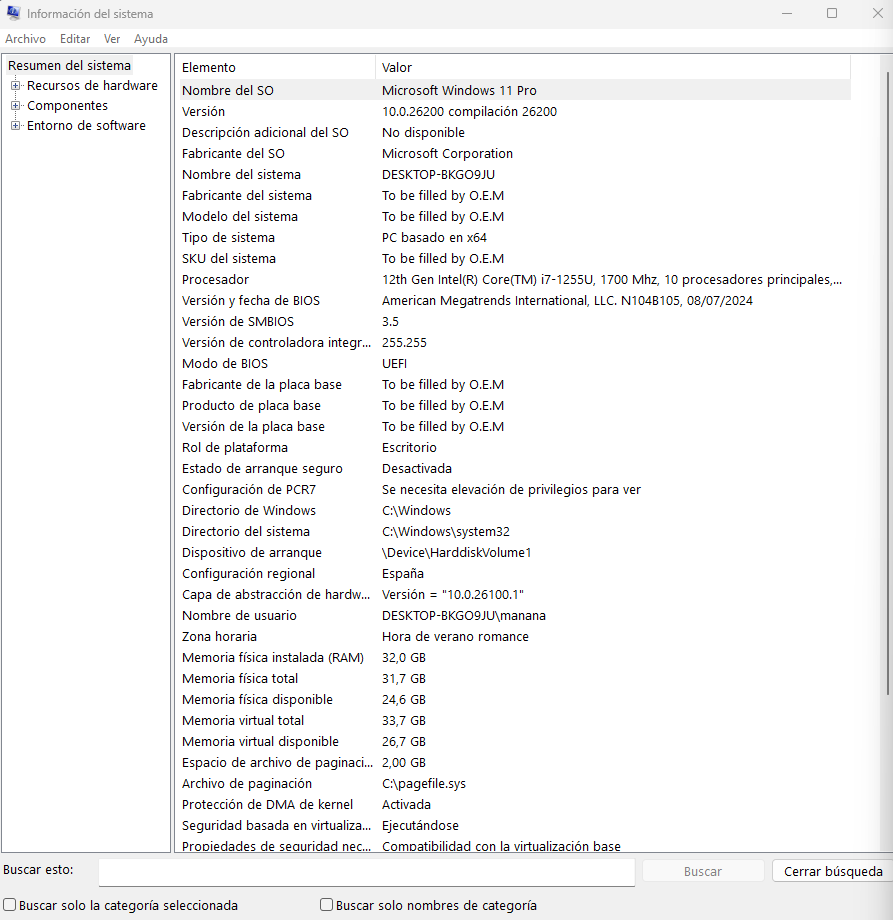
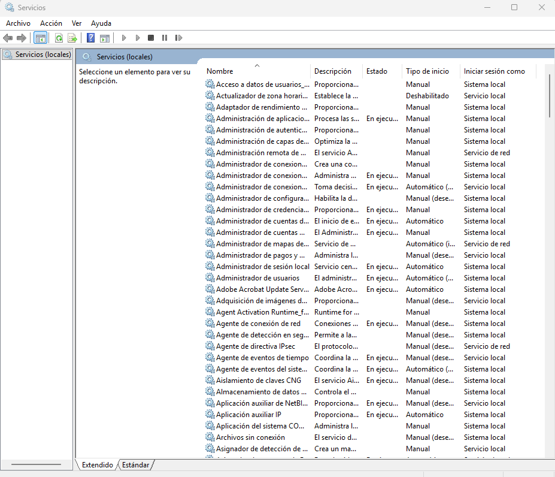
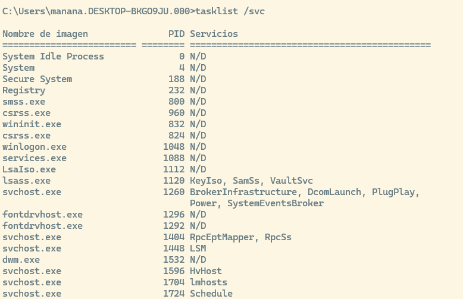
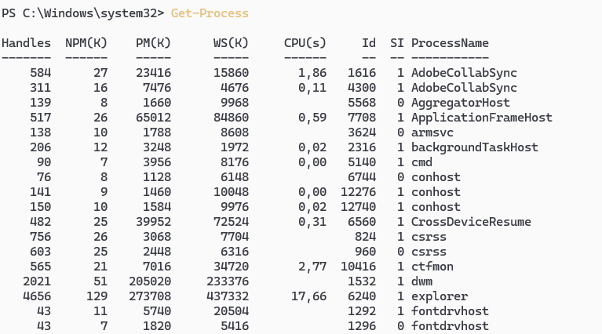
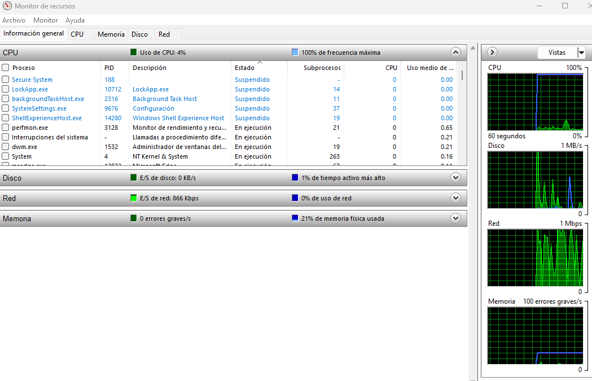
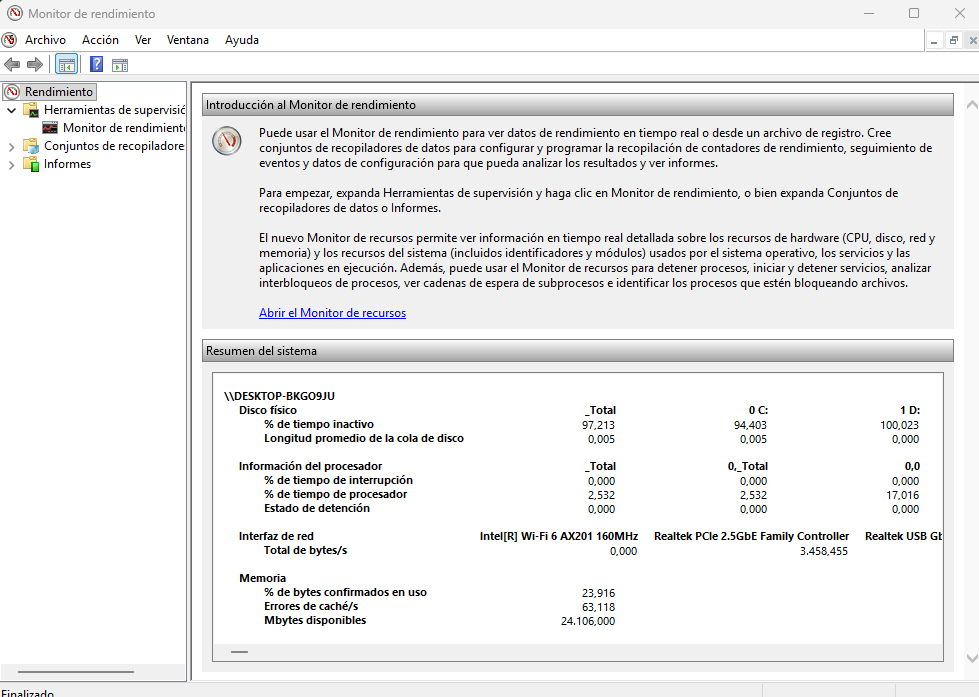
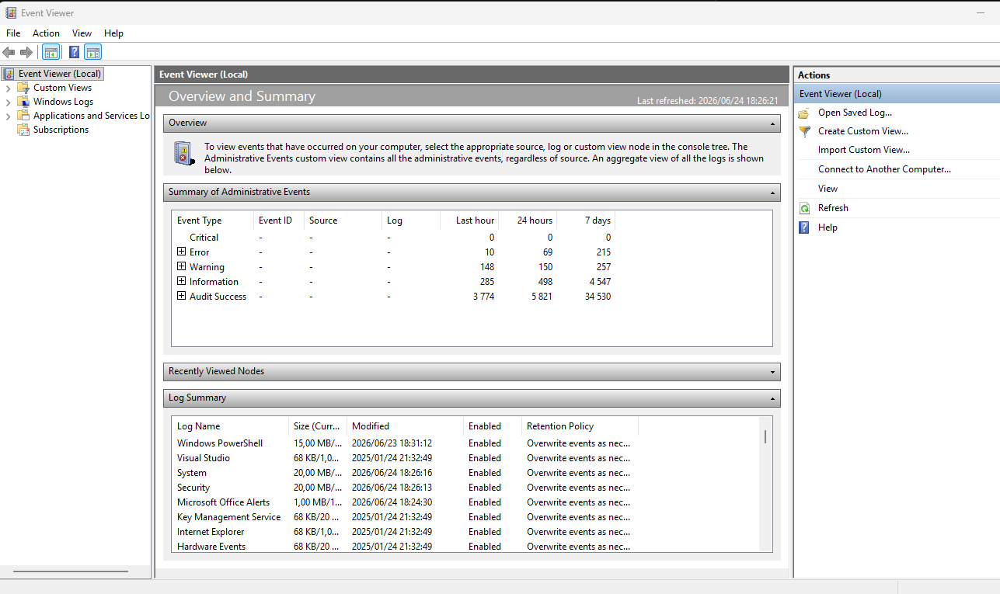

# Herramientas de Monitorización del Sistema

Windows:

- Información del sistema.
- Administrador de tareas
- Monitor de recursos (resmon ***resource monitor***)
- Monitor de rendimiento (perfmo ***performance monitor***) contadores en tiempo real y datos históricos.
- Visor de eventos (`eventvwr.msc`)/PowerShell/ Sysinternals

## Método general de diagnóstico

Para resolver problemas de rendimiento conviene seguir un método.

```{mermaid}
flowchart LR
    A([ 1.<br>OBSERVAR]) --> B([2.<br>IDENTIFICAR])
    B --> C([ 3.<br>LOCALIZAR])
    C --> D([ 4.<br>DIFERENCIAR])
    D --> E([ 5.<br>APLICAR])    
    %% Estilos para mantener los tonos de tu web
    style A fill:#f0f7ff,stroke:#2780e3,stroke-width:2px
   
```

Cada paso es esencial: desde observar la lentitud o el bloqueo inicial, hasta documentar la causa, la acción tomada, la fecha, el impacto y las medidas preventivas para evitar recurrencias.

## Métricas a observar

::: tabla-pequena
| Métrica | Síntomas | Causas típicas | Qué mirar | Herramientas |
|---------------|---------------|---------------|---------------|---------------|
| **CPU** | Sistema lento; procesos al 100%; picos constantes | Consultas sin índices; hilos bloqueados; loops; exceso de concurrencia | Uso por proceso; Load Average; Run Queue; % por núcleo | `top`, `htop`, `atop`, `mpstat`, `pidstat` --- Win: Task Manager, Resource Monitor |
| **RAM** | Uso de swap; procesos matados (OOM); lentitud general | Fugas de memoria; demasiados procesos; buffers/caches altos | Memoria libre/ocupada; Swap in/out; Page Faults | `free -h`, `vmstat`, `sar -r`, `smem` --- Win: Resource Monitor, RAMMap |
| **Disco (I/O)** | Consultas lentas; tiempos de respuesta altos; procesos esperando I/O | Latencia alta; cola de disco saturada; poco espacio; logs descontrolados | IOPS; Latencia (ms); Cola de disco (`await`); espacio disponible | `iostat`, `iotop`, `dstat`, `df`, `fio` --- Win: DiskSpd, Resource Monitor |
| **Procesos** | Sistema atascado; procesos que no terminan; consumo excesivo | Fugas de memoria; procesos zombies; deadlocks | Estados (R/S/Z); consumo por proceso; árbol de dependencias | `ps`, `pstree`, `lsof`, `systemctl` --- Win: procmon, strace |
| **Red** | Conexiones lentas; timeouts; fallos de replicación | Saturación de ancho; pérdida de paquetes; DNS lento | RTT; paquetes perdidos; errores RX/TX; velocidad real | `ping`, `iperf3`, `mtr`, `ss`, `netstat`, `tcpdump`, `dig` |
| **Sistema de archivos** | No se crean archivos; errores de permisos; rendimiento pobre | Fragmentación; inodos agotados; logs gigantes | Inodos libres; espacio; crecimiento de logs | `df -h`, `df -i`, `du -sh`, `find` --- Win: WinDirStat, TreeSize |
:::

## Herramientas en Windows

### msinfo32 (Información del sistema)

**`msinfo32.exe`** es una herramienta de Windows que muestra un informe completo del **hardware**, **componentes** y **configuración del sistema operativo**.\
Es muy útil para diagnóstico, soporte técnico y análisis del estado del equipo.

#### Qué ofrece

| Categoría | Elementos que incluye |
|:--------------------|:--------------------------------------------------|
| **Resumen del sistema** | Versión de Windows, Fabricante del equipo, Modelo, BIOS, Procesador, RAM instalada. |
| **Recursos de hardware** | IRQ, DMA, Conflictos y recursos compartidos, Memoria asignada, Controladores cargados. |
| **Componentes** | Almacenamiento, Red, Pantalla, Sonido, Dispositivos USB, Periféricos. |
| **Entorno de software** | Programas instalados, Servicios, Controladores, Tareas programadas, Variables de entorno. |

#### Para qué sirve

- Diagnosticar problemas de hardware o drivers
- Ver especificaciones completas del equipo
- Exportar informes para soporte técnico
- Detectar conflictos de recursos
- Revisar configuraciones del sistema sin herramientas externas

#### Cómo abrirlo

Puedes ejecutarlo escribiendo en la consola de comandos `msinfo32`



### Administrador de tareas. (Task Manager)

El Administrador de tareas de Windows es una herramienta integrada que permite supervisar y gestionar procesos, rendimiento, usuarios y servicios del sistema. Ofrece vistas simplificadas y técnicas, gráficos en tiempo real y opciones de control como finalizar procesos, ajustar prioridades o gestionar el inicio del sistema. Es esencial para diagnóstico rápido y resolución de problemas en entornos de administración de sistemas y bases de datos.

#### Supervisión de procesos

Permite ver qué programas y servicios están en ejecución, cuánto consumen y quién los ejecuta. Incluye dos vistas:

Procesos → vista simplificada y amigable. Usa la descripción del archivo. Puede estar traducido. Puede agrupar procesos. No es fiable para scripting.

Detalles → vista técnica con información precisa (PID, usuario, ruta, línea de comandos). Usa el nombre real del ejecutable. No está traducido. No está agrupado. Es el que debes usar para diagnóstico y PowerShell.

| Ejecutable real     | Nombre en "Procesos"                 |
|---------------------|--------------------------------------|
| `svchost.exe`       | Host de servicio: Sistema local      |
| `chrome.exe`        | Google Chrome                        |
| `explorer.exe`      | Explorador de Windows                |
| `RuntimeBroker.exe` | Administrador de tiempo de ejecución |

#### Análisis del rendimiento

La pestaña Rendimiento muestra gráficos en tiempo real de:

- CPU
- Memoria RAM
- Disco
- Red
- GPU

Es útil para detectar cuellos de botella o comportamientos anómalos.

#### Gestión de aplicaciones

Permite:

- Finalizar procesos que no responden
- Cambiar la prioridad de un proceso
- Abrir la ubicación del archivo
- Ver dependencias y servicios asociados

#### Supervisión de usuarios

En entornos multiusuario, muestra:

- Sesiones activas
- Procesos asociados a cada usuario
- Consumo de recursos por sesión

#### Gestión de servicios

La pestaña Servicios permite:

- Ver servicios en ejecución
- Iniciar o detener servicios
- Abrir la consola de servicios avanzada

::: nota-importante
Qué es `svchost.exe` (Service Host) svchost.exe es un proceso del sistema operativo Windows cuya función principal es alojar y ejecutar servicios del sistema. En lugar de que cada servicio tenga su propio ejecutable, Windows agrupa varios servicios dentro de instancias de svchost.exe para:

- Optimizar el uso de memoria
- Mejorar la estabilidad
- Aislar servicios críticos
- Facilitar la administración Windows tiene decenas de servicios: red, audio, actualizaciones, impresión, seguridad, etc. Si cada uno tuviera su propio .exe, el sistema sería más pesado y difícil de gestionar.

Por eso: Los servicios se implementan como bibliotecas DLL, no como ejecutables. Como las DLL no pueden ejecutarse solas, necesitan un "contenedor". Ese contenedor es svchost.exe. Cada instancia de svchost.exe carga uno o varios servicios definidos en: `HKLM\Software\Microsoft\Windows NT\CurrentVersion\Svchost` Es normal ver 10, 20 o más procesos svchost.exe. Cada uno aloja un conjunto distinto de servicios. Desde Windows 10, Microsoft incluso separa más los servicios para mejorar la seguridad, así que ver muchos svchost.exe es totalmente normal.

Windows agrupa servicios por función o nivel de criticidad. Ejemplos:

- Servicios de red
- Servicios de interfaz gráfica
- Servicios de seguridad
- Servicios del sistema

Esto permite que si un servicio falla, no se caiga todo el sistema, solo la instancia afectada.

Normalmente svchost.exe es legítimo, pero si aparece fuera de estas rutas, puede ser sospechoso: - C:\Windows\System32\\svchost.exe ← ruta correcta - C:\Windows\SysWOW64\\svchost.exe ← también válida Si aparece en otra carpeta, podría ser malware disfrazado.

Cómo ver qué servicios ejecuta cada svchost.exe En el Administrador de tareas: Clic derecho en una instancia de svchost.exe. "Ir a servicios", ahí verás qué servicios están asociados.
:::

#### Programas de inicio (Startup Programs)

Dentro del Administrador de tareas, la pestaña *Aplicaciones de arranque* permite habilitar o deshabilitar programas que se ejecutan al arrancar Windows, ayudando a mejorar el tiempo de arranque y reducir carga innecesaria.

##### **Cómo analizar estas aplicaciones:**

- **Impacto de inicio (Startup Impact):** Windows mide cuánto tiempo de CPU y de Disco consume la aplicación al arrancar (Alto, Medio, Bajo). Deshabilitar las de "Impacto Alto" acelera drásticamente el encendido.

- **Verificar el editor (Publisher):** Ayuda a identificar si un proceso es legítimo (ej. Microsoft, Oracle, Adobe) o si es un ejecutable sospechoso/malware sin firma que intenta camuflarse.

- **Línea de comandos:** (Haciendo clic derecho en las columnas para activarla). Te permite ver exactamente qué parámetros está usando el programa al lanzarse en segundo plano. En un servidor de bases de datos, esta lista debería estar prácticamente vacía; solo deben arrancar los servicios esenciales.

### Monitor de Servicios services.msc

`services.msc` es la consola gráfica de Windows para administrar los servicios del sistema. Permite ver, iniciar, detener, configurar y diagnosticar servicios que se ejecutan en segundo plano. Es una herramienta esencial para administradores de sistemas, DBA y técnicos de soporte.



#### Ver el estado de los servicios

Muestra todos los servicios instalados en el sistema, con información clave:

- Nombre del servicio
- Nombre para mostrar
- Estado (En ejecución, Detenido, Pausado)
- Tipo de inicio (Automático, Manual, Deshabilitado)
- Cuenta con la que se ejecuta
- Descripción del servicio

Es la vista más completa para entender qué componentes están activos en el sistema.

#### Iniciar, detener y reiniciar servicios

Permite controlar directamente el ciclo de vida de un servicio:

- Iniciar un servicio detenido
- Detener un servicio en ejecución
- Reiniciar servicios que fallan o se quedan bloqueados
- Pausar / Reanudar (solo algunos servicios lo permiten)

Esto es crítico para diagnosticar problemas de bases de datos, web servers, colas de mensajes, etc.

#### Configurar el tipo de inicio

Puedes definir cómo se comporta un servicio al arrancar Windows:

- Automático → se inicia con el sistema
- Automático (inicio retrasado) → se inicia después del arranque
- Manual → solo se inicia cuando lo solicita una aplicación
- Deshabilitado → no puede iniciarse

Esto ayuda a optimizar el arranque y evitar cargas innecesarias.

#### Ver dependencias

Cada servicio puede depender de otros. La consola permite ver:

- Servicios de los que depende
- Servicios que dependen de él

Esto es muy útil para evitar errores al detener servicios críticos.

#### Diagnóstico y resolución de problemas

services.msc permite:

- Ver si un servicio falla al iniciar
- Revisar la cuenta de ejecución (LocalSystem, NetworkService, usuario específico)
- Detectar servicios deshabilitados que deberían estar activos
- Identificar servicios que consumen recursos en exceso (combinado con Task Manager)
- Permite verificar si un servicio crítico está detenido o fallando.

::: nota-importante
Por qué es importante para un DBA o SysAdmin

- Muchas bases de datos (SQL Server, MySQL, PostgreSQL, Oracle) se ejecutan como servicios.
- Permite reiniciar instancias sin reiniciar el servidor.
- Ayuda a diagnosticar problemas de arranque, permisos o dependencias.
- Es clave para entornos con múltiples servicios: IIS, colas MSMQ, agentes de backup, antivirus, etc.
:::

### Tasklist

En la consola de comandos podemos ejecutar `tasklist` (Windows 11)para mostrar los procesos que se están ejecutando en el equipo local o remoto. La opción `tasklist /svc` nos muestra los procesos con servicios asociados.



### PowerShell para procesos y servicios

**PowerShell** permite consultar procesos y servicios desde consola. `Get-Process` obtiene los procesos del equipo local, y `Get-Service` obtiene los servicios del equipo.

```         
Get-process # Ver procesos
Get-Process | Sort-Object CPU -Descending | Select-Object -First 10 # Ver procesos con más CPU acumulada
Get-Process | Sort-Object WorkingSet -Descending | Select-Object -First 10 # Ver procesos con más memoria 
Get-Service | Where-Object {$_.Status -eq "Running"} # Ver servicios en ejecución
Get-Service | Where-Object {$_.Status -eq "Stopped"} # Ver servicios detenidos
```



<details class="extra-desplegable">

<summary>Exportar datos del Administrador de Tareas con PowerShell</summary>

El Administrador de Tareas de Windows (Task Manager) es una herramienta excelente para la monitorización en tiempo real, pero tiene una gran limitación: **no permite exportar sus datos directamente** a un archivo para analizarlos a posteriori.

Para solucionar esto, podemos usar PowerShell, pero hay que entender que el Administrador de Tareas no saca su información de un solo sitio, sino que mezcla datos de distintas capas del sistema operativo. Para imitarlo en la consola, necesitamos combinar dos fuentes de información:

1.  **`Get-Process`:** Es el comando básico de PowerShell. Nos da información en tiempo real muy rápida (como el uso actual de CPU y Memoria), pero es "superficial". No sabe quién ejecutó el proceso ni con qué parámetros.

2.  **WMI (Windows Management Instrumentation):** Es la base de datos interna y profunda de Windows. Contiene absolutamente todos los metadatos de administración del sistema. Tarda un poco más en consultarse, pero nos da el "chisme" completo: qué usuario lanzó el proceso, la ruta exacta del ejecutable y la línea de comandos utilizada.

**Equivalencia de Columnas: Task Manager vs PowerShell**

Al cruzar estas dos herramientas, así es como conseguimos mapear la información que vemos en la interfaz gráfica:

::: tabla-pequena
| Columna en Task Manager \| Propiedad PowerShell equivalente \| Fuente (WMI / Get-Process / cálculo) \| Notas importantes \| \|-----------------\|-----------------\|-----------------\|---------------------\| \| Name \| Name \| Win32_Process \| Coincide 1:1 \| \| PID \| ProcessId \| Win32_Process \| Coincide 1:1 \| \| Estado \| ExecutionState \| Win32_Process \| Suele venir vacío en Windows modernos \| \| Nombre de usuario \| GetOwner().User + Domain \| Win32_Process (método GetOwner) \| Solo disponible en WMI clásico \| \| CPU (tiempo acumulado) \| CPU \| Get-Process \| No es %CPU, es tiempo total de CPU \| \| CPU (%) \| Calculado con Get-Counter \| Cálculo manual \| Task Manager usa muestreo interno \| \| Memoria (espacio de trabajo privado) \| PrivateMemorySize64 \| Get-Process \| **Esta es la que coincide con Task Manager** \| \| Working Set (Memoria física total) \| WorkingSet / WorkingSet64 \| Get-Process \| No es "privada", incluye memoria compartida \| \| WorkingSetSize (WMI) \| WorkingSetSize \| Win32_Process \| **NO coincide con Task Manager** \| \| Descripción \| Description \| Win32_Process \| Depende del ejecutable \| \| Línea de comandos \| CommandLine \| Win32_Process \| Puede requerir permisos elevados \| \| Ruta de acceso de imagen \| ExecutablePath \| Win32_Process \| Puede venir vacío en procesos del sistema \| \| Número de hilos \| ThreadCount \| Win32_Process \| Coincide \| \| Uso de archivo de paginación \| PageFileUsage \| Win32_Process \| No coincide con "Commit size" del Task Manager \| \| Memoria virtual \| VirtualSize \| Win32_Process \| No coincide con "Memoria reservada" \|
:::

**Administrador de tareas** muestra información visual, resumida y orientada al usuario, incluyendo uso de GPU, impacto de inicio, servicios asociados, historial, etc. Usa APIs internas de Windows, incluyendo ETW (Event Tracing for Windows), contadores de rendimiento y datos del kernel.→ Por eso muestra más métricas y más precisas.

**Get-Process** muestra información técnica y detallada a nivel de proceso, ideal para automatización, scripting y administración avanzada, pero no incluye todo lo que muestra el Administrador de tareas. Usa la clase .NET System.Diagnostics.Process.→ Es más limitado, pero muy útil para automatizar.

::: ejemplo-practico
Para conseguir un informe (CSV) similar al que verías en el Administrador de Tareas, usamos un script que combina ambas fuentes. El flujo es simple: interrogamos a WMI para obtener la lista de procesos profunda, y por cada uno de ellos, interrogamos a Get-Process para sacarle el consumo de memoria y CPU.

El siguiente script es un ejemplo de cómo conseguirlo, tan solo tienes que elegir cambiar la información que necesites en cada caso y dónde quieres guardar la información.

``` bash
# Obtenemos los metadatos profundos de todos los procesos vía WMI
Get-WmiObject Win32_Process | ForEach-Object { 
    
    # Extraemos el propietario (Usuario) del proceso actual
    $owner = $_.GetOwner() 
    
    # Buscamos el consumo en tiempo real del proceso actual. 
    # SilentlyContinue evita errores si el proceso se cierra justo en este milisegundo.
    $proc = Get-Process -Id $_.ProcessId -ErrorAction SilentlyContinue          
    
    # Construimos nuestro objeto a medida combinando ambas fuentes
    [PSCustomObject]@{     
        Name                     = $_.Name     
        PID                      = $_.ProcessId     
        Estado                   = $_.ExecutionState     
        "Nombre de usuario"      = if ($owner.User) { "$($owner.Domain)\$($owner.User)" } else { "SYSTEM" }     
        CPU                      = if ($proc) { $proc.CPU } else { $null }     
        "Memoria Privada (KB)"   = if ($proc) { [math]::Round($proc.PrivateMemorySize64 / 1KB) } else { $null }     
        Descripcion              = $_.Description     
        "Línea de comandos"      = $_.CommandLine     
        "Ruta de imagen"         = $_.ExecutablePath 
    }
} | Export-Csv "d:\procesos_detallados.csv" -NoTypeInformation -Encoding UTF8
```
:::

</details>

### Monitor de Recursos (Resmon)

El monitor de recursos se abre desde la consola de comandos usando `resmon` `resmon.exe`, o *Monitor de recursos*, es una herramienta avanzada de Windows que permite ver en detalle cómo el sistema utiliza CPU, memoria, disco y red. Es más completo que el Administrador de tareas y más visual que usar comandos o PowerShell. El Monitor de recursos permite:

- Ver qué procesos están usando más CPU y por qué. Qué servicios están dentro de cada proceso, qué archivos tiene abiertos un proceso, qué puertos usa, qué recursos está bloqueando.
- Identificar bloqueos de disco (qué proceso está usando un archivo). En el administrador de tareas solo ves "Disco al 100%", en Resmon puedes ver qué proceso está saturando el disco, qué archivo está leyendo o escribiendo, latencia real del dispositivo y cola de disco.
- Ver uso de memoria por proceso, incluyendo memoria física, compartida y privada.
- Analizar conexiones de red, puertos abiertos y procesos que los usan. Conexiones activas, puertos, procesos que generan tráfico, errores RX/TX, latencia por proceso.
- Detectar cuellos de botella en tiempo real.
- Es una herramienta clave para diagnóstico, resolución de problemas y administración avanzada.

Resmon desglosa cada recurso con métricas profundas, como:

- Hilos por proceso
- Fallos de página (hard faults)
- Latencia de disco
- Archivos abiertos por proceso
- Conexiones TCP y puertos usados
- Actividad de red por proceso



::: tabla-pequena
| Sección | Qué muestra / métricas | Para qué sirve |
|------------------|-------------------------------|-----------------------|
| **CPU** | Procesos activos, servicios asociados, hilos por proceso, tiempo de CPU, gráficos en tiempo real | Detectar procesos que saturan el procesador y analizar carga de trabajo. |
| **Memoria** | Memoria en uso, memoria reservada, memoria compartida, hard faults, uso por proceso | Analizar consumo de RAM con más detalle que el Administrador de tareas. |
| **Disco** | Lectura/escritura por proceso, archivos abiertos, latencia, cuellos de botella | Identificar procesos que bloquean el sistema por I/O. |
| **Red** | Conexiones TCP activas, puertos usados, procesos con tráfico, latencia y ancho de banda | Detectar procesos sospechosos o problemas de red. |
| **Seguridad y diagnóstico** | Validar procesos legítimos, detectar malware, identificar bloqueos de archivos, analizar cuelgues | Diagnóstico avanzado y resolución de problemas. |
:::

------------------------------------------------------------------------

**Explicación de los Tipos de Memoria**

::: tabla-pequena
| Tipo de memoria | Qué significa | ¿Se puede usar inmediatamente? | Ejemplo |
|-----------------|----------------------|-----------------|-----------------|
| **En uso** | Memoria que están usando activamente procesos, servicios y el sistema. | ❌ No | Programas abiertos ocupando RAM. |
| **Modificada** | Datos cambiados que aún no se han guardado en disco; deben escribirse antes de liberarse. | ⚠️ No, hasta que se escriba en disco | Datos pendientes de guardar. |
| **En espera** | Caché de datos usados recientemente; puede liberarse al instante si otro proceso necesita RAM. | ✔️ Sí | Memoria "reciclable" que acelera el sistema. |
| **Libre** | RAM completamente vacía, sin datos útiles. | ✔️ Sí | Memoria sin usar. |
:::

### Monitor de rendimiento (perfmon, Performance Monitor)

**perfmon.exe** es una herramienta avanzada de Windows que permite **monitorizar el rendimiento del sistema en tiempo real** y **registrar métricas históricas** mediante contadores.\
Es mucho más potente y configurable que el Administrador de tareas o el Monitor de recursos. Perfmon es la **única** que permite **registrar datos a largo plazo** y analizar tendencias.

Puedes ejecutarlo desde la consola de comandos `perform` o desde: - Inicio → "Monitor de rendimiento" - Panel de control → Herramientas administrativas

**¿Para qué sirve Perfmon?**

- Analizar rendimiento del sistema a nivel profundo

- Registrar métricas durante horas o días

- Detectar cuellos de botella en CPU, RAM, disco o red

- Monitorizar servicios, procesos y aplicaciones específicas

- Crear informes automáticos de diagnóstico

- Comparar rendimiento antes/después de cambios en el sistema

::: {}

:::

#### Componentes principales

**Vista general (Performance Monitor)** : Muestra gráficos en tiempo real de contadores como:

- \% de uso de CPU
- Latencia de disco
- Memoria disponible
- Tráfico de red
- Actividad de procesos

Puedes añadir o quitar contadores según lo que quieras analizar.

**Conjuntos de recopiladores de datos (Data Collector Sets)**: La función más potente de Perfmon.

Permite:

- Registrar métricas durante un periodo largo
- Guardar los datos en archivos `.blg`
- Programar sesiones de monitorización
- Crear perfiles personalizados para CPU, disco, red, memoria, etc.

Tipos:

- **Sistema** (ya preconfigurados por Windows)
- **Usuario** (creados por ti): En perfmon, ir a: Conjuntos de recopiladores de datos → Definido por el usuario
- **Plantillas** (importadas/exportadas)

**Informes:** Perfmon genera informes automáticos con:

- Cuellos de botella detectados
- Análisis de rendimiento
- Recomendaciones
- Gráficos y estadísticas

Muy útil para diagnósticos post-mortem.

#### Contadores más usados

**CPU** - Processor → % Processor Time\
- System → Processor Queue Length\
- Process → % Processor Time

**Memoria** - Memory → Available MBytes\
- Memory → Pages/sec\
- Memory → Cache Faults/sec

**Disco** - PhysicalDisk → Avg. Disk sec/Read\
- PhysicalDisk → Avg. Disk sec/Write\
- PhysicalDisk → Disk Queue Length

**Red** - Network Interface → Bytes Total/sec\
- TCPv4 → Segments Retransmitted/sec

::: nota-importante
**Ejemplos de uso real**

- Detectar si un servidor tiene **cuello de botella de disco**
- Registrar durante 24h el **uso de CPU por proceso**
- Analizar **picos de latencia** en red
- Ver si una aplicación tiene **fugas de memoria**
- Crear informes automáticos de rendimiento
:::

### Visor de eventos

El Visor de eventos permite consultar registros de Windows.

También se puede usar para crear vistas personalizadas y filtrar eventos, y PowerShell puede apoyarse en filtros creados desde el propio Visor de eventos.

Para abrirlo en la consola `eventvwr.msc`



Es la bitácora central donde el sistema operativo, los servicios y las aplicaciones anotan todo lo que ocurre.

**Secciones principales:**

- **Aplicación:** Eventos registrados por programas (ej. un error al arrancar SQL Server o MySQL).

- **Seguridad:** Registros de auditoría (ej. inicios de sesión fallidos o exitosos, cambios de privilegios). - **Instalación (Setup):** Eventos relacionados con actualizaciones y parches de Windows.

- **Sistema:** Eventos propios del sistema operativo y sus componentes (ej. fallos de un driver, un servicio del sistema que se detiene inesperadamente).

**Tipos de eventos (Niveles de gravedad):**

1.  **Informativo (Information):** Operaciones normales y exitosas. (Ej. "El servicio de base de datos se inició correctamente").

2.  **Advertencia (Warning):** Un problema que no es crítico ahora, pero podría serlo en el futuro. (Ej. "El disco C: está al 90% de capacidad").

3.  **Error:** Un problema significativo, como la pérdida de datos o de funcionalidad. (Ej. "El servicio X no pudo iniciarse por falta de dependencias").

4.  **Crítico (Critical):** Un fallo grave que ha provocado que el sistema o la aplicación se detengan de forma inesperada. (Ej. Un reinicio forzado o un pantallazo azul - BSOD).

**Cómo crear una Vista Personalizada (Custom View):**

Si administras una base de datos, no te interesa leer miles de eventos del sistema; quieres ver solo los errores de tu SGBD.

1\. Haz clic en "Crear vista personalizada" en el panel derecho.

2\. Selecciona el nivel de evento (Error, Crítico).

3\. Selecciona el origen del evento (ej. "MSSQLSERVER" o el nombre de tu aplicación).

4\. Guarda la vista. PowerShell puede apoyarse en filtros creados desde el propio Visor de eventos para automatizar alertas.

**Relación con problemas de rendimiento y servicios:** Cuando detectas un cuello de botella con `Perfmon` o `Resmon`, el Visor de Eventos te da el "por qué".

Si la CPU hizo un pico al 100%, puedes buscar en la sección *Sistema* o *Aplicación* en esa misma franja horaria.

Localizar fallos en servicios es tan sencillo como filtrar la sección *Sistema* por el origen "Service Control Manager"; ahí verás qué servicio exacto entró en bucle, fue matado por falta de memoria (OOM) o no pudo arrancar.

En un servidor, esta información es vital para diagnósticos *post-mortem* (saber qué pasó de madrugada cuando nadie estaba mirando).

::: practica
**Pruebas de stress**

Podemos usar unos script in Power Shell para sobrecargar los recursos del sistema y de esa forma ver cómo los distintos monitores del sistema reflejan esos cambios.

**Stress test de CPU (30 segundos** - Usa varios hilos que hacen cálculos intensivos. - Usa 4 hilos (puedes subirlo a 8, 16, etc.). - Mantiene la CPU ocupada durante 30 segundos.

``` bash
$fin = (Get-Date).AddSeconds(30)
while ((Get-Date) -lt $fin) {
    1..4 | ForEach-Object {
        Start-Job -ScriptBlock {
            $end = (Get-Date).AddSeconds(30)
            while ((Get-Date) -lt $end) {
                [Math]::Sqrt(12345) > $null
            }
        }
    }
    Start-Sleep -Seconds 30
    Get-Job | Remove-Job -Force
}
```

**Stress test de RAM (30 segundos)**

- Reserva bloques de 100 MB cada medio segundo.

- Puedes ajustar el tamaño.

``` bash
$fin = (Get-Date).AddSeconds(30)
$bloques = @()

while ((Get-Date) -lt $fin) {
    $bloques += ,(New-Object byte[] (100MB))
    Start-Sleep -Milliseconds 500
}

"Memoria reservada: $([math]::Round(($bloques.Count * 100),2)) MB"
```

**Stress test de disco (30 segundos)**

- Escribe y lee repetidamente un archivo de 10 MB.

- Genera carga de I/O real.

``` bash
$archivo = "$env:TEMP\stress_disk.tmp"
$datos = New-Object byte[] (10MB)

$fin = (Get-Date).AddSeconds(30)
while ((Get-Date) -lt $fin) {
    [System.IO.File]::WriteAllBytes($archivo, $datos)
    $null = [System.IO.File]::ReadAllBytes($archivo)
}
Remove-Item $archivo -Force
```

**Stress test de red (30 segundos)** - Usa un archivo de prueba público. - Genera tráfico de red sostenido.

``` bash
$fin = (Get-Date).AddSeconds(30)
$url = "http://speedtest.tele2.net/10MB.zip"

while ((Get-Date) -lt $fin) {
    Invoke-WebRequest -Uri $url -OutFile "$env:TEMP\net_test.tmp" -UseBasicParsing
}
Remove-Item "$env:TEMP\net_test.tmp" -Force
```
:::

# Resumen y Guía de Diagnóstico para Administradores de Bases de Datos (DBAs)

Como DBA, tu objetivo principal es garantizar que el motor de la base de datos tenga los recursos necesarios para servir datos rápido y de forma segura. Aquí tienes el mapa mental de "Qué herramienta usar y qué mirar" ante los problemas más comunes.

::: tabla-pequena
| Síntoma del Servidor BD | Recurso Sospechoso | ¿Qué herramienta utilizo? | ¿Qué busco exactamente? |
|:----------------|:----------------|:----------------|:----------------------|
| **Consultas muy lentas de repente, pero la BD responde.** | **Disco (I/O)** | Monitor de Recursos (Resmon) / Perfmon | En *Resmon*, reviso la pestaña Disco para ver la latencia (ms) y la "Cola de disco". Si la latencia es alta, el disco no da abasto para leer las tablas. |
| **El servidor web dice "Timeout" al conectar a la BD.** | **Red** / **Servicio** | Administrador de Tareas / Visor de Eventos | En *Task Manager*, reviso si el servicio del SGBD está "Detenido". En el *Visor de Eventos (Aplicación)*, busco si la BD registró un "Error" al agotar el pool de conexiones o un bloqueo de puertos. |
| **El servidor está "congelado" o va a tirones.** | **CPU** | Administrador de Tareas (Detalles) / Get-Process | Busco procesos que consuman cerca del 100% de CPU. Si es el SGBD, suele indicar una consulta mal optimizada (sin índices). Si es otro proceso (ej. un antivirus), está robando ciclos a la BD. |
| **La base de datos se reinicia sola o procesos "desaparecen".** | **Memoria (RAM)** | Visor de Eventos / Monitor de Recursos | Esto suele ser un fallo OOM (Out Of Memory). El sistema operativo sacrifica el proceso de la BD para no colapsar. En *Resmon*, reviso si los "Hard Faults" son altos (exceso de uso de Swap). |
| **Tengo que justificar la compra de más discos o RAM para el año que viene.** | **Planificación de Capacidad** | Monitor de Rendimiento (Perfmon) | Configuro un "Data Collector Set" (Conjunto de recopiladores) para grabar el uso de RAM y Disco durante una semana. Exporto el histórico para mostrar la tendencia de crecimiento. |
:::

------------------------------------------------------------------------
