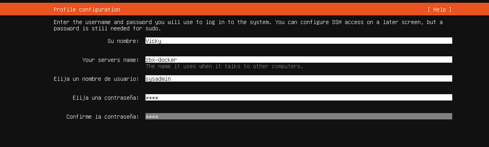

# Objetivo de la práctica

El objetivo es montar una plataforma Zabbix funcional usando contenedores y después monitorizar dos máquinas:

-   **ZBX-DOCKER** -\> Servidor Zabbix en Docker
-   **LNX-DB** -\> Ubuntu Server monitorizado
-   **WIN-CLI** -\> Windows monitorizado

Al finalizar, el alumno deberá ser capaz de:

-   Instalar Docker y Docker Compose en Ubuntu Server.
-   Desplegar Zabbix con contenedores.
-   Entender qué contenedor hace cada función.
-   Acceder a Zabbix desde navegador.
-   Añadir un host Linux y un host Windows.
-   Monitorizar CPU, RAM, disco y red.
-   Crear una comprobación para un servicio de base de datos.
-   Crear una alerta cuando el servicio deje de responder.
-   Interpretar problemas y métricas desde Zabbix.

------------------------------------------------------------------------

# Infraestructura de la práctica

Usaremos tres máquinas virtuales configuradas en modo **Adaptador Puente**.

+----------------+---------------------+---------------------------------------+------------------------------------------------------------------------------------------------------------------------------------------------------------------------------------------+
| Máquina        | Sistema operativo   | Función                               | IP propuesta                                                                                                                                                                             |
+:===============+:====================+:======================================+:=========================================================================================================================================================================================+
| **ZBX-DOCKER** | Ubuntu Server 26.04 | Docker + Zabbix + PostgreSQL + Web    | 192.168.31.13                                                                                                                                                                            |
+----------------+---------------------+---------------------------------------+------------------------------------------------------------------------------------------------------------------------------------------------------------------------------------------+
| **LNX-DB**     | Ubuntu Server 26.04 | Servidor Linux monitorizado + MariaDB | 10.0.20.60                                                                                                                                                                               |
+----------------+---------------------+---------------------------------------+------------------------------------------------------------------------------------------------------------------------------------------------------------------------------------------+
| **WIN-CLI**    | Windows 10/11       | Equipo Windows monitorizado           |                                                                                                                                                                                          |
+----------------+---------------------+---------------------------------------+------------------------------------------------------------------------------------------------------------------------------------------------------------------------------------------+
| WIN-HOST       | Windows 11          | Host                                  | Wireless LAN adapter Wi-Fi:                                                                                                                                                              |
|                |                     |                                       |                                                                                                                                                                                          |
|                |                     |                                       | Connection-specific DNS Suffix . : IPv4 Address. . . . . . . . . . . : 192.168.31.147 Subnet Mask . . . . . . . . . . . : 255.255.255.0 Default Gateway . . . . . . . . . : 192.168.31.1 |
+----------------+---------------------+---------------------------------------+------------------------------------------------------------------------------------------------------------------------------------------------------------------------------------------+

En **ZBX-DOCKER** tendremos estos contenedores:

+---------------------+-------------------------------------------------+---------------------------+
| Contenedor          | Imagen                                          | Función                   |
+:====================+:================================================+:==========================+
| **postgres-server** | postgres:16-alpine                              | Base de datos de Zabbix   |
+---------------------+-------------------------------------------------+---------------------------+
| **zabbix-server**   | zabbix/zabbix-server-pgsql:alpine-7.0-latest    | Motor principal de Zabbix |
+---------------------+-------------------------------------------------+---------------------------+
| **zabbix-web**      | zabbix/zabbix-web-nginx-pgsql:alpine-7.0-latest | Interfaz web con Nginx    |
+---------------------+-------------------------------------------------+---------------------------+

> **Nota:** Zabbix ofrece imágenes oficiales separadas por componente: servidor, frontend web, proxy, agentes, etc. Las imágenes de Zabbix Server tienen variantes para PostgreSQL y MySQL, entre otras.

------------------------------------------------------------------------

# Esquema de funcionamiento

``` text
                    Navegador del host
                            |
                            | http://192.168.31.13:8080
                            v
                      zabbix-web
                         Nginx
                            |  
                            v
                    zabbix-server
                            | http://192.168.31.13
                            v
                    postgres-server
                    
                  Máquinas monitorizadas
        ---------------------------------------------------
        LNX-DB                         WIN-CLI
        Ubuntu Server                  Windows 10/11
        Zabbix Agent 2                 Zabbix Agent 2
        MariaDB                        Servicios Windows
```

1\. El alumno entra por navegador del host a Zabbix web server

2\. Zabbix Server recoge datos de los agentes.

3\. PostgreSQL guarda configuración, métricas, eventos y problemas.

4\. Zabbix Web muestra todo gráficamente.

------------------------------------------------------------------------

# Parte 1 — Preparar la máquina ZBX-DOCKER

Esta parte se realiza en la máquina:

\* **Host:** ZBX-DOCKER

\* **IP:** 192.168.31.13

\* **Sistema:** Ubuntu Server 26.04

Instalamos Ubuntu Server en adaptador puetne y fijamos la ip




# Cambiar el nombre del equipo.

Si no hemos configurado el nombre correcto durante la instalación como se muestra en el paso anterior, podemos cambiarlo una vez creado:

``` bash
sudo hostnamectl set-hostname zbx-docker
```

Comprobamos:

``` bash
hostname
```

*Resultado esperado:* `zbx-docker`

> **Consejo pedagógico:** El nombre del equipo no es obligatorio, pero ayuda a saber dónde estamos trabajando. En una práctica con varias máquinas, esto evita el clásico "lo he instalado en la VM que no era".

## Comprobar la IP y conectividad

``` bash
ip a
```

Comprobar conectividad con las otras máquinas haciendo ping desde el host a la ip del servidor.

------------------------------------------------------------------------

# Parte 2 — Instalar Docker y Docker Compose

> **Nota técnica:** Docker recomienda instalar Docker Engine en Ubuntu configurando previamente su repositorio apt, y Docker Compose se instala actualmente como plugin con el paquete docker-compose-plugin.

## Actualizar paquetes

``` bash
sudo apt update
sudo apt upgrade -y
```

| Comando        | Explicación                                 |
|:---------------|:--------------------------------------------|
| apt update     | Actualiza la lista de paquetes disponibles. |
| apt upgrade -y | Instala las actualizaciones pendientes.     |

## Instalar paquetes necesarios

``` bash
sudo apt install -y ca-certificates curl
```

| Paquete         | Función                                |
|:----------------|:---------------------------------------|
| ca-certificates | Permite validar certificados HTTPS.    |
| curl            | Permite descargar datos desde una URL. |

## Añadir la clave oficial de Docker

``` bash
sudo install -m 0755 -d /etc/apt/keyrings
sudo curl -fsSL https://download.docker.com/linux/ubuntu/gpg -o /etc/apt/keyrings/docker.asc
sudo chmod a+r /etc/apt/keyrings/docker.asc
```

## Añadir el repositorio de Docker

``` bash
echo \
"deb [arch=$(dpkg --print-architecture) signed-by=/etc/apt/keyrings/docker.asc] https://download.docker.com/linux/ubuntu \
$(. /etc/os-release && echo "${UBUNTU_CODENAME:-$VERSION_CODENAME}") stable" | \
sudo tee /etc/apt/sources.list.d/docker.list > /dev/null
sudo apt update
```

## Instalar Docker Engine y Docker Compose

``` bash
sudo apt install -y docker-ce docker-ce-cli containerd.io docker-buildx-plugin docker-compose-plugin
```

+-----------------------+------------------------------------------------+
| Paquete               | Función                                        |
+:======================+:===============================================+
| docker-ce             | Motor principal de Docker.                     |
+-----------------------+------------------------------------------------+
| docker-ce-cli         | Comandos de Docker.                            |
+-----------------------+------------------------------------------------+
| containerd.io         | Servicio interno para ejecutar contenedores.   |
+-----------------------+------------------------------------------------+
| docker-buildx-plugin  | Plugin para construcción avanzada de imágenes. |
+-----------------------+------------------------------------------------+
| docker-compose-plugin | Permite usar docker compose.                   |
+-----------------------+------------------------------------------------+

## Comprobar Docker

``` bash
docker --version
docker compose version
```

Probamos Docker levantando un contenedor de prueba:

``` bash
sudo docker run hello-world
```

*Resultado esperado:* `Hello from Docker!`

## Permitir usar Docker sin sudo

``` bash
sudo usermod -aG docker $USER
newgrp docker
```

Comprobamos:

``` bash
docker ps
```

Si no da error de permisos, Docker está listo.

------------------------------------------------------------------------

# Parte 3 — Crear el proyecto Docker Compose de Zabbix

## Crear una carpeta de trabajo

``` bash
mkdir -p ~/zabbix-docker
cd ~/zabbix-docker
```

## Crear el archivo .env

``` bash
nano .env
```

Pegar este contenido:

``` ini
POSTGRES_USER=zabbix
POSTGRES_PASSWORD=ZabbixDB_2026!
POSTGRES_DB=zabbix
```

| Variable          | Función                         |
|:------------------|:--------------------------------|
| POSTGRES_USER     | Usuario de la base de datos.    |
| POSTGRES_PASSWORD | Contraseña de la base de datos. |
| POSTGRES_DB       | Nombre de la base de datos.     |

> **Importante:** En un entorno real no usaríamos una contraseña tan visible en una práctica entregable, pero aquí interesa que el alumno vea claramente la relación entre servicios.

## Crear el archivo docker-compose.yml

``` bash
nano docker-compose.yml
```

Pegar este contenido:

``` yaml
services:
  postgres-server:
    image: postgres:16-alpine
    container_name: postgres-server
    environment:
      POSTGRES_USER: ${POSTGRES_USER}
      POSTGRES_PASSWORD: ${POSTGRES_PASSWORD}
      POSTGRES_DB: ${POSTGRES_DB}
    volumes:
      - zabbix-postgres-data:/var/lib/postgresql/data
    networks:
      - zabbix-net
    restart: unless-stopped
    healthcheck:
      test: ["CMD-SHELL", "pg_isready -U ${POSTGRES_USER} -d ${POSTGRES_DB}"]
      interval: 10s
      timeout: 5s
      retries: 5

  zabbix-server:
    image: zabbix/zabbix-server-pgsql:alpine-7.0-latest
    container_name: zabbix-server
    environment:
      DB_SERVER_HOST: postgres-server
      POSTGRES_USER: ${POSTGRES_USER}
      POSTGRES_PASSWORD: ${POSTGRES_PASSWORD}
      POSTGRES_DB: ${POSTGRES_DB}
    ports:
      - "10051:10051"
    depends_on:
      postgres-server:
        condition: service_healthy
    networks:
      - zabbix-net
    restart: unless-stopped

  zabbix-web:
    image: zabbix/zabbix-web-nginx-pgsql:alpine-7.0-latest
    container_name: zabbix-web
    environment:
      ZBX_SERVER_HOST: zabbix-server
      DB_SERVER_HOST: postgres-server
      POSTGRES_USER: ${POSTGRES_USER}
      POSTGRES_PASSWORD: ${POSTGRES_PASSWORD}
      POSTGRES_DB: ${POSTGRES_DB}
      PHP_TZ: Europe/Madrid
    ports:
      - "8080:8080"
    depends_on:
      - zabbix-server
    networks:
      - zabbix-net
    restart: unless-stopped

networks:
  zabbix-net:
    driver: bridge

volumes:
  zabbix-postgres-data:
```

# Parte 4 — Entender el archivo Docker Compose

## Servicio postgres-server

Este contenedor será la base de datos de Zabbix. Zabbix necesita una base de datos para guardar: hosts, usuarios, plantillas, métricas, eventos, problemas, alertas y dashboards. La diferencia con una instalación tradicional es que aquí PostgreSQL no se instala directamente en Ubuntu, sino dentro de un contenedor.

## Servicio zabbix-server

Este es el motor principal de Zabbix. Se encarga de consultar agentes, recibir datos, evaluar alertas, procesar eventos y guardar información en PostgreSQL. Publicamos el puerto **10051** para que los agentes puedan comunicarse de forma remota con el servidor central.

## Servicio zabbix-web

Este contenedor ofrece la interfaz web. Publicamos el puerto **8080**. Por eso entraremos desde el navegador a `[http://192.168.31.13:8080](http://192.168.31.13:8080)`. No usamos el puerto 80 directamente para evitar conflictos con otros servicios web del sistema.

## Red interna zabbix-net

Docker crea una red privada bridge para que los contenedores se comuniquen entre ellos por el nombre del servicio. De esta forma, `zabbix-web` localiza al backend apuntando al host `zabbix-server` sin que el alumno necesite saber las IPs internas virtuales de Docker.

## Volumen zabbix-postgres-data

El volumen guarda los datos de PostgreSQL de forma persistente. Si el contenedor se destruye o se actualiza, la información permanece intacta en el volumen. Si el volumen se borra explícitamente, se pierde toda la base de datos de Zabbix. *Docker sin volumen es como escribir los apuntes en la arena de la playa. Muy bonito hasta que llega la ola.*

------------------------------------------------------------------------

# Parte 5 — Arrancar Zabbix

Desde la carpeta del proyecto ejecute:

``` bash
cd ~/zabbix-docker
docker compose up -d
```

## Ver contenedores activos

``` bash
docker compose ps
```

*Resultado esperado:* `postgres-server`, `zabbix-server` y `zabbix-web` en estado `running`.

## Ver los logs de inicialización

``` bash
docker compose logs -f
```

> **Nota:** La primera vez puede tardar un poco porque Zabbix tiene que preparar y estructurar sus tablas iniciales en la base de datos. Para salir de la vista de logs pulse `CTRL + C`.

------------------------------------------------------------------------

# Parte 6 — Acceder a Zabbix desde navegador

Desde el equipo anfitrión, abra un navegador web y acceda a: `[http://192.168.31.13:8080](http://192.168.31.13:8080)`

## Credenciales iniciales

-   **Usuario:** Admin
-   **Contraseña:** zabbix

> **Nota de seguridad:** La documentación oficial de Zabbix estipula estas credenciales de acceso por defecto para todas sus instalaciones y recomienda cambiarla tras el primer inicio de sesión.

## Cambiar idioma

Dentro del panel de control de Zabbix: 1. Vaya a **User settings** -\> **Profile** -\> **Language**. 2. Seleccione **Spanish (es_ES)** y guarde los cambios.

## Cambiar la contraseña inicial

1.  Vaya a **User settings** -\> **Profile** -\> **Change password**.
2.  Para clase usaremos una clave genérica unificada: `Zabbix_Alumno_2026!`

------------------------------------------------------------------------

# Parte 7 — Comprobar puertos desde ZBX-DOCKER

En la máquina Ubuntu donde está Docker, verifique que los puertos estén escuchando en el sistema de red:

``` bash
ss -tulpen | grep -E '8080|10051'
```

Si el cortafuegos de Ubuntu (`UFW`) está activo, habilite las conexiones entrantes:

``` bash
sudo ufw allow 8080/tcp
sudo ufw allow 10051/tcp
sudo ufw reload
```

------------------------------------------------------------------------

# Parte 8 — Preparar la máquina Linux monitorizada

Esta parte se realiza íntegramente en la máquina: \* **Host:** LNX-DB \* **IP Real Estática:** 10.0.20.60 \* **Sistema:** Ubuntu Server 26.04

## Ajustar nombre de host y actualizar

``` bash
sudo hostnamectl set-hostname lnx-db
sudo apt update && sudo apt upgrade -y
```

## Instalar MariaDB y herramientas de prueba

``` bash
sudo apt install -y mariadb-server stress-ng netcat-openbsd
```

Habilitamos el servicio del motor de base de datos de pruebas:

``` bash
sudo systemctl enable --now mariadb
systemctl status mariadb --no-pager
```

## Instalar Zabbix Agent 2 en Linux

Descargamos y registramos el repositorio oficial de empaquetado de Zabbix:

``` bash
wget https://repo.zabbix.com/zabbix/7.0/ubuntu/pool/main/z/zabbix-release/zabbix-release_latest_7.0+ubuntu26.04_all.deb
sudo dpkg -i zabbix-release_latest_7.0+ubuntu26.04_all.deb
sudo apt update
sudo apt install -y zabbix-agent2
```

## Configurar el agente Linux

Modificamos el archivo de configuración del agente:

``` bash
sudo nano /etc/zabbix/zabbix_agent2.conf
```

Busque y edite con cuidado las siguientes líneas asegurándose de poner la IP correcta del servidor central de Zabbix y el nombre del equipo correspondiente:

``` ini
Server=192.168.31.13
ServerActive=192.168.31.13
Hostname=lnx-db
```

Reinicie y aplique los cambios en el inicio del sistema operativo:

``` bash
sudo systemctl restart zabbix-agent2
sudo systemctl enable zabbix-agent2
```

## Abrir firewall de red en LNX-DB

Si UFW está habilitado, abra el puerto **10050** para permitir que el servidor central de Zabbix consulte las métricas:

``` bash
sudo ufw allow 10050/tcp
```

------------------------------------------------------------------------

# Parte 9 — Añadir LNX-DB en la interfaz de Zabbix

Desde el entorno web de Zabbix, vaya a: **Data collection** -\> **Hosts** -\> **Create host**

Configure rigurosamente los siguientes parámetros:

| Campo            | Valor                 |
|:-----------------|:----------------------|
| **Host name**    | lnx-db                |
| **Visible name** | Servidor Linux DB     |
| **Host group**   | Linux servers         |
| **Interface**    | Seleccione *Agent*    |
| **IP address**   | 10.0.20.60            |
| **Port**         | 10050                 |
| **Template**     | Linux by Zabbix agent |

Haga clic en **Add**. Espere 1 o 2 minutos hasta que la etiqueta de estado "ZBX" se ponga de color verde. Después, dirígete a **Monitoring** -\> **Latest data**, filtre por el host `lnx-db` y valide que están entrando de forma constante todas las métricas operativas del sistema.

------------------------------------------------------------------------

# Parte 10 — Preparar la máquina Windows monitorizada

Esta parte se realiza en: \* **Host:** WIN-CLI \* **IP:** 10.0.20.242 \* **Sistema:** Windows 10/11

## Descargar Zabbix Agent 2

1.  Desde Windows, acceda a la página oficial de descargas de agentes de Zabbix.
2.  Descargue el instalador `.msi` seleccionando: **7.0 LTS**, **Windows**, componente **Agent 2**, cifrado **OpenSSL**, arquitectura **amd64**.

## Instalar el agente en el sistema

Ejecute el instalador MSI como administrador e introduzca los datos del laboratorio: \* **Host name:** win-cli \* **Zabbix server IP/DNS:** 192.168.31.13 \* **Server or Proxy for active checks:** 192.168.31.13 \* **Listen port:** 10050

## Comprobar el servicio en Windows

Abra una consola de **PowerShell** como administrador y ejecute:

``` powershell
Get-Service "*Zabbix*"
```

*Resultado esperado:* Estado `Running`.

## Abrir firewall de Windows Defender

En la consola de PowerShell como administrador, cree la regla para permitir el tráfico entrante de monitorización:

``` powershell
New-NetFirewallRule `
  -DisplayName "Zabbix Agent 2" `
  -Direction Inbound `
  -Protocol TCP `
  -LocalPort 10050 `
  -Action Allow `
  -RemoteAddress 192.168.31.13
```

# Parte 11 — Añadir WIN-CLI en Zabbix

Desde la interfaz web de Zabbix, proceda a dar de alta la máquina cliente: **Data collection** -\> **Hosts** -\> **Create host**

| Campo            | Valor                   |
|:-----------------|:------------------------|
| **Host name**    | win-cli                 |
| **Visible name** | Cliente Windows         |
| **Host group**   | Windows servers         |
| **Interface**    | Agent                   |
| **IP address**   | 10.0.20.242             |
| **Port**         | 10050                   |
| **Template**     | Windows by Zabbix agent |

Haga clic en **Add**. Posteriormente verifique la entrada de contadores en el apartado de **Latest data**.

# Parte 12 — Comprobar comunicación desde el servidor Zabbix

Como el servidor Zabbix está dentro de un contenedor aislado, la forma más clara de comprobar la conectividad de red es inyectarse directamente en él.

En la terminal de **ZBX-DOCKER**, ejecute:

``` bash
docker exec -it zabbix-server sh
```

Dentro de la shell interna del contenedor, haga un ping de prueba hacia el host Linux:

``` bash
ping -c 3 10.0.20.60
exit
```

De igual modo, verifique los puertos abiertos de los agentes desde la máquina base Ubuntu de **ZBX-DOCKER**:

``` bash
nc -zv 10.0.20.60 10050
nc -zv 10.0.20.242 10050
```

*Resultado esperado:* `succeeded`.

# Parte 13 — Crear una comprobación del servicio MariaDB

El objetivo de esta sección es monitorizar el estado de salud del puerto remoto del motor de base de datos (`3306/tcp`) para que Zabbix envíe un aviso si el servicio se cae.

## Crear el ítem en Zabbix

Vaya a: **Data collection** -\> **Hosts** -\> Seleccione la línea de `lnx-db` -\> Haga clic en **Items** -\> **Create item**.

Configure los siguientes valores: \* **Name:** Comprobación puerto MariaDB 3306 \* **Type:** Simple check \* **Key:** net.tcp.service\[tcp,,3306\] \* **Type of information:** Numeric unsigned \* **Update interval:** 1m

Guarde el registro. Este ítem realiza una petición de red TCP devolviendo de forma periódica: \* **`1`**: El puerto está abierto y responde de forma correcta. \* **`0`**: El puerto está cerrado o inaccesible.

------------------------------------------------------------------------

# Parte 14 — Crear una alerta para MariaDB (Trigger)

Para automatizar la detección del fallo cuando la métrica caiga a cero: Vaya a: **Data collection** -\> **Hosts** -\> Haga clic en **Triggers** en la línea de `lnx-db` -\> **Create trigger**

-   **Name:** MariaDB no responde en {HOST.NAME}
-   **Severity:** High
-   **Expression:** last(/lnx-db/net.tcp.service\[tcp,,3306\])=0

Guarde el disparador. Si el último valor recibido de la comprobación del puerto 3306 es estrictamente 0, Zabbix generará un problema visual visible en la consola general.

------------------------------------------------------------------------

# Parte 15 — Provocar una incidencia controlada

## Forzar la caída de la base de datos

Conéctate por terminal a **LNX-DB** e interrumpa de forma controlada el servicio de MariaDB:

``` bash
sudo systemctl stop mariadb
```

Espera un lapso de entre 1 y 2 minutos. Compruebe la sección de **Monitoring** -\> **Problems** en la web de Zabbix. Deberá aparecer una alerta crítica activa de color rojo.

## Recuperar el servicio

Levante de nuevo el servicio en **LNX-DB**:

``` bash
sudo systemctl start mariadb
```

Observe el panel de control web y verifique cómo el problema se resuelve de forma automática en cuanto se ejecuta la siguiente comprobación recurrente.

------------------------------------------------------------------------

# Parte 16 — Generar carga de CPU en Linux

Validaremos los gráficos inyectando estrés al sistema. En la terminal de **LNX-DB**, ejecute:

``` bash
stress-ng --cpu 2 --timeout 120s
```

Vaya de forma inmediata en la web a **Monitoring** -\> **Latest data**, busque las métricas de procesador de `lnx-db` y compruebe el pico de utilización generado por la herramienta.

------------------------------------------------------------------------

# Parte 17 — Generar consumo de disco duro real

> **Nota pedagógica fundamental:** En Ubuntu Server, el directorio virtual `/tmp` está montado sobre un sistema de archivos temporal de tipo `tmpfs` residente directo en la memoria RAM. Para simular un llenado real en las métricas de disco de almacenamiento físico de la partición raíz (`/`), **la prueba debe realizarse de forma obligatoria dentro de su directorio personal o carpeta home (`~/`)**.

En la consola de **LNX-DB**, reserve un archivo ficticio de 2 Gigabytes de tamaño en su disco persistente:

``` bash
fallocate -l 2G ~/prueba_zabbix.img
```

Verifique la alteración local de las particiones de almacenamiento con:

``` bash
df -h
```

Compruebe en la interfaz web de Zabbix cómo las gráficas de almacenamiento del host detectan el incremento de espacio ocupado en la partición de almacenamiento raíz de la VM.

Una vez completada la comprobación, elimine el archivo para limpiar el entorno del laboratorio:

``` bash
rm ~/prueba_zabbix.img
df -h
```

------------------------------------------------------------------------

# Parte 18 — Crear un dashboard básico

Vaya a: **Dashboards** -\> **Create dashboard** \* **Name:** Monitorización aula - Zabbix Docker

Añada componentes visuales (*Widgets*) para tener un centro de control básico: \* **Problems**: Muestra las incidencias operativas activas de la red. \* **Host availability**: Muestra de un vistazo si las máquinas del aula están vivas o caídas. \* **Graph**: Rendimiento de CPU en tiempo real de `lnx-db`. \* **Graph**: Histórico de consumo de RAM de `win-cli`. \* **Graph**: Espacio utilizado en disco duro persistente de `lnx-db`.

------------------------------------------------------------------------

# Parte 19 — Comandos útiles de Docker Compose

Estas tareas de administración operativa se deben realizar posicionados en la ruta raíz del proyecto (`cd ~/zabbix-docker`):

-   **Ver el estado y salud actual de los contenedores:** `bash     docker compose ps`
-   **Ver logs continuos en tiempo real:** `bash     docker compose logs -f`
-   **Ver logs de un único contenedor específico:** `bash     docker compose logs -f zabbix-server`
-   **Reiniciar todos los servicios de la plataforma:** `bash     docker compose restart`
-   **Detener los contenedores sin borrar su estado:** `bash     docker compose stop`
-   **Destruir los contenedores y redes virtuales del proyecto:** `bash     docker compose down`
-   **Borrar de forma absoluta los contenedores, redes y la base de datos completa:** `bash     docker compose down -v` \> **¡Peligro!** El parámetro `-v` elimina de forma irreversible el volumen de almacenamiento de PostgreSQL. Si se ejecuta, los alumnos perderán de golpe todas las configuraciones, hosts y dashboards creados en la práctica.

------------------------------------------------------------------------

# Parte 20 — Solución de problemas comunes (Troubleshooting)

## T1: No carga la interfaz web de Zabbix en el puerto 8080

-   Asegúrese de que el contenedor web esté activo ejecutando `docker compose ps`.
-   Revise las trazas del servidor HTTP interno con `docker compose logs zabbix-web`.
-   Compruebe que el puerto responda localmente en el anfitrión con `ss -tulpen | grep 8080`.

## T2: Abre la web pero indica que no puede conectar con el Servidor Central Zabbix

-   El motor del core se ha detenido. Revise los motivos del fallo con `docker compose logs zabbix-server`.
-   Asegúrese de que no se hayan modificado los puertos de enlace del manifiesto yaml.

## T3: El Servidor Zabbix no puede conectar con la Base de Datos PostgreSQL

-   Examine los motivos del rechazo de la base de datos con `docker compose logs postgres-server`.
-   Valide que las credenciales declaradas coincidan de forma exacta. Imprima sus variables con `cat .env` y compruebe que los campos `POSTGRES_USER`, `POSTGRES_PASSWORD` y `POSTGRES_DB` tengan los mismos valores tipográficos en todas las secciones del manifiesto `docker-compose.yml`.

## T4: La máquina de pruebas LNX-DB se queda sin registrar datos en la web

-   Compruebe que el servicio del agente de monitorización esté activo: `systemctl status zabbix-agent2`.
-   Extraiga y verifique los parámetros del archivo de configuración ejecutando: `bash     grep -E "^Server=|^ServerActive=|^Hostname=" /etc/zabbix/zabbix_agent2.conf`
-   Verifique que apunte de forma estricta a la IP de la máquina de Docker (`192.168.31.13`) y que el nombre de host coincida letra por letra en la interfaz web de administración.

------------------------------------------------------------------------

# Resultado final esperado

Al concluir satisfactoriamente el laboratorio, la infraestructura lógica de red se conformará siguiendo esta topología:

``` text
Ubuntu Server (ZBX-DOCKER) [192.168.31.13]
│
├── [Contenedor] PostgreSQL Server (Persistencia de base de datos)
├── [Contenedor] Zabbix Server Engine (Gestiona puerto 10051)
└── [Contenedor] Zabbix Web Frontend + Nginx (Gestiona puerto 8080)
      │
      ├── Enlace Pasivo/Activo (Puerto 10050) ---> Ubuntu Server (LNX-DB) [10.0.20.60] (MariaDB)
      └── Enlace Pasivo/Activo (Puerto 10050) ---> Windows Client (WIN-CLI) [10.0.20.242]
```

------------------------------------------------------------------------